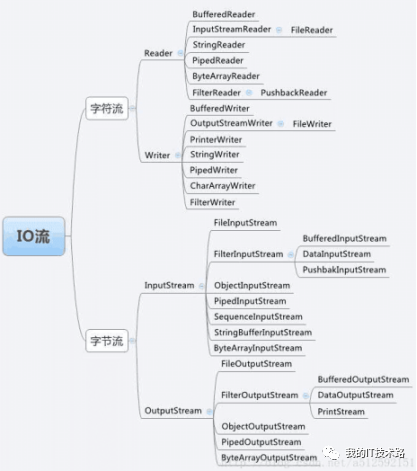

# 前言

java基础相关面试题目整理

# 题目

## Java创建一个对象的方法有几种？

1. 使用new关键字
2. 反射
    (1)使用Class类的newInstance方法
    ```
    Employee emp2 = (Employee) Class.forName("org.programming.mitra.exercises.Employee").newInstance();
    ```
    或者(目前Class.newInstance()这种方法因为效率问题已经被标记@Deprecated)
    ```
    Employee emp2 = Employee.class.newInstance();
    ```
    (2)使用Constructor类的newInstance方法
    ```
    Constructor<Employee> constructor = Employee.class.getConstructor();
    Employee emp3 = constructor.newInstance();
    ```
3. clone
    类需要先实现Cloneable接口并实现其定义的clone方法。
    ```
    Employee emp4 = (Employee) emp3.clone();
    ```
4. 反序列化
    需要让类实现Serializable接口
    ```
    ObjectInputStream in = new ObjectInputStream(new FileInputStream("data.obj"));
    Employee emp5 = (Employee) in.readObject();
    ```

参考:
[Java中创建对象的5种方式](https://www.cnblogs.com/wxd0108/p/5685817.html)

## Java中==和equals的区别是什么？

略

## 序列化的作用是什么？常见的序列化方法是什么？Java自带的序列化是怎么实现的？

### 序列化的作用是什么？

网络传输的数据都必须是二进制数据，但是在Java中都是对象，是没有办法在网络中进行传输的，所以就需要对Java对象进行序列化。

序列化：将数据结构或对象转换成二进制串的过程；

反序列化：将在序列化过程中所生成的二进制串转换成数据结构或者对象的过程

### 常见的序列化方法是什么？

json序列化，java原生序列化等。关于选型可以参考美团技术博客，见[序列化和反序列化](https://tech.meituan.com/2015/02/26/serialization-vs-deserialization.html)。

### Java自带的序列化是怎么实现的？

1. 对于要序列化对象的类要去实现Serializable接口或者Externalizable接口
    ```
    public class TestBean implements Serializable {
        private static final long serialVersionUID = 6000894702030258313L;
        private Integer id;
        private String name;
        private Date date;
        //省去getter和setter方法和toString
    }
    ```
2. 使用JDK提供的ObjectOutputStream和ObjectInputStream来实现序列化和反序列化
    序列化：
    ```
    public static void main(String[] args) {
        TestBean testBean = new TestBean();
        testBean.setDate(new Date());
        testBean.setId(1);
        testBean.setName("zll1");
        //使用ObjectOutputStream序列化testBean对象并将其序列化成的字节序列写入test.txt文件
        try {
            FileOutputStream fileOutputStream = new FileOutputStream("D:\\test.txt");
            ObjectOutputStream objectOutputStream = new ObjectOutputStream(fileOutputStream);
            objectOutputStream.writeObject(testBean);
        } catch (FileNotFoundException e) {
            e.printStackTrace();
        } catch (IOException e) {
            e.printStackTrace();
        }
    }
    ```
    反序列化：
    ```
    public static void main(String[] args) {
        try {
            FileInputStream fileInputStream = new FileInputStream("D:\\test.txt");
            ObjectInputStream objectInputStream = new ObjectInputStream(fileInputStream);
            TestBean testBean = (TestBean) objectInputStream.readObject();
            System.out.println(testBean);
        } catch (FileNotFoundException e) {
            e.printStackTrace();
        } catch (IOException e) {
            e.printStackTrace();
        } catch (ClassNotFoundException e) {
            e.printStackTrace();
        }
    }
    ```
    注意：
    - 一个对象要进行序列化，如果该对象成员变量是引用类型的，那这个引用类型也一定要是可序列化的，否则会报错
    - 对于不想序列化的字段可以在字段类型之前加上transient关键字修饰（反序列化时会被赋予默认值）
    - 实现Externalizable接口需要重写两个方法writeExternal(ObjectOutput out)和readExternal(ObjectInput in)，用来自定义决定哪些字段需要序列化，哪些需要反序列化
    - 关于serialVersionUID：在进行序列化时，会把当前类的serialVersionUID写入到字节序列中（也会写入序列化的文件中），在反序列化时会将字节流中的serialVersionUID同本地对象中的serialVersionUID进行对比，一致的话进行反序列化，不一致则失败报错（报InvalidCastException异常）。如果未显式声明serialVersionUID，会隐式申明一个serialVersionUID，这个serialVersionUID和对象字段还有JVM环境有关，如果没有设置serialVersionUID做了序列化，然后修改了字段就无法进行反序列化了，所以一般会先设定一个serialVersionUID。可以基于IDEA自动生成(参见[IDEA 自动生成serialVersionUID](https://blog.csdn.net/Aphysia/article/details/80620804))，也可以基于jdk中的工具生成。

参考:
[Java几种序列化方式对比](https://zhuanlan.zhihu.com/p/361705392)
[序列化和反序列化](https://tech.meituan.com/2015/02/26/serialization-vs-deserialization.html)
[一文搞懂序列化与反序列化](https://zhuanlan.zhihu.com/p/316200445)
[IDEA 自动生成serialVersionUID](https://blog.csdn.net/Aphysia/article/details/80620804)
[serialVersionUID作用是什么以及如何生成的](https://cloud.tencent.com/developer/article/1943450)

## 重载和重写的区别？

略

## java的异常机制？结合项目描述一下你是怎么处理异常的？

### java的异常机制

- Error和Exception

Java所有异常类都是Throwable的子类。它包括Java异常处理的两个重要子类：Error和Exception。

Error：Error及其子类用来描述Java运行系统中的内部错误以及资源耗尽的错误，是程序无法处理的错误，这类错误比较严重，如OutOfMemoryError。这些异常发生时，JVM一般会选择线程终止。这些错误是不可查的，因为它们在应用程序的控制和处理能力之外，而且绝大多数是程序运行时不允许出现的状况。 

Exception：可以通过捕捉处理使程序继续执行，是程序自身可以处理的异常。根据错误发生原因可分为RuntimeException异常和除RunTimeException之外的异常，如IOException异常。RuntimeException 类及其子类表示“JVM 常用操作”引发的错误。例如，若试图使用空值对象引用、除数为零或数组越界，则分别引发运行时异常（NullPointerException、ArithmeticException和 ArrayIndexOutOfBoundException）。 

- 可查异常和不可查异常

可查异常：编译器要求必须处理的异常，这类异常的发生在一定程度上是可以预计的，除了RuntimeException及其子类以外的其它异常类都属于可查异常。这种异常的特点是Java编译器会检查它，也就是说，出现这种异常，要么用try-catch语句捕捉它，要么用throws语句声明抛出它，否则编译不通过。

不可查异常：编译器不要求强制处理的异常，包括运行时异常（RuntimeException与其子类）和错误（Error） 。

### 结合项目描述一下你是怎么处理异常的

自定义异常实现错误码接口，在特定检查处抛出包含错误码的自定义异常，

参考：
[Java的异常处理机制](https://blog.csdn.net/qq_15349687/article/details/82811581)

## Object类有哪些常用的方法

- getClass()

返回Class，native方法

- hashCode()

返回一个int，native方法

- equals(Object obj)

默认等价与==

- clone()

需要继承Coloneable接口，返回一个对象的副本，不过是对于对象的引用型字段（String和包装类除外）为浅拷贝

- toString()

默认返回 getClass().getName() + "@" + Integer.toHexString(hashCode())

- notify()、wait()

通知

- finalize()

在GC准备释放对象所占的内存空间时，将会调用finalize()，用于释放非java资源（例如打开的文件资源、数据库连接等）或调用非java方法（native方法）时分配的内存。finalize()最多只会执行一次，可以在这次执行中使对象再次被引用，使对象再活一次。

已经标记为@Deprecated，主要原因为
1. 调用时机的不确定性
2. 影响代码的可移植性，移植到其他JVM，finalize方法可能运行崩溃
3. 成本较高，如果一个类没有重载finalize方法，那么销毁时只要将堆中的内存处理一下就可以了，而如果重载了finalize方法的话，就要执行finalize方法，万一执行过程中再出现点异常或错误成本就更高了。
4. 异常丢失，万一fianlize方法中抛出了异常，那么finalize会终止运行，而抛出的这个异常也会被舍弃，最终会让对象实例处于一种半销毁半存活的僵尸状态

参考：
[Java中finalize()方法的使用](https://blog.csdn.net/CrazyLai1996/article/details/84900818)
[Java中的finalize方法已经退出历史舞台，再看它最后一眼，留点余香](https://zhuanlan.zhihu.com/p/94072959)

## java的hashcode和equals方法的作用？什么时候会用到？

hashcode在HashMap和HashSet中可以用于确定key所在桶的位置。在HashMap和HashSet中，两个key的hashcode相等，且equals为true时，可以判定为相同的key，就不会重复添加key。

## String是一个基本类型么？那java的基本类型有哪些？String和StringBuffer和StringBuilder的区别是什么？

不是;int, long, float, double, boolean, char等；String是不可变字符串，StringBuffer和StringBuilder是可变字符串，StringBuffer线程安全，StringBuilder线程不安全但是效率高。StringBuffer虽然线程安全但可能会造成字符串写入顺序问题，一般使用StringBuilder。

## String str="i"与 String str=new String("i")一样吗？不同点主要在哪里呢？

不一样。String str="i"的方式，Java 虚拟机会将其分配到常量池中，常量池指的是在编译期被确定，并被保存在已编译的.class文件中的一些数据，常量池不会重复创建对象；而 String str=new String(“i”)方式，则会被分到堆内存中。

```
    public static void main(String[] args) {
        String str1 = "i";
        String str2 = "i";
        String str3 = new String("i");
        String str4 = new String("i");
        System.out.println(str1 == str2);//ture
        System.out.println(str2 == str3);//false
        System.out.println(str3 == str4);//false
        System.out.println(str2.equals(str3));//ture
        System.out.println(str3.equals(str4));//ture
    }
```

参考：
[String str=“i“与 String str=new String(“i”)一样吗？](https://blog.csdn.net/MuYIShan1/article/details/115350086)

## 抽象类和接口的区别？抽象类一定要有抽象函数么？接口定义的变量一定是常量么？接口中可以定义函数的实现么？

### 抽象类和接口的区别？

相同点：

1. 都不能被实例化 
2. 接口的实现类或抽象类的子类都只有实现了接口或抽象类中的方法后才能实例化。

不同点：

1. 接口只有定义，不能有方法的实现，java 1.8中可以定义default方法体，而抽象类可以有定义与实现，方法可在抽象类中实现。

2. 实现接口的关键字为implements，继承抽象类的关键字为extends。一个类可以实现多个接口，但一个类只能继承一个抽象类。所以，使用接口可以间接地实现多重继承。

3. 接口强调特定功能的实现，而抽象类强调所属关系。

4. 接口成员变量默认为public static final，必须赋初值，不能被修改；其所有的成员方法都是public、abstract的。抽象类中成员变量默认default，可在子类中被重新定义，也可被重新赋值；抽象方法被abstract修饰，不能被private、static、synchronized和native等修饰，必须以分号结尾，不带花括号。

### 抽象类一定要有抽象函数么？

不需要，抽象类不一定有抽象方法；但是包含一个抽象方法的类一定是抽象类。

### 接口定义的变量一定是常量么？

是

### 接口中可以定义函数的实现么？

java 1.8中可以定义default方法体

参考：
[Java基础之接口与抽象类的区别](https://zhuanlan.zhihu.com/p/94770324)
[抽象类必须要有抽象方法吗？](https://blog.csdn.net/ZM_Crazy/article/details/113931384)

## final、static关键字在java中的作用？抽象类可以使用final修饰么？

### final、static关键字在java中的作用？

- final 变量
    变量指定的对象存储空间固定，不能修改，只读
- final 方法
    final 方法使该类的子类无法重写该方法
- final 类
    无法被子类继承
- static 
    与类相关，例如静态内部类、静态方法、静态变量、静态代码块

### 抽象类可以使用final修饰么？

不能

## final,finally,finalize分别是什么？

- final：java中的关键字，修饰符。
1. 如果一个类被声明为final，就意味着它不能再派生出新的子类，不能作为父类被继承。
2. 被声明为final的变量必须在声明时给定初值，变量指向的内存地址无法改变。
3. 被声明final的方法子类无法重写。
- finally：java的一种异常处理机制。
finally是对Java异常处理模型的补充。finally结构使代码总会执行，而不管无异常发生。使用finally可以维护对象的内部状态，并可以清理非内存资源。特别是在关闭数据库连接这方面，如果程序员把数据库连接的close()方法放到finally中，就会大大降低程序出错的几率。
- finalize：Java中的一个方法名。
Java技术使用finalize()方法在垃圾收集器将对象从内存中清除出去前，做必要的清理工作。这个方法是由垃圾收集器在确定这个对象没被引用时对这个对象调用的。它是在Object类中定义的，因此所的类都继承了它。子类覆盖finalize()方法以整理系统资源或者执行其他清理工作。目前该方法已经在JDK1.9被标记@Deprecated

参考：
[Java中final、finally、finalize的区别与用法](https://www.cnblogs.com/smart-hwt/p/8257330.html)

## Java的IO流有了解过，实现一个按行读取数据的方式。

### Java的IO流体系

在Java中，将不同的终端的输入输出源抽象为流的概念，通过这种方式可以将不同终端的数据进行交互。Java将传统的流类型都放在java.io包中，一般我们将IO以以下三种方式进行分类。

1）按照流的方向：输入流和输出流

输入输出流是针对程序运行的内存而言的，从内存输出到其他介质上称为输出流，从其他介质输入到程序内存中称为输入流。一般以inputstream/reader结尾的称为输入流，outputstream/writer结尾的称为输出流。

2）按照操作单元分：字节流和字符流

字节流是针对一个字节一个字节进行操作的，字符流最小的操作单元是一个字符。字节流以inputstream/outputstream结尾，字符流以writer/reader结尾。字符流和字节流的转换使用适配器模式进行，可以利用转换流将字符流、字节流相互转换。

3）按照是否可以直接连接一个介质来划分：节点流和处理流

节点流是指可以直接连接在一个介质上进行输入输出的，而处理流是将节点流进行包装而具有新的功能，节点流也被称为低级流，处理流因为有了新的功能特性（当然了也包含了原来的特性）被称为高级流。这里jdk使用装饰器模式进行。



### 关于转换流

InputStreamReader 字节流转字符流
OutputStreamWriter 字符流转字节流
以上均需要注意指定或默认的字符集

### 按行读取文件

```
public static void main(String[] args) {
    BufferedReader reader;
    try {
        reader = new BufferedReader(new FileReader(
                "D:\\git\\learning\\readtext.txt"));
        String line = reader.readLine();
        while (line != null) {
            System.out.println(line);
            line = reader.readLine();
        }
        reader.close();
    } catch (IOException e) {
        e.printStackTrace();
    }
}
```

参考：
[Java IO流详解（六）----转换流（字节流和字符流之间的转换）](https://www.cnblogs.com/tanghaorong/p/12363660.html)
[java逐行读取文件_Java逐行读取文件](https://blog.csdn.net/cunchi4221/article/details/107470903)

## Java的反射原理是什么？Getclass和classforName的区别是什么？

```
public class HelloReflect {
    public static void main(String[] args) {
        try {
            // 1. 使用外部配置的实现，进行动态加载类
            TempFunctionTest test = (TempFunctionTest)Class.forName("com.tester.HelloReflect").newInstance();
            test.sayHello("call directly");
            // 2. 根据配置的函数名，进行方法调用（不需要通用的接口抽象）
            Object t2 = new TempFunctionTest();
            Method method = t2.getClass().getDeclaredMethod("sayHello", String.class);
            method.invoke(test, "method invoke");
        } catch (ClassNotFoundException e) {
            e.printStackTrace();
        } catch (InstantiationException e) {
            e.printStackTrace();
        } catch (IllegalAccessException e) {
            e.printStackTrace();
        } catch (NoSuchMethodException e ) {
            e.printStackTrace();
        } catch (InvocationTargetException e) {
            e.printStackTrace();
        }
    }
    
    public void sayHello(String word) {
        System.out.println("hello," + word);
    }

}
```

### forName和newInstance

forName()反射获取类信息，主要是先获取ClassLoader，然后调用native方法获取信息，最后，jvm又会回调ClassLoader进行类加载（双亲委派）
newInstance() 主要做了三件事：（1）权限检测，如果不通过直接抛出异常；（2）查找无参构造器（1. 先尝试从缓存获取所有的constructors，如果没有缓存则重新从jvm中获取并用软引用缓存, 然后通过进行参数类型比较；2. 找到匹配后，通过 ReflectionFactory copy一份constructor返回；3. 否则抛出 NoSuchMethodException;），并将其缓存起来；（3）调用具体方法的无参构造方法，生成实例并返回；

### getDeclaredMethod和invoke

getDeclaredMethod()主要做了四件事：（1）先进行权限检查；（2）获取所有方法列表(也是先从缓存中取，没有则从jvm中获取)；（3）根据方法名称和方法列表，选出符合要求的方法（ReflectionFactory, copy方法后返回，实际返回的是一个方法的副本）；（4）如果没有找到相应方法，抛出异常，否则返回对应方法；

invoke()做的事情：（1）先获取Method的MethodAccessor（缓存中没有则创建）;（2）调用MethodAccessor的invoke方法，底层交给JVM实现；

### 反射小结

最后，用几句话总结反射的实现原理：

1. 反射类及反射方法的获取，都是通过从列表中搜寻查找匹配的方法，所以查找性能会随类的大小方法多少而变化；
2. 每个类都会有一个与之对应的Class实例，从而每个类都可以获取method反射方法，并作用到其他实例身上；
3. 反射也是考虑了线程安全的，放心使用；
4. 反射使用软引用relectionData缓存class信息，避免每次重新从jvm获取带来的开销；
5. 反射调用多次生成新代理Accessor, 而通过字节码生存的则考虑了卸载功能，所以会使用独立的类加载器；
6. 当找到需要的方法，都会copy一份出来，而不是使用原来的实例，从而保证数据隔离；
7. 调度反射方法，最终是由jvm执行invoke0()执行；

### .class、class.forname()和getClass()的区别

- 相同

通过这几种方式，得到的都是java.lang.Class对象；都是类加载的产物

- 差别

1.出现的时期不同：Class.forname()在运行时加载（动态加载）；Class.class和对象名.getClass()是在编译时加载（静态加载）
2.类名.class：JVM将使用类装载器，将类装入内存(前提是:类还没有装入内存)，不做类的初始化工作，返回Class的对象
3.Class.forName("类名字符串") （注：类名字符串是包名+类名）：装入类，并做类的静态初始化，返回Class的对象
4.实例对象.getClass()：对类进行静态初始化、非静态初始化；返回引用运行时真正所指的对象(因为:子对象的引用可能会赋给父对象的引用变量中)所属的类的Class的对象

参考：
[深入理解java反射原理](https://www.cnblogs.com/yougewe/p/10125073.html)
[java中Class对象详解和类名.class, class.forName(), getClass()区别](https://www.cnblogs.com/Seachal/p/5371733.html)

## 如何实现一个list类型的深拷贝？Java的clone接口的作用是什么？
## Java的泛型的作用是什么？
## Java的注解有了解，其底层的实现原理是什么？怎么定义一个注解？
## Java中两个类的关系有多少种？有了解过设计模式么？
## Java的collection有几种？Collection和collections的区别是什么？
## ArrayLsit、LinkedList和vector的区别？它们是线程安全的么？如果想要线程安全应该要怎么实现？
## HashMap扩容机制？hashMap是线程安全的么？它和hashtable的区别是什么？hashMap key和value可以是null么？Hashmap的扩容一定是2^n么？1.8版本的优化点在哪里？什么时候链表转换为红黑树？什么时候红黑树转换为链表？Hashmap的get和put方法是怎么实现的？
## Queue中poll和remove方法的区别是什么？
## Iterator是什么？和splitIterator的区别是什么？
## ArrayList中怎么一边遍历一边删除？
## Treemap 和linkedHashMap有什么作用？其实现的原理是什么？
## HashSet的实现原理有了解？
## 静态内部类和内部类的区别是什么？为什么内部类可以访问外部类？
## 从安全性上说说java权限关键字private，protected，default，public的区别？
## 面向对象的概念是什么？Java的多态怎么实现？
## try {}里有一个return语句，那么紧跟在这个try后的finally {}里的code会不会被执行，什么时候被执行，在return前还是后?


# 参考

[微信公众号:我的IT技术路](https://mp.weixin.qq.com/s/54_bMeUwjxk-8DHa90heNQ)


