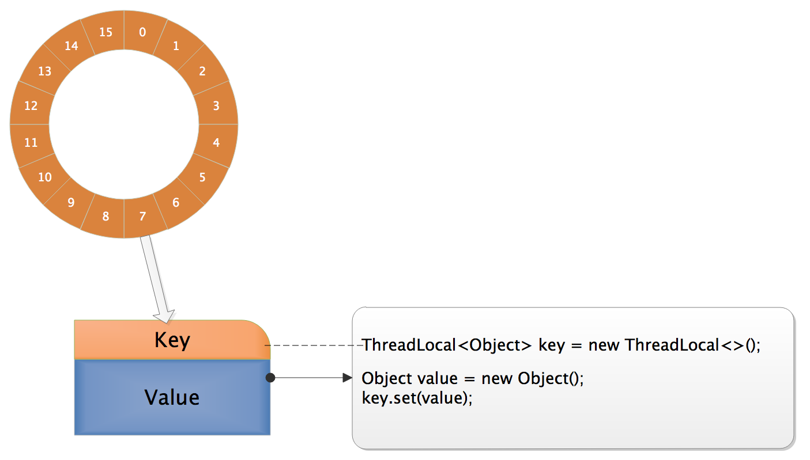
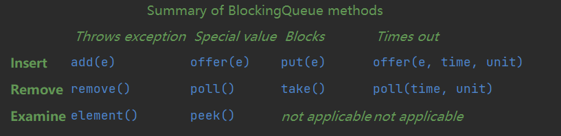
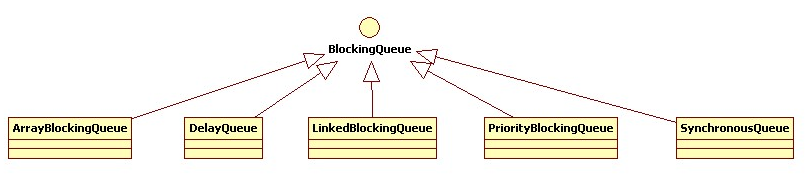

# 前言

java多线程的线程安全、线程管理、线程活性等相关面试题目整理，面经尽量用简短的语句说明问题，详细的信息可以参考每个面经下的参考链接。面经不保证完全正确，欢迎大家邮件联系作者进行相应的修改和交流。

# 题目

## Threadlocal使用场景？原理？如何保证内存不泄露？

### ThreadLocal使用场景

不加锁的情况下，多线程安全访问共享变量，每个线程保留共享变量的副本（线程特有对象），每个线程往这个ThreadLocal中读写是线程隔离。

### ThreadLocal原理

Thread类有一个类型为ThreadLocal.ThreadLocalMap的实例变量threadLocals，每个线程都有一个自己的ThreadLocalMap。
ThreadLocal的get\set\remove方法均先找出当前线程的ThreadLocalMap，然后执行ThreadLocalMap的get\set\remove，每个线程调用ThreadLocal的get\set\remove方法时，均在本线程对象的ThreadLocalMap中操作，所以实现了线程隔离。

ThreadLocalMap不是传统意义上的map，它其实是一个环形数组，数据元素entry是ThreadLocal变量的弱引用，而这个entry中有个变量为value是ThreadLocal变量的实际引用值，这样看起来是一个key-value的形式。
Entry便是ThreadLocalMap里定义的节点，它继承了WeakReference类，定义了一个类型为Object的value，用于存放塞到ThreadLocal里的值。

```
static class Entry extends WeakReference<java.lang.ThreadLocal<?>> {
    // 往ThreadLocal里实际塞入的值
    Object value;

    Entry(java.lang.ThreadLocal<?> k, Object v) {
        super(k);
        value = v;
    }
}
```

为什么用弱引用？因为如果这里使用普通的key-value形式来定义存储结构，实质上就会造成节点的生命周期与线程强绑定，只要线程没有销毁，那么节点在GC分析中一直处于可达状态，没办法被回收，而程序本身也无法判断是否可以清理节点。弱引用是Java中四档引用的第三档，比软引用更加弱一些，如果一个对象没有强引用链可达，那么一般活不过下一次GC。当某个ThreadLocal已经没有强引用可达，则随着它被垃圾回收，在ThreadLocalMap里对应的Entry的键值会失效，这为ThreadLocalMap本身的垃圾清理提供了便利。

```
/**
 * 重新分配表大小的阈值，默认为0
 */
private int threshold; 

/**
 * Entry表，大小必须为2的幂
 */
private Entry[] table;

/**
 * 设置resize阈值以维持最坏2/3的装载因子
 */
private void setThreshold(int len) {
    threshold = len * 2 / 3;
}

/**
 * 环形意义的下一个索引
 */
private static int nextIndex(int i, int len) {
    return ((i + 1 < len) ? i + 1 : 0);
}

/**
 * 环形意义的上一个索引
 */
private static int prevIndex(int i, int len) {
    return ((i - 1 >= 0) ? i - 1 : len - 1);
}
```

ThreadLocal需要维持一个最坏2/3的负载因子，ThreadLocal有两个方法用于得到上一个/下一个索引，注意这里实际上是环形意义下的上一个与下一个。由于ThreadLocalMap使用线性探测法来解决散列冲突，所以实际上Entry[]数组在程序逻辑上是作为一个环形存在的。hreadLocalMap维护了Entry环形数组，数组中元素Entry的逻辑上的key为指向该ThreadLocal对象的弱引用，value为代码中该线程往该ThreadLoacl变量实际塞入的值。



执行ThreadLocalMap的get\set方法和扩容时，当发现有entry的弱引用为null时（因为entry是ThreadLocal的弱引用，所以如果没有其他强引用使用时就会被清理），会将无效的entry去掉，顺便做一些启发式的清理，所以大部分失效的entry一般都是可以清理的。但是这样清理终究是有漏网之鱼的，所以需要使用remove方法来避免这种情况的发生，remove方法直接在table中找key，如果找到了，把弱引用断掉并做一次段清理，这样可以避免无效entry的残留。

### 关于内存泄漏

之所以有关于内存泄露的讨论是因为在有线程复用如线程池的场景中，一个线程的寿命很长，大对象长期不被回收影响系统运行效率与安全。如果线程不会复用，用完即销毁了也不会有ThreadLocal引发内存泄露的问题。
只有在get的时候才会第一次创建初始值，所以用完后使用remove，可以将这个entry去掉，下次get还会重新加载，这样避免了内存泄漏。
Get和set方法执行时，偶尔发现无效entry后做段清理，可能清理不完全，导致可能存在大对象滞留。
如果在使用的ThreadLocal的过程中，显式地进行remove是个很好的编码习惯，这样是不会引起内存泄漏。

### 为什么Entry数组大小必须为2的幂?

这和hash函数相关，基于ThreadLocal特有的hash函数，可以使entry在Entry数组上均匀分布，减少hash冲突。

### Hash冲突的处理

ThreadLocalMap使用线性探测法来解决散列冲突，所以实际上Entry[]数组在程序逻辑上是作为一个环形存在的。注意如果删除一个节点后，需要将后面的节点重新hash。

参考：
[Thread local原理梳理](https://www.cnblogs.com/lllliuxiaoxia/p/15683558.html)
[ThreadLocal源码解读](https://www.cnblogs.com/micrari/p/6790229.html)

## 了解死锁么？怎么防止死锁？

### 死锁的产生条件

资源互斥，每个资源一次只能被一个线程持有
资源不可抢夺
占用并等待资源，涉及的线程当前至少持有一个资源并申请其他资源，而这些资源恰好被其他线程持有
循环等待资源

### 死锁的排查

Jstack、arthas、jvisualvm 直接检查

### 如何解决

- 已经产生

重启

- 修复

锁粗法，用一个粗粒度的锁代替原来多个细粒度的锁，这样每个线程只申请一个锁，避免了死锁。但是这个方法会导致资源浪费。避免了“循环等待资源”的必要条件。
锁排序法，相关线程使用全局统一的顺序申请锁，消除“循环等待资源”的必要条件，比如一个对象方法要申请两个锁，先申请hashcode值小的那个锁，然后再申请hashcode值大的那个锁。“循环等待资源”实际为每个对象使用局部顺序去申请锁，如果依赖全局统一的顺序，即可消除“循环等待资源”的必要条件。
ReentrantLock.tryLock(long, TimeUnit)，为申请锁这个操作指定一个超时时间，避免了“占用并等待资源”的必要条件。
不用锁。

参考:
[死锁问题整理](https://www.cnblogs.com/lllliuxiaoxia/p/15689367.html)
《Java多线程编程实战指南》黄文海

## Java安全的阻塞队列有哪些？分别提供了什么功能？

### 什么是阻塞队列

多线程环境中，通过队列可以很容易实现数据共享，比如经典的“生产者”和“消费者”模型中，通过队列可以很便利地实现两者之间的数据共享。假设我们有若干生产者线程，另外又有若干个消费者线程。如果生产者线程需要把准备好的数据共享给消费者线程，利用队列的方式来传递数据，就可以很方便地解决他们之间的数据共享问题。但如果生产者和消费者在某个时间段内，万一发生数据处理速度不匹配的情况呢？理想情况下，如果生产者产出数据的速度大于消费者消费的速度，并且当生产出来的数据累积到一定程度的时候，那么生产者必须暂停等待一下（阻塞生产者线程），以便等待消费者线程把累积的数据处理完毕，反之亦然。然而，在concurrent包发布以前，在多线程环境下，我们每个程序员都必须去自己控制这些细节，尤其还要兼顾效率和线程安全，而这会给我们的程序带来不小的复杂度。好在此时concurrent包出现了，而他也给我们带来了强大的BlockingQueue。

### 阻塞队列的方法



核心方法如下：

- 放入数据

（1）offer(anObject):表示如果可能的话,将anObject加到BlockingQueue里,即如果BlockingQueue可以容纳,则返回true,否则返回false.（本方法不阻塞当前执行方法的线程）；
（2）offer(E o, long timeout, TimeUnit unit)：可以设定等待的时间，如果在指定的时间内，还不能往队列中加入BlockingQueue，则返回失败。
（3）put(anObject):把anObject加到BlockingQueue里,如果BlockQueue没有空间,则调用此方法的线程被阻断直到BlockingQueue里面有空间再继续.

- 获取数据

（1）poll(time):取走BlockingQueue里排在首位的对象,若不能立即取出,则可以等time参数规定的时间,取不到时返回null;
（2）poll(long timeout, TimeUnit unit)：从BlockingQueue取出一个队首的对象，如果在指定时间内，队列一旦有数据可取，则立即返回队列中的数据。否则知道时间超时还没有数据可取，返回失败。
（3）take():取走BlockingQueue里排在首位的对象,若BlockingQueue为空,阻断进入等待状态直到BlockingQueue有新的数据被加入;
（4）drainTo():一次性从BlockingQueue获取所有可用的数据对象（还可以指定获取数据的个数），通过该方法，可以提升获取数据效率；不需要多次分批加锁或释放锁。

### 常见阻塞队列



- ArrayBlockingQueue

基于数组的阻塞队列实现，在ArrayBlockingQueue内部，维护了一个定长数组，以便缓存队列中的数据对象，这是一个常用的阻塞队列，除了一个定长数组外，ArrayBlockingQueue内部还保存着两个整形变量，分别标识着队列的头部和尾部在数组中的位置。
ArrayBlockingQueue在生产者放入数据和消费者获取数据，都是共用同一个锁对象，由此也意味着两者无法真正并行运行，这点尤其不同于LinkedBlockingQueue，可能导致锁的高争用，进而导致较多的上下文切换；
ArrayBlockingQueue和LinkedBlockingQueue间还有一个明显的不同之处在于，前者在插入或删除元素时不会产生或销毁任何额外的对象实例，而后者则会生成一个额外的Node对象。ArrayBlockingQueue不会增加GC负担，这在长时间内需要高效并发地处理大批量数据的系统中，其对于GC的影响还是存在一定的区别。而在创建ArrayBlockingQueue时，我们还可以控制对象的内部锁是否采用公平锁，默认采用非公平锁。

- LinkedBlockingQueue

基于链表的阻塞队列，同ArrayListBlockingQueue类似，其内部也维持着一个数据缓冲队列（该队列由一个链表构成），当生产者往队列中放入一个数据时，队列会从生产者手中获取数据，并缓存在队列内部，而生产者立即返回；只有当队列缓冲区达到最大值缓存容量时（LinkedBlockingQueue可以通过构造函数指定该值），才会阻塞生产者队列，直到消费者从队列中消费掉一份数据，生产者线程会被唤醒，反之对于消费者这端的处理也基于同样的原理。而LinkedBlockingQueue之所以能够高效的处理并发数据，还因为其对于生产者端和消费者端分别采用了独立的锁来控制数据同步，这也意味着在高并发的情况下生产者和消费者可以并行地操作队列中的数据，以此来提高整个队列的并发性能。
作为开发者，我们需要注意的是，如果构造一个LinkedBlockingQueue对象，而没有指定其容量大小，LinkedBlockingQueue会默认一个类似无限大小的容量（Integer.MAX_VALUE），这样的话，如果生产者的速度一旦大于消费者的速度，也许还没有等到队列满阻塞产生，系统内存就有可能已被消耗殆尽了。

- SynchronousQueue

一种无缓冲的等待队列，类似于无中介的直接交易，有点像原始社会中的生产者和消费者，生产者拿着产品去集市销售给产品的最终消费者，而消费者必须亲自去集市找到所要商品的直接生产者，如果一方没有找到合适的目标，那么对不起，大家都在集市等待。相对于有缓冲的BlockingQueue来说，少了一个中间经销商的环节（缓冲区），如果有经销商，生产者直接把产品批发给经销商，而无需在意经销商最终会将这些产品卖给那些消费者，由于经销商可以库存一部分商品，因此相对于直接交易模式，总体来说采用中间经销商的模式会吞吐量高一些（可以批量买卖）；但另一方面，又因为经销商的引入，使得产品从生产者到消费者中间增加了额外的交易环节，单个产品的及时响应性能可能会降低。
声明一个SynchronousQueue有两种不同的方式，它们之间有着不太一样的行为。公平模式和非公平模式的区别:
如果采用公平模式：SynchronousQueue会采用公平锁，并配合一个FIFO队列来阻塞多余的生产者和消费者，从而体系整体的公平策略；
但如果是非公平模式（SynchronousQueue默认）：SynchronousQueue采用非公平锁，同时配合一个LIFO队列来管理多余的生产者和消费者，而后一种模式，如果生产者和消费者的处理速度有差距，则很容易出现饥渴的情况，即可能有某些生产者或者是消费者的数据永远都得不到处理。

- DelayQueue

DelayQueue中的元素只有当其指定的延迟时间到了，才能够从队列中获取到该元素。DelayQueue是一个没有大小限制的队列，因此往队列中插入数据的操作（生产者）永远不会被阻塞，而只有获取数据的操作（消费者）才会被阻塞。
使用场景：DelayQueue使用场景较少，但都相当巧妙，常见的例子比如使用一个DelayQueue来管理一个超时未响应的连接队列。

- PriorityBlockingQueue

基于优先级的阻塞队列（优先级的判断通过构造函数传入的Compator对象来决定），但需要注意的是PriorityBlockingQueue并不会阻塞数据生产者，而只会在没有可消费的数据时，阻塞数据的消费者。因此使用的时候要特别注意，生产者生产数据的速度绝对不能快于消费者消费数据的速度，否则时间一长，会最终耗尽所有的可用堆内存空间。在实现PriorityBlockingQueue时，内部控制线程同步的锁采用的是公平锁。

- 对比

ArrayBlockingQueue和LinkedBlockingQueue是两个最普通也是最常用的阻塞队列。
是否有界:
ArrayBlockingQueue是有界队列， LinkedBlockingQueue既可以有界也可以无界
调度:
LinkedBlockingQueue仅支持非公平调度
ArrayBlockingQueue和SynchronousQueue支持公平和非公平调度
适用场景:
LinkedBlockingQueue适合生产者和消费者线程并发程度较大的场景；
ArrayBlockingQueue适合生产者和消费者线程并发程度较低的场景；
SynchronousQueue适合生产者和消费者处理能力相差不大的场景。

参考：
[阻塞队列、线程池、异步](https://www.cnblogs.com/lllliuxiaoxia/p/15724940.html)
[BlockingQueue（阻塞队列）详解](https://www.cnblogs.com/aspirant/p/8657801.html)

## 线程池

### 线程工厂

线程工厂可以统一线程生成的样式，增加线程异常处理对象、定制线程名称等。

### 为什么用线程池

线程启动会产生相应的线程调度开销，线程的销毁也有开销，通过线程池来使用线程更加有效，避免不必要的反复创建线程的开销，同时可以方便实现任务提交与任务调度执行的功能分离。
线程池预先创建一定数目的工作者线程，客户端不需要向线程池借用线程而是将其需要执行的任务作为一个对象提交给线程池，线程池可能将这些任务缓存在队列之中，而线程池内部的各个工作者线程则不断取出任务并执行之。因此，线程池可以看做基于生产者—消费者模式的一种服务。

### 基本参数和原理

ThreadPoolExecutor类是一个常用的线程池，客户端可以调用ThreadPoolExecutor.submit方法提交任务。Task如果是一个Runnable实例，没有返回结果，Task如果是Callable实例，可以由返回结果。

```
Public Future<?> submit(Runnable task); 
Public Future< T > submit(Callable<T> task);
```

通过submit向线程池提交Runnable 或 Callable<T> 任务后，任务都会被转化为FutureTask然后提交给execute方法。

关于线程池线程数量有三个概念，当前线程池大小表示线程池中实际工作者线程的数量；最大线程池大小表示线程池中允许存在的工作者线程的数量上限；核心线程大小表示一个不大于最大线程池大小的工作者线程数量上限。
三个线程池线程概念的关系如下：

```
当前线程池大小<=核心线程大小<=最大线程池大小
或者
核心线程大小<=当前线程池大小<=最大线程池大小
```

ThreadPoolExecutor最详尽的构造函数如下（还有很多简化的构造函数，部分入参可以采用默认值）：

```
public ThreadPoolExecutor(int corePoolSize,
                      int maximumPoolSize,
                      long keepAliveTime,
                      TimeUnit unit,
                      BlockingQueue<Runnable> workQueue,
                      ThreadFactory threadFactory,
                      RejectedExecutionHandler handler) {
  //...
}
```

corePoolSize：线程池核心大小
maximumPoolSize：最大线程池大小
keepAliveTime和unit指定线程池中空闲线程的最大存活时间
workQueue: 称为工作队列的阻塞队列
threadFactory：指定创建工作者线程的线程工厂
handler：线程拒绝策略

初始状态下，客户端每提交一个任务线程池就创建一个工作者线程来处理任务。随着任务的提交，当前线程池大小相应增加，在当前线程池大小达到核心线程池大小是，新来的任务被存入到工作队列之中。这些缓存的任务由线程池种所有的工作者线程负责取出进行执行。线程池将任务放入工作队列的时候调用的是BlockingQueue的非阻塞方法offer（E e），所以当工作队列满的时候不会使提交任务的客户端线程暂停。当工作队列满的时候，线程池会继续创建新的工作者线程，直到当前线程池大小达到最大线程池大小。

在当前线程池大小超过核心线程池大小的时候，超过核心线程池大小部分的工作者线程空闲（即工作者队列中没有待处理的任务）时间达到了keepAliveTime所指定的时间后就会被清理掉，即这些工作者线程会自动终止并被从线程池中被移除，需要谨慎设置，否则造成线程反复创建。

线程池是通过threadFactory的newThread方法来创建工作者线程的。如果在创建线程池的时候没有指定线程工厂（调用了ThreadPoolExecutor的其他构造器），那么ThreadPoolExecutor会使用Executord.defaultThreadFactory()所返回的默认线程工厂。

当线程池饱和的时候，即工作队列满且当前线程池大小达到最大线程池大小的情况下，客户端试图提交的任务就会被拒绝。RejectExecutionHandler接口用于封装被拒绝的任务的处理策略，ThreadPoolExecutor提供几个现成的RejectExecutionHandler的实现类，其中ThreadPoolExecutor.AbortPolicy是ThreadPoolExecutor使用的默认RejectExecutionHandler。如果默认的AbortPolicy无法满足可以优先考虑ThreadPoolExecutor提供的其他RejectExecutionHandler，其次考虑自行实现RejectExecutionHandler。
以下为拒绝策略
AbortPolicy：直接抛出异常，默认策略；
CallerRunsPolicy：用调用者所在的线程来执行任务；
DiscardOldestPolicy：丢弃阻塞队列中靠最前的任务，并执行当前任务；
DiscardPolicy：直接丢弃任务；

### 线程池怎么设计核心线程数和最大线程数

暂时没有了解到最合理的线程设置原则。对于cpu核数为N的机器一般原则如下：cpu密集型程序可以设置核心线程为N+1，IO密集型程序可以设置核心线程为N*2。也可以参照《Java多线程编程实战指南》中的一些公式来计算核心线程数，可以设置最大线程数为核心线程数的2倍。

对于快速响应用户请求的需求，一般设置缓冲队列为同步队列，即不缓存任务，尽可能调高核心线程和最大线程，实现快速响应。对于批量处理的需求，一般会设置一定容量的缓冲队列，过多的线程可能导致频繁上下文切换，影响程序运行的吞吐量。

美团技术博客中也提到了传统线程池线程设置的困难，所以开发了一个线程池监控配置平台，用来实时监控线程池的负载，同时提供了实时变更线程池参数的界面。

### 拒绝策略怎么选择？

没有最佳实践，只有更适合自身业务的策略。现在我们聊聊各种策略的适用场景。

AbortPolicy 中止策略，线程池默认的拒绝策略，也是我们最常用的拒绝策略。当系统线程池满载的时候，可以通过异常的形式告知使用方，交由使用方自行处理。一般出现此异常时，我们可以提示用户稍后再试，或者我们把未执行的任务记录下来，等到适当时机再次执行。

DiscardPolicy 丢弃策略，一般我们都不会选择它，因为它直接就把任务丢弃掉了，我们毫无感知。如果任务不重要，丢弃掉也没有没关系，就可以使用它。还有一种情况，我们也可以使用它，我们事后知道哪些任务没有执行，说明任务是被丢弃了，需要重新执行。

DiscardOldestPolicy 丢弃最老任务策略，如果有这种业务场景：需要淘汰等待时间最长任务，就可以适用该策略。

CallerRunsPolicy 调用者执行策略。为了保证所有任务都能执行，可以使用该策略。但是它也隐藏着非常大的风险。

比如，我们在SpringWeb项目中，有一个web请求过来需要处理一个异步任务，正常情况下，我们是交由线程池来处理任务的，但是由于线程池满了，我们使用了CallerRunsPolicy策略，该异步任务就由web请求线程来处理。
看起来好像没有什么问题，但实际情况是，web请求已经使用了tomcat的线程池中的线程来处理的了，异步任务也交由该线程处理，此时的线程资源就被此次的web请求长久占用了。如果这样的web请求有很多，Tomcat的可用线程将会变得很少，这导致整个服务器的qps大大降低，甚至系统奔溃。
所以使用CallerRunsPolicy策略时，要站在更高的角度来评估，这会不会给系统带来其他问题！

### 优雅关闭线程池

用shutdown + awaitTermination关闭线程池，如果检测线程池在指定时间范围内没有关闭，可以使用shutdownNow()来主动中断所有子线程。

```
    public static <T> void executeCallableCommand(Callable<T> callable) {
        ThreadPoolExecutor threadPoolExecutor = new ThreadPoolExecutor(5,10,15,
                TimeUnit.SECONDS, new ArrayBlockingQueue<>(5));
        Future<T> submit = threadPoolExecutor.submit(callable);
        threadPoolExecutor.shutdown();
        try {
            if(!threadPoolExecutor.awaitTermination(60, TimeUnit.SECONDS)){
                // 超时的时候向线程池中所有的线程发出中断(interrupted)。
                threadPoolExecutor.shutdownNow();
            }
            System.out.println("AwaitTermination Finished");
        } catch (InterruptedException ignore) {
            threadPoolExecutor.shutdownNow();
        }
    }
```

参考：
[Java线程池的正确关闭方法，awaitTermination还不够](https://www.cnblogs.com/slankka/p/11609615.html)
[Java线程池实现原理及其在美团业务中的实践](https://tech.meituan.com/2020/04/02/java-pooling-pratice-in-meituan.html)
[线程池拒绝策略最佳实践](https://juejin.cn/post/7090570473611722788)
《Java多线程编程实战指南》黄文海

## ConcurrenthashMap的put、get方法

### jdk1.7的ConcurrenthashMap

jdk1.7的ConcurrenthashMap由多个Segment组合而成，Segment相当于一个HashMap对象。同HashMap一样，Segment包含一个HashEntry数组，数组中的每一个HashEntry既是一个键值对，也是一个链表的头节点。可以说，ConcurrentHashMap是一个二级哈希表。在一个总的哈希表下面，有若干个子哈希表。

```
static final class Segment<K,V> extends ReentrantLock implements Serializable
```

Segment继承了ReentrantLock，所以在put中加锁的时候是以Segment为单元进行加锁的。

- put操作

1、通过key首先定位到Segment，然后在Segment中进行put；
2、加锁操作（首先tryLock，如果没成功就自旋tryLock，如果还获取不到就lock阻塞获取）；
3、定位到Segment中特定的位置的HashEntry；
4、遍历该HashEntry，如果不为空则判断传入的key和当前遍历的key是否相等，相等则覆盖旧的value；
5、为空则需要新建一个HashEntry并加入到Segment中，同时会先判断是否需要扩容；
6、释放锁；

- get操作

1、Key通过Hash之后定位到具体的Segment；
2、再通过一次Hash定位到具体的元素上；
3、遍历HashEntry，如果找到则返回对应的value，否则返回null。由于HashEntry中的value属性是用volatile关键词修饰的，保证了内存可见性，所以每次获取时都是最新值。

### jdk1.8的ConcurrenthashMap

jdk1.8的ConcurrenthashMap的结构变得和jdk1.8的hashMap类似，取消了Segment结构，hash定位直接定位到某个Node上（1.8的元素由HashEntry改为了Node），在加锁的时候直接以Node为monitor加锁，加锁的粒度更细，且也有了长链表转红黑树的优化。

- put操作

1、求出hash值
2、是否已经初始化数组，如果没有初始化，直接初始化
3、是否该位置为空，空的话直接cas设置第一个节点
4、判断是否正在扩容，如果正在扩容，就加入一起进行扩容
5、如果不为空的话，锁住头结点，开始进行插入操作，如果是链表，就遍历是否相同，如果是红黑树就直接添加
6、添加完成之后，判断是否需要扩容，如果超过阈值就扩容。

- get操作

1、获取hash值
2、如果是第一个节点，直接返回
3、如果不是，判断是否正在扩容或者是红黑树，那就调用find方法
4、如果不是，那就是链表结构，直接while寻找。同样，node中的val是volatile，我们每次取出来的是最新的值，这里使用的是volatile的可见性。

- jdk1.8的ConcurrentHashMap是怎么保证线程安全的？

1、CAS操作数据：sizectl的修改，扩容数值等修改使用cas保证数据修改的原子性。
2、synchronized互斥锁：put和扩容过程，使用synchronized保证线程只有一个操作，保证线程安全。
3、volatile修饰变量：table、sizeCtl等变量用volatile修饰，保证可见性

参考：
[java 面试--concurrentHashMap](https://mp.weixin.qq.com/s/fxKmlW1Qt9tHfd22tILE1Q)
[深入浅出ConcurrentHashMap详解](https://blog.csdn.net/qq_29051413/article/details/107869427)

## 简述一下JMM，as-if-serial语义、happens-before模型？

### JMM

Java内存模型（JavaMemoryModel,JMM）是Java语言规范（The Java Language Specification,JLS）的一部分。Java内存模型定义了final、volatile和synchronized关键字的行为并确保正确同步（Correctly Synchronized）的Java程序能够正确地运行在不同架构的处理器之上，屏蔽了底层不同架构处理器带来的差异。

### as-if-serial语义

java单线程程序运行时并不是完全按照编码的代码顺序执行的，中间可能涉及到很多重排序等调整，但是最终的运行结果是和按照编码的代码顺序执行的一样，所以称为貌似串行语义。貌似串行语义只是从单线程程序的角度保证重排序后的运行结果不影响程序的正确性，它并不保证多线程环境下程序的正确性。

### happens-before模型

对程序员来说，JMM提供了happens-before模型来帮助理解java的内存可见性。Happens-before模型描述了两个操作的执行顺序，happens-before关系定义如下：

1） 如果一个操作happens-before另一个操作，那么第一个操作的执行结果将对第二个操作可见，而且第一个操作的执行顺序排在第二个操作之前。

2）两个操作之间存在happens-before关系，并不意味着Java平台的具体实现必须要按照 happens-before关系指定的顺序来执行。如果重排序之后的执行结果，与按happens-before关系来执行的结果一致，那么这种重排序并不非法（也就是说，JMM允许这种重排序）

根据这两条定义，其规定了几个基本的执行规则：

1） 程序次序规则：一个线程内，按照代码顺序，书写在前面的操作先行发生于书写在后面的操作；

2） 锁定规则：一个unLock操作先行发生于后面对同一个锁的lock操作；

3） volatile变量规则：对一个变量的写操作先行发生于后面对这个变量的读操作；

4） 传递规则：如果操作A先行发生于操作B，而操作B又先行发生于操作C，则可以得出操作A先行发生于操作C；

5） 线程启动规则：Thread对象的start()方法先行发生于此线程的每个一个动作；

6） 线程中断规则：对线程interrupt()方法的调用先行发生于被中断线程的代码检测到中断事件的发生；

7） 线程终结规则：线程中所有的操作都先行发生于线程的终止检测，我们可以通过Thread.join()方法结束、Thread.isAlive()的返回值手段检测到线程已经终止执行；

8） 对象终结规则：一个对象的初始化完成先行发生于他的finalize()方法的开始；

参考：
《Java多线程编程实战指南》黄文海
[java 面试--多线程基本概念](https://mp.weixin.qq.com/s/uF4PSxItyyXLJ5VaO-kyLA)

## 缓存的一致性协议是什么？

由于cpu的执行速度远远大于IO的速度，为了减少和IO的交互，增高效率，cpu内部会有高速缓存（cache）。当程序运行的时候，高速缓存中会从主存中保存一份副本数据。每次读写都在高速缓存中操作，这个在单线程下是没有问题的，但是多线程下会导致数据不一致的情况（其他线程中的数据没有同步该线程修改的数据）。为了解决这个问题（其实就是上图中可见性描述），通常有两种方案进行解决：锁和缓存一致性协议。由于在总线上加锁的机制导致效率低下，所以缓存一致性协议就变得关键了。具体原理是：当CPU写数据时，如果发现操作的变量是共享变量，即在其他CPU中也存在该变量的副本，会发出信号通知其他CPU将该变量的缓存行置为无效状态，因此当其他CPU需要读取这个变量时，发现自己缓存中缓存该变量的缓存行是无效的，那么它就会从内存重新读取。

参考：
[java 面试--多线程基本概念](https://mp.weixin.qq.com/s/uF4PSxItyyXLJ5VaO-kyLA)


# 参考

[微信公众号:我的IT技术路](https://mp.weixin.qq.com/s/54_bMeUwjxk-8DHa90heNQ)
