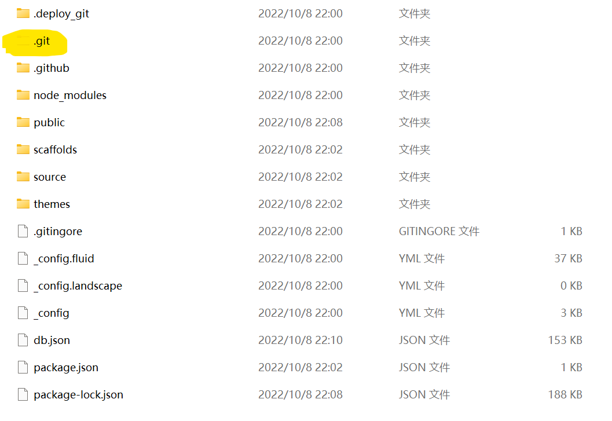

# 概述

《基于GitHub和Hexo搭建博客》中总结了如何利用github和hexo搭建个人博客，但是github上上传的只是博客网站文件，像markdown笔记之类的源文件并没有备份，如果本地电脑坏了很难恢复以往的markdown笔记，所以需要连同markdown笔记在内的源文件都备份到github上。

# 备份步骤

## 创建新分支

在github上的博客所在仓库上创建一个用来备份的分支hexo，并且将其设置为默认分支。

## 获取git信息文件

去桌面或者哪里随便一个地方，把刚刚的hexo分支给clone下来。然后剪切出里面的.git文件夹，复制到现在的博客文件夹中。



## 添加 .[gitignore](https://so.csdn.net/so/search?q=gitignore&spm=1001.2101.3001.7020)

用来在上传时候忽略一些文件，即不上传`.gitignore`中忽略的文件。如果有最好，没有的话自己手动添加。

```
.DS_Store
Thumbs.db
db.json
*.log
node_modules/
public/
.deploy*/
```

**注意，如果你之前克隆过theme中的主题文件，那么应该把主题文件中的.git文件夹删掉，因为git不能嵌套上传，最好是显示隐藏文件，检查一下有没有，否则上传的时候会出错，导致你的主题文件无法上传，这样你的配置在别的电脑上就用不了了。**

## 备份

在hexo博客的根目录下执行

```
$ git add .
$ git commit -m "Backup"
$ git push origin hexo
```

这样就备份完博客了且在Github上能看到两个分支(main和hexo)。

## 备份习惯

```
hexo clean
git add .
git commit -m "Backup"
git push
hexo g
hexo d
```

# 恢复步骤

## 环境准备

安装git 、nodejs，确保github公钥接入，参考《基于GitHub和Hexo搭建博客》

## 克隆项目到本地

输入下列命令克隆博客必须文件(hexo分支)：

```
$ git clone https://xxxxx(详见仓库链接)
```

## 博客恢复

在clone下来的那个文件夹里面执行

```
$ npm install hexo-cli
$ npm install
$ npm install hexo-deployer-git –save
$ rm -rf .deploy_git
```

然后再去安装原来安装的一些插件。**在此不需要执行hexo init这条指令，因为不是从零搭建起新博客。

后续正常写博客，执行以下命令即可

```
hexo n xx
hexo clean
hexo g
hexo d
```

# 参考

[【Hexo异常】fatal: in unpopulated submodule '.deploy_git'_nomasp的博客-CSDN博客](https://blog.csdn.net/NoMasp/article/details/79504699)

[ Hexo博客的备份_fFee-ops的博客-CSDN博客_hexo备份](https://blog.csdn.net/qq_21040559/article/details/109702142)
