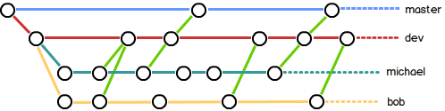

# 创建版本库

版本库又名仓库，英文名repository，你可以简单理解成一个目录，这个目录里面的所有文件都可以被Git管理起来，每个文件的修改、删除，Git都能跟踪，以便任何时刻都可以追踪历史，或者在将来某个时刻可以“还原”。

初始化一个Git仓库，使用`git init`命令。

添加文件到Git仓库，分两步：

1. 使用命令`git add 文件名`，注意，可反复多次使用，添加多个文件，此时文件放到了缓存区；
2. 使用命令`git commit -m "提交信息"`，完成，此时文件从缓存区被放到了head指定的当前分支中。

# 查看工作区状态与提交修改

要随时掌握工作区的状态，使用`git status`命令。

如果git status告诉你有文件被修改过，用`git diff`可以查看修改内容。

提交修改与添加文件的步骤一样

```
 git add 文件名
 git commit -m "add a line"
```

将暂存区的版本提交到版本库,从而形成工作区->暂存区->版本库的基本链路,本地工作区的版本控制流程大致如此.

# 版本切换

HEAD指向的版本就是当前版本，因此，Git允许我们在版本的历史之间穿梭，使用命令`git reset --hard commit_id`（commit_id可以输入前几位就行）。

穿梭前，用`git log`可以查看提交历史，以便确定要回退到哪个版本。

要重返未来，用`git reflog`查看命令历史，以便确定要回到未来的哪个版本。

# 多次修改

第一次修改 -> git add -> 第二次修改 -> git add -> git commit

# 修改撤销

- 场景1：当你改乱了工作区某个文件的内容，想直接丢弃工作区的修改时，用命令`git checkout -- file`。
- 场景2：当你不但改乱了工作区某个文件的内容，还添加到了暂存区时，想丢弃修改，分两步，第一步用命令`git reset HEAD` ，就回到了场景1，第二步按场景1操作。
- 场景3：已经提交了不合适的修改到版本库时，想要撤销本次提交，参考**版本切换**一节，不过前提是没有推送到远程库。

# 删除文件

如果在本地删除了文件，可以通过以下操作在git库里删除  

`git rm test.txt`  

`git commit -m "remove test.txt"`  

可以通过以下操作恢复，相当于是让工作目录test.txt恢复到暂存区中test.txt的状态

`git checkout -- test.txt`

# 添加远程库

**git连接GitHub的操作可以见《Windows环境基于GitHub和Hexo搭建个人博客》的2.2节**

把本地库的内容推送到远程，用git push命令，实际上是把指定分支推送到远程。  

由于远程库是空的，我们第一次推送master分支时，加上了-u参数，Git不但会把本地的master分支内容推送的远程新的master分支，还会把本地的master分支和远程的master分支关联起来，在以后的推送或者拉取时就可以简化命令。

1. 要关联一个远程库，使用命令
   
   ```
   git remote add origin git@server-name:path/repo-name.git
   ```
   
   例如：
   
   ```
   git remote add origin git@github.com:michaelliao/learngit.git
   ```

2. 关联后，使用命令`git push -u origin master`第一次推送master分支的所有内容；

3. 此后，每次本地提交后，只要有必要，就可以使用命令`git push origin master`推送最新修改；

# 克隆远程库

Git支持多种协议，包括https，但通过ssh支持的原生git协议速度最快。以下是拉去默认分支的内容

```shell
$ git clone git@github.com:michaelliao/gitskills.git
```

因为刚才推送到master分支，所以我们可以拉取master分支的内容

```
git clone git@github.com:michaelliao/gitskills.git -b master
```

# 分支

## 命令

查看分支：`git branch`

创建分支：`git branch <name>`

切换分支：`git checkout <name>`或者`git switch <name>`

创建+切换分支：`git checkout -b <name>`或者`git switch -c <name>`

合并某分支到当前分支：`git merge <name>`

删除分支：`git branch -d <name>`

通常，合并分支时，如果可能，Git会用Fast forward模式，但这种模式下，删除分支后，会丢掉分支信息。如果要强制禁用Fast forward模式，Git就会在merge时生成一个新的commit，这样，从分支历史上就可以看出分支信息。具体的`git merge --no-ff -m "merge with no-ff" dev`，加上--no-ff选项。

## 分支管理

master分支应该是非常稳定的，也就是仅用来发布新版本，平时不能在上面干活；干活都在dev分支上，也就是说，dev分支是不稳定的，到某个时候比如1.0版本发布时，再把dev分支合并到master上，在master分支发布1.0版本；每个人都在dev分支上干活，每个人都有自己的分支，时不时地往dev分支上合并就可以了。  

所以，团队合作的分支看起来就像这样：



## bug分支

修复bug时，我们会通过创建新的bug分支进行修复，然后合并，最后删除；

当手头工作没有完成时，先把工作现场git stash一下，然后去修复bug，修复后，再git stash pop，回到工作现场；

在master分支上修复的bug，想要合并到当前dev分支，可以用git cherry-pick 命令，把bug提交的修改“复制”到当前分支，避免重复劳动。

具体可以参考：https://www.liaoxuefeng.com/wiki/896043488029600/900388704535136

## feature分支

开发一个新feature，最好新建一个分支，开发完可以合并到dev分支；

如果要丢弃一个没有被合并过的分支，可以通过git branch -D 强行删除。

# 多人协作

多人协作的工作模式通常是这样：

- 首先，可以试图用git push origin 推送自己的修改；
- 如果推送失败，则因为远程分支比你的本地更新，需要先用git pull试图合并；
- 如果合并有冲突，则解决冲突，并在本地提交；
- 没有冲突或者解决掉冲突后，再用git push origin 推送就能成功！
- 如果git pull提示no tracking information，则说明本地分支和远程分支的链接关系没有创建，用命令git branch --set-upstream-to origin/。

多人协作重点：

- 查看远程库信息，使用git remote -v；
- 本地新建的分支如果不推送到远程，对其他人就是不可见的；
- 从本地推送分支，使用git push origin branch-name，如果推送失败，先用git pull抓取远程的新提交；
- 在本地创建和远程分支对应的分支，使用git checkout -b branch-name origin/branch-name，本地和远程分支的名称最好一致；
- 建立本地分支和远程分支的关联，使用git branch --set-upstream branch-name origin/branch-name；
- 从远程抓取分支，使用git pull，如果有冲突，要先处理冲突。

# 标签

命令git tag 用于新建一个标签，默认为HEAD，也可以指定一个commit id；

命令git tag -a -m "blablabla..."可以指定标签信息；

命令git tag可以查看所有标签。

命令git push origin 可以推送一个本地标签；

命令git push origin --tags可以推送全部未推送过的本地标签；

命令git tag -d 可以删除一个本地标签；

命令git push origin :refs/tags/可以删除一个远程标签。

# 使用github

在GitHub上，可以任意Fork开源仓库，复制到自己的仓库；

自己拥有Fork后的仓库的读写权限；

可以推送pull request给官方仓库来贡献代码。

# 参考

[Git教程 - 廖雪峰的官方网站 (liaoxuefeng.com)](https://www.liaoxuefeng.com/wiki/896043488029600)
