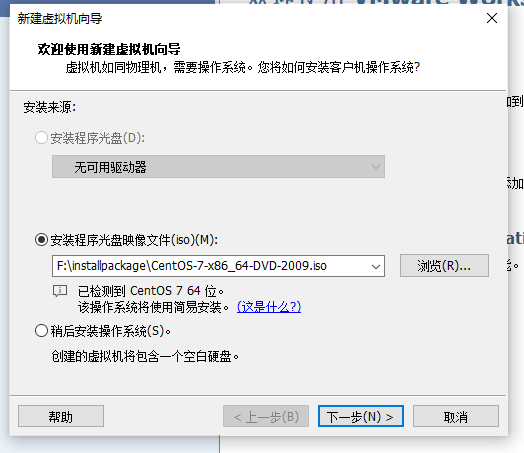

# 背景

前一段时间，博主为了在家里搭建学习环境，想模拟一个生产环境，尝试了Windows安装WSL、Vmware workstation player 安装Ubuntu、把Window删了直接装Ubuntu、把Ubuntu删了装回Windows(Windows一直无法安装到SSD，最后拆了电脑拔了机械硬盘才装成功)的多个阶段，发现还是Windows用的习惯，曾经还想过有朝一日试试高贵的Macbook，如今兴趣也是减了大半了。话归主题，最后博主决定还是使用Windows基于Vmware workstation player安装centos和其他相关组件。

# 准备

## VMware Workstation 16 Player

VMware Workstation 16 Player个人使用免费，直接百度搜索官网下载安装，注意软件的安装位置和虚拟机文件的位置选择，其他默认即可。

## centOS镜像

博主前往[https://mirrors.tuna.tsinghua.edu.cn](清华大学开源软件镜像站)下载的centos7镜像，具体路径是`/centos/7/isos/x86_64/`，具体镜像名为**CentOS-7-x86_64-DVD-2009.iso**

# 虚拟机创建

打开Vmware workstation player，点击**创建新虚拟机**，选择刚才下载下来的镜像，点击下一步



填写全名（主机名称）、用户名、密码，本步骤用于Vmware workstation player自动安装centos，点击下一步

填写Vmware workstation player上显示的虚拟机名称和虚拟机文件的存放位置，点击下一步

配置磁盘大小，博主设置为了60GB，其他配置默认，点击下一步

选择**自定义组件**，博主将**虚拟机的内存**设置为了6GB，**处理器内核数量**设置为了8，网络选择了**桥接模式**，其他配置默认，点击关闭，然后点击**完成**，然后后续Vmware workstation player会全自动安装centOS，比使用公司的魔改centos镜像安装还要顺滑~

[NAT模式和桥接模式的区别详解](https://blog.csdn.net/qq_27088383/article/details/108634985)中介绍了桥接模式的基本原理

# 虚拟机配置

因为网络选择的是桥接模式，所以虚拟机会有一个独立的ip，Vmware workstation player已经自动为我们配置好了系统的网卡，直接执行`ifconfig`可以看到虚拟机的ip信息，但是外部还无法基于ssh连接虚拟机，需要开放ssh的端口。

修改ssh配置，`vim /etc/ssh/sshd_config`，将`Port 22`注释解开,重启sshd`sudo service sshd restart`，然后使用MabaXterm尝试连接虚拟机即可。

为了方便后续mysql图形化客户端连接，把防火墙也一并关掉`systemctl stop firewalld.service`，然后永久关闭防火墙`systemctl disable firewalld.service`

# mysql安装

- 安装mysql源

```
# 下载安装包
wget https://dev.mysql.com/get/mysql80-community-release-el7-3.noarch.rpm
# 安装
rpm -vih mysql80-community-release-el7-3.noarch.rpm
# 确认是否安装成功
yum repolist enabled | grep "mysql.*-community.*"
```

- 修改版本

以上安装版本一般会安装最新稳定版，但是我们一般用5.6版本，所以需要调整版本

`yum repolist all | grep mysql`可以展示哪些源被禁用或者启动

执行`yum-config-manager --disable mysql80-community`禁用8.0版本，执行`yum-config-manager --enable mysql56-community`启用5.6版本

- 安装Mysql

```
yum install mysql-community-server
```

- 启动Mysql

```
service mysqld start
```

启动说明里有提示如何修改密码，参照说明进行密码修改可以


- MySQL其他命令

```
service mysqld stop　　　　　　　　#关闭MySQL服务
service mysqld restart　　　　　　#重启MySQL服务 
service mysqld status　　　　　　#查看服务状态
```

- 登录与简单信息查看

```
mysql -uroot -pve#LoVkeU2u!
show databases;
```

- 图形化MySQL客户端工具连接MySQL报错

博主使用MySQL Workbench来连接MySQL，端口默认。连接MySQL报错**Host 'xxx' is not allowed to connect to this MySQL server**，通过https://www.cnblogs.com/codecat/p/10729033.html和https://blog.csdn.net/qq_38331606/article/details/79535489解决

# 参考资料

[NAT模式和桥接模式的区别详解](https://blog.csdn.net/qq_27088383/article/details/108634985) 
[在Windows上使用 VMware 16 Player 创建新虚拟机](https://blog.csdn.net/u013766416/article/details/121351256)
[Centos7 怎么永久关闭防火墙](https://www.cnblogs.com/hailexuexi/p/15124213.html)
[Linux系统发行版ContOS7演示安装MySQL](https://www.cnblogs.com/xsge/p/13827288.html)
[解决MySql报错：1130 - Host 'xxx' is not allowed to connect to this MySQL server的方法](https://www.cnblogs.com/codecat/p/10729033.html)
[Duplicate entry '%-root' for key 'PRIMARY'](https://blog.csdn.net/qq_38331606/article/details/79535489)