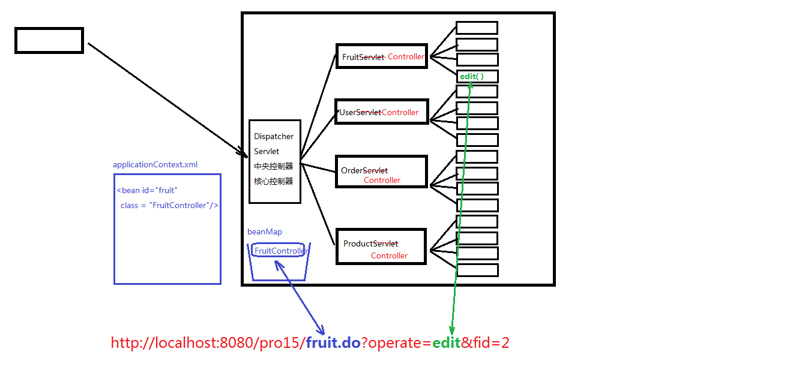
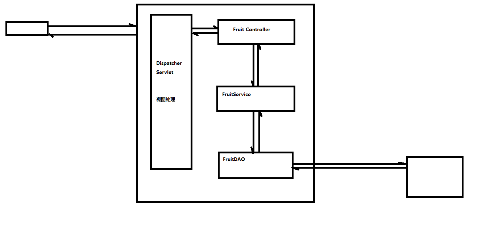

# 前言

基于JavaWeb基础知识进行优化，形成了MVC的开发模式。

# 程序结构优化

教程原来案例中的servlet太多了，希望只有一个servlet，把原来多个servlet的合并成一个，根据参数operation判断用哪个方法并用反射调用，都写到了新servlet的service方法中了。引入dispatcherservlet，作为中心控制器，把原来整合后的servlet都换成controller，不再是servlet了。
dispatcherservlet开始加载不同关键字和controller的对应关系，然后根据前端传入的url关键字(servletpath)调用不同controller，然后根据参数operation调用controller中不同的方法。
原来controller中的重定向，改为返回重定向的信息String，由dispatcherservlet接收后统一重定向（如果需要重定向的话），参数获取也由dispatcherservlet统一基于反射获取然后传给controller中的方法，不在需要在controller进行参数获取和重定向，controller变成一个普通类。



另外将业务逻辑抽出为Service层，来将Dao中的单精度操作聚合，使web整体层次更清晰。



# MVC

MVC : Model（模型）、View（视图）、Controller（控制器）
视图层：用于做数据展示以及和用户交互的一个界面
控制层：能够接受客户端的请求，具体的业务功能还是需要借助于模型组件来完成
模型层：模型分为很多种：有比较简单的pojo/vo(value object)，有业务模型组件，有数据访问层组件
    1) pojo/vo : 值对象
    2) DAO ： 数据访问对象，DAO中的方法都是单精度方法或者称之为细粒度方法。什么叫单精度？一个方法只考虑一个操作，比如添加，那就是insert操作、查询那就是select操作....
    3) BO ： 业务对象，BO中的方法属于业务方法，也实际的业务是比较复杂的，因此业务方法的粒度是比较粗的

# 补充

## filter

Filter也属于Servlet规范。

Filter开发步骤：新建类实现Filter接口，然后实现其中的三个方法：init、doFilter、destroy

配置Filter，可以用注解@WebFilter，也可以使用xml文件 <filter> <filter-mapping>

Filter在配置时，和servlet一样，也可以配置通配符，例如 @WebFilter("*.do")表示拦截所有以.do结尾的请求

以下是一个Filter的案例，拦截所有以.do结尾的请求，会在处理请求前先打印"helloA"然后等请求处理完之后再打印"helloA2"

```
@WebFilter("*.do")
public class Demo01Filter implements Filter {
    @Override
    public void init(FilterConfig filterConfig) throws ServletException {

    }

    @Override
    public void doFilter(ServletRequest servletRequest, ServletResponse servletResponse, FilterChain filterChain) throws IOException, ServletException {
        System.out.println("helloA");
        //放行
        filterChain.doFilter(servletRequest,servletResponse);
        System.out.println("helloA2");
    }

    @Override
    public void destroy() {

    }
}
```

## listener

监听器分类：

1. ServletContextListener - 监听ServletContext对象的创建和销毁的过程
2. HttpSessionListener - 监听HttpSession对象的创建和销毁的过程
3. ServletRequestListener - 监听ServletRequest对象的创建和销毁的过程
4. ServletContextAttributeListener - 监听ServletContext的保存作用域的改动(add,remove,replace)
5. HttpSessionAttributeListener - 监听HttpSession的保存作用域的改动(add,remove,replace)
6. ServletRequestAttributeListener - 监听ServletRequest的保存作用域的改动(add,remove,replace)
7. HttpSessionBindingListener - 监听某个对象在Session域中的创建与移除
8. HttpSessionActivationListener - 监听某个对象在Session域中的序列化和反序列化

监听器举例：

```
public class MyServletContextListener implements ServletContextListener {
    @Override
    public void contextInitialized(ServletContextEvent servletContextEvent) {
        System.out.println("Servlet上下文对象初始化动作被我监听到了....");
    }

    @Override
    public void contextDestroyed(ServletContextEvent servletContextEvent) {
        System.out.println("Servlet上下文对象销毁动作被我监听到了.....");
    }
}
```

## cookie

Cookie是浏览器端的缓存

- 设置Cookie的有效时长
  cookie.setMaxAge(60)  ， 设置cookie的有效时长是60秒
- Cookie的应用：
  记住用户名和密码十天 setMaxAge(60 * 60 * 24 * 10)
  十天免登录

# 参考

[尚硅谷javaweb教程](https://www.bilibili.com/video/BV1AS4y177xJ/)


