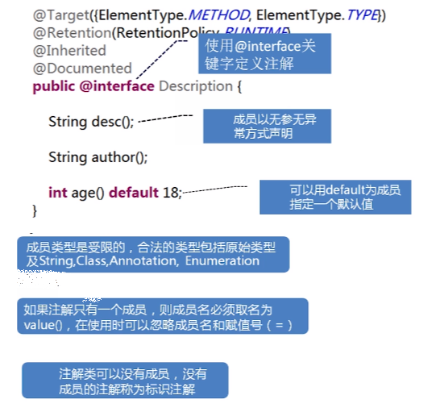

# 前言

java基础相关面试题目整理

# 题目

## Java创建一个对象的方法有几种？

1. 使用new关键字
2. 反射
    (1)使用Class类的newInstance方法
    ```
    Employee emp2 = (Employee) Class.forName("org.programming.mitra.exercises.Employee").newInstance();
    ```
    或者(目前Class.newInstance()这种方法因为效率问题已经被标记@Deprecated)
    ```
    Employee emp2 = Employee.class.newInstance();
    ```
    (2)使用Constructor类的newInstance方法
    ```
    Constructor<Employee> constructor = Employee.class.getConstructor();
    Employee emp3 = constructor.newInstance();
    ```
3. clone
    类需要先实现Cloneable接口并实现其定义的clone方法。
    ```
    Employee emp4 = (Employee) emp3.clone();
    ```
4. 反序列化
    需要让类实现Serializable接口
    ```
    ObjectInputStream in = new ObjectInputStream(new FileInputStream("data.obj"));
    Employee emp5 = (Employee) in.readObject();
    ```

参考:
[Java中创建对象的5种方式](https://www.cnblogs.com/wxd0108/p/5685817.html)

## Java中==和equals的区别是什么？

略

## 序列化的作用是什么？常见的序列化方法是什么？Java自带的序列化是怎么实现的？

### 序列化的作用是什么？

网络传输的数据都必须是二进制数据，但是在Java中都是对象，是没有办法在网络中进行传输的，所以就需要对Java对象进行序列化。

序列化：将数据结构或对象转换成二进制串的过程；

反序列化：将在序列化过程中所生成的二进制串转换成数据结构或者对象的过程

### 常见的序列化方法是什么？

json序列化，java原生序列化等。关于选型可以参考美团技术博客，见[序列化和反序列化](https://tech.meituan.com/2015/02/26/serialization-vs-deserialization.html)。

### Java自带的序列化是怎么实现的？

1. 对于要序列化对象的类要去实现Serializable接口或者Externalizable接口
    ```
    public class TestBean implements Serializable {
        private static final long serialVersionUID = 6000894702030258313L;
        private Integer id;
        private String name;
        private Date date;
        //省去getter和setter方法和toString
    }
    ```
2. 使用JDK提供的ObjectOutputStream和ObjectInputStream来实现序列化和反序列化
    序列化：
    ```
    public static void main(String[] args) {
        TestBean testBean = new TestBean();
        testBean.setDate(new Date());
        testBean.setId(1);
        testBean.setName("zll1");
        //使用ObjectOutputStream序列化testBean对象并将其序列化成的字节序列写入test.txt文件
        try {
            FileOutputStream fileOutputStream = new FileOutputStream("D:\\test.txt");
            ObjectOutputStream objectOutputStream = new ObjectOutputStream(fileOutputStream);
            objectOutputStream.writeObject(testBean);
        } catch (FileNotFoundException e) {
            e.printStackTrace();
        } catch (IOException e) {
            e.printStackTrace();
        }
    }
    ```
    反序列化：
    ```
    public static void main(String[] args) {
        try {
            FileInputStream fileInputStream = new FileInputStream("D:\\test.txt");
            ObjectInputStream objectInputStream = new ObjectInputStream(fileInputStream);
            TestBean testBean = (TestBean) objectInputStream.readObject();
            System.out.println(testBean);
        } catch (FileNotFoundException e) {
            e.printStackTrace();
        } catch (IOException e) {
            e.printStackTrace();
        } catch (ClassNotFoundException e) {
            e.printStackTrace();
        }
    }
    ```
    注意：
    - 一个对象要进行序列化，如果该对象成员变量是引用类型的，那这个引用类型也一定要是可序列化的，否则会报错
    - 对于不想序列化的字段可以在字段类型之前加上transient关键字修饰（反序列化时会被赋予默认值）
    - 实现Externalizable接口需要重写两个方法writeExternal(ObjectOutput out)和readExternal(ObjectInput in)，用来自定义决定哪些字段需要序列化，哪些需要反序列化
    - 关于serialVersionUID：在进行序列化时，会把当前类的serialVersionUID写入到字节序列中（也会写入序列化的文件中），在反序列化时会将字节流中的serialVersionUID同本地对象中的serialVersionUID进行对比，一致的话进行反序列化，不一致则失败报错（报InvalidCastException异常）。如果未显式声明serialVersionUID，会隐式申明一个serialVersionUID，这个serialVersionUID和对象字段还有JVM环境有关，如果没有设置serialVersionUID做了序列化，然后修改了字段就无法进行反序列化了，所以一般会先设定一个serialVersionUID。可以基于IDEA自动生成(参见[IDEA 自动生成serialVersionUID](https://blog.csdn.net/Aphysia/article/details/80620804))，也可以基于jdk中的工具生成。

参考:
[Java几种序列化方式对比](https://zhuanlan.zhihu.com/p/361705392)
[序列化和反序列化](https://tech.meituan.com/2015/02/26/serialization-vs-deserialization.html)
[一文搞懂序列化与反序列化](https://zhuanlan.zhihu.com/p/316200445)
[IDEA 自动生成serialVersionUID](https://blog.csdn.net/Aphysia/article/details/80620804)
[serialVersionUID作用是什么以及如何生成的](https://cloud.tencent.com/developer/article/1943450)
[java序列化框架性能对比](https://www.bbsmax.com/A/8Bz841mVzx/)
## 重载和重写的区别？

略

## java的异常机制？结合项目描述一下你是怎么处理异常的？

### java的异常机制

- Error和Exception

Java所有异常类都是Throwable的子类。它包括Java异常处理的两个重要子类：Error和Exception。

Error：Error及其子类用来描述Java运行系统中的内部错误以及资源耗尽的错误，是程序无法处理的错误，这类错误比较严重，如OutOfMemoryError。这些异常发生时，JVM一般会选择线程终止。这些错误是不可查的，因为它们在应用程序的控制和处理能力之外，而且绝大多数是程序运行时不允许出现的状况。 

Exception：可以通过捕捉处理使程序继续执行，是程序自身可以处理的异常。根据错误发生原因可分为RuntimeException异常和除RunTimeException之外的异常，如IOException异常。RuntimeException 类及其子类表示“JVM 常用操作”引发的错误。例如，若试图使用空值对象引用、除数为零或数组越界，则分别引发运行时异常（NullPointerException、ArithmeticException和 ArrayIndexOutOfBoundException）。 

- 可查异常和不可查异常

可查异常：编译器要求必须处理的异常，这类异常的发生在一定程度上是可以预计的，除了RuntimeException及其子类以外的其它异常类都属于可查异常。这种异常的特点是Java编译器会检查它，也就是说，出现这种异常，要么用try-catch语句捕捉它，要么用throws语句声明抛出它，否则编译不通过。

不可查异常：编译器不要求强制处理的异常，包括运行时异常（RuntimeException与其子类）和错误（Error） 。

### 结合项目描述一下你是怎么处理异常的

自定义异常实现错误码接口，在特定检查处抛出包含错误码的自定义异常，

参考：
[Java的异常处理机制](https://blog.csdn.net/qq_15349687/article/details/82811581)

## Object类有哪些常用的方法

- getClass()

返回Class，native方法

- hashCode()

返回一个int，native方法

- equals(Object obj)

默认等价与==

- clone()

需要继承Coloneable接口，返回一个对象的副本，不过是对于对象的引用型字段（String和包装类除外）为浅拷贝

- toString()

默认返回 getClass().getName() + "@" + Integer.toHexString(hashCode())

- notify()、wait()

通知

- finalize()

在GC准备释放对象所占的内存空间时，将会调用finalize()，用于释放非java资源（例如打开的文件资源、数据库连接等）或调用非java方法（native方法）时分配的内存。finalize()最多只会执行一次，可以在这次执行中使对象再次被引用，使对象再活一次。

已经标记为@Deprecated，主要原因为
1. 调用时机的不确定性
2. 影响代码的可移植性，移植到其他JVM，finalize方法可能运行崩溃
3. 成本较高，如果一个类没有重载finalize方法，那么销毁时只要将堆中的内存处理一下就可以了，而如果重载了finalize方法的话，就要执行finalize方法，万一执行过程中再出现点异常或错误成本就更高了。
4. 异常丢失，万一fianlize方法中抛出了异常，那么finalize会终止运行，而抛出的这个异常也会被舍弃，最终会让对象实例处于一种半销毁半存活的僵尸状态

参考：
[Java中finalize()方法的使用](https://blog.csdn.net/CrazyLai1996/article/details/84900818)
[Java中的finalize方法已经退出历史舞台，再看它最后一眼，留点余香](https://zhuanlan.zhihu.com/p/94072959)

## java的hashcode和equals方法的作用？什么时候会用到？

hashcode在HashMap和HashSet中可以用于确定key所在桶的位置。在HashMap和HashSet中，两个key的hashcode相等，且equals为true时，可以判定为相同的key，就不会重复添加key。

## String是一个基本类型么？那java的基本类型有哪些？String和StringBuffer和StringBuilder的区别是什么？

不是;int, long, float, double, boolean, char等；String是不可变字符串，StringBuffer和StringBuilder是可变字符串，StringBuffer线程安全，StringBuilder线程不安全但是效率高。StringBuffer虽然线程安全但可能会造成字符串写入顺序问题，一般使用StringBuilder。

## String str="i"与 String str=new String("i")一样吗？不同点主要在哪里呢？

不一样。String str="i"的方式，Java 虚拟机会将其分配到常量池中，常量池指的是在编译期被确定，并被保存在已编译的.class文件中的一些数据，常量池不会重复创建对象；而 String str=new String(“i”)方式，则会被分到堆内存中。

```
    public static void main(String[] args) {
        String str1 = "i";
        String str2 = "i";
        String str3 = new String("i");
        String str4 = new String("i");
        System.out.println(str1 == str2);//ture
        System.out.println(str2 == str3);//false
        System.out.println(str3 == str4);//false
        System.out.println(str2.equals(str3));//ture
        System.out.println(str3.equals(str4));//ture
    }
```

参考：
[String str=“i“与 String str=new String(“i”)一样吗？](https://blog.csdn.net/MuYIShan1/article/details/115350086)

## 抽象类和接口的区别？抽象类一定要有抽象函数么？接口定义的变量一定是常量么？接口中可以定义函数的实现么？

### 抽象类和接口的区别？

相同点：

1. 都不能被实例化 
2. 接口的实现类或抽象类的子类都只有实现了接口或抽象类中的方法后才能实例化。

不同点：

1. 接口只有定义，不能有方法的实现，java 1.8中可以定义default方法体，而抽象类可以有定义与实现，方法可在抽象类中实现。

2. 实现接口的关键字为implements，继承抽象类的关键字为extends。一个类可以实现多个接口，但一个类只能继承一个抽象类。所以，使用接口可以间接地实现多重继承。

3. 接口强调特定功能的实现，而抽象类强调所属关系。

4. 接口成员变量默认为public static final，必须赋初值，不能被修改；其所有的成员方法都是public、abstract的。抽象类中成员变量默认default，可在子类中被重新定义，也可被重新赋值；抽象方法被abstract修饰，不能被private、static、synchronized和native等修饰，必须以分号结尾，不带花括号。

### 抽象类一定要有抽象函数么？

不需要，抽象类不一定有抽象方法；但是包含一个抽象方法的类一定是抽象类。

### 接口定义的变量一定是常量么？

是

### 接口中可以定义函数的实现么？

java 1.8中可以定义default方法体

参考：
[Java基础之接口与抽象类的区别](https://zhuanlan.zhihu.com/p/94770324)
[抽象类必须要有抽象方法吗？](https://blog.csdn.net/ZM_Crazy/article/details/113931384)

## final、static关键字在java中的作用？抽象类可以使用final修饰么？

### final、static关键字在java中的作用？

- final 变量
    变量指定的对象存储空间固定，不能修改，只读
- final 方法
    final 方法使该类的子类无法重写该方法
- final 类
    无法被子类继承
- static 
    与类相关，例如静态内部类、静态方法、静态变量、静态代码块

### 抽象类可以使用final修饰么？

不能

## final,finally,finalize分别是什么？

- final：java中的关键字，修饰符。
1. 如果一个类被声明为final，就意味着它不能再派生出新的子类，不能作为父类被继承。
2. 被声明为final的变量必须在声明时给定初值，变量指向的内存地址无法改变。
3. 被声明final的方法子类无法重写。
- finally：java的一种异常处理机制。
finally是对Java异常处理模型的补充。finally结构使代码总会执行，而不管无异常发生。使用finally可以维护对象的内部状态，并可以清理非内存资源。特别是在关闭数据库连接这方面，如果程序员把数据库连接的close()方法放到finally中，就会大大降低程序出错的几率。
- finalize：Java中的一个方法名。
Java技术使用finalize()方法在垃圾收集器将对象从内存中清除出去前，做必要的清理工作。这个方法是由垃圾收集器在确定这个对象没被引用时对这个对象调用的。它是在Object类中定义的，因此所的类都继承了它。子类覆盖finalize()方法以整理系统资源或者执行其他清理工作。目前该方法已经在JDK1.9被标记@Deprecated

参考：
[Java中final、finally、finalize的区别与用法](https://www.cnblogs.com/smart-hwt/p/8257330.html)

## Java的IO流有了解过，实现一个按行读取数据的方式。

### Java的IO流体系

在Java中，将不同的终端的输入输出源抽象为流的概念，通过这种方式可以将不同终端的数据进行交互。Java将传统的流类型都放在java.io包中，一般我们将IO以以下三种方式进行分类。

1）按照流的方向：输入流和输出流

输入输出流是针对程序运行的内存而言的，从内存输出到其他介质上称为输出流，从其他介质输入到程序内存中称为输入流。一般以inputstream/reader结尾的称为输入流，outputstream/writer结尾的称为输出流。

2）按照操作单元分：字节流和字符流

字节流是针对一个字节一个字节进行操作的，字符流最小的操作单元是一个字符。字节流以inputstream/outputstream结尾，字符流以writer/reader结尾。字符流和字节流的转换使用适配器模式进行，可以利用转换流将字符流、字节流相互转换。

3）按照是否可以直接连接一个介质来划分：节点流和处理流

节点流是指可以直接连接在一个介质上进行输入输出的，而处理流是将节点流进行包装而具有新的功能，节点流也被称为低级流，处理流因为有了新的功能特性（当然了也包含了原来的特性）被称为高级流。这里jdk使用装饰器模式进行。


### 关于转换流

InputStreamReader 字节流转字符流
OutputStreamWriter 字符流转字节流
以上均需要注意指定或默认的字符集

### 按行读取文件

```
public static void main(String[] args) {
    BufferedReader reader;
    try {
        reader = new BufferedReader(new FileReader(
                "D:\\git\\learning\\readtext.txt"));
        String line = reader.readLine();
        while (line != null) {
            System.out.println(line);
            line = reader.readLine();
        }
        reader.close();
    } catch (IOException e) {
        e.printStackTrace();
    }
}
```

参考：
[Java IO流详解（六）----转换流（字节流和字符流之间的转换）](https://www.cnblogs.com/tanghaorong/p/12363660.html)
[java逐行读取文件_Java逐行读取文件](https://blog.csdn.net/cunchi4221/article/details/107470903)

## Java的反射原理是什么？Getclass和classforName的区别是什么？

```
public class HelloReflect {
    public static void main(String[] args) {
        try {
            // 1. 使用外部配置的实现，进行动态加载类
            TempFunctionTest test = (TempFunctionTest)Class.forName("com.tester.HelloReflect").newInstance();
            test.sayHello("call directly");
            // 2. 根据配置的函数名，进行方法调用（不需要通用的接口抽象）
            Object t2 = new TempFunctionTest();
            Method method = t2.getClass().getDeclaredMethod("sayHello", String.class);
            method.invoke(test, "method invoke");
        } catch (ClassNotFoundException e) {
            e.printStackTrace();
        } catch (InstantiationException e) {
            e.printStackTrace();
        } catch (IllegalAccessException e) {
            e.printStackTrace();
        } catch (NoSuchMethodException e ) {
            e.printStackTrace();
        } catch (InvocationTargetException e) {
            e.printStackTrace();
        }
    }
    
    public void sayHello(String word) {
        System.out.println("hello," + word);
    }

}
```

### forName和newInstance

forName()反射获取类信息，主要是先获取ClassLoader，然后调用native方法获取信息，最后，jvm又会回调ClassLoader进行类加载（双亲委派）
newInstance() 主要做了三件事：（1）权限检测，如果不通过直接抛出异常；（2）查找无参构造器（1. 先尝试从缓存获取所有的constructors，如果没有缓存则重新从jvm中获取并用软引用缓存, 然后通过进行参数类型比较；2. 找到匹配后，通过 ReflectionFactory copy一份constructor返回；3. 否则抛出 NoSuchMethodException;），并将其缓存起来；（3）调用具体方法的无参构造方法，生成实例并返回；

### getDeclaredMethod和invoke

getDeclaredMethod()主要做了四件事：（1）先进行权限检查；（2）获取所有方法列表(也是先从缓存中取，没有则从jvm中获取)；（3）根据方法名称和方法列表，选出符合要求的方法（ReflectionFactory, copy方法后返回，实际返回的是一个方法的副本）；（4）如果没有找到相应方法，抛出异常，否则返回对应方法；

invoke()做的事情：（1）先获取Method的MethodAccessor（缓存中没有则创建）;（2）调用MethodAccessor的invoke方法，底层交给JVM实现；

### 反射小结

最后，用几句话总结反射的实现原理：

1. 反射类及反射方法的获取，都是通过从列表中搜寻查找匹配的方法，所以查找性能会随类的大小方法多少而变化；
2. 每个类都会有一个与之对应的Class实例，从而每个类都可以获取method反射方法，并作用到其他实例身上；
3. 反射也是考虑了线程安全的，放心使用；
4. 反射使用软引用relectionData缓存class信息，避免每次重新从jvm获取带来的开销；
5. 反射调用多次生成新代理Accessor, 而通过字节码生存的则考虑了卸载功能，所以会使用独立的类加载器；
6. 当找到需要的方法，都会copy一份出来，而不是使用原来的实例，从而保证数据隔离；
7. 调度反射方法，最终是由jvm执行invoke0()执行；

### .class、class.forname()和getClass()的区别

- 相同

通过这几种方式，得到的都是java.lang.Class对象；都是类加载的产物

- 差别

1.出现的时期不同：Class.forname()在运行时加载（动态加载）；Class.class和对象名.getClass()是在编译时加载（静态加载）
2.类名.class：JVM将使用类装载器，将类装入内存(前提是:类还没有装入内存)，不做类的初始化工作，返回Class的对象
3.Class.forName("类名字符串") （注：类名字符串是包名+类名）：装入类，并做类的静态初始化，返回Class的对象
4.实例对象.getClass()：对类进行静态初始化、非静态初始化；返回引用运行时真正所指的对象(因为:子对象的引用可能会赋给父对象的引用变量中)所属的类的Class的对象

### 反射慢的原因

1. 需要对比参数匹配方法；
2. 需要进行权限检查；
3. 中间产生很多中间对象（方法副本，方法代理），影响GC；
4. 据说还影响JIT优化

参考：
[深入理解java反射原理](https://www.cnblogs.com/yougewe/p/10125073.html)
[java中Class对象详解和类名.class, class.forName(), getClass()区别](https://www.cnblogs.com/Seachal/p/5371733.html)
[都说 Java 反射效率低，究竟原因在哪里？](https://zhuanlan.zhihu.com/p/86993361)

## 拷贝

### 深拷贝和浅拷贝

而对于一个基础类型（包装类和非包装基本类型以及String），深拷贝和浅拷贝是一样的，都会复制一份新的，而对于一个对象类型，如果是浅拷贝的话，那其底层访问的是同一份对象，类似于对该对象起了个别名。而深拷贝的话才是我们真正说的复制，它会重新创建一个新的对象出来，和之前的对象的值一模一样，但是底层的地址是完全不同的。

### 如何实现深拷贝

一个类实现了Cloneable接口后，其对象即可调用clone()方法，此时为浅拷贝，被拷贝对象中的变量如果是基本类型及其包装类和String类会创建副本，其他类型的对象则是引用原对象的内存地址。

如果要实现深拷贝，需要实现Cloneable接口，并且实现clone方法，如果对象中包含其他对象，其他对象也要实现。举例如下：

```
import lombok.AllArgsConstructor;  
import lombok.Data;  
import lombok.NoArgsConstructor;  
@NoArgsConstructor  
@AllArgsConstructor  
@Data
public class User implements Cloneable{  
    private String name;  
    private LoginInfo loginInfo;  
    @Override  
    protected Object clone() throws CloneNotSupportedException {  
        User clone= (User)super.clone();  
        //调用底层clone方法重新赋值，不然就是浅拷贝  
        clone.loginInfo =(LoginInfo) clone.getLoginInfo().clone();  
        return clone;  
    }  

    @NoArgsConstructor  
    @AllArgsConstructor  
    @Data  
    public static class LoginInfo implements Cloneable{  
        private String id;  
        private String name;  
        //也要实现clone接口  
        @Override  
        protected Object clone() throws CloneNotSupportedException {  
            return super.clone();  
        }  
    }  
 }  
```

当然除了上面的方式，如果底下对象很多的话，那调用也是相对麻烦过程，可以直接new一个对象也可以实现深拷贝，或者通过反序列化(gson\Jackson等)的方式来说实现。

### 如何实现一个list类型的深拷贝

new一个list，然后对象依次深拷贝clone即可

参考：
[java 面试--序列化、反射、拷贝](https://mp.weixin.qq.com/s/EVYDpDVJXx4X72MKLbNsrQ)

## 泛型

### 作用和局限性

- 作用

使用泛型可以在编译时进行类型检查，可以大大减少类型转换的错误。

- 局限性

泛型不会被存入编码区，所以一个泛型的类型T是无法new出来的，我们不能使用T.class()。一个被经常使用的场景就是反序列化一个泛型T是不被允许的，这个时候，我们必须要传入T的具体类型，这样就增加了一个传参，具体如下：

```
public class GenericClass<T> {
    public T getResult(String s) {
        //报错，T不是一个类型
        T t = JSON.parseObject(s, T.class);
        return t;
    }

    //通过传入具体的类型，在强制转换
    public T getResult(String s, Class cls) {
        T t = (T) JSON.parseObject(s, cls);
        return t;
    }
}
```

### 类型擦除

Java的泛型类型在编译器阶段实现，编译过程泛型类型会被清除掉，生成的字节码中不包含任何的泛型信息，这个过程被称为类型擦除。

`List<String> list = new ArrayList<>();` 

上面定义的list为List<String>，经过编译之后就成了List，所以在方法区里面并没有存入String的相关信息。

类型擦除例子：

```
public static void main(String[] args) throws Exception {
    List<String> list = new ArrayList<>();
    list.add("2");
    //idea在做检查的时候会报错，无法通过编译
    list.add(1);
    //类型擦除之后，通过反射可以添加整型，这句话执行不会报错
    list.getClass().getMethod("add", Object.class).invoke(list, 1);
}
```

上面的反射可以添加任何类型，不会报错，但是要通过get方法取出来的时候会报错，因为get会进行强制类型转换为String。类型被擦除之后，在jvm中存入的是其限定类，如果没有限定，存入的是object类。

### 获取泛型

泛型的类型在编译的时候确实被擦除了，但可以通过签名来获取泛型的类型。

```
public class Test extends GenericClass<String> {
}
//获取类型
ParameterizedType genericType =(ParameterizedType)Test.class.getGenericSuperclass();
//输出字符串类型
System.out.println(genericType.getActualTypeArguments()[0]);
```

参考：
[java 面试--泛型、注解](https://mp.weixin.qq.com/s/1ZxBOtID64NEnwsXwOXTHg)

## Java的注解有了解，其底层的实现原理是什么？怎么定义一个注解？

注解类似一种标记，在实战中，注解有助于我们代码的解耦和无侵入性，一般通过反射获取类、函数或成员上运行时注解信息，从而实现动态控制程序运行的逻辑。

Java的注解有三类，分别是：元注解，自定义注解，jdk自带的注解。

元注解是指在定义一个注解的时候，必须要使用元注解进行标注，@Target，@Retention，@Documented，@Inherited，这四个是java的元注解；

jdk自带的注解是java已经定义好的注解，比如@override。

自定义注解是开发者定义的注解。自定义注解至少需要使用到元注解的两个@Target和@Retention

### 元注解

@Target：运行地方。@Target的取值有以下：
ElementType.CONSTRUCTOR 可以给构造方法进行注解
ElementType.FIELD 可以给属性进行注解
ElementType.LOCAL_VARIABLE 可以给局部变量进行注解
ElementType.METHOD 可以给方法进行注解
ElementType.PACKAGE 可以给一个包进行注解
ElementType.PARAMETER 可以给一个方法内的参数进行注解
ElementType.ANNOTATION_TYPE 可以给一个注解进行注解
ElementType.TYPE 可以给一个类型进行注解，比如类、接口、枚举（常用）

@Retention：保留时间，Source代码中，class编译后的类，runtime运行（常用）

@Document：是否文档化

@Inhrited：能否被继承


### 自定义注解



### 注解反射使用用例

```
package cn.gacl.annotation;

import java.lang.annotation.ElementType;
import java.lang.annotation.Retention;
import java.lang.annotation.RetentionPolicy;
import java.lang.annotation.Target;

@Retention(RetentionPolicy.RUNTIME)
//Retention注解决定MyAnnotation注解的生命周期
@Target( { ElementType.METHOD, ElementType.TYPE })
public @interface MyAnnotation {
    String color() default "blue";//为属性指定缺省值
    String value();//定义一个名称为value的属性
}
```

```
package cn.gacl.annotation;

@MyAnnotation("孤傲苍狼")//等价于@MyAnnotation(value="孤傲苍狼")
public class MyAnnotationTest {
    public static void main(String[] args) {
        /**
         * 用反射方式获得注解对应的实例对象后，在通过该对象调用属性对应的方法
         */
        MyAnnotation annotation = (MyAnnotation) MyAnnotationTest.class.getAnnotation(MyAnnotation.class);
        System.out.println(annotation.color());//输出color属性的默认值：blue
        System.out.println(annotation.value());

    }
}
```

参考：
[java 面试--泛型、注解](https://mp.weixin.qq.com/s/1ZxBOtID64NEnwsXwOXTHg)
[框架基础——全面解析Java注解](https://www.cnblogs.com/Qian123/p/5256084.html)
[Java基础加强总结(一)——注解(Annotation) ](https://www.cnblogs.com/xdp-gacl/p/3622275.html)

## Java中两个类的关系有多少种？

- 单向关联: 一个对象是另一个对象的成员变量
- 双向关联：两个对象互为对方的成员变量
- 自关联：一个对象是同类对象的成员变量
- 聚合关系：单向关联，大雁和雁群
- 组合关系：单向关联，大雁和翅膀
- 依赖关系：一个类的方法使用另一个类的对象作为参数
- 继承关系
- 接口实现关系

参考：
[Java 类图(UML)梳理](https://www.cnblogs.com/lllliuxiaoxia/articles/16512406.html)

## 有了解过设计模式么？

### 线程安全的单例模式

饿汉式

```
public class SingleHungry {
    private static SingleHungry singleHungry = new SingleHungry();
    private SingleHungry(){};
    public static SingleHungry getInstance(){
        return singleHungry;
    }
}
```

懒汉式，基于双重检查，此方式需要注意的是volatile关键字和双重检查

```
public class SingleLazy {
    private static volatile SingleLazy singleLazy;
    private SingleLazy(){};
    public static SingleLazy getInstance(){
        if (singleLazy == null){
            synchronized (SingleLazy.class){
                if (singleLazy == null){
                    singleLazy = new SingleLazy();
                }
            }
        }
        return singleLazy;
    }
}
```

### 策略模式

基于不同的标识，加载不同的策略进行处理。例如计算器加载加法策略进行加法计算，基于不同的子类标志采用不同的策略反射创建对象。

### 观察者模式

被观察者维护了一个观察者的列表，当被观察者的状态发生改变时通知所有的观察者做出相应的处理。

## Java的collection有几种？Collection和collections的区别是什么？

### java集合框架


### Collection和Collections的区别是什么

Collection是集合的接口，Collections是操作Collection的工具类，可以排序、填充、混排、最值、复制、线程安全包装等

参考：
[Java 集合框架](https://www.runoob.com/java/java-collections.html)
[Collection和Collections的区别及Collections常用方法](https://www.jianshu.com/p/0494cce4312a)

## ArrayLsit、LinkedList和vector的区别？它们是线程安全的么？如果想要线程安全应该要怎么实现？

### ArrayLsit、LinkedList和vector

ArrayList,LinkedList和Vector都继承自List接口。ArrayList和Vector的底层是动态数组，LinkedList的底层是双向链表。

ArrayList和Vector的区别就是ArrayList是线程不安全的，Vector是线程安全的，Vector中的方法都是同步方法(synchronized),所以ArrayList的执行效率要高于Vector,它也是用的最广泛的一种集合。

### 线程安全的List

- Vector

Vector大部分方法和ArrayList都是相同的，只是加上了synchronized关键字(同步在this上)

- Collections.synchronizedList

List list = Collections.synchronizedList(new ArrayList());
转换包装后的list可以实现add，remove，get等操作的线程安全性（内部同步在mutex），但是对于迭代操作，Collections.synchronizedList并没有提供相关机制，所以迭代时需要对包装后的list（必须对包装后的list进行加锁，锁其他的不行,多线程需要保证monitor相同）进行手动加锁，使用方式如下
```
List list = Collections.synchronizedList(new ArrayList());
//必须对list进行加锁
synchronized (list) {
  Iterator i = list.iterator();
  while (i.hasNext())
      foo(i.next());
}
```

- CopyOnWriteArrayList

是java并发包里类，用可重入锁
每次修改都会生成一个新的Array,同时利用Arrays.copyOf复制，最后更新
修改的时候加锁，读的时候不加锁，读写分离

- 对比

Collections.synchronizedList和Vector性能接近，但是Collections.synchronizedList可以包装多种List，兼容性和拓展性更强，一般推荐Collections.synchronizedList

CopyOnWriteArrayList会有一段时间的数据更新延迟，不是强同步，适用读多写少的非严格同步环境，非此场景建议用Collections.synchronizedList

参考：
[ArrayList,LinkedList和Vector的区别](https://zhuanlan.zhihu.com/p/79624468?utm_id=0)
[Collections.synchronizedList 、CopyOnWriteArrayList、Vector介绍、源码浅析与性能对比](https://www.cnblogs.com/lkxsnow/p/12247524.html)


## hashmap 

### HashMap扩容机制？

元素数量大于阈值，阈值是总容量*负载因子

### 它和Hashtable的区别是什么？

都实现了Map接口，Hashtable线程安全，而HashMap线程不安全。

HashTable的类注释说明HashTable已经被淘汰，如果你不需要线程安全，那么使用HashMap，如果需要线程安全，那么使用ConcurrentHashMap。应该是加锁比较粗暴的原因，性能估计较低。

### hashMap key和value可以是null么？

可以，一般不这么操作

### Hashmap的扩容一定是2^n么？

HashMap的初始化的数组长度一定是2的n次的，每次扩容仍是原来的2倍的话，就不会破坏这个规律，每次扩容后，原数据都会进行数据迁移，根据二进制的计算，扩容后数据要么在原来位置，要么在【原来位置+扩容长度】，这样就不需要重新hash，效率上更高。

### 1.8版本的优化点在哪里？

resize 扩容优化，不用rehash，快速寻址
引入了红黑树，目的是避免单条链表过长而影响查询效率
解决了resize时多线程死循环问题，但仍是非线程安全的

### 什么时候链表转换为红黑树？什么时候红黑树转换为链表？

链表长度大于 8 并且 表的长度大于 64 的时候会转化红黑树;
链表长度低于6，就把红黑树转回链表;

### 平时在使用HashMap时一般使用什么类型的元素作为Key？

选择Integer，String这种不可变的类型，像对String的一切操作都是新建一个String对象，对新的对象进行拼接分割等，这些类已经很规范的覆写了hashCode()以及equals()方法。作为不可变类天生是线程安全的，

### Hashmap的get和put方法是怎么实现的？

存储对象时，将 K/V 键值传给 put() 方法：

1. 调用 hash(K) 方法计算 K 的 hash 值，然后结合数组长度，计算得数组下标；
2. 调整数组大小（当容器中的元素个数大于 capacity * loadfactor 时，容器会进行扩容resize 为 2n）；
3. (1)如果 K 的 hash 值在 HashMap 中不存在，则执行插入，若存在，则发生碰撞；(2)如果 K 的 hash 值在 HashMap 中存在，且它们两者 equals 返回 true，则更新键值对；(3) 如果 K 的 hash 值在 HashMap 中存在，且它们两者 equals 返回 false，则插入链表的尾部（尾插法）或者红黑树中（树的添加方式）。

（JDK 1.7 之前使用头插法、JDK 1.8 使用尾插法）（注意：当碰撞导致链表大于 TREEIFY_THRESHOLD = 8 时，就把链表转换成红黑树）

获取对象时，将 K 传给 get() 方法：
1. 调用 hash(K) 方法（计算 K 的 hash 值）从而获取该键值所在链表的数组下标；
2. 顺序遍历链表，equals()方法查找相同 Node 链表中 K 值对应的 V 值。

hashCode 是定位的，存储位置；equals是定性的，比较两者是否相等。

参考：
[为什么HashMap的数组长度一定是2的次幂？](https://zhuanlan.zhihu.com/p/567114632)
[2021年大厂必备HashMap夺命连环问！转红黑树的阈值为什么是8？红黑树转链表为什么是6？](https://zhuanlan.zhihu.com/p/410319925)
[JDK1.8 HashMap源码分析](https://www.cnblogs.com/xiaoxi/p/7233201.html)
[Java集合：HashMap底层实现和原理](https://www.cnblogs.com/better-farther-world2099/p/9258605.html)
[HashMap 1.7和1.8的区别](https://blog.csdn.net/weixin_44141495/article/details/108402128)

## 什么是不可变类型

不可变数据类型：当该数据类型对应的变量的值发生了改变，那么它对应的内存地址也发生改变，对于这种数据类型，就称不可变数据类型。即：原有内存地址中的内容不变，为变化后的值分配了新的内存。
可变数据类型：当该数据类型对应的变量的值发生了改变，那么它对应的内存地址不发生改变，对于这种数据类型，就称之为可变数据类型。可变数据类型改变时实际上更改了内存中的内容。

样例1：
```
public class Test {
  public int num;

  public static void main(String[] args) {
    Test t = new Test();
    t.num = 11;
    
    Test t1 = t;
    t1.num = 111;

    System.out.println(t.num);
  }
}
```
//输出结果是111

样例2：
```
public class Test_1 {
  public static void main(String[] args) {
    int i = 0;

    int i1 = i;
    i1 = 10;

    System.out.println(i);
  }
}
```
//输出结果仍然是0

如上样例1中：
t是Test类型，属于可变数据类型。对象t和t1的值其实是一个地址，也可以看成一个指向堆内存中某个对象的指针。让t1=t时，实际上也是让t1指向t指向的对象，通过t1改变num的值，也就是改变了堆内存中的对象的值，通过t再调用时，num的值自然也是改变后的结果。

如上样例2中：
虽然i1=i的时候，i1和i共用0，但是一旦i1赋值10，此时不是将内存中的0改成10，而是又创建一个10，让i1指向10，而i还是指向0的，所以最后的结果还是0

参考：
[Java中的不可变类型](https://www.cnblogs.com/yickel/p/14593913.html)

## Queue中poll和remove方法的区别是什么？

队列是一个典型的先进先出（FIFO）的容器。即从容器的一端放入事物，从另一端取出，并且事物放入容器的顺序与取出的顺序是相同的。队列的两种实现方式：LinkedList\PriorityQueue。

1. offer()和add()的区别
add()和offer()都是向队列中添加一个元素。但是如果想在一个满的队列中加入一个新元素，调用 add() 方法就会抛出一个 unchecked 异常，而调用 offer() 方法会返回 false。可以据此在程序中进行有效的判断！

2. peek()和element()的区别
peek()和element()都将在不移除的情况下返回队头，但是peek()方法在队列为空时返回null，调用element()方法会抛出NoSuchElementException异常。

3. poll()和remove()的区别
poll()和remove()都将移除并且返回对头，但是在poll()在队列为空时返回null，而remove()会抛出NoSuchElementException异常。

参考：
[Java面试题之 Queue 中 poll()和 remove()有什么区别？](https://blog.csdn.net/qq_41026809/article/details/90647569)

## Iterator

Java迭代器（Iterator）是 Java 集合框架中的一种机制，它提供了一种在不暴露集合内部实现的情况下遍历集合元素的方法，可用于迭代 ArrayList 和 HashSet 等集合。

ArrayList中怎么一边遍历一边删除？

```
List<String> list1 = new ArrayList<>();

list1.add("1");

list1.add("1");

//1.8之前 使用迭代器删除 可以删除

Iterator<String> iterator = list1.iterator();

while (iterator.hasNext()){

    if (iterator.next().equals("1")){

        iterator.remove();

    }

}

//-------------------------------------------------

List<String> list2 = new ArrayList<>();

list2.add("1");

list2.add("1");

//1.8 版本之后 使用removeIf  可以删除

list2.removeIf(s -> s.equals("1"));//底层实现就是迭代器
```

参考：
[java面试--集合（collection）](https://mp.weixin.qq.com/s/reWHsPetHA7sAq-SXn-GMA)
[Java Iterator（迭代器）](https://www.runoob.com/java/java-iterator.html)

## Treemap和LinkedHashMap有什么作用？其实现的原理是什么？

TreeMap是基于key排序的Map，LinkedHashMap是保留插入顺序的Map

LinkedHashMap继承HashMap,在HashMap的基础上将entry做成了双向链表，默认按照插入顺序排序，后插入的排在最后，也可以按照访问进行排序，最少访问的排在前面，另外重写removeEldestEntry可以触发删除最早元素的功能，达成LRU即Least Recently Used的功能。
TreeMap基于比较器进行排序，底层为红黑树

参考：
[Java集合之LinkedHashMap](https://www.cnblogs.com/xiaoxi/p/6170590.html)
[Java提高篇（二七）-----TreeMap](https://www.cnblogs.com/chenssy/p/3746600.html)
[LinkedHashMap和hashMap和TreeMap的区别 ](https://www.cnblogs.com/coder-lzh/p/10819627.html)

## HashSet的实现原理有了解？

基于HashMap实现，底层和HashMap类似，就是没有value而已

## 静态内部类和内部类的区别是什么？为什么内部类可以访问外部类？

- 内部类

1. 内部类中的变量和方法不能声明为静态的。
2. 内部类实例化：B是A的内部类，实例化B：A.B b = new A().new B()。
3. 内部类可以引用外部类的静态或者非静态属性及方法。

- 静态内部类

1. 静态内部类属性和方法可以声明为静态的或者非静态的。
2. 实例化静态内部类：B是A的静态内部类，A.B b = new A.B()。
3. 静态内部类只能引用外部类的静态的属性及方法。

参考：
[Java面试题—内部类和静态内部类的区别](https://zhuanlan.zhihu.com/p/61735448)

## 从安全性上说说java权限关键字private，protected，default，public的区别？

||类内部|本包|子类|外部包|
|-|-|-|-|-|
|public|y|y|y|y|
|protected|y|y|y|n|
|default|y|y|n|n|
|private|y|n|n|n|

## 面向对象的概念是什么？Java的多态怎么实现？

程序中的一切都是由对象构成的。面向对象的三大特征：继承、封装、多态性

将一个子类申明为它的父类，运行时实际执行子类的方法。

## try {}里有一个return语句，那么紧跟在这个try后的finally {}里的code会不会被执行，什么时候被执行，在return前还是后?

如果finally中也有return，则会直接返回并终止程序，函数栈中的return不会被完成！；
如果finally中没有return，则在执行完finally中的代码之后，会将函数栈中的try中的return的内容返回并终止程序；

参考：
[try {}里有一个return语句，那么紧跟在这个try后的finally {}里的code会不会被执行，什么时候被执行，在return前还是后?](https://www.cnblogs.com/xh_Blog/p/6518620.html)

# 参考

[微信公众号:我的IT技术路](https://mp.weixin.qq.com/s/54_bMeUwjxk-8DHa90heNQ)


