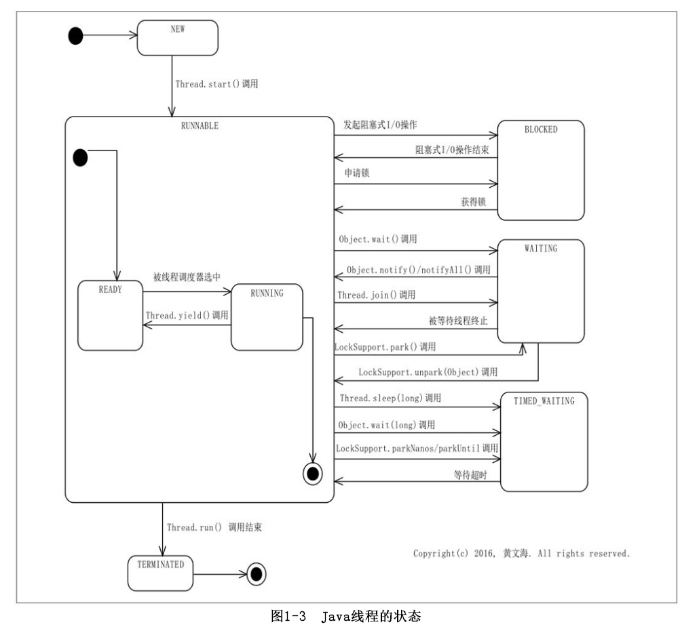

# 前言

java多线程基础相关面试题目整理

# 题目

## 线程和进程的概念？守护线程是干什么的？常见的守护线程有哪些？

### 线程和进程的概念

进程是程序的运行实例，是程序向操作系统申请资源的基本单位，线程是进程的一条执行路径。
Java的线程分为两种：用户线程和守护线程。守护线程作用是为其他线程提供服务，如果所有的用户线程死亡，后台线程都会死亡。

### 常见的守护线程有哪些

守护线程最典型代表就是GC线程。

参考:
[Java 守护线程Daemon](https://www.jianshu.com/p/f1723dfc0a9d)
《Java多线程编程实战指南》黄文海
《Java疯狂讲义》李刚

## 并发和并行的概念？Java实现并发的方式？

### 并发和并行的概念

从软件的角度来说，并发就是在一段时间内以交替的方式去完成多个任务，而并行就是以齐头并进的方式去完成多个任务。
从硬件的角度来说，在一个处理器一次只能够运行一个线程的情况下，由于处理器可以使用时间片（Time-slice）分配的技术来实现在同一段时间内运行多个线程，因此一个处理器就可以实现并发。而并行则需要靠多个处理器在同一时刻各自运行一个线程来实现。

### Java实现并发的方式

- 继承Thread类

```
//实现方法的类
public class Demo1 extends Thread {
    public void run(){
        System.out.println("继承Thread类");
    }
}

//执行的方法
public static void main(String[] args) {
        Demo1 demo1=new Demo1();
        demo1.start();
}

执行结果：
继承Thread类
```

- 实现Runnable接口

```
//实现的方法类：
public class Demo2 implements Runnable {
    @Override
    public void run() {
        System.out.println("实现runnable接口");
    }

}

//执行方法：
public static void main(String[] args) {
        Demo2 demo2=new Demo2();
        Thread thread=new Thread(demo2);
        thread.start();
}
    
执行结果：
实现runnable接口
```

- 通过实现Callable接口

```
//实现类方法：
public class Demo3 implements Callable {
    @Override
    public Object call() {
        return "1";
    }
}

//执行方法：
public static void main(String[] args) {
		//创建实现类对象
        Callable demo3=new Demo3();
        FutureTask oneTask = new FutureTask(demo3);
        Thread thread = new Thread(oneTask);
        thread.start();
        Object o = null;
        try {
        	//获取返回值
            o = oneTask.get();
        } catch (InterruptedException e) {
            e.printStackTrace();
        } catch (ExecutionException e) {
            e.printStackTrace();
        }
        System.out.println(o);

}

执行结果：
1
```

- 通过线程池来实现多线程

```
//实现代码如下：
public class Demo5 {
    public static void main(String[] args) {
        ExecutorService executorService = Executors.newFixedThreadPool(5);
        for(int i=0;i<5;i++){
            int finalI = i;
            executorService.execute(()-> {
                System.out.println(finalI);
            });
        }
    }
}

执行结果：
2
3
4
1
0
```

参考:
《Java多线程编程实战指南》黄文海
[浅谈实现并发的几种方式](https://blog.csdn.net/limingxingjy/article/details/102709756)

## native关键字的作用是什么？

- 作用

使用native关键字说明这个方法是原生方法，也就是这个方法是用C/C++语言实现的，并且被编译成了DLL，由java去调用。
这些函数的实现体在DLL中，JDK的源代码中并不包含。对于不同的平台它们也是不同的。这也是java的底层机制，实际上java就是在不同的平台上调用不同的native方法实现对操作系统的访问的。

- 使用

可以将native方法比作Java程序同Ｃ程序的接口，其实现步骤：
　　１、在Java中声明native()方法，然后编译；
　　２、用javac -h产生一个.h文件；
　　３、写一个.cpp文件实现native导出方法，其中需要包含第二步产生的.h文件（注意其中又包含了JDK带的jni.h文件）；
　　４、将第三步的.cpp文件编译成动态链接库文件；
　　５、在Java中用System.loadLibrary()方法加载第四步产生的动态链接库文件，这个native()方法就可以在Java中被访问了。

参考：
[Java中Native关键字的作用](https://www.cnblogs.com/KingIceMou/p/7239668.html)

## 线程的状态有哪些，是怎么转换的？Jvm怎么查看线程的运行状态？

### 线程的状态有哪些，是怎么转换的

Java线程的状态可以使用监控工具查看，也可以通过Thread.getState()调用来获取。Thread.getState()的返回值类型Thread.State是一个枚举类型（Enum）。Thread.State所定义的线程状态包括以下几种。
NEW：一个已创建而未启动的线程处于该状态。由于一个线程实例只能够被启动一次，因此一个线程只可能有一次处于该状态。
RUNNABLE：该状态可以被看成一个复合状态。它包括两个子状态：READY和RUNNING。前者表示处于该状态的线程可以被线程调度器（Scheduler）进行调度而使之处于RUNNING状态。后者表示处于该状态的线程正在运行，即相应线程对象的run方法所对应的指令正在由处理器执行。执行Thread.yield()的线程，其状态可能会由RUNNING转换为READY。处于READY子状态的线程也被称为活跃线程。
BLOCKED：一个线程发起一个阻塞式I/O（BlockingI/O）操作后，或者申请一个由其他线程持有的独占资源（比如锁）时，相应的线程会处于该状态。处于BLOCKED状态的线程并不会占用处理器资源。当阻塞式I/O操作完成后，或者线程获得了其申请的资源，该线程的状态又可以转换为RUNNABLE。
WAITING：一个线程执行了某些特定方法之后就会处于这种等待其他线程执行另外一些特定操作的状态。能够使其执行线程变更为WAITING状态的方法包括：Object.wait()、Thread.join()和LockSupport.park(Object)。能够使相应线程从WAITING变更为RUNNABLE的相应方法包括：Object.notify()/notifyAll()和LockSupport.unpark(Object))。
TIMED_WAITING：该状态和WAITING类似，差别在于处于该状态的线程并非无限制地等待其他线程执行特定操作，而是处于带有时间限制的等待状态。当其他线程没有在指定时间内执行该线程所期望的特定操作时，该线程的状态自动转换为RUNNABLE。
TERMINATED：已经执行结束的线程处于该状态。由于一个线程实例只能够被启动一次，因此一个线程也只可能有一次处于该状态。Thread.run()正常返回或者由于抛出异常而提前终止都会导致相应线程处于该状态。一个线程在其整个生命周期中，只可能有一次处于NEW状态和TERMINATED状态。



### Jvm怎么查看线程的运行状态

对线程进行监视的主要途径是获取并查看程序的线程转储（ThreadDump）。一个程序的线程转储包含了获取这个线程转储的那一刻该程序的线程信息。这些信息包括程序中有哪些线程以及这些线程的具体信息。常用线程转储的方法如下：

- jstack

功能描述：
jstack用于生成java虚拟机当前时刻的线程快照。线程快照是当前java虚拟机内每一条线程正在执行的方法堆栈的集合，生成线程快照的主要目的是定位线程出现长时间停顿的原因，如线程间死锁、死循环、请求外部资源导致的长时间等待等。
命令用法：
jstack [ option ] vmid
主要选项：
-l 打印锁的额外信息
-e 打印线程的额外信息

举例：

```
C:\Users\liuwe>jstack -l 16788
2023-01-23 16:57:23
Full thread dump OpenJDK 64-Bit Server VM (11+28 mixed mode):

Threads class SMR info:
_java_thread_list=0x0000024591cff610, length=11, elements={
0x00000245f256d000, 0x00000245911b3000, 0x00000245911b4000, 0x0000024591a43000,
0x00000245911e9000, 0x00000245911eb800, 0x00000245911f2000, 0x0000024591ab0000,
0x00000245f264d000, 0x0000024591d54000, 0x0000024591d2d800
}

"main" #1 prio=5 os_prio=0 cpu=20078.13ms elapsed=28.27s tid=0x00000245f256d000 nid=0x3f48 runnable  [0x0000005b97bff000]
   java.lang.Thread.State: RUNNABLE
        at java.io.FileOutputStream.writeBytes(java.base@11/Native Method)
        at java.io.FileOutputStream.write(java.base@11/FileOutputStream.java:354)
        at java.io.BufferedOutputStream.flushBuffer(java.base@11/BufferedOutputStream.java:81)
        at java.io.BufferedOutputStream.flush(java.base@11/BufferedOutputStream.java:142)
        - locked <0x00000000847e2818> (a java.io.BufferedOutputStream)
        at java.io.PrintStream.write(java.base@11/PrintStream.java:561)
        - locked <0x0000000084718cc8> (a java.io.PrintStream)
        at sun.nio.cs.StreamEncoder.writeBytes(java.base@11/StreamEncoder.java:233)
        at sun.nio.cs.StreamEncoder.implFlushBuffer(java.base@11/StreamEncoder.java:312)
        at sun.nio.cs.StreamEncoder.flushBuffer(java.base@11/StreamEncoder.java:104)
        - locked <0x0000000084718c88> (a java.io.OutputStreamWriter)
        at java.io.OutputStreamWriter.flushBuffer(java.base@11/OutputStreamWriter.java:184)
        at java.io.PrintStream.newLine(java.base@11/PrintStream.java:625)
        - eliminated <0x0000000084718cc8> (a java.io.PrintStream)
        at java.io.PrintStream.println(java.base@11/PrintStream.java:883)
        - locked <0x0000000084718cc8> (a java.io.PrintStream)
        at TestClass.main(TestClass.java:7)

   Locked ownable synchronizers:
        - None

"Reference Handler" #2 daemon prio=10 os_prio=2 cpu=0.00ms elapsed=28.01s tid=0x00000245911b3000 nid=0x393c waiting on condition  [0x0000005b982ff000]
   java.lang.Thread.State: RUNNABLE
        at java.lang.ref.Reference.waitForReferencePendingList(java.base@11/Native Method)
        at java.lang.ref.Reference.processPendingReferences(java.base@11/Reference.java:241)
        at java.lang.ref.Reference$ReferenceHandler.run(java.base@11/Reference.java:213)

   Locked ownable synchronizers:
        - None

"Finalizer" #3 daemon prio=8 os_prio=1 cpu=0.00ms elapsed=28.01s tid=0x00000245911b4000 nid=0x434c in Object.wait()  [0x0000005b983fe000]
   java.lang.Thread.State: WAITING (on object monitor)
        at java.lang.Object.wait(java.base@11/Native Method)
        - waiting on <0x0000000084729c70> (a java.lang.ref.ReferenceQueue$Lock)
        at java.lang.ref.ReferenceQueue.remove(java.base@11/ReferenceQueue.java:155)
        - waiting to re-lock in wait() <0x0000000084729c70> (a java.lang.ref.ReferenceQueue$Lock)
        at java.lang.ref.ReferenceQueue.remove(java.base@11/ReferenceQueue.java:176)
        at java.lang.ref.Finalizer$FinalizerThread.run(java.base@11/Finalizer.java:170)

   Locked ownable synchronizers:
        - None

"Signal Dispatcher" #4 daemon prio=9 os_prio=2 cpu=0.00ms elapsed=27.90s tid=0x0000024591a43000 nid=0x3938 runnable  [0x0000000000000000]
   java.lang.Thread.State: RUNNABLE

   Locked ownable synchronizers:
        - None

"Attach Listener" #5 daemon prio=5 os_prio=2 cpu=62.50ms elapsed=27.90s tid=0x00000245911e9000 nid=0x28fc waiting on condition  [0x0000000000000000]
   java.lang.Thread.State: RUNNABLE

   Locked ownable synchronizers:
        - None

"C2 CompilerThread0" #6 daemon prio=9 os_prio=2 cpu=437.50ms elapsed=27.90s tid=0x00000245911eb800 nid=0x2e78 waiting on condition  [0x0000000000000000]
   java.lang.Thread.State: RUNNABLE
   No compile task

   Locked ownable synchronizers:
        - None

"C1 CompilerThread0" #8 daemon prio=9 os_prio=2 cpu=187.50ms elapsed=27.90s tid=0x00000245911f2000 nid=0x4be0 waiting on condition  [0x0000000000000000]
   java.lang.Thread.State: RUNNABLE
   No compile task

   Locked ownable synchronizers:
        - None

"Sweeper thread" #9 daemon prio=9 os_prio=2 cpu=15.63ms elapsed=27.88s tid=0x0000024591ab0000 nid=0x13b8 runnable  [0x0000000000000000]
   java.lang.Thread.State: RUNNABLE

   Locked ownable synchronizers:
        - None

"Common-Cleaner" #10 daemon prio=8 os_prio=1 cpu=0.00ms elapsed=27.66s tid=0x00000245f264d000 nid=0x40e4 in Object.wait()  [0x0000005b989ff000]
   java.lang.Thread.State: TIMED_WAITING (on object monitor)
        at java.lang.Object.wait(java.base@11/Native Method)
        - waiting on <0x000000008472a448> (a java.lang.ref.ReferenceQueue$Lock)
        at java.lang.ref.ReferenceQueue.remove(java.base@11/ReferenceQueue.java:155)
        - waiting to re-lock in wait() <0x000000008472a448> (a java.lang.ref.ReferenceQueue$Lock)
        at jdk.internal.ref.CleanerImpl.run(java.base@11/CleanerImpl.java:148)
        at java.lang.Thread.run(java.base@11/Thread.java:834)
        at jdk.internal.misc.InnocuousThread.run(java.base@11/InnocuousThread.java:134)

   Locked ownable synchronizers:
        - None

"Monitor Ctrl-Break" #11 daemon prio=5 os_prio=0 cpu=0.00ms elapsed=27.45s tid=0x0000024591d54000 nid=0x34b0 runnable  [0x0000005b98afe000]
   java.lang.Thread.State: RUNNABLE
        at java.net.SocketInputStream.socketRead0(java.base@11/Native Method)
        at java.net.SocketInputStream.socketRead(java.base@11/SocketInputStream.java:115)
        at java.net.SocketInputStream.read(java.base@11/SocketInputStream.java:168)
        at java.net.SocketInputStream.read(java.base@11/SocketInputStream.java:140)
        at sun.nio.cs.StreamDecoder.readBytes(java.base@11/StreamDecoder.java:284)
        at sun.nio.cs.StreamDecoder.implRead(java.base@11/StreamDecoder.java:326)
        at sun.nio.cs.StreamDecoder.read(java.base@11/StreamDecoder.java:178)
        - locked <0x000000008471f758> (a java.io.InputStreamReader)
        at java.io.InputStreamReader.read(java.base@11/InputStreamReader.java:185)
        at java.io.BufferedReader.fill(java.base@11/BufferedReader.java:161)
        at java.io.BufferedReader.readLine(java.base@11/BufferedReader.java:326)
        - locked <0x000000008471f758> (a java.io.InputStreamReader)
        at java.io.BufferedReader.readLine(java.base@11/BufferedReader.java:392)
        at com.intellij.rt.execution.application.AppMainV2$1.run(AppMainV2.java:55)

   Locked ownable synchronizers:
        - None

"Service Thread" #12 daemon prio=9 os_prio=0 cpu=0.00ms elapsed=27.45s tid=0x0000024591d2d800 nid=0x3abc runnable  [0x0000000000000000]
   java.lang.Thread.State: RUNNABLE

   Locked ownable synchronizers:
        - None

"VM Thread" os_prio=2 cpu=31.25ms elapsed=28.03s tid=0x00000245911af000 nid=0x41dc runnable

"GC Thread#0" os_prio=2 cpu=0.00ms elapsed=28.19s tid=0x00000245f2583000 nid=0x3708 runnable

"GC Thread#1" os_prio=2 cpu=0.00ms elapsed=25.42s tid=0x0000024591dfd800 nid=0x223c runnable

"GC Thread#2" os_prio=2 cpu=0.00ms elapsed=25.42s tid=0x0000024591dfe000 nid=0x3e60 runnable

"G1 Main Marker" os_prio=2 cpu=0.00ms elapsed=28.18s tid=0x00000245f25b1800 nid=0x4a5c runnable

"G1 Conc#0" os_prio=2 cpu=0.00ms elapsed=28.18s tid=0x00000245f25b4800 nid=0x3378 runnable

"G1 Refine#0" os_prio=2 cpu=0.00ms elapsed=28.18s tid=0x00000245f2644000 nid=0x1e0c runnable

"G1 Young RemSet Sampling" os_prio=2 cpu=0.00ms elapsed=28.18s tid=0x00000245f2647000 nid=0x4054 runnable
"VM Periodic Task Thread" os_prio=2 cpu=0.00ms elapsed=27.45s tid=0x0000024591d93000 nid=0x2c64 waiting on condition

JNI global refs: 15, weak refs: 0
```

线程中参数解释：
tid: Java memory address of its internal Thread control structure. 16进制的
nid: native thread id. 每一个nid对应于linux下的一个tid, 即lwp (light weight process, or thread). 16进制的，转到10进制后可以用ps命令找到它。
prio: java内定义的线程的优先级
os_prio: 操作系统级别的优先级
cpu: 为cpu运行时间
elapsed: 为实际运行时间
daemon: 说明是守护线程

- JvisualVm

VisualVM是一款免费的\集成了多个JDK命令行工具的可视化工具，是功能最强大的运行监控和故障处理程序之一，曾经很长一段时间是oracle官方主力发展的虚拟机故障处理工具。功能包括生成和分析海量数据、跟踪内存泄漏、监控垃圾回收器、执行内存和CPU分析，同时它还支持在MBeans上进行浏览和操作。可以基于该工具实现线程转储和可视化监测。

参考:
《Java多线程编程实战指南》黄文海
[jvm监控工具小结](https://www.cnblogs.com/lllliuxiaoxia/p/15799378.html)

## 线程安全问题的三个方面

线程安全问题概括来说表现为3个方面：原子性、可见性和有序性。

### 原子性

原子操作的“不可分割”包括以下两层含义。

- 访问（读、写）某个共享变量的操作从其执行线程以外的任何线程来看，该操作要么已经执行结束要么尚未发生，即其他线程不会“看到”该操作执行了部分的中间效果。
- 访问同一组共享变量的原子操作是不能够被交错的。

Java中有两种方式来实现原子性。一种是使用锁（Lock）。锁具有排他性，即它能够保障一个共享变量在任意一个时刻只能够被一个线程访问。这就排除了多个线程在同一时刻访问同一个共享变量而导致干扰与冲突的可能，即消除了竞态。另一种是利用处理器提供的专门CAS（Compare-and-Swap）指令，CAS算作乐观锁。

Java语言中针对任何变量的读操作都是原子操作。在Java语言中，long型和double型以外的任何类型的变量的写操作都是原子操作。对long/double型变量的写操作由于Java语言规范并不保障其具有原子性，因此在多个线程并发访问同一long/double型变量的情况下，一个线程可能会读取到其他线程更新该变量的“中间结果”。尽管如此，Java语言规范特别地规定对于volatile关键字修饰的long/double型变量的写操作具有原子性。

### 可见性

可见性就是指一个线程对共享变量的更新的结果对于读取相应共享变量的线程而言是否可见的问题。多线程程序在可见性方面存在问题意味着某些线程读取到了旧数据（StaleData）。导致可见性问题的原因分为两种，一种是JIT编译器的优化，需要基于一定机制避免多线程情况下的不正常编译优化；另一种是没有及时进行缓存同步，要通过使更新共享变量的处理器执行冲刷处理器缓存的动作，并使读取共享变量的处理器执行刷新处理器缓存的动作来保障可见性。

可见性的保障仅仅意味着一个线程能够读取到共享变量的相对新值，而不能保障该线程能够读取到相应变量的最新值，即读到数据后到使用的时候，原来的数据可能已经发生了变化。

### 有序性

多种因素都可能导致程序的感知顺序与源代码顺序不一致，而这种不一致可能导致线程安全问题。避免这个问题实质上就是保证感知顺序与源代码顺序一致，即有序性。

导致有序性问题的来源分为：（1）指令重排序。指令重排序主要来源于JIT的编译优化和处理器在判断语句场景的猜测执行技术；（2）存储系统重排序。即使在处理器严格依照程序顺序执行两个内存访问操作的情况下，在存储子系统的作用下其他处理器对这两个操作的感知顺序仍然可能与程序顺序不一致，即这两个操作的执行顺序看起来像是发生了变化。这种现象就是存储子系统重排序，也被称为内存重排序（MemoryOrdering）。

单线程也会发生重排序，但是结果不会出现异常，就仿佛是串行执行的一样；要保证多线程的有序性，需要在逻辑上部分禁止重排序。

参考:
《Java多线程编程实战指南》黄文海

## Thread类中的start和run方法的区别是什么？

Thread类的start方法的作用是启动相应的线程，并在这个新线程中执行run方法，线程属于“一次性用品”，start方法也只能够被调用一次，多次调用同一个Thread实例的start方法会导致其抛出IllegalThreadStateException异常。

Thread类的run方法可以反复执行，但是是在当前线程中执行，不会创建新线程，一般不建议这样操作。

参考:
《Java多线程编程实战指南》黄文海

## Runnable和Callable？Future的作用是什么？

### Runnable和Callable

Runnable接口可以被看作对任务进行的抽象，任务的处理逻辑就体现在run方法之中。Thread类实际上是Runnable接口的一个实现类，其对Runnable接口的实现。

Callable接口也是对任务的抽象，任务的处理逻辑可以在Callable接口实现类的call方法中实现。Callable接口相当于一个增强型的Runnable接口：call方法的返回值代表相应任务的处理结果，其类型V是通过Callable接口的类型参数指定的；call方法代表的任务在其执行过程中可以抛出异常。而Runnable接口中的run方法既无返回值也不能抛出异常。

采用Runnable实例来表示异步任务，其优点是任务既可以交给一个专门的工作者线程执行（以相应的Runnable实例为参数创建并启动一个工作者线程），也可以交给一个线程池或者Executor的其他实现类来执行；其缺点是我们无法直接获取任务的执行结果。使用Callable实例来表示异步任务，其优点是我们可以通过ThreadPoolExecutor.submit(Callable<T>)的返回值获取任务的处理结果；其缺点是Callable实例表示的异步任务只能交给线程池执行，而无法直接交给一个专门的工作者线程或者Executor实现类执行。

### Future

Future接口实例可被看作任务的处理结果句柄（Handle），Future.get()方法可以用来获取task参数所指定的任务的处理结果，Future.get()是个阻塞方法，该方法能够抛出InterruptedException说明它可以响应线程中断，可以通过捕获Future.get()调用抛出的异常来知晓相应任务执行过程中抛出的异常。ThreadPoolExecutor线程池的一个submit方法声明如下：public<T>Future<T>submit(Callable<T>task)，可以通过提交Callable任务并通过Future.get()获取结果。

java.util.concurrent.FutureTask类融合了Runnable接口和Callable接口的优点：FutureTask是java.util.concurrent.RunnableFuture接口的一个实现类，由于RunnableFuture接口继承了Future接口和Runnable接口，因此FutureTask既是Runnable接口的实现类也是Future接口的实现。因此FutureTask表示的异步任务可以交给专门的工作者线程执行，也可以交给Executor实例（比如线程池）执行，FutureTask还能够直接返回其代表的异步任务的处理结果。ThreadPoolExecutor.submit(Callable<T>task)的返回值就是一个FutureTask实例。

FutureTask的一个构造器可以将Callable实例转换为Runnable实例，该构造器的声明如下：publicFutureTask(Callable<V>callable)。
我们可以将任务的处理逻辑封装在一个Callable实例中，并以该实例为参数创建一个FutureTask实例，我们可以用FutureTask实例（Runnable实例）为参数来创建并启动一个工作者线程以执行相应的任务，也可以将FutureTask实例交给Executor执行（通过Executor.execute(Runnabletask)调用），FutureTask类还实现了Future接口，这使得我们在调用Executor.execute(Runnabletask)这样只认Runnable接口的方法来执行任务的情况下依然能够获取任务的执行结果。

参考:
《Java多线程编程实战指南》黄文海

# 参考

[微信公众号:我的IT技术路](https://mp.weixin.qq.com/s/54_bMeUwjxk-8DHa90heNQ)
