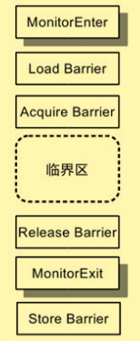
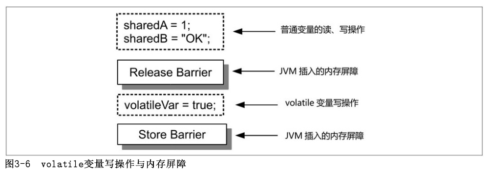
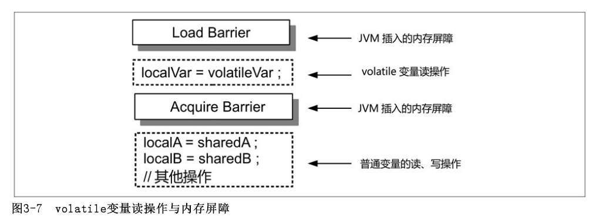
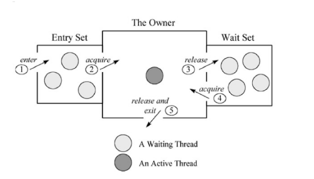
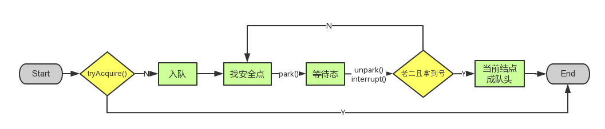
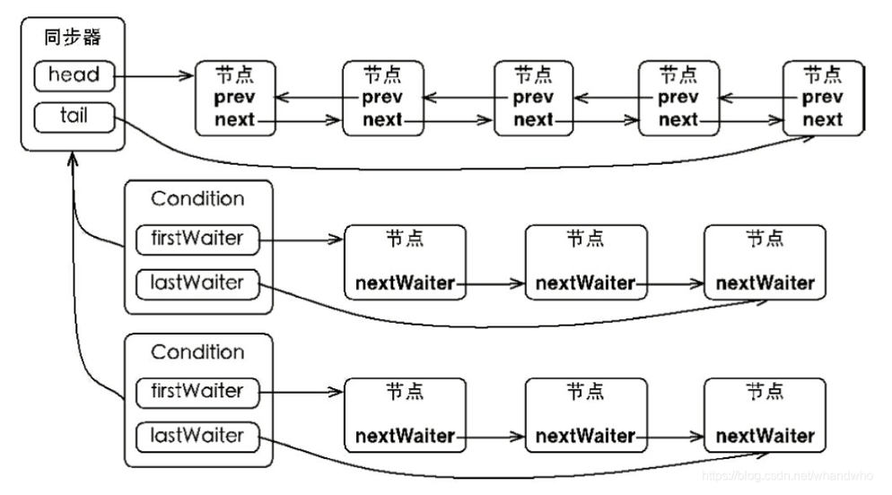

# 前言

java多线程同步与协作相关面试题目整理，面经尽量用简短的语句说明问题，详细的信息可以参考每个面经下的参考链接。面经不保证完全正确，欢迎大家邮件联系作者进行相应的修改和交流。

# 题目

## Synchronized和ReentryLock

### 锁

锁可以视作访问共享数据的许可证。锁能够保护共享数据以实现线程安全，其作用包括保障原子性、保障可见性和保障有序性。
Java平台中的锁包括内部锁（IntrinsicLock）和显式锁（ExplicitLock）。内部锁是通过synchronized关键字实现的；显式锁是通过java.util.concurrent.locks.Lock接口的实现类（如java.concurrent.locks.ReentrantLock类）实现的。synchronized在软件层面依赖JVM（jvm指令），而j.u.c.Lock在硬件层面依赖特殊的CPU指令。

### 锁的调度

公平调度，多个线程申请锁的时候需要排队，先到先得，不允许插队，在线程任务执行时间较长的情况下使用公平调度效率更高，公平调度适合线程任务执行时间较长的场景；
非公平调度，多个线程申请锁的时候需要排队，但是允许插队，一般情况下效率更高；

### Synchronized

Java平台中的任何一个对象都有唯一一个与之关联的锁。这种锁被称为监视器（Monitor）或者内部锁（IntrinsicLock）。内部锁是一种排他锁，它能够保障原子性、可见性和有序性。内部锁是通过synchronized关键字实现的。synchronized关键字可以用来修饰方法以及代码块（花括号“{}”包裹的代码）。
同步静态方法，锁为类对象；如果同步实例方法，锁为this，即当前对象实例；同步代码块的时候需要指定的锁句柄，作为锁句柄的变量通常采用final修饰
synchronized关键字申请锁和释放锁都是JVM代为实施，不需要手动操作，所以称为内部锁，内部锁是使用最方便的锁。

```
public class SafeCircularSeqGenerator implements CircularSeqGenerator {
     private short sequence = -1; 
     public synchronized short nextSequence() {
        if (sequence >= 999) {
            sequence = 0; 
        } else { 
            sequence++; 
        } 
        return sequence; 
    } 
}
```

```
public short nextSequence() { 
    synchronized (this) { 
        if (sequence >= 999) { 
            sequence = 0; 
        } else { 
            sequence++; 
        } 
        return sequence; 
    }
}
```

### ReentryLock

显示锁最常用的是ReentrantLock，需要创建一个ReentrantLock对象lock，并且在同步代码前插入`lock.lock()`，在同步代码后插入`lock.unlock()`;，注意`lock.unlock();`需要放在finally里中，避免锁泄露；

```
lock.lock(); // 申请锁lock 
try{ 
    // 在此对共享数据进行访问 
    …… 
}finally{
    // 总是在finally块中释放锁，以避免锁泄漏 
    lock.unlock(); // 释放锁lock 
}
```

### 对比

两者都是可重入锁。内部锁只支持非公平调度，ReentrantLock同时支持公平和非公平调度。
内部锁和ReentrantLock两者性能接近，内部锁使用简单，ReentrantLock使用复杂，需要手动释放锁。一般情况下使用synchronized内部锁即可，如果需要使用更加复杂的线程协作或者需要公平调度等时候可以考虑使用ReentrantLock。

参考：
《Java多线程编程实战指南》黄文海
[java多线程基础 ](https://www.cnblogs.com/lllliuxiaoxia/p/15775069.html)

## 内存屏障？Java是怎么实现原子性，有序性，可见性呢?

### 内存屏障

内存屏障是对一类仅针对内存读、写操作指令（Instruction）的跨处理器架构（比如x86、ARM）的比较底层的抽象（或者称呼）。内存屏障是被插入到两个指令之间进行使用的，其作用是禁止编译器、处理器重排序从而保障有序性。它在指令序列（如指令1；指令2；指令3）中就像是一堵墙（因此被称为屏障）一样使其两侧（之前和之后）的指令无法“穿越”它（一旦穿越了就是重排序了）。但是，为了实现禁止重排序的功能，这些指令也往往具有一个副作用——刷新处理器缓存、冲刷处理器缓存，从而保证可见性。不同微架构的处理器所提供的这样的指令是不同的，并且出于不同的目的使用的相应指令也是不同的。

按照可见性保障来划分，内存屏障可分为加载屏障（LoadBarrier）和存储屏障（StoreBarrier）。加载屏障的作用是刷新处理器缓存，存储屏障的作用冲刷处理器缓存。

按照有序性保障来划分，内存屏障可以分为获取屏障（AcquireBarrier）和释放屏障（ReleaseBarrier）。获取屏障的使用方式是在一个读操作（包括Read-Modify-Write以及普通的读操作）之后插入该内存屏障，其作用是禁止该读操作与其后的任何读写操作之间进行重排序，这相当于在进行后续操作之前先要获得相应共享数据的所有权（这也是该屏障的名称来源）。释放屏障的使用方式是在一个写操作之前插入该内存屏障，其作用是禁止该写操作与其前面的任何读写操作之间进行重排序。这相当于在对相应共享数据操作结束后释放所有权（这也是该屏障的名称来源）。

### 内部锁中内存屏障的使用

由于内部锁的申请与释放对应的Java虚拟机字节码指令分别是monitorenter和monitorexit，因此习惯上我们用MonitorEnter表示锁的申请，用MonitorExit表示锁的释放。

Java虚拟机会在MonitorExit（释放锁）对应的机器码指令之后插入一个存储屏障，这就保障了写线程在释放锁之前在临界区中对共享变量所做的更新对读线程的执行处理器来说是可同步的；相应地，Java虚拟机会在MonitorEnter（申请锁）对应的机器码指令之后临界区开始之前的地方插入一个加载屏障，这使得读线程的执行处理器能够将写线程对相应共享变量所做的更新从其他处理器同步到该处理器的高速缓存中。

Java虚拟机会在MonitorEnter（它包含了读操作）对应的机器码指令之后临界区开始之前的地方插入一个获取屏障，并在临界区结束之后MonitorExit（它包含了写操作）对应的机器码指令之前的地方插入一个释放屏障。因此，这两种屏障就像是三明治的两层面包片把火腿夹住一样把临界区中的代码（指令序列）包括起来。由于获取屏障禁止了临界区中的任何读、写操作被重排序到临界区之前的可能性，而释放屏障又禁止了临界区中的任何读、写操作被重排序到临界区之后的可能性，因此临界区内的任何读、写操作都无法被重排序到临界区之外。在锁的排他性的作用下，这使得临界区中执行的操作序列具有原子性。因此，写线程在临界区中对各个共享变量所做的更新会同时对读线程可见，即在读线程看来各个共享变量就像是“一下子”被更新的，于是这些线程无从（也无必要）区分这些共享变量是以何种顺序被更新的。这使得写线程在临界区中执行的操作自然而然地具有有序性——读线程对这些操作的感知顺序与源代码顺序一致。




### Java内部锁是怎么实现原子性，有序性，可见性呢?

临界区中执行操作序列的原子性由锁的排他性实现。
锁对可见性的保障是通过写线程和读线程成对地使用存储屏障和加载屏障实现的。
锁对有序性的保障是通过写线程和读线程配对使用释放屏障与获取屏障屏障实现的。

参考：
《Java多线程编程实战指南》黄文海

## Volatile的作用是什么？底层是怎么实现的？

volatile关键字用于修饰共享可变变量，即没有使用final关键字修饰的实例变量或静态变量，相应的变量就被称为volatile变量。volatile可以保障可见性、保障有序性和保障long/double型变量读写操作的原子性。

可见性和有序性由内存屏障保障：





注意：

volatile仅仅保障对其修饰的变量的写操作（以及读操作）本身的原子性，而这并不表示对volatile变量的赋值操作一定具有原子性。

volatile关键字在可见性方面仅仅是保证读线程能够读取到共享变量的相对新值。对于引用型变量和数组变量，volatile关键字并不能保证读线程能够读取到相应对象的字段（实例变量、静态变量）、元素的相对新值。

参考：
《Java多线程编程实战指南》黄文海

## Java的CAS是怎么实现的？Atomic包中的Atmoicinteger和AtmoicintegerFiledUpdater区别？

### Java的CAS是怎么实现的

CAS（CompareandSwap）是对一种处理器指令（例如x86处理器中的cmpxchg指令）的称呼。

原子变量类（Atomics）通常是借助一个volatile变量基于CAS实现的能够保障对共享变量进行read-modify-write更新操作的原子性和可见性的一组工具类。关于CAS的操作都是基于Unsafe类中的一些方法实现的，这些方法对处理器的CAS指令进行了包装。

### 简单分析下Atmoicinteger

主要看下getAndIncrement方法

```
public final int getAndIncrement() {
    return U.getAndAddInt(this, VALUE, 1);
}
```

这里的U是`private static final jdk.internal.misc.Unsafe U = jdk.internal.misc.Unsafe.getUnsafe();`，是unsafe对象

AtomicInteger中用value来实际存储值

`private static final long VALUE = U.objectFieldOffset(AtomicInteger.class, "value");`，VALUE是value属性的内存地址位置较AtomicInteger对象内存地址位置的偏移量，所以`U.getAndAddInt(this, VALUE, 1);`中通过this和VALUE可以直接定位到value的内存地址位置。

再看getAndAddInt方法

```
public final int getAndAddInt(Object o, long offset, int delta) {
    int v;
    do {
        v = getIntVolatile(o, offset);
    } while (!weakCompareAndSetInt(o, offset, v, v + delta));
    return v;
}
```

首先基于value的内存地址位置获取它的当前值，然后尝试CAS对value增加delta，如果成功则返回原value值，否则重复以上操作直到成功。

### Atomic包中的Atmoicinteger和AtmoicintegerFiledUpdater区别

两者使用对比：

```
public class AtomicIntegerFieldUpdaterDemo {
 
    public static class Candidate {
        int id;
 
        volatile int score = 0;
 
        AtomicInteger score2 = new AtomicInteger();
    }
 
    public static final AtomicIntegerFieldUpdater<Candidate> scoreUpdater =
            AtomicIntegerFieldUpdater.newUpdater(Candidate.class, "score");
 
    public static AtomicInteger realScore = new AtomicInteger(0);
 
    public static void main(String[] args) throws InterruptedException {
        final Candidate candidate = new Candidate();
        Thread[] t = new Thread[10000];
        for (int i = 0; i < 10000; i++) {
            t[i] = new Thread() {
                @Override
                public void run() {
                    if (Math.random() > 0.4) {
                        candidate.score2.incrementAndGet();
                        scoreUpdater.incrementAndGet(candidate);
                        realScore.incrementAndGet();
                    }
                }
            };
            t[i].start();
        }
        for (int i = 0; i < 10000; i++) {
            t[i].join();
        }
        System.out.println("AtomicIntegerFieldUpdater Score=" + candidate.score);
        System.out.println("AtomicInteger Score=" + candidate.score2.get());
        System.out.println("realScore=" + realScore.get());
 
    }
}
```

输出台如下：

```
AtomicIntegerFieldUpdater Score=6003
AtomicInteger Score=6003
realScore=6003
```

通过上述代码我们不难得知使用AtomicIntegerFieldUpdater与AtomicInteger其实效果是一致的，那既然已经存在了AtomicInteger并发之神又要写一个AtomicIntegerFieldUpdater呢？

1.从AtomicIntegerFieldUpdaterDemo代码中我们不难发现，通过AtomicIntegerFieldUpdater更新score我们获取最后的int值时相较于AtomicInteger来说不需要调用get()方法！
2.对于AtomicIntegerFieldUpdaterDemo类的AtomicIntegerFieldUpdater是static final类型也就是说即使创建了100个对象AtomicIntegerField也只存在一个不会占用对象的内存，但是AtomicInteger会创建多个AtomicInteger对象，占用的内存比AtomicIntegerFieldUpdater大，所以对于熟悉dubbo源码的人都知道，dubbo有个实现轮询负载均衡策略的类AtomicPositiveInteger用的就是AtomicIntegerFieldUpdater。

参考：
《Java多线程编程实战指南》黄文海
[AtomicIntegerFieldUpdater与AtomicInteger使用引发的思考](https://blog.csdn.net/qq_23536449/article/details/103880340)

## sleep和wait的区别？notify和notifyall的区别是啥？

### wait\notify\notifyall基本用法

wait模板

```
synchronized(someObject){
  while(保护条件不成立)（
  someObject.wait();
）
doAction;
}
```

注意：
保护条件需要循环判断，防止在获取锁的时候，保护条件又不成立，内部锁支持非公平调度，可能有插队将保护条件给修改了，这是需要让线程重新等待。

notify模板

```
synchronized(someObject){
  updateShareState();
  someObject.notify();
}
```

注意：
notify()需要尽可能放在临界区的结束的地方，否则被唤醒线程可能拿不到锁(被其他线程抢占)，导致上下文切换。

开销和问题:
Notifyall（）过早唤醒，保护条件还没有成立就被唤醒，可以利用显示锁的Condition接口来解决，实现分组唤醒；

notify()和notifyall():
只有在特定条件下采用notify()，否则都用notifyall()：
条件1：一次通知只唤醒一个线程；条件2：线程同质

### wait()和sleep()的区别

这两个方法来自不同的类，sleep()是Thread的静态方法，wait()是Object的实例方法；
sleep方法没有释放锁，而wait方法释放了锁;
wait，notify和notifyAll的调用需要放在同一个对象所引导的临界区中，而sleep可以在任何地方使用;
sleep到时间会自动恢复。wait必须使用notify或者是notifyall进行唤醒;
Wait通常被用于线程间交互/通信，sleep通常被用于暂停执行。

参考：
《Java多线程编程实战指南》黄文海
[java多线程中sleep和wait的4个区别，你知道几个？](https://zhuanlan.zhihu.com/p/86717279)
[wait()和sleep()方法的区别](https://blog.csdn.net/qq_42787645/article/details/101326366)

## await/signal/signalAll/condition

Condition接口可作为wait/notify的替代品来实现等待/通知，它为解决过早唤醒问题提供了支持，并解决了Object.wait(long)不能区分其返回是否是由等待超时而导致的问题。
Lock.newCondition()的返回值就是一个Condition实例，因此调用任意一个显式锁实例的newCondition方法可以创建一个相应的Condition接口。Object.wait()/notify()要求其执行线程持有这些方法所属对象的内部锁，类似地，Condition.await()/signal()也要求其执行线程持有创建该Condition实例的显式锁。
通过condition，可以将等待线程分组并进行分组唤醒。

```
class ConditionUsage {
    private final Lock lock = new ReentrantLock();
    private final Condition condition = lock.newCondition();

    public void aGuaredMethod() throws InterruptedException {
        lock.lock();
        try {
            while (保护条件不满足) {
                condition.await();
            }
            // 执行目标动作 
            doAction();
        } finally {
            lock.unlock();
        }
    }

    private void doAction() {
        // ... 
    }

    public void anNotificationMethod() throws InterruptedException {
        lock.lock();
        try {
            // 更新共享变量 
            changeState();
            condition.signal();
        } finally {
            lock.unlock();
        }
    }

    private void changeState() {
        // ... 
    }
}
```

Condition.awaitUntil(Date)返回值true表示进行的等待尚未达到最后期限，即此时方法的返回是由于其他线程执行了相应条件变量的signal/signalAll方法。

参考：
《Java多线程编程实战指南》黄文海

## synchronized原理？锁升级？

JDK1.5之前synchronized是一个重量级锁，不过，随着Javs SE 1.6对synchronized进行的各种优化后，性能上synchronized和显示锁相差不大，不过显示锁的功能更为强大，且显示锁的读写锁在特定场景性能提升明显。

### synchronized基本原理

j.u.c.Lock在硬件层面依赖特殊的CPU指令实现同步，synchronized是在软件层面依赖JVM（jvm指令）实现同步，编译后可以看到实际靠monitorenter和monitorexit指令来实现同步。

monitorenter：每个对象都是一个监视器锁（monitor）。当monitor被占用时就会处于锁定状态，线程执行monitorenter指令时尝试获取monitor的所有权，过程如下：
1）如果monitor的进入数为0，则该线程进入monitor，然后将进入数设置为1，该线程即为monitor的所有者，如果同一个线程反复重入则反复加1；
2）如果线程已经占有该monitor，只是重新进入，则进入monitor的进入数加1；
3）如果其他线程已经占用了monitor，则该线程进入阻塞状态，直到monitor的进入数为0，再重新尝试获取monitor的所有权；
monitorexit：执行monitorexit的线程必须是objectref所对应的monitor的所有者。指令执行时，monitor的进入数减1，如果减1后进入数为0，那线程退出monitor，不再是这个monitor的所有者。其他被这个monitor阻塞的线程可以尝试去获取这个monitor的所有权。

其实wait/notify等方法也依赖于monitor对象，这就是为什么只有在同步的块或者方法中才能调用wait/notify等方法，否则会抛出java.lang.IllegalMonitorStateException的异常的原因。

与一切皆对象一样，所有的Java对象是天生的Monitor，每一个Java对象都有成为Monitor的潜质。在Java虚拟机（HotSpot）中，Monitor是由ObjectMonitor实现的。ObjectMonitor中有两个队列，_WaitSet 和 _EntryList，用来保存ObjectWaiter对象列表（ 每个等待锁的线程都会被封装成ObjectWaiter对象 ），_owner指向持有ObjectMonitor对象的线程，当多个线程同时访问一段同步代码时：
1）首先会进入 _EntryList 集合，当线程获取到对象的monitor后，进入 _Owner区域并把monitor中的owner变量设置为当前线程，同时monitor中的计数器count加1；
2）若线程调用 wait() 方法，将释放当前持有的monitor，owner变量恢复为null，count自减1，同时该线程进入 WaitSet集合中等待被唤醒；
3）若当前线程执行完毕，也将释放monitor（锁）并复位count的值，以便其他线程进入获取monitor(锁)；



### synchronized锁升级

JDK1.6对synchronized的实现机制进行了较大调整，包括锁升级、锁消除、锁粗化等优化策略，使得synchronized性能极大提高。锁主要存在四种状态，依次是：无锁状态、偏向锁状态、轻量级锁状态、重量级锁状态，锁升级指锁可以从偏向锁升级到轻量级锁，再升级的重量级锁。但是锁的升级是单向的，也就是说只能从低到高升级，不会出现锁的降级。在JDK1.6中默认是开启偏向锁和轻量级锁的。

#### 偏向锁

HotSpot作者经过研究实践发现，在大多数情况下，锁不仅不存在多线程竞争，而且总是由同一线程多次获得。引入偏向锁是为了在没有多线程竞争的情况下尽量减少不必要的轻量级锁执行路径，因为轻量级锁的加锁解锁操作是需要依赖多次CAS原子指令的，而偏向锁只需要在置换ThreadID的时候依赖一次CAS原子指令。偏向锁的想法是一旦线程第一次获得了监视对象，之后让监视对象“偏向”这个线程，之后的多次调用则可以避免CAS操作，说白了就是置个变量，如果发现为true则无需再走各种加锁/解锁流程。

如果一个线程A持有偏向锁，线程B来竞争，如果线程B通过CAS竞争失败，则在安全点偏向锁升级为轻量级锁。

#### 轻量级锁

因为重量级锁会导致线程上下文切换，所以偏向锁不会直接升级到重量级锁，而是会升级到轻量级锁的状态。
在轻量锁的状态下，线程间通过自旋加CAS的方式来竞争锁，如果可以很快获得锁资源，这样的开销比较小，如果自旋一定次数后仍然无法竞争到锁，此时轻量级锁升级为重量级锁。

#### 重量级锁

Synchronized是通过对象内部的一个叫做监视器锁（Monitor）来实现的。但是监视器锁本质又是依赖于底层的操作系统的Mutex Lock来实现的。而操作系统实现线程之间的切换这就需要从用户态转换到核心态，这个成本非常高，状态之间的转换需要相对比较长的时间，这就是为什么Synchronized效率低的原因。因此，这种依赖于操作系统Mutex Lock所实现的锁我们称之为 “重量级锁”。“重量级锁”才是我们平时以为的同步锁。

### synchronized其他优化

#### 锁消除

为了保证数据的完整性，在进行操作时需要对这部分操作进行同步控制，但是在有些情况下，JVM检测到不可能存在共享数据竞争，这是JVM会对这些同步锁进行锁消除。

#### 锁粗化

在使用同步锁的时候，需要让同步块的作用范围尽可能小—仅在共享数据的实际作用域中才进行同步，这样做的目的是为了使需要同步的操作数量尽可能缩小，如果存在锁竞争，那么等待锁的线程也能尽快拿到锁。在大多数的情况下，上述观点是正确的。但是如果一系列的连续加锁解锁操作，可能会导致不必要的性能损耗，所以引入锁粗话的概念。
锁粗话概念比较好理解，就是将多个连续的加锁、解锁操作连接在一起，扩展成一个范围更大的锁

参考：
《Java多线程编程实战指南》黄文海
[synchronized原理](https://www.cnblogs.com/lllliuxiaoxia/p/15711549.html)

## AQS

### AQS概述

AbstractQueuedSynchronizer（AQS），抽象的队列式的同步器。AQS维护了一个volatile int state（代表共享资源）和一个FIFO线程同步队列，多线程争用资源被阻塞时线程被封装成Node加入这个队列中。AQS定义两种资源共享方式：Exclusive（独占，只有一个线程能执行，如ReentrantLock）和Share（共享，多个线程可同时执行，如Semaphore/CountDownLatch）。
AQS定义了一套多线程访问共享资源的同步器框架，许多同步类实现都依赖于它，如常用的ReentrantLock/Semaphore/CountDownLatch，这些同步类内部都有具体的自定义同步器，这些同步器继承了AQS，不同的自定义同步器争用共享资源的方式也不同。自定义同步器在实现时只需要实现共享资源state的获取与释放方式即可，至于具体线程等待队列的维护（如获取资源失败入队/唤醒出队等），AQS已经在顶层实现好了。
自定义同步器实现时主要实现以下几种方法：
* isHeldExclusively()：该线程是否正在独占资源。只有用到condition才需要去实现它。
* tryAcquire(int)：独占方式。尝试获取资源，成功则返回true，失败则返回false。
* tryRelease(int)：独占方式。尝试释放资源，成功则返回true，失败则返回false。
* tryAcquireShared(int)：共享方式。尝试获取资源。负数表示失败；0表示成功，但没有剩余可用资源；正数表示成功，且有剩余资源。
* tryReleaseShared(int)：共享方式。尝试释放资源，如果释放后允许唤醒后续等待结点返回true，否则返回false。
这些方式不需要都实现，一般实现tryAcquire-tryRelease、tryAcquireShared-tryReleaseShared中的一种即可。

### 方法详解

AQS使用时比较核心的方法是acquire-release、acquireShared-releaseShared。

- acquire(int)

ReentrantLock的lock方法，内部其实就是调用的acquire(1)

```
public final void acquire(int arg) {
    if (!tryAcquire(arg) &&
        acquireQueued(addWaiter(Node.EXCLUSIVE), arg))
        selfInterrupt();
}
```
tryAcquire()尝试直接去获取资源，如果成功则直接返回（这里体现了非公平锁，每个线程获取锁时会尝试直接抢占加塞一次，而CLH队列中可能还有别的线程在等待）；
如果直接通过tryAcquire()获取资源失败，addWaiter()将该线程加入等待队列的尾部，并标记为独占模式；
acquireQueued()使线程阻塞在等待队列中获取资源，一直获取到资源后才返回。如果在整个等待过程中被中断过，则返回true，否则返回false；
如果线程在等待过程中被中断过，它是不响应的。只是获取资源后才再进行自我中断selfInterrupt()，将中断补上。



- release(int)

ReentrantLock的unlock方法，内部其实就是调用的release(1)

```
public final boolean release(int arg) {
    if (tryRelease(arg)) {
        Node h = head;
        if (h != null && h.waitStatus != 0)
            unparkSuccessor(h);
        return true;
    }
    return false;
}
```

tryRelease()释放资源，自义定同步器在实现时，如果已经彻底释放资源(state=0)，要返回true，否则返回false。
如果资源彻底释放了（即state=0）,unparkSuccessor()会唤醒等待队列里的其他线程来获取资源

acquireShared()和releaseShared()类似，不同的是acquireShared()中一个线程拿到资源后如果有剩余资源还会去唤醒后继线程，releaseShared()在释放部分资源后就会唤醒后继线程，不需要完全释放资源。

### ReentrantLock原理

内部的Sync继承AQS，而Sync有两个子类分别为NonfairSync和FairSync，分别对应非公平锁和公平锁的Sync，Sync重写了AQS的tryAcquire和tryRelease等方法。针对公平或不公平的需求，会将Sync设置为NonfairSync或FairSync。
ReentrantLock在调用lock和unlock时，实际使用的为Sync(AQS)的acquire(1)和release(1)。

```
public void lock() {
    sync.acquire(1);
}
public void unlock() {
    sync.release(1);
}
```

NonfairSync和FairSync的tryRelease()相同，都是释放一定的资源量，如果资源为0时，则将独占线程设为null然后退出。

```
protected final boolean tryRelease(int releases) {
    int c = getState() - releases;
    if (Thread.currentThread() != getExclusiveOwnerThread())
        throw new IllegalMonitorStateException();
    boolean free = false;
    if (c == 0) {
        free = true;
        setExclusiveOwnerThread(null);
    }
    setState(c);
    return free;
}
```

NonfairSync和FairSync的tryAcquire()因为公平性问题，所以有一些差别：NonfairSync的tryAcquire()在资源为0时（c == 0）直接尝试通过cas来增加state并将当前线程设为独占线程，如果当前线程本身就是独占线程的话，则将state增加一定的数量。

```
static final class NonfairSync extends Sync {
    protected final boolean tryAcquire(int acquires) {
        return nonfairTryAcquire(acquires);
    }
}
final boolean nonfairTryAcquire(int acquires) {
    final Thread current = Thread.currentThread();
    int c = getState();
    if (c == 0) {
        if (compareAndSetState(0, acquires)) {
            setExclusiveOwnerThread(current);
            return true;
        }
    }
    else if (current == getExclusiveOwnerThread()) {
        int nextc = c + acquires;
        if (nextc < 0) // overflow
            throw new Error("Maximum lock count exceeded");
        setState(nextc);
        return true;
    }
    return false;
}
```

FairSync的tryAcquire()在资源为0时（c == 0）还要看队列里是否有线程正在排队（hasQueuedPredecessors()），如果有的话，当前线程就得老老实实去排队，不能插队，这里表现了公平性调度。

```
static final class FairSync extends Sync {
    protected final boolean tryAcquire(int acquires) {
        final Thread current = Thread.currentThread();
        int c = getState();
        if (c == 0) {
            if (!hasQueuedPredecessors() &&
                compareAndSetState(0, acquires)) {
                setExclusiveOwnerThread(current);
                return true;
            }
        }
        else if (current == getExclusiveOwnerThread()) {
            int nextc = c + acquires;
            if (nextc < 0)
                throw new Error("Maximum lock count exceeded");
            setState(nextc);
            return true;
        }
        return false;
    }
}
```

### Condition

AQS中除了刚才说的同步队列外，还有等待队列，ReentrantLock中的每个condition都有一个等待队列，这也是condition实现分组唤醒的基础。



查看AQS的newCondition（）方法，实际调用：

```
final ConditionObject newCondition() {
	return new ConditionObject();
}
```

直接初始化并返回了一个AQS提供的ConditionObject对象。ConditionObject通过维护firstWaiter和lastWaiter来维护Condition等待队列。通过signal操作将Condition等待队列中的线程移到Sync锁等待队列。

Condition必须与一个独占锁绑定使用，在await或signal之前必须现持有独占锁。Condition队列是一个单向链表，他是公平的，按照先进先出的顺序从队列中被“唤醒”，所谓唤醒指的是完成Condition对象上的等待，被移到Sync锁等待队列中，又参与竞争锁的资格（Sync队列有公平&非公平两种模式，注意区别）。

参考：
[Java并发之AQS详解](https://www.cnblogs.com/waterystone/p/4920797.html)
[Java多线程之JUC包：Condition源码学习笔记](https://www.cnblogs.com/go2sea/p/5630355.html)


# 参考

[微信公众号:我的IT技术路](https://mp.weixin.qq.com/s/54_bMeUwjxk-8DHa90heNQ)
