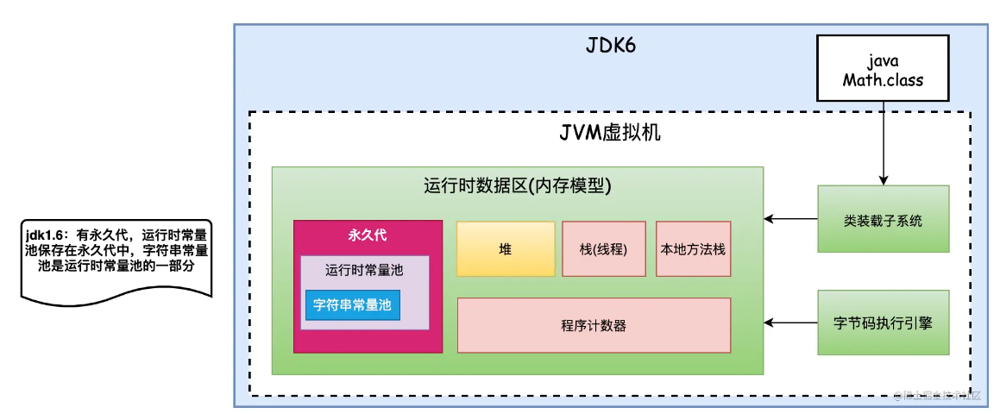
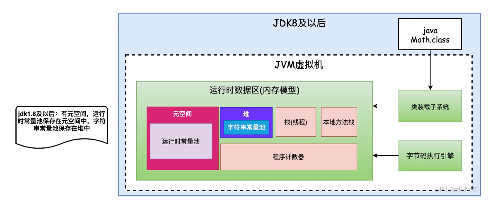
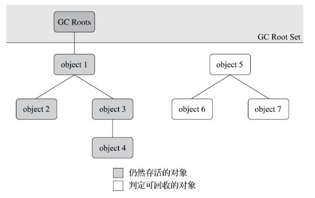
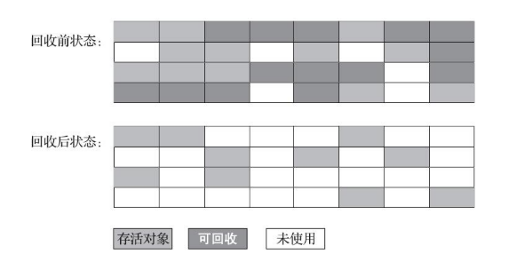
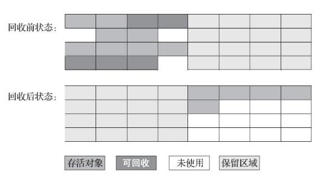
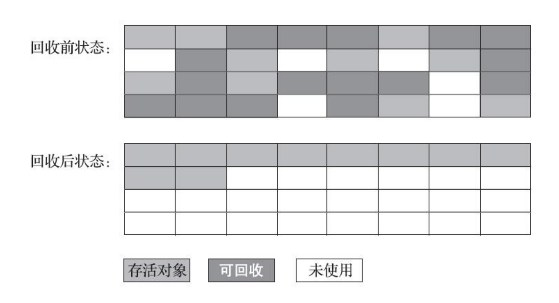
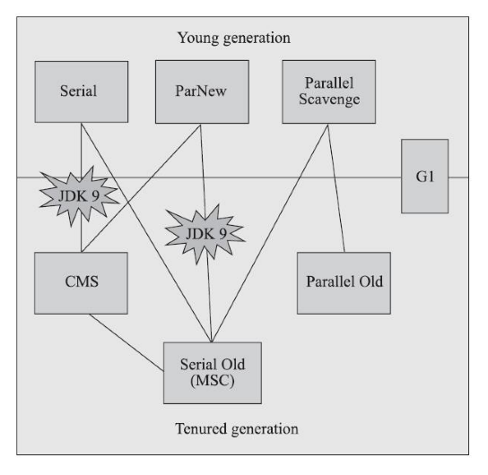
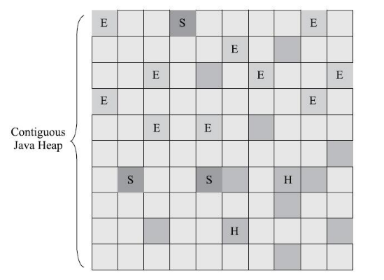
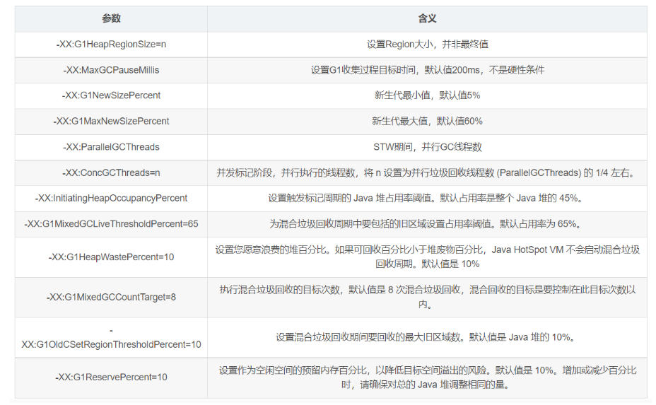

# 前言

jvm相关面试题目整理

# 题目

## JVM 的内存模型描述一下？

### 程序计数器

线程私有。可以看作是当前线程做执行的字节码的行号指示器。此内存区域是唯一一个在《JVM规范》中没有规定任何outOfMemoryError情况的区域。

### 虚拟机栈

线程私有。虚拟机栈描述的是java方法执行的线程内存模型：每个方法执行时，jvm会同步创建一个栈帧用于存储局部变量表，操作数栈，动态链接，方法出口等信息。每个方法被调用直到执行完毕的过程对应着一个栈帧在虚拟机栈中从入栈到出栈的过程。
如果线程请求的栈深度超过了虚拟机允许的深度时会抛出StackOverflowError异常；如果jvm栈容量可以动态扩展，当栈扩展时无法申请到足够的内存会抛出OutOfMemoryError异常（HopSpot不允许栈空间扩展，只有在申请的时候空间不足会抛出该异常，在运行的时候不会出现该异常）。

### 本地方法栈

线程私有。和虚拟机栈类似，只不过本地方法栈服务于本地方法（native方法）。也会抛出StackOverflowError异常和OutOfMemoryError异常。
当堆内存超过上限时会抛出OutOfMemoryError异常。

### 堆

线程共享。几乎所有的对象实例及数组都分配在java堆上。

### 方法区

线程共享。用于存储已被虚拟机加载的类型信息、常量、静态变量、即时编译器编译后的代码缓存等数据。
jdk8以前，Hotspot设计团队把收集器的分代设计扩展至方法区或者说用永久代实现了方法区，所以有的人会认为方法区是永久代，实际上是不严谨的。jdk8将方法区采用本地内存来实现，这个空间叫做元空间（meta-space），方法区无法满足新的内存分配需求时，将抛出OutOfMemoryError异常。
运行时常量池是方法去的一部分。Class文件中除了有类版本、字段、方法、接口等信息的描述外，还有一项信息是常量池表，用于存放编译期间生成的各种字面量和符号引用，常量池表在类加载后存放到方法区的运行时常量池中。运行时常量池一般除了保存class文件中描述的符号引用外，还会把符号引用翻译出来的直接引用也存储在运行时常量池中。
另外运行时常量池具备动态性，处理类加载时导入的常量外，可以在程序运行中加入新的常量。常量池无法再申请内存的时候会抛出OutOfMemoryError异常。

### 直接内存

直接内存不是JVM运行时数据区的一部分，也不是《规范》中定义的内存区域，但是这部分可能被频繁使用，而且也会导致OutOfMemoryError异常。一般为NIO使用。

### java运行时数据区域的垃圾回收

程序计数器、虚拟机栈、本地方法栈3个区域和线程的生命周期一致，栈中的栈帧随着方法的进入和退出有序地执行进栈和出栈。每个栈帧中分配的内存基本是在类结构确定下来就已知了，所以这些区域的内存分配和回收是确定的，不用过多考虑垃圾回收问题，当方法或者线程结束的时候，内存就随着回收了。
java堆和方法区里对象和接口的分配和回收是动态，只有在运行期间才会知道有那些接口和对象，这两块的垃圾回收是需要重点关注的。

参考：
[jvm运行时数据区域](https://www.cnblogs.com/lllliuxiaoxia/p/15785650.html)

## 内存溢出的情况

### 堆内存溢出

在堆中创建对象一直被GC Roots引用无法被清理，同时堆中的对象内存超过了最大堆内存，发生堆内存溢出。

```
public class HeapOOM {
    static class OOMObject{
    }
    public static void main(String[] args) {
        ArrayList<OOMObject> objects = new ArrayList<>();
        while (true){
            objects.add(new OOMObject());
        }
    }
}
```
错误信息提示“java.lang.OutOfMemoryError: Java heap space”
可以通过MAT进行分析定位

### 虚拟机栈和本地方法栈溢出

由于HotSpot不区分虚拟机栈和本地方法栈，所以栈容量只能由-Xss参数设置。虚拟机栈和本地方法栈在《规范》中有两种异常：（1）栈深度超限，抛出StackOverflowError；（2）如果虚拟机的栈内存允许动态扩展，当扩展栈容量无法申请到足够的内存时，将抛出OutOfMemoryError异常。HotSpot虚拟机不支持扩展栈内存，所以除非 在创建线程申请内存时就因无法获得足够内存而出现OutOfMemoryError异常，否则在线程运行时是不会因为扩展而导致内存溢出的，只会因为栈容量无法容纳新的栈帧而导致StackOverflowError异常。
每个线程的栈空间是线程独有的。对于HotSpot，-Xss参数表示单个线程的栈空间上限，如果-Xss较小，会导致没有空间创建新的栈帧，抛出StackOverflowError，如果在方法里定义大量变量，增加每个栈帧的大小，在相同的-Xss参数下，会导致能创建的栈帧数量变少，方法调用深度变少，最终也会抛出StackOverflowError。
对于多线程而言，每个线程都拥有-Xss参数大小的栈空间，如果反复循环创建线程。如果是32位的windows或者linux环境，每个进程可用的内存上限为若干GB，进程内存上限-堆内存-方法区内存-JVM自身内存-直接内存~=栈空间可用内存，当多个线程的栈空间和大于栈空间可用内存时，会抛出OutOfMemoryError异常。如果-Xss参数设置越大，会越快的出现这个异常。
`Exception in thread "main" java.lang.OutOfMemoryError: unable to create native thread`
不过对于64位的系统，进程内存上限达上百TB，不会出现上述的OutOfMemoryError异常，但是可能会不断侵占本地内存。在64位linux服务器上尝试了下，cpu基本占满，虚拟内存占用较多（54.3G），实际内存缓慢增长，开始内存增长快，后面速度降低，可能因为线程较多，主线程创建新线程的速度下降，看上去内存增长似乎很难达到服务器上限，主要的问题应该还是集中在cpu占用上。


### 方法区溢出

- 字符串常量池溢出

运行时常量池是方法区的一部分，字符串常量池是运行时常量池的一部分，但是jdk7以上将字符串常量池移到了java堆中。以下代码，如果在jdk6上运行，并且设置-XX: PermSize=6M -XX: MaxPermSize=6M时，会报OutOfMemoryError: PermGen space，即永久代(方法区)内存溢出；但是如果在jdk7及以上，字符串常量池移到了java堆中，由于堆内存十分大，下面代码的循环几乎一直运行，但是如果设置-Xmx为6MB，也会报OutOfMemoryError: Java heap space。

```
public class RuntimeConstantPoolOOM {
    public static void main(String[] args) {
        Set<String> set = new HashSet<>();
        short i = 0;
        while (true){
            System.out.println(i);
            set.add(String.valueOf(i).intern());
        }
    }
}
```

方法区的变动：




- 方法区其他部分溢出（类加载溢出）

jdk7，方法区还由永久代实现，可以比较容易的出发方法区溢出，jdk8之后方法区由元空间实现，理论上仅受限于系统内存，同时可以实现垃圾回收，很难出现方法区溢出，如果类大量加载可能出现方法区溢出。但是HotSpot提供了若干防御性参数避免元空间的任意使用。例如：
-XX：MaxMetaspaceSize：设置元空间最大值，默认是-1，即不限制，或者说只受限于本地内存大小。该值表示了元空间能够申请空间的极限。
-XX：MetaspaceSize：指定元空间的最小回收阈值，以字节为单位，达到该值就会触发垃圾收集进行类型卸载，同时收集器会对该值进行调整：如果释放了大量的空间，就适当降低该值；如果释放了很少的空间，那么在不超过-XX：MaxMetaspaceSize（如果设置了的话）的情况下，适当提高该值。

### 直接内存溢出

直接内存（DirectMemory）的容量大小可通过-XX：MaxDirectMemorySize参数来指定，如果不去指定，则默认与Java堆最大值（由-Xmx指定）一致。由直接内存导致的内存溢出，一个明显的特征是在HeapDump文件中不会看见有什么明显的异常情况，如果读者发现内存溢出之后产生的Dump文件很小，而程序中又直接或间接使用了DirectMemory（典型的间接使用就是NIO），那就可以考虑重点检查一下直接内存方面的原因了。异常信息一般如下：

```
Exception in thread "main" java.lang.outofMemoryError
at sun.misc.Unsafe.allocateMemory(Native Method)
at org.fenixsoft.oom. DMOOM.main(DMOOM.java:20)
```

参考：
《深入理解java虚拟机：jvm高级特性和最佳实践》
[一个程序最多可以使用多少内存？](https://blog.csdn.net/weixin_42709563/article/details/106234230)
[深刻理解运行时常量池、字符串常量池](https://juejin.cn/post/7058375922235211790)
[JVM参数-XX:MatespaceSize的含义](https://blog.csdn.net/wangyili002/article/details/105584663)

## java对象状态判定

### 判断对象存活的方法

- 引用计数法

在对象中添加一个引用计数器，每有一个地方引用就加一，每有一个引用失效就减一，减到0时认为对象已死。
优点：判别效率高，原理简单
缺点：占用额外内存空间，需要考虑大量的例外情况，例如相互循环引用的问题。

- 可达性分析算法

当前主流的商用程序语言的内存管理子系统都是通过可达性分析算法判定对象是否存活的，通过一系列称为“GC roots”的跟对象作为其实节点集，从这些节点开始，根据应用关系向下搜索，搜索过程所走过的路径称为“引用链”，如果某个对象到GC Roots间没有任何引用链相连，或者用图论的话来说从GC roots到这个对象不可达时，则证明这个对象时不可能再被使用的。



### java的GC Roots

在Java技术体系里面，固定可作为GCRoots的对象包括以下几种：
* 在虚拟机栈（栈帧中的本地变量表）中引用的对象，譬如各个线程被调用的方法堆栈中使用到的参数、局部变量、临时变量等。
* 在本地方法栈中JNI（即通常所说的Native方法）方法）引用的对象。
* 在方法区中类静态属性引用的对象，譬如Java类的引用类型静态变量。
* 在方法区中常量引用的对象，譬如字符串常量池（StringTable）里的引用。
* Java虚拟机内部的引用，如基本数据类型对应的Class对象，一些常驻的异常对象（比如NullPointExcepiton、OutOfMemoryError）等，还有系统类加载器。
* 所有被同步锁（synchronized关键字）持有的对象。
* 反映Java虚拟机内部情况的JMXBean、JVMTI中注册的回调、本地代码缓存等。
除了这些固定的GCRoots集合以外，根据用户所选用的垃圾收集器以及当前回收的内存区域不同，还可以有其他对象“临时性”地加入，共同构成完整GCRoots集合

### java如何判定对象死亡

1）首先通过可达性分析判定对象已经不被引用链关联；
2）在对象可能执行的finalize方法（如果没有重写该方法或者已经被调用过将被视为“没有必要执行”）中，该对象没有逃脱（finalize中对象可能重新被引用链关联）。
以上两个阶段都符合后，对象将判定死亡并被回收。但是不建议大家使用finalize方法，这个方法十分不可靠。

参考：
《深入理解java虚拟机：jvm高级特性和最佳实践》

## 方法区回收

方法区的回收较为苛刻，性价比低，但是在某些特定的场景（如大量使用反射、动态代理、CGlib等字节码框架）收集方法区是有必要的。
如何判定一个类是否属于“不再被使用的类”？
- 该类所有的实例都已经被回收，也就是Java堆中不存在该类及其任何派生子类的实例。
- 加载该类的类加载器已经被回收，这个条件除非是经过精心设计的可替换类加载器的场景，如OSGi、JSP的重加载等，否则通常是很难达成的。
- 该类对应的java.lang.Class对象没有在任何地方被引用，无法在任何地方通过反射访问该类的方法。
Java虚拟机被允许对满足上述三个条件的无用类进行回收，这里说的仅仅是“被允许”，而并不是和对象一样，没有引用了就必然会回收。关于是否要对类型进行回收，HotSpot虚拟机提供了-Xnoclassgc参数进行控制。

## JVM堆内存为什么要分成新生代，老年代，持久代？新生代中为什么要分为Eden和Survivor？

### 为何分代

分代收集理论
1）弱分代假说（WeakGenerationalHypothesis）：绝大多数对象都是朝生夕灭的。
2）强分代假说（StrongGenerationalHypothesis）：熬过越多次垃圾收集过程的对象就越难以消亡。
3）跨代引用假说（IntergenerationalReferenceHypothesis）：跨代引用相对于同代引用来说仅占极少数。
jdk8之前采用永久代实现方法区，认为该空间一般不需要进行垃圾回收，jdk8开始使用叫做元空间的本地内存实现方法区，会进行垃圾回收；分代主要是为了让不同代的对象按照不同的频率回收，减少不必要的垃圾回收开销，这里考虑了弱分代假说和强分代假说。

不用为了少量的跨代引用去扫描整个老年代，也不必浪费空间专门记录每一个对象是否存在及存在哪些跨代引用，只需在新生代上建立一个全局的数据结构（该结构被称为“记忆集”，RememberedSet），这个结构把老年代划分成若干小块，标识出老年代的哪一块内存会存在跨代引用。此后当发生MinorGC时，只有包含了跨代引用的小块内存里的对象才会被加入到GCRoots进行扫描。虽然这种方法需要在对象改变引用关系（如将自己或者某个属性赋值）时维护记录数据的正确性，会增加一些运行时的开销，但比起收集时扫描整个老年代来说仍然是划算的。

### 新生代中为什么要分为Eden和Survivor

新生代采用标记-复制算法，但是半区的标记-复制只能使用一般的区域。IBM公司曾有一项专门研究对新生代“朝生夕灭”的特点做了更量化的诠释——新生代中的对象有98%熬不过第一轮收集。因此并不需要按照1∶1的比例来划分新生代的内存空间。所以产生了Appel式回收，将存活的新生代放到Survivor中，如果Survivor0、Survivor1、Eden的比例为1：1：8，则可以有效利用新生代90的空间。

任何人都没有办法百分百保证每次回收都只有不多于10%的对象存活，因此Appel式回收还有一个充当罕见情况的“逃生门”的安全设计，当Survivor空间不足以容纳一次MinorGC之后存活的对象时，就需要依赖其他内存区域（实际上大多就是老年代）进行分配担保（HandlePromotion）。

参考：
《深入理解java虚拟机：jvm高级特性和最佳实践》

## 简述下垃圾回收算法？为什么新生代使用复制算法？

### 垃圾回收算法

- 标记-清除算法

先标记（可能标记存活的对象，也可能标记死亡的对象），标记完成后在清除。
优点：标记清除速度快；
缺点：标记清除操作效率随着对象的增长而降低，内存碎片化导致大对象无法分配导致再次触发GC；



- 标记-复制算法

**半区复制**

将内存分为大小相等的两块，一块内存用完，将存活的少量对象移动到另一块内存上，保障了新的可用内存区域的连续性，然后集中清理原来那块内存。
优点：速度快，内存空间连续
缺点：可用内存减半



**Appel式回收**

IBM公司曾有一项专门研究对新生代“朝生夕灭”的特点做了更量化的诠释——新生代中的对象有98%熬不过第一轮收集。因此并不需要按照1∶1的比例来划分新生代的内存空间。
AndrewAppel针对具备“朝生夕灭”特点的对象，提出了一种更优化的半区复制分代策略，现在称为“Appel式回收”。HotSpot虚拟机的Serial、ParNew等新生代收集器均采用了这种策略来设计新生代的内存布局。
Appel式回收的具体做法是把新生代分为一块较大的Eden空间和两块较小的Survivor空间，每次分配内存只使用Eden和其中一块Survivor。发生垃圾搜集时，将Eden和Survivor中仍然存活的对象一次性复制到另外一块Survivor空间上，然后直接清理掉Eden和已用过的那块Survivor空间。HotSpot虚拟机默认Eden和Survivor的大小比例是8∶1，也即每次新生代中可用内存空间为整个新生代容量的90%（Eden的80%加上一个Survivor的10%），只有一个Survivor空间，即10%的新生代是会被“浪费”的。当然，98%的对象可被回收仅仅是“普通场景”下测得的数据，任何人都没有办法百分百保证每次回收都只有不多于10%的对象存活，因此Appel式回收还有一个充当罕见情况的“逃生门”的安全设计，当Survivor空间不足以容纳一次MinorGC之后存活的对象时，就需要依赖其他内存区域（实际上大多就是老年代）进行分配担保（HandlePromotion）。

- 标记-整理算法

标记-整理算法，先标记，再整理，最后清理。



CMS收集器平时采用标记清除算法，当内存的碎片化程度较高影响对象分配时，采用标记整理算法整理一次内存空间。

### 为什么新生代使用复制算法

复制算法效率会高于整理算法，新生代使用复制算法每次只需要复制少量的对象，且没有碎片内存空间，另外存在担保空间，所以可以使用；老年代没有担保，所以无法使用复制算法。

参考：
《深入理解Java虚拟机：JVM高级特性与最佳实践（第3版）》

## 简述一下垃圾回收器？说下各自的优缺点？有了解过cms和G1么？能详细说明一下么？

### GC术语

Partial GC:目标不是完整收集整个java堆的垃圾收集
Minor GC/Young GC(收集新生代),Major GC/Old GC（收集老年代，目前只有CMS会有单独回收老年代的行为）,Mixed GC（收集整个新生代和部分老年代）
Full GC:收集整个堆和方法区。

### HotSpot垃圾回收相关概念

- 根节点枚举

尽管可达性分析中耗时最长的查找引用链的过程已经可以做到和用户线程一起并发了，但是根节点的枚举还是必须在一个能保障一致性的快照中才能进行，即根节点枚举阶段，整个执行子系统看起来被冻结在某个时间点上一样。这是导致垃圾收集过程中必须停顿所有用户线程的其中一个重要原因，虽然时间可控，但是这个停顿时不可避免的。
HotSpot在类加载和即时编译阶段都会将对象内各个数据类型的位置都计算出来，在根节点枚举前可以直接利用这些信息生成OopMap这么一个数据结构，直接通过OopMap获取根节点信息。

- 安全点

因为很多指令都会导致引用关系变化，同时也会导致OopMap变化，所以不能在完成每条指令后都生成OopMap，这样开销太大，所以HotSpot只在安全点生成OopMap。
安全点一般在方法调用、循环跳转、异常调转等指令序列复用（具有让程序长时间执行的特征）处选取。
多线程安全点暂停的方案有抢占式中断和主动式中断。目前虚拟机一般都采用主动式中断方式。即在需要中断线程的时候不直接对线程操作，而是简单设置一个标志位，各线程不断主动轮询这个标志位，一旦标志位为真，各线程就在自己最近的安全点上主动中断挂起，一般是到达某个安全点开始轮询标志位。

- 安全区域

线程在处于sleep或者阻塞状态时无法响应虚拟机中断，此时如果等线程自己走到安全点将花费大量的时间，这个不太现实，所以引入安全区域的概念。安全区域能确保在某一段代码片段之中，引用关系不会发生变化，因此，在这个区域中的任意地方开始垃圾回收都是安全的。可以将安全区域当成安全点的延展。如果线程进入安全区域且发生了GCRoots枚举，需要等待枚举完成后再离开安全区域。

- 记忆集和卡表

新生代和老年代可能存在跨代引用（只考虑老年代引用新生代的情况），涉及到部分区域收集的时候（G1、ZGC等）也会面临跨区引用。但是我们不能将引用方所在的整个内存区域如老年代整个扫描一遍，这样成本太高，所以可以维护一个数据结构记录引用了目标垃圾收集区域对象的指针，这个数据结构就是记忆集。但是如果到每一个引用指针所在的具体位置成本太高，所以推出了卡表来实现记忆集，将精确到具体指针位置变成精确到一个内存区域，该区域存在跨代指针。如果一个区域内存在跨代指针，就将这个区域内所有的对象都加入GCRoots。

- 并发可达性分析

可达性分析过程中查找引用链耗时最长，所以需要此部分和用户线程实现并发进行。如果在并发进行过程中，某几个需要清理的垃圾因为用户线程并发操作导致遗漏并不会有太大的影响，但是如果有几个对象本不该清理却因为用户线程的并发操作导致被清理则会产生致命影响。
相关论文证明了导致有用有对象被清理的两个条件，后续提出了两个解决方案分别用于破坏这两个条件，分别为增量更新和原始快照。CMS是基于增量更新实现并发的，而G1、Shenandoah则是用原始快照来实现的。


----------------------------------------------


### G1前的经典垃圾收集器

下图为经典垃圾收集器的关系图，存在连线的是可以配合使用的垃圾收集器，其中有两个配合在jdk9的时候被禁止。



**新生代垃圾收集器**:

- Serial收集器

使用一个收集器、一个线程收集垃圾，同时必须暂停其他所有工作线程，直到收集结束。采用标记-复制算法。
最悠久的收集器，运行在客户端模式下的默认新生代收集器，简单高效（单核环境中基本最强），适用于资源受限的环境，适合客户端或者部分微服务应用，新生代在200MB以内的场景。一般停顿在100毫秒以内。

- ParNew收集器

ParNew收集器是Serial收集器多线程版本，控制参数、收集算法等一致。jdk9之后只能和CMS收集器配合使用。

Parallel Scavenge收集器
多线程并行垃圾收集器，但是Parallel Scavenge关注吞吐量（CMS等关注停顿或者说延迟），被称为“吞吐量优先收集器”，吞吐量=（运行用户代码时间）/（运行用户代码时间+运行垃圾收集时间），主要适用与后台计算，交互较少的分析任务。Parallel Scavenge收集器提供了两个参数用于精确控制吞吐量，分别是控制最大垃圾收集停顿时间的-XX：MaxGCPauseMillis参数以及直接设置吞吐量大小的-XX：GCTimeRatio参数。
XX：+UseAdaptiveSizePolicy开启后，只需要设置-XX：MaxGCPauseMillis或者-XX：GCTimeRatio参数后即可由收集器自动设置新生代大小、代数等细节参数。

**老年代垃圾收集器**:

Serial Old收集器
Serial收集器的老年代版本，单线程收集器，标记-整理算法，主要用于客户端模式下的HotSpot虚拟机使用，同时作为CMS发生失败的后备预案。Parallel Scavenge收集器中包含老年代收集器，代码和Serial Old收集器一样，所以可以视为两者搭配使用。

Parallel Old收集器
Parallel Scavenge收集器的老年代版本，多线程并发收集，标记-整理算法。关注吞吐量，一般和Parallel Scavenge搭配，用于多核处理器且注重吞吐量的场景。

CMS收集器
注重减少停顿（延迟），提供较高的响应速度，提高交互体验。步骤为初始标记-并发标记-重新标记-并发清除。
其中并发标记和并发清除是和用户线程并发进行的，而初始标记和重新标记的时间极短，极大的降低了停顿时间。重新标记采用增量更新方式。
CMS是HotSpot追求低停顿的的第一次尝试，但是还有以下几个问题：
1）资源敏感，处理器核数超过4个时，垃圾回收占用不超过25%的资源
2）并发收集时用户线程会产生浮动垃圾，需要预留一定空间存放，需要设定一个阈值提前开始垃圾收集，阈值太低造成回收频率频繁，阈值太高则预留空间不足放不下浮动垃圾，此时造成并发失败，使用Serial Old收集器暂停所有其他线程进行老年代收集，停顿时间很久；
3）CMS收集器基于标记-清除算法，当碎片化程度高时使用标记-整理，此时停顿较大。

### G1垃圾收集器

G1目标是指定在一个长度为M毫秒的时间内，消耗在垃圾收集的时间大概率不超过N毫秒，G1可以面向堆内存任何部分来组成回收集进行回收。

同时基于分代理论和region分区进行内存布局，每个region可以根据需要扮演eden、servivor或者老年代空间，region中有一类特殊的humongous区域用来存放大对象，G1认为只要大小超过了一个region容量一般的对象都被判为大对象，对于超过了整个region的超级大对象会存放在多个连续的humongous region 中，G1一般将humongous region当成老年代的一部分看待。G1中新生代、老年代的区域不再需要连续了。

mixed GC分批开展，基于收集器的停顿目标优先选取回收效率高的老年代进行收集（garbage first），保证了G1在有限的时间里获取尽可能高的收集效率。

region间看起来又像是标记-复制算法，这两种算法都不会造成内存空间碎片化，有利于程序长期运行。

如果设置的停顿时间过小，可能导致内存回收的速度跟不上内存分配的速度，G1也要被迫冻结用户线程，导致full gc而长生长时间停顿。



### G1对比CMS

G1收集器的设计目标是取代CMS收集器，它同CMS相比，在以下方面表现的更出色：
G1是一个有整理内存过程的垃圾收集器，不会产生很多内存碎片
G1的Stop The World(STW)更可控，G1在停顿时间上添加了预测机制，用户可以指定期望停顿时间
但是G1的执行负载较高，小内存应用上CMS表现大概率好于G1，而大内存应用上G1大概率好于CMS，平衡点经验上看在6-8GB之间。

### 低延迟垃圾收集器

内存占用、吞吐量、延迟构成了不可能三角，一个优秀的收集器最多只能达成两项，三个指标中延迟的重要性越发重要，因为硬件规格提升可以提升吞吐量，但是对延迟反而会带来负面效果（堆越大，垃圾收集时间越长），所以延迟被视为收集器最重要的指标。
后续推出了新的收集器Shenandoah和ZGC，在任意堆大小情况下，停顿时间都不超过10毫秒。
jdk15中，ZGC已经被意见投入生产环境了。最大支持4TB的堆。

### 垃圾收集器应用场景

Serial+Serial Old：单核处理器,轻量化客户端(jdk9-jdk19)
CMS+parNew:6GB以下堆内存，关注延迟，cpu核数最好大于4
Parallel Scavenge+Parallel Old:关注吞吐（jdk7-jdk8）
Parallel Scavenge+Serial Old：鸡肋，不考虑(jdk5-jdk7)
G1：6GB以上的堆内存
ZGC：jdk15及之后，极低延迟
Shenandoah：openjdk12及之后，极低延迟

### jdk默认垃圾收集器

jdk5-jdk7:Parallel Scavenge+Serial Old
jdk7-jdk8:Parallel Scavenge+Parallel Old
jdk9-jdk19:G1
注意，有时将Serial Old和Parallel Old统称为PS MarkSweep。故有时jdk5-jdk8都显示为PS Scavenge + PS MarkSweep.

参考：
《深入理解Java虚拟机：JVM高级特性与最佳实践（第3版）》
[ZGC都出来了，你还不懂G1？](https://blog.csdn.net/baidu_38083619/article/details/105752830)
[G1调优实践日记](https://blog.csdn.net/lovejj1994/article/details/109620239)
[G1垃圾回收参数优化](https://zhuanlan.zhihu.com/p/181305087)
[G1垃圾回收参数优化](https://juejin.cn/post/7001406102621388831)

## JVM 是怎么从新生代到老年代？一个完整的GC流程是怎样的？

### JVM 是怎么从新生代到老年代？

（1）新创建的对象进入eden区，经过一次young GC后如果没有被清理掉将进入某个Survivor空间，同时这个对象的代数增长一个，当代数增长到某一个阈值的时候将进入老年代；
（2）也可能大对象直接进入老年代；
（3）也可能是某次young GC后一个Survivor空间容不下剩下的新生代对象，一部分对象直接通过担保机制进入老年代，
（4）也可能在Survivor空间中有相同年龄所有对象大小的总和大于Survivor空间的一半，年龄大于或等于该年龄的对象就可以直接进入老年代，无须等到-XX：MaxTenuringThreshold中要求的年龄。

### 一个完整的GC流程是怎样的？

G1之前，一般是minor GC(一般时新生代空间不足时发生) -> full GC（当准备要触发一次young GC时，如果发现统计数据说之前young GC的平均晋升大小比目前old gen剩余的空间大，则不会触发young GC而是转为触发full GC（因为HotSpot VM的GC里，除了CMS之外，其它能收集old gen的GC都会同时收集整个GC堆，包括young gen，所以不需要事先触发一次单独的young GC）；或者方法区没有足够空间时，也要触发一次full GC；或者System.gc()、heap dump带GC，默认也是触发full GC。并发GC的触发条件就不太一样。以CMS GC为例，它主要是定时去检查old gen的使用量，当使用量超过了触发比例就会启动一次CMS GC，对old gen做并发收集。

G1，一般是minor GC -> mixed GC ->full GC。
1）Young GC：Young GC主要是对Eden区进行GC，它在Eden空间耗尽时会被触发。JVM启动时，G1先准备好Eden区，程序在运行过程中不断创建对象到Eden区，当所有的Eden区都满了，G1会启动一次年轻代垃圾回收过程。年轻代只会回收Eden区和Survivor区。首先G1停止应用程序的执行（Stop-The-World），G1创建回收集（Collection Set），回收集是指需要被回收的内存分段的集合，年轻代回收过程的回收集包含年轻代Eden区和Survivor区所有的内存分段。
扫描根：根引用连同RSet记录的外部引用作为扫描存活对象的入口。
更新RSet：处理Dirty Card Queue中的Card，更新RSet。此阶段完成后，RS可以准确的反映老年代对所在的内存分段中对象的引用。
处理RSet：识别被老年代对象指向的Eden中的对象，这些被指向的Eden中的对象被认为是存活的对象。
复制对象：对象树被遍历，Eden区Region中存活的对象会被复制到Survivor区中空的Region，Survivor区Region中存活的对象如果年龄未达阈值（G1默认是15），年龄会加1，达到阀值会被会被复制到Old区中空的Region。survivor空间不足时进入分配担保空间。
清除内存：原有的年轻代分区将被整体回收掉后放入空闲列表中，等待下次被使用。

2）Mixed GC：当整个堆内存（包括老年代和新生代）被占满一定大小的时候（默认是45%，可以通过-XX:InitiatingHeapOccupancyPercent进行设置），Mixed GC（混合回收）就会被启动。具体检测堆内存使用情况的时机是年轻代回收之后或者Houmongous对象分配之后。Mixed GC主要可以分为两个阶段

全局并发标记（global concurrent marking）
包含以下几个阶段：
初始标记（initial mark，STW）：在此阶段对GC Root对象进行标记，初始标记阶段共用了Young GC的暂停，这是因为他们可以复用Root Scan操作。
根分区扫描（Root Region Scanning）：在初始标记暂停结束后，年轻代收集也完成的对象复制到 Survivor 的工作，应用线程开始活跃起来。此时为了保证标记算法的正确性，所有新复制到 Survivor 分区的对象，都需要被扫描并标记成根。根分区扫描必须在下一次年轻代垃圾收集启动前完成（并发标记的过程中，可能会被若干次年轻代垃圾收集打断），因为每次 GC 会产生新的存活对象集合。
并发标记（Concurrent Marking）：在整个堆中查找根可达（存活的）对象，收集各个Region的存活对象信息，过程中还会扫描上文中提到的SATB write barrier所记录下的引用。
重新标记（Remark，STW）：标记那些在并发标记阶段发生变化的对象，将被回收。
清理垃圾（Cleanup，部分STW）：在这个最后阶段，G1 GC 执行统计和 RSet 净化的 STW 操作。在统计期间，为混合收集周期识别回收收益高（基于释放空间和暂停目标）的老年代分区集合。识别所有空闲分区，即发现无存活对象的分区。该分区可在清除阶段直接回收，无需等待下次收集周期。
拷贝存活对象（Evacuation）
将Region里的活对象拷贝到空Region里去（并行拷贝），然后回收原本的Region的空间。
为了满足停顿预测模型即暂停时间，G1 可能不能一口气将所有的Region都收集掉，因此 G1 可能会产生连续多次的混合收集与应用线程交替执行，每次 STW 的混合收集与年轻代收集过程相类似。由于老年代中的内存分段默认分8次（可以通过-XX:G1MixedGCCountTarget设置）回收，G1会优先回收垃圾多的内存分段。垃圾占内存分段比例越高的，越会被先回收。并且有一个阈值会决定内存分段是否被回收，-XX:G1MixedGCLiveThresholdPercent，默认为65%，意思是垃圾占内存分段比例要达到65%才会被回收。如果垃圾占比太低，意味着存活的对象占比高，在复制的时候会花费更多的时间。
混合回收并不一定要进行8次。有一个阈值-XX:G1HeapWastePercent，默认值为10%，意思是允许整个堆内存中有10%的空间被浪费，意味着如果发现可以回收的垃圾占堆内存的比例低于10%，则不再进行混合回收。因为GC会花费很多的时间但是回收到的内存却很少。G1 GC 回收了足够的旧区域后（经过多次混合垃圾回收），G1 将恢复执行年轻代垃圾回收，直到下一个标记周期完成。

3）Full GC
转移失败（Evacuation Failure）是指当 G1 无法在堆空间中申请新的分区时，G1 便会触发担保机制，执行一次 STW 式的、单线程的 Full GC。Full GC 会对整堆做标记清除和压缩，最后将只包含纯粹的存活对象。参数 -XX:G1ReservePercent（默认10%）可以保留空间，来应对晋升模式下的异常情况，最大占用整堆50%，更大也无意义。
从年轻代分区拷贝存活对象时，无法找到可用的空闲分区
从老年代分区转移存活对象时，无法找到可用的空闲分区
分配巨型对象时在老年代无法找到足够的连续分区
G1 的Full GC算法就是单线程执行的 Serial Old GC，会导致异常长时间的暂停时间，需要进行不断的调优，尽可能的避免Full GC。


## 简述一下类加载过程，重点说明一下双亲委派模型，怎么破坏双亲委派模型？Tomat是怎么破坏的呢？

## 说说你了解的jvm参数和其作用？

- 经典垃圾收集器参数

-Xms:初始大小内存，默认为物理内存的1/64等价于-XX:InitialHeapSize
-Xmx:最大分配内存，默认为物理内存的1/4等价于-XX:MaxHeapSize
-Xss:设置单个线程栈的大小，一般默认为512k~1024k等价于-XX:ThreadStackSize
当值等于0的时候，代表使用得是默认大小
-Xmn：设置年轻代大小
-XX:MetaspaceSize：设置元空间大小（元空间与永久代最大的区别为：元空间并不在虚拟机中，而使用的是本地内存，因此，元空间只收本地内存的限制）
手动设置：-XX：MetaspaceSize=1024m
-XX:MaxMetaspaceSize: 设置元空间的最大大小

-XX:SurvivorRatio：设置新生代中 eden 和 S0/S1 空间比例，默认 -XX:SurvivorRatio=8，Eden : S0 : S1 = 8 : 1 : 1
​ -XX:SurvivorRatio=4==》Eden : S0 : S1 = 4 : 1 : 1
-XX:NewRatio：配置年轻代和老年代在堆结构的占比，默认 -XX:NewRatio=2 新生代占1，老年代占2，年轻代占整个堆的 1/3
​ -XX:NewRatio=4 新生代占1，老年代占4，年轻代占整个堆的 1/5
-XX:MaxTenuringThreshold：设置垃圾最大年龄。默认是15。
-XX:MaxTenuringThreshold=0：设置垃圾最大年龄。如果设置为0的话，则年轻代对象不经过Survivor区，直接进入老年代。对于老年代比较多的应用，可以提高效率。如果此值设置为一个较大的值，则年前对象会在Survivor区进行多次复制，这样可以增加对象在年轻代的存活时间，增加在年轻代被回收的概率！

- G1参数



## GC调优


- 微调 G1 GC 时，请记住以下建议：

年轻代大小：避免使用 -Xmn 选项或 -XX:NewRatio 等其他相关选项显式设置年轻代大小。固定年轻代的大小会覆盖暂停时间目标。
暂停时间目标：-XX:MaxGCPauseMillis设定暂停时间目标，每当对垃圾回收进行评估或调优时，都会涉及到延迟与吞吐量的权衡。
掌握混合垃圾回收：当您调优混合垃圾回收时，请尝试以下选项
-XX:InitiatingHeapOccupancyPercent：堆内存比例，当整个堆占用超过某个百分比时，就会触发并发GC周期，这个百分比默认是45%。
-XX:G1MixedGCLiveThresholdPercent 和 -XX:G1HeapWastePercent：G1MixedGCLiveThresholdPercent是Region的存活比例，默认85%，即只有存活对象低于85%的Region才可以被回收。G1HeapWastePercent是允许堆的浪费比例，默认10%，即全局并发标记后统计出所有可回收垃圾比例超过G1HeapWastePercent才会触发回收混合回收。
-XX:G1MixedGCCountTarget 和 -XX:G1OldCSetRegionThresholdPercent：执行混合垃圾回收的目标次数和设置混合垃圾回收期间要回收的最大旧区域数


调优建议：
微调 G1 GC 时，请记住以下建议：
年轻代大小：避免使用 -Xmn 选项或 -XX:NewRatio 等其他相关选项显式设置年轻代大小。固定年轻代的大小会覆盖暂停时间目标。
暂停时间目标：-XX:MaxGCPauseMillis设定暂停时间目标，每当对垃圾回收进行评估或调优时，都会涉及到延迟与吞吐量的权衡。G1 GC 是增量垃圾回收器，暂停统一，同时应用程序线程的开销也更多。G1 GC 的吞吐量目标是 90% 的应用程序时间和 10%的垃圾回收时间。因此，当您评估 G1 GC 的吞吐量时，暂停时间目标不要太严苛。目标太过严苛表示您愿意承受更多的垃圾回收开销，而这会直接影响到吞吐量。当您评估 G1 GC 的延迟时，请设置所需的（软）实时目标，G1 GC 会尽量满足。副作用是，吞吐量可能会受到影响。

掌握混合垃圾回收：当您调优混合垃圾回收时，请尝试以下选项
-XX:InitiatingHeapOccupancyPercent：堆内存比例，当整个堆占用超过某个百分比时，就会触发并发GC周期，这个百分比默认是45%。
-XX:G1MixedGCLiveThresholdPercent 和 -XX:G1HeapWastePercent：G1MixedGCLiveThresholdPercent是Region的存活比例，默认85%，即只有存活对象低于85%的Region才可以被回收。G1HeapWastePercent是允许堆的浪费比例，默认10%，即全局并发标记后统计出所有可回收垃圾比例超过G1HeapWastePercent才会触发回收混合回收。
-XX:G1MixedGCCountTarget 和 -XX:G1OldCSetRegionThresholdPercent：执行混合垃圾回收的目标次数和设置混合垃圾回收期间要回收的最大旧区域数

G1的推荐用例
G1的首要重点是为运行需要大堆且GC延迟有限的应用程序的用户提供解决方案。这意味着堆大小约为6GB或更大，并且稳定且可预测的暂停时间低于0.5秒。

如果当前具有CMS或ParallelOld垃圾收集器的应用程序具有以下一个或多个特征，则将其切换到G1很有用。
超过50％的Java堆被实时数据占用。
分代中的对象分配率或提升率差异很大
不必要的长时间垃圾收集或压缩暂停（长于0.5到1秒）
对象分配率和提升率：https://blog.csdn.net/zlfprogram/article/details/77365459

## Java的四种引用有了解么？引用队列怎么使用？作用是什么？

强引用
普通赋值就是强引用
软引用
用WeakReference类实现，被软引用关联的对象，当系统要发生OOM异常时，会将软引用关联的对象列进回收范围之中进行第二次回收，如果这次回收后还没有足够资源才抛出OOM异常
弱引用
用WeakReference类实现，被弱引用关联的对象只能生存到下次垃圾回收发生为止，不管内存是否够用，只要发生垃圾回收就会收回只被弱引用关联的对象。
虚引用
用PhantomReference类实现，无法通过虚引用来获取一个对象实例，虚引用也不会对对象的生存实践构成影响。唯一作用是能在对象被收集器回收的时候收到一个系统通知。
引用队列
当联合使用软引用、弱引用和引用队列时，系统在回收被引用的对象之后，将把它所回收对象对应的引用添加到关联的引用队列中。而虚引用在对象被释放之前，将把它对应的虚引用添加到它关联的引用队列中，这使得可以在对象被回收之前采取行动。

## 怎么打出一个线程的堆栈信息？如果内存过高怎么分析？如果cpu过高怎么定位？

### 怎么打出一个线程的堆栈信息？

jstack。

### 如果cpu过高怎么定位？

top，找到线程，jstack中找线程，定位代码

### 如果内存过高怎么分析？

内存过高，dump分析

## 内存的哪些部分会参与GC的回收

堆、方法区、直接内存

## 经典垃圾收集器频繁老年代回收怎么分析解决

- 频繁full gc会后果

机器 cpu 负载过高
频繁 full gc 告警
系统无法请求处理或者过慢， 接口无关 全面性的
出现以上异常的时候，要第一时间反应过来可能是full gc的问题

- 频繁full gc的常见原因

full gc 触发条件是 老年代空间不足， 所以追因的方向就是导致 老年代空间不足的原因：
大量对象频繁进入老年代 + 老年代空间释放不掉
系统并发高、执行耗时过长，或者数据量过大，导致 young gc频繁，且gc后存活对象太多，但是survivor 区存放不下（太小 或 动态年龄判断） 导致对象快速进入老年代 老年代迅速堆满
程序一次性加载过多对象到内存 （大对象），导致频繁有大对象进入老年代 造成full gc
存在内存溢出的情况，老年代驻留了大量释放不掉的对象， 只要有一点点对象进入老年代 就达到 full gc的水位了
元数据区加载了太多类 ，满了 也会发生 full gc
堆外内存 direct buffer memory 使用不当导致
也许， 你看到老年代内存不高 重启也没用 还在频繁发生full gc， 那么可能有人作妖，在代码里搞执行了 System.gc();

- 定位思路

如果有监控，那么通过图形能比较直观、快速的了解gc情况；
如果没有监控，那么只能看gc日志或jstat来分析 这是基本技能 一定要熟练
观察年轻代 gc的情况，多久执行一次、每次gc后存活对象有多少 survivor区多大
存活对象比较多 超过survivor区大小或触发动态年龄判断 => 调整内存分配比例
观察老年代的内存情况 水位情况，多久执行一次、执行耗时多少、回收掉多少内存
如果在持续的上涨，而且full gc后回收效果不好，那么很有可能是内存溢出了 => dump 排查具体是什么玩意
如果年轻代和老年代的内存都比较低，而且频率低 那么又可能是元数据区加载太多东西了
直接内存超过限制，导致触发 System.gc()
其实如果是自己负责的系统，可能要看是不是发版改了什么配置、代码


## While（true）里一直new thread().start()会有什么问题

线程一直运行的情况会导致CPU被占满，创建线程的速度越来越慢。
线程不一直运行的情况会导致创建大量线程对象，导致垃圾收集器频繁young gc。

# 参考

[微信公众号:我的IT技术路](https://mp.weixin.qq.com/s/54_bMeUwjxk-8DHa90heNQ)

