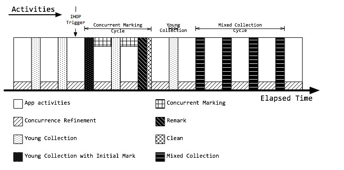
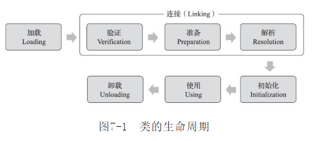
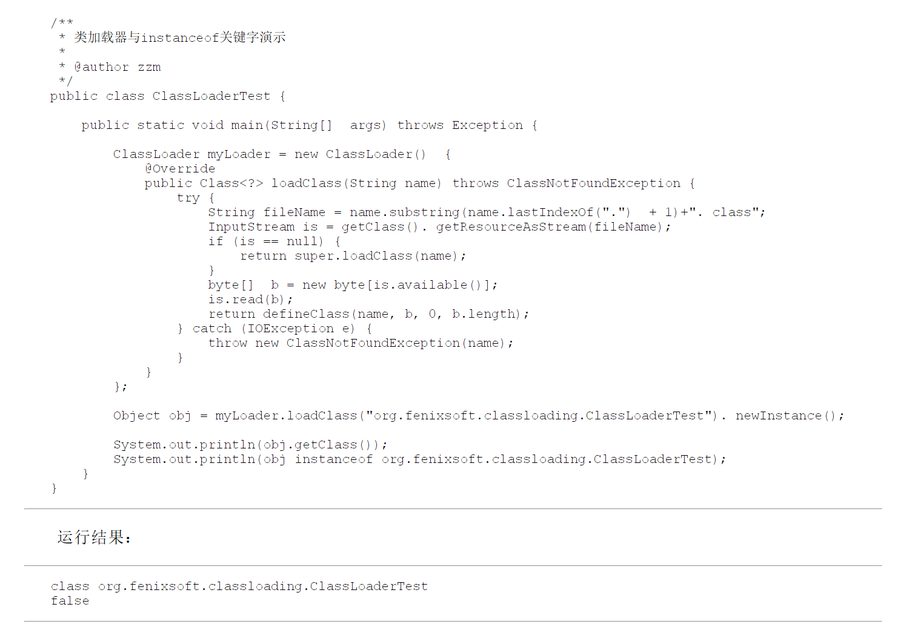
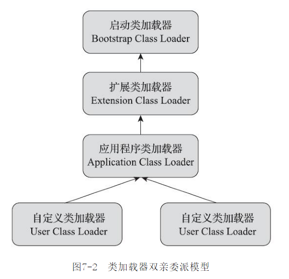
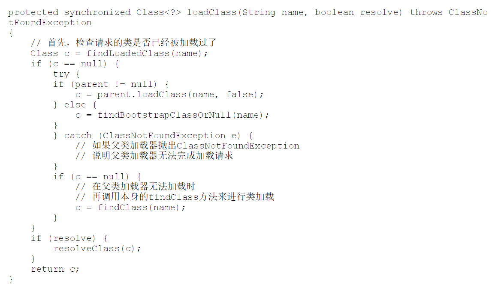
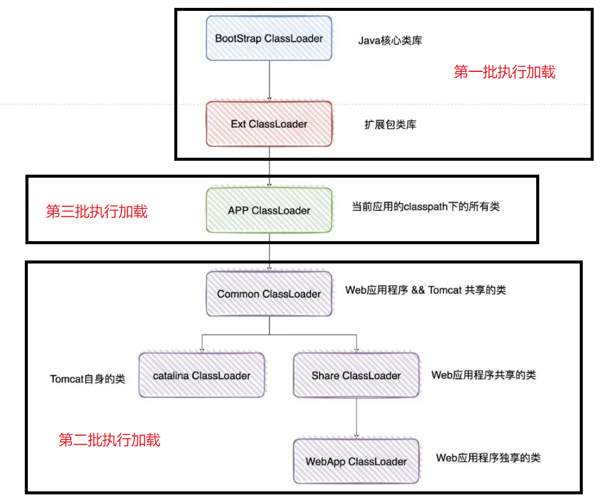

# 前言

jvm相关面试题目整理

# 题目

## JVM 的内存模型描述一下？

### 程序计数器

线程私有。可以看作是当前线程做执行的字节码的行号指示器。此内存区域是唯一一个在《JVM规范》中没有规定任何outOfMemoryError情况的区域。

### 虚拟机栈

线程私有。虚拟机栈描述的是java方法执行的线程内存模型：每个方法执行时，jvm会同步创建一个栈帧用于存储局部变量表，操作数栈，动态链接，方法出口等信息。每个方法被调用直到执行完毕的过程对应着一个栈帧在虚拟机栈中从入栈到出栈的过程。
如果线程请求的栈深度超过了虚拟机允许的深度时会抛出StackOverflowError异常；如果jvm栈容量可以动态扩展，当栈扩展时无法申请到足够的内存会抛出OutOfMemoryError异常（HopSpot不允许栈空间扩展，只有在申请的时候空间不足会抛出该异常，在运行的时候不会出现该异常）。

### 本地方法栈

线程私有。和虚拟机栈类似，只不过本地方法栈服务于本地方法（native方法）。也会抛出StackOverflowError异常和OutOfMemoryError异常。
当堆内存超过上限时会抛出OutOfMemoryError异常。

### 堆

线程共享。几乎所有的对象实例及数组都分配在java堆上。

### 方法区

线程共享。用于存储已被虚拟机加载的类型信息、常量、静态变量、即时编译器编译后的代码缓存等数据。
jdk8以前，Hotspot设计团队把收集器的分代设计扩展至方法区或者说用永久代实现了方法区，所以有的人会认为方法区是永久代，实际上是不严谨的。jdk8将方法区采用本地内存来实现，这个空间叫做元空间（meta-space），方法区无法满足新的内存分配需求时，将抛出OutOfMemoryError异常。
运行时常量池是方法去的一部分。Class文件中除了有类版本、字段、方法、接口等信息的描述外，还有一项信息是常量池表，用于存放编译期间生成的各种字面量和符号引用，常量池表在类加载后存放到方法区的运行时常量池中。运行时常量池一般除了保存class文件中描述的符号引用外，还会把符号引用翻译出来的直接引用也存储在运行时常量池中。
另外运行时常量池具备动态性，处理类加载时导入的常量外，可以在程序运行中加入新的常量。常量池无法再申请内存的时候会抛出OutOfMemoryError异常。

### 直接内存

直接内存不是JVM运行时数据区的一部分，也不是《规范》中定义的内存区域，但是这部分可能被频繁使用，而且也会导致OutOfMemoryError异常。一般为NIO使用。

### java运行时数据区域的垃圾回收

程序计数器、虚拟机栈、本地方法栈3个区域和线程的生命周期一致，栈中的栈帧随着方法的进入和退出有序地执行进栈和出栈。每个栈帧中分配的内存基本是在类结构确定下来就已知了，所以这些区域的内存分配和回收是确定的，不用过多考虑垃圾回收问题，当方法或者线程结束的时候，内存就随着回收了。
java堆和方法区里对象和接口的分配和回收是动态，只有在运行期间才会知道有那些接口和对象，这两块的垃圾回收是需要重点关注的。

参考：
[jvm运行时数据区域](https://www.cnblogs.com/lllliuxiaoxia/p/15785650.html)

## 内存溢出的情况

### 堆内存溢出

在堆中创建对象一直被GC Roots引用无法被清理，同时堆中的对象内存超过了最大堆内存，发生堆内存溢出。

```
public class HeapOOM {
    static class OOMObject{
    }
    public static void main(String[] args) {
        ArrayList<OOMObject> objects = new ArrayList<>();
        while (true){
            objects.add(new OOMObject());
        }
    }
}
```
错误信息提示“java.lang.OutOfMemoryError: Java heap space”
可以通过MAT进行分析定位

### 虚拟机栈和本地方法栈溢出

由于HotSpot不区分虚拟机栈和本地方法栈，所以栈容量只能由-Xss参数设置。虚拟机栈和本地方法栈在《规范》中有两种异常：（1）栈深度超限，抛出StackOverflowError；（2）如果虚拟机的栈内存允许动态扩展，当扩展栈容量无法申请到足够的内存时，将抛出OutOfMemoryError异常。HotSpot虚拟机不支持扩展栈内存，所以除非 在创建线程申请内存时就因无法获得足够内存而出现OutOfMemoryError异常，否则在线程运行时是不会因为扩展而导致内存溢出的，只会因为栈容量无法容纳新的栈帧而导致StackOverflowError异常。
每个线程的栈空间是线程独有的。对于HotSpot，-Xss参数表示单个线程的栈空间上限，如果-Xss较小，会导致没有空间创建新的栈帧，抛出StackOverflowError，如果在方法里定义大量变量，增加每个栈帧的大小，在相同的-Xss参数下，会导致能创建的栈帧数量变少，方法调用深度变少，最终也会抛出StackOverflowError。
对于多线程而言，每个线程都拥有-Xss参数大小的栈空间，如果反复循环创建线程。如果是32位的windows或者linux环境，每个进程可用的内存上限为若干GB，进程内存上限-堆内存-方法区内存-JVM自身内存-直接内存~=栈空间可用内存，当多个线程的栈空间和大于栈空间可用内存时，会抛出OutOfMemoryError异常。如果-Xss参数设置越大，会越快的出现这个异常。
`Exception in thread "main" java.lang.OutOfMemoryError: unable to create native thread`
不过对于64位的系统，进程内存上限达上百TB，不会出现上述的OutOfMemoryError异常，但是可能会不断侵占本地内存。在64位linux服务器上尝试了下，cpu基本占满，虚拟内存占用较多（54.3G），实际内存缓慢增长，开始内存增长快，后面速度降低，可能因为线程较多，主线程创建新线程的速度下降，看上去内存增长似乎很难达到服务器上限，主要的问题应该还是集中在cpu占用上。


### 方法区溢出

- 字符串常量池溢出

运行时常量池是方法区的一部分，字符串常量池是运行时常量池的一部分，但是jdk7以上将字符串常量池移到了java堆中。以下代码，如果在jdk6上运行，并且设置-XX: PermSize=6M -XX: MaxPermSize=6M时，会报OutOfMemoryError: PermGen space，即永久代(方法区)内存溢出；但是如果在jdk7及以上，字符串常量池移到了java堆中，由于堆内存十分大，下面代码的循环几乎一直运行，但是如果设置-Xmx为6MB，也会报OutOfMemoryError: Java heap space。

```
public class RuntimeConstantPoolOOM {
    public static void main(String[] args) {
        Set<String> set = new HashSet<>();
        short i = 0;
        while (true){
            System.out.println(i);
            set.add(String.valueOf(i).intern());
        }
    }
}
```

方法区的变动：


- 方法区其他部分溢出（类加载溢出）

jdk7，方法区还由永久代实现，可以比较容易的出发方法区溢出，jdk8之后方法区由元空间实现，理论上仅受限于系统内存，同时可以实现垃圾回收，很难出现方法区溢出，如果类大量加载可能出现方法区溢出。但是HotSpot提供了若干防御性参数避免元空间的任意使用。例如：
-XX：MaxMetaspaceSize：设置元空间最大值，默认是-1，即不限制，或者说只受限于本地内存大小。该值表示了元空间能够申请空间的极限。
-XX：MetaspaceSize：指定元空间的最小回收阈值，以字节为单位，达到该值就会触发垃圾收集进行类型卸载，同时收集器会对该值进行调整：如果释放了大量的空间，就适当降低该值；如果释放了很少的空间，那么在不超过-XX：MaxMetaspaceSize（如果设置了的话）的情况下，适当提高该值。

### 直接内存溢出

直接内存（DirectMemory）的容量大小可通过-XX：MaxDirectMemorySize参数来指定，如果不去指定，则默认与Java堆最大值（由-Xmx指定）一致。由直接内存导致的内存溢出，一个明显的特征是在HeapDump文件中不会看见有什么明显的异常情况，如果读者发现内存溢出之后产生的Dump文件很小，而程序中又直接或间接使用了DirectMemory（典型的间接使用就是NIO），那就可以考虑重点检查一下直接内存方面的原因了。异常信息一般如下：

```
Exception in thread "main" java.lang.outofMemoryError
at sun.misc.Unsafe.allocateMemory(Native Method)
at org.fenixsoft.oom. DMOOM.main(DMOOM.java:20)
```

参考：
《深入理解java虚拟机：jvm高级特性和最佳实践》
[一个程序最多可以使用多少内存？](https://blog.csdn.net/weixin_42709563/article/details/106234230)
[深刻理解运行时常量池、字符串常量池](https://juejin.cn/post/7058375922235211790)
[JVM参数-XX:MatespaceSize的含义](https://blog.csdn.net/wangyili002/article/details/105584663)

## java对象状态判定

### 判断对象存活的方法

- 引用计数法

在对象中添加一个引用计数器，每有一个地方引用就加一，每有一个引用失效就减一，减到0时认为对象已死。
优点：判别效率高，原理简单
缺点：占用额外内存空间，需要考虑大量的例外情况，例如相互循环引用的问题。

- 可达性分析算法

当前主流的商用程序语言的内存管理子系统都是通过可达性分析算法判定对象是否存活的，通过一系列称为“GC roots”的跟对象作为其实节点集，从这些节点开始，根据应用关系向下搜索，搜索过程所走过的路径称为“引用链”，如果某个对象到GC Roots间没有任何引用链相连，或者用图论的话来说从GC roots到这个对象不可达时，则证明这个对象时不可能再被使用的。


### java的GC Roots

在Java技术体系里面，固定可作为GCRoots的对象包括以下几种：
* 在虚拟机栈（栈帧中的本地变量表）中引用的对象，譬如各个线程被调用的方法堆栈中使用到的参数、局部变量、临时变量等。
* 在本地方法栈中JNI（即通常所说的Native方法）方法）引用的对象。
* 在方法区中类静态属性引用的对象，譬如Java类的引用类型静态变量。
* 在方法区中常量引用的对象，譬如字符串常量池（StringTable）里的引用。
* Java虚拟机内部的引用，如基本数据类型对应的Class对象，一些常驻的异常对象（比如NullPointExcepiton、OutOfMemoryError）等，还有系统类加载器。
* 所有被同步锁（synchronized关键字）持有的对象。
* 反映Java虚拟机内部情况的JMXBean、JVMTI中注册的回调、本地代码缓存等。
除了这些固定的GCRoots集合以外，根据用户所选用的垃圾收集器以及当前回收的内存区域不同，还可以有其他对象“临时性”地加入，共同构成完整GCRoots集合

### java如何判定对象死亡

1）首先通过可达性分析判定对象已经不被引用链关联；
2）在对象可能执行的finalize方法（如果没有重写该方法或者已经被调用过将被视为“没有必要执行”）中，该对象没有逃脱（finalize中对象可能重新被引用链关联）。
以上两个阶段都符合后，对象将判定死亡并被回收。但是不建议大家使用finalize方法，这个方法十分不可靠。

参考：
《深入理解java虚拟机：jvm高级特性和最佳实践》

## 方法区回收

方法区的回收较为苛刻，性价比低，但是在某些特定的场景（如大量使用反射、动态代理、CGlib等字节码框架）收集方法区是有必要的。
如何判定一个类是否属于“不再被使用的类”？
- 该类所有的实例都已经被回收，也就是Java堆中不存在该类及其任何派生子类的实例。
- 加载该类的类加载器已经被回收，这个条件除非是经过精心设计的可替换类加载器的场景，如OSGi、JSP的重加载等，否则通常是很难达成的。
- 该类对应的java.lang.Class对象没有在任何地方被引用，无法在任何地方通过反射访问该类的方法。
Java虚拟机被允许对满足上述三个条件的无用类进行回收，这里说的仅仅是“被允许”，而并不是和对象一样，没有引用了就必然会回收。关于是否要对类型进行回收，HotSpot虚拟机提供了-Xnoclassgc参数进行控制。

## JVM堆内存为什么要分成新生代，老年代，持久代？新生代中为什么要分为Eden和Survivor？

### 为何分代

分代收集理论
1）弱分代假说（WeakGenerationalHypothesis）：绝大多数对象都是朝生夕灭的。
2）强分代假说（StrongGenerationalHypothesis）：熬过越多次垃圾收集过程的对象就越难以消亡。
3）跨代引用假说（IntergenerationalReferenceHypothesis）：跨代引用相对于同代引用来说仅占极少数。
jdk8之前采用永久代实现方法区，认为该空间一般不需要进行垃圾回收，jdk8开始使用叫做元空间的本地内存实现方法区，会进行垃圾回收；分代主要是为了让不同代的对象按照不同的频率回收，减少不必要的垃圾回收开销，这里考虑了弱分代假说和强分代假说。

不用为了少量的跨代引用去扫描整个老年代，也不必浪费空间专门记录每一个对象是否存在及存在哪些跨代引用，只需在新生代上建立一个全局的数据结构（该结构被称为“记忆集”，RememberedSet），这个结构把老年代划分成若干小块，标识出老年代的哪一块内存会存在跨代引用。此后当发生MinorGC时，只有包含了跨代引用的小块内存里的对象才会被加入到GCRoots进行扫描。虽然这种方法需要在对象改变引用关系（如将自己或者某个属性赋值）时维护记录数据的正确性，会增加一些运行时的开销，但比起收集时扫描整个老年代来说仍然是划算的。

### 新生代中为什么要分为Eden和Survivor

新生代采用标记-复制算法，但是半区的标记-复制只能使用一般的区域。IBM公司曾有一项专门研究对新生代“朝生夕灭”的特点做了更量化的诠释——新生代中的对象有98%熬不过第一轮收集。因此并不需要按照1∶1的比例来划分新生代的内存空间。所以产生了Appel式回收，将存活的新生代放到Survivor中，如果Survivor0、Survivor1、Eden的比例为1：1：8，则可以有效利用新生代90的空间。

任何人都没有办法百分百保证每次回收都只有不多于10%的对象存活，因此Appel式回收还有一个充当罕见情况的“逃生门”的安全设计，当Survivor空间不足以容纳一次MinorGC之后存活的对象时，就需要依赖其他内存区域（实际上大多就是老年代）进行分配担保（HandlePromotion）。

参考：
《深入理解java虚拟机：jvm高级特性和最佳实践》

## 简述下垃圾回收算法？为什么新生代使用复制算法？

### 垃圾回收算法

- 标记-清除算法

先标记（可能标记存活的对象，也可能标记死亡的对象），标记完成后在清除。
优点：标记清除速度快；
缺点：标记清除操作效率随着对象的增长而降低，内存碎片化导致大对象无法分配导致再次触发GC；


- 标记-复制算法

**半区复制**

将内存分为大小相等的两块，一块内存用完，将存活的少量对象移动到另一块内存上，保障了新的可用内存区域的连续性，然后集中清理原来那块内存。
优点：速度快，内存空间连续
缺点：可用内存减半


**Appel式回收**

IBM公司曾有一项专门研究对新生代“朝生夕灭”的特点做了更量化的诠释——新生代中的对象有98%熬不过第一轮收集。因此并不需要按照1∶1的比例来划分新生代的内存空间。
AndrewAppel针对具备“朝生夕灭”特点的对象，提出了一种更优化的半区复制分代策略，现在称为“Appel式回收”。HotSpot虚拟机的Serial、ParNew等新生代收集器均采用了这种策略来设计新生代的内存布局。
Appel式回收的具体做法是把新生代分为一块较大的Eden空间和两块较小的Survivor空间，每次分配内存只使用Eden和其中一块Survivor。发生垃圾搜集时，将Eden和Survivor中仍然存活的对象一次性复制到另外一块Survivor空间上，然后直接清理掉Eden和已用过的那块Survivor空间。HotSpot虚拟机默认Eden和Survivor的大小比例是8∶1，也即每次新生代中可用内存空间为整个新生代容量的90%（Eden的80%加上一个Survivor的10%），只有一个Survivor空间，即10%的新生代是会被“浪费”的。当然，98%的对象可被回收仅仅是“普通场景”下测得的数据，任何人都没有办法百分百保证每次回收都只有不多于10%的对象存活，因此Appel式回收还有一个充当罕见情况的“逃生门”的安全设计，当Survivor空间不足以容纳一次MinorGC之后存活的对象时，就需要依赖其他内存区域（实际上大多就是老年代）进行分配担保（HandlePromotion）。

- 标记-整理算法

标记-整理算法，先标记，再整理，最后清理。


CMS收集器平时采用标记清除算法，当内存的碎片化程度较高影响对象分配时，采用标记整理算法整理一次内存空间。

### 为什么新生代使用复制算法

复制算法效率会高于整理算法，新生代使用复制算法每次只需要复制少量的对象，且没有碎片内存空间，另外存在担保空间，所以可以使用；老年代没有担保，所以无法使用复制算法。

参考：
《深入理解Java虚拟机：JVM高级特性与最佳实践（第3版）》

## 简述一下垃圾回收器？说下各自的优缺点？有了解过cms和G1么？能详细说明一下么？

### GC术语

Partial GC:目标不是完整收集整个java堆的垃圾收集
Minor GC/Young GC(收集新生代),Major GC/Old GC（收集老年代，目前只有CMS会有单独回收老年代的行为）,Mixed GC（收集整个新生代和部分老年代）
Full GC:收集整个堆和方法区。

### HotSpot垃圾回收相关概念

- 根节点枚举

尽管可达性分析中耗时最长的查找引用链的过程已经可以做到和用户线程一起并发了，但是根节点的枚举还是必须在一个能保障一致性的快照中才能进行，即根节点枚举阶段，整个执行子系统看起来被冻结在某个时间点上一样。这是导致垃圾收集过程中必须停顿所有用户线程的其中一个重要原因，虽然时间可控，但是这个停顿时不可避免的。
HotSpot在类加载和即时编译阶段都会将对象内各个数据类型的位置都计算出来，在根节点枚举前可以直接利用这些信息生成OopMap这么一个数据结构，直接通过OopMap获取根节点信息。

- 安全点

因为很多指令都会导致引用关系变化，同时也会导致OopMap变化，所以不能在完成每条指令后都生成OopMap，这样开销太大，所以HotSpot只在安全点生成OopMap。
安全点一般在方法调用、循环跳转、异常调转等指令序列复用（具有让程序长时间执行的特征）处选取。
多线程安全点暂停的方案有抢占式中断和主动式中断。目前虚拟机一般都采用主动式中断方式。即在需要中断线程的时候不直接对线程操作，而是简单设置一个标志位，各线程不断主动轮询这个标志位，一旦标志位为真，各线程就在自己最近的安全点上主动中断挂起，一般是到达某个安全点开始轮询标志位。

- 安全区域

线程在处于sleep或者阻塞状态时无法响应虚拟机中断，此时如果等线程自己走到安全点将花费大量的时间，这个不太现实，所以引入安全区域的概念。安全区域能确保在某一段代码片段之中，引用关系不会发生变化，因此，在这个区域中的任意地方开始垃圾回收都是安全的。可以将安全区域当成安全点的延展。如果线程进入安全区域且发生了GCRoots枚举，需要等待枚举完成后再离开安全区域。

- 记忆集和卡表

新生代和老年代可能存在跨代引用（只考虑老年代引用新生代的情况），涉及到部分区域收集的时候（G1、ZGC等）也会面临跨区引用。但是我们不能将引用方所在的整个内存区域如老年代整个扫描一遍，这样成本太高，所以可以维护一个数据结构记录引用了目标垃圾收集区域对象的指针，这个数据结构就是记忆集。但是如果到每一个引用指针所在的具体位置成本太高，所以推出了卡表来实现记忆集，将精确到具体指针位置变成精确到一个内存区域，该区域存在跨代指针。如果一个区域内存在跨代指针，就将这个区域内所有的对象都加入GCRoots。

- 并发可达性分析

可达性分析过程中查找引用链耗时最长，所以需要此部分和用户线程实现并发进行。如果在并发进行过程中，某几个需要清理的垃圾因为用户线程并发操作导致遗漏并不会有太大的影响，但是如果有几个对象本不该清理却因为用户线程的并发操作导致被清理则会产生致命影响。
相关论文证明了导致有用有对象被清理的两个条件，后续提出了两个解决方案分别用于破坏这两个条件，分别为增量更新和原始快照。CMS是基于增量更新实现并发的，而G1、Shenandoah则是用原始快照来实现的。

### G1前的经典垃圾收集器

下图为经典垃圾收集器的关系图，存在连线的是可以配合使用的垃圾收集器，其中有两个配合在jdk9的时候被禁止。


**新生代垃圾收集器**:

- Serial收集器

使用一个收集器、一个线程收集垃圾，同时必须暂停其他所有工作线程，直到收集结束。采用标记-复制算法。
最悠久的收集器，运行在客户端模式下的默认新生代收集器，简单高效（单核环境中基本最强），适用于资源受限的环境，适合客户端或者部分微服务应用，新生代在200MB以内的场景。一般停顿在100毫秒以内。

- ParNew收集器

ParNew收集器是Serial收集器多线程版本，控制参数、收集算法等一致。jdk9之后只能和CMS收集器配合使用。

- Parallel Scavenge收集器

多线程并行垃圾收集器，但是Parallel Scavenge关注吞吐量（CMS等关注停顿或者说延迟），被称为“吞吐量优先收集器”，吞吐量=（运行用户代码时间）/（运行用户代码时间+运行垃圾收集时间），主要适用与后台计算，交互较少的分析任务。Parallel Scavenge收集器提供了两个参数用于精确控制吞吐量，分别是控制最大垃圾收集停顿时间的-XX：MaxGCPauseMillis参数以及直接设置吞吐量大小的-XX：GCTimeRatio参数。XX：+UseAdaptiveSizePolicy开启后，只需要设置-XX：MaxGCPauseMillis或者-XX：GCTimeRatio参数后即可由收集器自动设置新生代大小、代数等细节参数。

**老年代垃圾收集器**:

- Serial Old收集器

Serial收集器的老年代版本，单线程收集器，标记-整理算法，主要用于客户端模式下的HotSpot虚拟机使用，同时作为CMS发生失败的后备预案。Parallel Scavenge收集器中包含老年代收集器，代码和Serial Old收集器一样，所以可以视为两者搭配使用。

- Parallel Old收集器

Parallel Scavenge收集器的老年代版本，多线程并发收集，标记-整理算法。关注吞吐量，一般和Parallel Scavenge搭配，用于多核处理器且注重吞吐量的场景。

- CMS收集器

注重减少停顿（延迟），提供较高的响应速度，提高交互体验。步骤为初始标记-并发标记-重新标记-并发清除。
其中并发标记和并发清除是和用户线程并发进行的，而初始标记和重新标记的时间极短，极大的降低了停顿时间。重新标记采用增量更新方式。
CMS是HotSpot追求低停顿的的第一次尝试，但是还有以下几个问题：
1）资源敏感，处理器核数超过4个时，垃圾回收占用不超过25%的资源
2）并发收集时用户线程会产生浮动垃圾，需要预留一定空间存放，需要设定一个阈值提前开始垃圾收集，阈值太低造成回收频率频繁，阈值太高则预留空间不足放不下浮动垃圾，此时造成并发失败，使用Serial Old收集器暂停所有其他线程进行老年代收集，停顿时间很久；
3）CMS收集器基于标记-清除算法，当碎片化程度高时使用标记-整理，此时停顿较大。

### G1垃圾收集器

“停顿时间模型”的收集器：能够支持指定所在一个长度为M毫秒的时间片段内，消耗在垃圾收集上的时间大概率不超过N毫秒这样的目标。G1可以面向堆内存任何部分来组成回收集进行回收。适用于大内存、多CPU的机器。

G1同时基于分代理论和region分区进行内存布局，每个region可以根据需要扮演eden、servivor或者老年代空间，region中有一类特殊的humongous区域用来存放大对象，G1认为只要大小超过了一个region容量一般的对象都被判为大对象，对于超过了整个region的超级大对象会存放在多个连续的humongous region 中，G1一般将humongous region当成老年代的一部分看待。G1中新生代、老年代的区域不再需要连续了。

mixed GC分批开展，基于收集器的停顿目标优先选取回收效率高的老年代进行收集（garbage first），保证了G1在有限的时间里获取尽可能高的收集效率。

region间垃圾收集看起来像是标记-复制算法又像是标记-整理算法，这两种算法都不会造成内存空间碎片化，有利于程序长期运行。

如果设置的停顿时间过小，可能导致内存回收的速度跟不上内存分配的速度，G1也要被迫冻结用户线程，导致full gc而长生长时间停顿。


**G1对比CMS**

G1收集器的设计目标是取代CMS收集器，它同CMS相比，在以下方面表现的更出色：
G1是一个有整理内存过程的垃圾收集器，不会产生很多内存碎片；
G1的Stop The World(STW)更可控，G1在停顿时间上添加了预测机制，用户可以指定期望停顿时间。采用分批开展MixedGC，避免一次停顿时间过久；
但是G1的执行负载较高，小内存应用上CMS表现大概率好于G1，而大内存应用上G1大概率好于CMS，平衡点经验上看在6-8GB之间。

### 低延迟垃圾收集器

内存占用、吞吐量、延迟构成了不可能三角，一个优秀的收集器最多只能达成两项，三个指标中延迟的重要性越发重要，因为硬件规格提升可以提升吞吐量，但是对延迟反而会带来负面效果（堆越大，垃圾收集时间越长），所以延迟被视为收集器最重要的指标。
后续推出了新的收集器Shenandoah和ZGC，在任意堆大小情况下，停顿时间都不超过10毫秒。
jdk15中，ZGC已经被意见投入生产环境了。最大支持4TB的堆。

### 垃圾收集器应用场景

Serial+Serial Old：单核处理器,轻量化客户端(jdk9-jdk19)
CMS+parNew:6GB以下堆内存，关注延迟，cpu核数最好大于4
Parallel Scavenge+Parallel Old:关注吞吐（jdk7-jdk8）
Parallel Scavenge+Serial Old：鸡肋，不考虑(jdk5-jdk7)
G1：6GB以上的堆内存
ZGC：jdk15及之后，极低延迟
Shenandoah：openjdk12及之后，极低延迟

### jdk默认垃圾收集器

jdk7-jdk8:Parallel Scavenge+Parallel Old
jdk9-jdk19:G1
注意，有时将Serial Old和Parallel Old统称为PS MarkSweep。故有时jdk5-jdk8都显示为PS Scavenge + PS MarkSweep.

参考：
《深入理解Java虚拟机：JVM高级特性与最佳实践（第3版）》
[ZGC都出来了，你还不懂G1？](https://blog.csdn.net/baidu_38083619/article/details/105752830)
[G1调优实践日记](https://blog.csdn.net/lovejj1994/article/details/109620239)
[G1垃圾回收参数优化](https://zhuanlan.zhihu.com/p/181305087)
[G1垃圾回收参数优化](https://juejin.cn/post/7001406102621388831)

## JVM 是怎么从新生代到老年代？一个完整的GC流程是怎样的？

### JVM 是怎么从新生代到老年代？

（1）新创建的对象进入eden区，经过一次young GC后如果没有被清理掉将进入某个Survivor空间，同时这个对象的代数增长一个，当代数增长到某一个阈值的时候将进入老年代；
（2）也可能大对象直接进入老年代；
（3）也可能是某次young GC后一个Survivor空间容不下剩下的新生代对象，一部分对象直接通过担保机制进入老年代，
（4）也可能在Survivor空间中有相同年龄所有对象大小的总和大于Survivor空间的一半，年龄大于或等于该年龄的对象就可以直接进入老年代，无须等到-XX：MaxTenuringThreshold中要求的年龄。

### 一个完整的GC流程是怎样的？

- 非G1版本

一般是minor GC(一般是新生代空间不足时发生) -> full GC（当准备要触发一次young GC时，如果发现统计数据说之前young GC的平均晋升大小比目前old gen剩余的空间大，则不会触发young GC而是转为触发full GC（因为HotSpot VM的GC里，除了CMS之外，其它能收集old gen的GC都会同时收集整个GC堆，包括young gen，所以不需要事先触发一次单独的young GC）；或者方法区没有足够空间时，也要触发一次full GC；或者System.gc()、heap dump带GC，默认也是触发full GC。并发GC的触发条件就不太一样，以CMS GC为例，它主要是定时去检查old gen的使用量，当使用量超过了触发比例就会启动一次CMS GC，对old gen做并发收集。

- G1版本

G1，一般是minor GC -> mixed GC ->full GC。

1）Young GC：在Eden空间耗尽时，Young GC针对Eden区和Survivor区进行回收。首先G1停止应用程序的执行（Stop-The-World），G1创建回收集（Collection Set），回收集是指需要被回收的内存分段的集合，年轻代回收过程的回收集包含年轻代Eden区和Survivor区所有的内存分段。
扫描根：根引用连同RSet记录的外部引用作为扫描存活对象的入口。
更新RSet：处理Dirty Card Queue中的Card，更新RSet。此阶段完成后，RS可以准确的反映老年代对所在的内存分段中对象的引用。
处理RSet：识别被老年代对象指向的Eden中的对象，这些被指向的Eden中的对象被认为是存活的对象。
复制对象：对象树被遍历，Eden区Region中存活的对象会被复制到Survivor区中空的Region，Survivor区Region中存活的对象如果年龄未达阈值（G1默认是15），年龄会加1，达到阀值会被会被复制到Old区中空的Region。survivor空间不足时进入分配担保空间。
清除内存：原有的年轻代分区将被整体回收掉后放入空闲列表中，等待下次被使用。

2）Mixed GC：当整个堆内存（包括老年代和新生代）被占满一定大小的时候（默认是45%，可以通过-XX:InitiatingHeapOccupancyPercent进行设置），Mixed GC（混合回收）就会被启动。具体检测堆内存使用情况的时机是年轻代回收之后或者Houmongous对象分配之后。Mixed GC主要可以分为两个阶段

a. 全局并发标记（global concurrent marking）
包含以下几个阶段：
初始标记（initial mark，STW）：在此阶段对GC Root对象进行标记，初始标记阶段共用了Young GC的暂停，这是因为他们可以复用Root Scan操作。
根分区扫描（Root Region Scanning）：在初始标记暂停结束后，年轻代收集也完成的对象复制到 Survivor 的工作，应用线程开始活跃起来。此时为了保证标记算法的正确性，所有新复制到 Survivor 分区的对象，都需要被扫描并标记成根。根分区扫描必须在下一次年轻代垃圾收集启动前完成（并发标记的过程中，可能会被若干次年轻代垃圾收集打断），因为每次 GC 会产生新的存活对象集合。
并发标记（Concurrent Marking）：在整个堆中查找根可达（存活的）对象，收集各个Region的存活对象信息，过程中还会扫描上文中提到的SATB write barrier所记录下的引用。
重新标记（Remark，STW）：标记那些在并发标记阶段发生变化的对象，将被回收。
清理垃圾（Cleanup，部分STW）：在这个最后阶段，G1 GC 执行统计和 RSet 净化的 STW 操作。在统计期间，为混合收集周期识别回收收益高（基于释放空间和暂停目标）的老年代分区集合。识别所有空闲分区，即发现无存活对象的分区。该分区可在清除阶段直接回收，无需等待下次收集周期。

b. 拷贝存活对象（Evacuation）
将Region里的活对象拷贝到空Region里去（并行拷贝），然后回收原本的Region的空间。

为了满足停顿预测模型即暂停时间，G1 可能不能一口气将所有的Region都收集掉，因此 G1 可能会产生连续多次的混合收集与应用线程交替执行，每次 STW 的混合收集与年轻代收集过程相类似。由于老年代中的内存分段默认分8次（可以通过-XX:G1MixedGCCountTarget设置）回收，G1会优先回收垃圾多的内存分段。垃圾占内存分段比例越高的，越会被先回收。并且有一个阈值会决定内存分段是否被回收，-XX:G1MixedGCLiveThresholdPercent，默认为65%，意思是垃圾占内存分段比例要达到65%才会被回收。如果垃圾占比太低，意味着存活的对象占比高，在复制的时候会花费更多的时间。
混合回收并不一定要进行8次。有一个阈值-XX:G1HeapWastePercent，默认值为10%，意思是允许整个堆内存中有10%的空间被浪费，意味着如果发现可以回收的垃圾占堆内存的比例低于10%，则不再进行混合回收。因为GC会花费很多的时间但是回收到的内存却很少。G1 GC 回收了足够的旧区域后（经过多次混合垃圾回收），G1 将恢复执行年轻代垃圾回收，直到下一个标记周期完成。

3）Full GC
转移失败（Evacuation Failure）是指当 G1 无法在堆空间中申请新的分区时，G1 便会触发担保机制，执行一次 STW 式的、单线程的 Full GC。Full GC 会对整堆做标记清除和压缩，最后将只包含纯粹的存活对象。参数 -XX:G1ReservePercent（默认10%）可以保留空间，来应对晋升模式下的异常情况，最大占用整堆50%，更大也无意义。
以下场景将触发Full GC：
从年轻代分区拷贝存活对象时，无法找到可用的空闲分区
从老年代分区转移存活对象时，无法找到可用的空闲分区
分配巨型对象时在老年代无法找到足够的连续分区
G1的Full GC算法就是单线程执行的 Serial Old GC，会导致异常长时间的暂停时间，需要进行不断的调优，尽可能的避免Full GC。

**G1活动汇总**



年轻代收集和混合收集周期，是G1回收空间的主要活动。当应用运行开始时，堆内存可用空间还比较大，只会在年轻代满时，触发年轻代收集；随着老年代内存增长，当到达IHOP阔值-XX：InitiatingHeapOccupancyPercent时，G1开始着手准备收集老年代空间。
首先经历并发标记周期，识别出高收益的老年代分区，前文已述。但随后G1并不会马上开始一次混合收集，而是让应用线程先运行一段时间，等待触发一次年轻代收集(Young Collection Following Concurrent Marking Cycle)，在这次STW中，G1将整理混合收集周期。接看再次让应用线程运行，当接下来的几次年轻代收集时，将会有老年代分区加入到CSet中，即触发混合收集，这些连续多次的混合收集称为混合收集周期(Mxed Colection Cycle)。G1会计算每次加入到CSet中的分区数量、混合收集进行次数，并且确定是否结束混合收集周期。

参考：
[详解 JVM Garbage First(G1) 垃圾收集器](https://blog.csdn.net/coderlius/article/details/79272773)
[看完这篇G1垃圾收集器的总结就足以吊打面试官了](https://juejin.cn/post/7025212933428740110)

## 简述一下类加载过程，重点说明一下双亲委派模型，怎么破坏双亲委派模型？

### 类加载时机

《规范》中没有规定加载的时机，但是规定了必须立即对类进行初始化的情况（而加载、验证、准备自然需要在此之前开始）：

- 遇到new、getstatic、putstatic或invokestatic这四条字节码指令时（·使用new关键字实例化对象的时候。·读取或设置一个类型的静态字段（被final修饰、已在编译期把结果放入常量池的静态字段除外）的时候。·调用一个类型的静态方法的时候。）
- 使用java.lang.reflect包的方法对类型进行反射调用的时候
- 当初始化类的时候，如果发现其父类还没有进行过初始化，则需要先触发其父类的初始化
- 当虚拟机启动时，用户需要指定一个要执行的主类（包含main()方法的那个类），虚拟机会先初始化这个主类
- 当使用JDK7新加入的动态语言支持时，如果一个java.lang.invoke.MethodHandle实例最后的解析结果为REF_getStatic、REF_putStatic、REF_invokeStatic、REF_newInvokeSpecial四种类型的方法句柄，并且这个方法句柄对应的类没有进行过初始化，则需要先触发其初始化
- 当一个接口中定义了JDK8新加入的默认方法（被default关键字修饰的接口方法）时，如果有这个接口的实现类发生了初始化，那该接口要在其之前被初始化。
注意：
通过子类引用父类的静态字段，不会导致子类初始化
通过数组定义来引用类，不会触发此类的初始化
常量（final static）在编译阶段会存入调用类的常量池中，本质上没有直接引用到定义常量的类，因此不会触发定义常量的类的初始化

### 类加载过程

在Java语言里面，类型的加载、连接和初始化过程都是在程序运行期间完成的。一个类型从被加载到虚拟机内存中开始，到卸载出内存为止，它的整个生命周期将会经历加载（Loading）、验证（Verification）、准备（Preparation）、解析（Resolution）、初始化（Initialization）、使用（Using）和卸载（Unloading）七个阶段，其中验证、准备、解析三个部分统称为连接（Linking）。



加载、验证、准备、初始化和卸载这五个阶段的顺序是确定的，类型的加载过程必须按照这种顺序按部就班地开始，而解析阶段则不一定：它在某些情况下可以在初始化阶段之后再开始，这是为了支持Java语言的运行时绑定特性（也称为动态绑定或晚期绑定）。

- 加载

“加载”（Loading）阶段是整个“类加载”（ClassLoading）过程中的一个阶段，在加载阶段，Java虚拟机需要完成以下三件事情：1）通过一个类的全限定名来获取定义此类的二进制字节流。2）将这个字节流所代表的静态存储结构转化为方法区的运行时数据结构。3）在内存（堆）中生成一个代表这个类的java.lang.Class对象，作为方法区这个类的各种数据的访问入口。
对于数组类而言，情况就有所不同，数组类本身不通过类加载器创建，它是由Java虚拟机直接在内存中动态构造出来的。但数组类与类加载器仍然有很密切的关系，因为数组类的元素类型（ElementType，指的是数组去掉所有维度的类型）最终还是要靠类加载器来完成加载，

- 验证

验证是连接阶段的第一步，这一阶段的目的是确保Class文件的字节流中包含的信息符合《Java虚拟机规范》的全部约束要求，保证这些信息被当作代码运行后不会危害虚拟机自身的安全。

- 准备

正式为类中定义的变量（即静态变量，被static修饰的变量）分配内存并设置类变量初始值的阶段，从概念上讲，这些变量所使用的内存都应当在方法区中进行分配，但必须注意到方法区本身是一个逻辑上的区域，在JDK7及之前，HotSpot使用永久代来实现方法区时，实现是完全符合这种逻辑概念的；而在JDK8及之后，类变量则会随着Class对象一起存放在Java堆中，这时候“类变量在方法区”就完全是一种对逻辑概念的表述了。final static修饰的变量在此阶段会分配空间并赋初始值，如果没有final修饰则只会分配空间并赋零值（例如boolean的零值位false），在初始化阶段再赋初始值。

- 解析

解析阶段是Java虚拟机将常量池内的符号引用替换为直接引用的过程，
符号引用（SymbolicReferences）：符号引用以一组符号来描述所引用的目标，符号可以是任何形式的字面量，只要使用时能无歧义地定位到目标即可。
直接引用（DirectReferences）：直接引用是可以直接指向目标的指针、相对偏移量或者是一个能间接定位到目标的句柄。

- 初始化

变量已经赋过一次系统要求的初始零值，而在初始化阶段，则会根据程序员通过程序编码制定的主观计划去初始化类变量和其他资源。我们也可以从另外一种更直接的形式来表达：初始化阶段就是执行类构造器<clinit>()方法的过程。
<clinit>()方法是由编译器自动收集类中的所有类变量的赋值动作和静态语句块（static{}块）中的语句合并产生的，编译器收集的顺序是由语句在源文件中出现的顺序决定的。

### 类加载器

ClassLoader相当于类的命名空间，起到了类隔离的作用。位于同一个 ClassLoader 里面的类名是唯一的，不同的 ClassLoader可以持有同名的类。ClassLoader 是类名称的容器，是类的沙箱。
对于任意一个类，都必须由加载它的类加载器和这个类本身一起共同确立其在Java虚拟机中的唯一性，每一个类加载器，都拥有一个独立的类名称空间。
比较两个类是否“相等”，只有在这两个类是由同一个类加载器加载的前提下才有意义，否则，即使这两个类来源于同一个Class文件，被同一个Java虚拟机加载，只要加载它们的类加载器不同，那这两个类就必定不相等。这里所指的“相等”，包括代表类的Class对象的equals()方法、isAssignableFrom()方法、isInstance()方法的返回结果，也包括了使用instanceof关键字做对象所属关系判定等各种情况。



### 双亲委派模型

站在Java虚拟机的角度来看，只存在两种不同的类加载器：一种是启动类加载器（BootstrapClassLoader），这个类加载器使用C++语言实现，是虚拟机自身的一部分；另外一种就是其他所有的类加载器，这些类加载器都由Java语言实现，独立存在于虚拟机外部，并且全都继承自抽象类java.lang.ClassLoader。
站在Java开发人员的角度来看，类加载器就应当划分得更细致一些，自JDK1.2以来，Java一直保持着三层类加载器、双亲委派的类加载架构，绝大多数Java程序都会使用到以下3个系统提供的类加载器来进行加载：

- 启动类加载器（BootstrapClassLoader）：这个类加载器负责加载存放在<JAVA_HOME>\lib目录，或者被-Xbootclasspath参数所指定的路径中存放的，而且是Java虚拟机能够识别的（按照文件名识别，如rt.jar、tools.jar，名字不符合的类库即使放在lib目录中也不会被加载）类库加载到虚拟机的内存中。
- 扩展类加载器（ExtensionClassLoader）：这个类加载器是在类sun.misc.Launcher$ExtClassLoader中以Java代码的形式实现的。它负责加载<JAVA_HOME>\lib\ext目录中，或者被java.ext.dirs系统变量所指定的路径中所有的类库。根据“扩展类加载器”这个名称，就可以推断出这是一种Java系统类库的扩展机制，JDK的开发团队允许用户将具有通用性的类库放置在ext目录里以扩展JavaSE的功能。
- 应用程序类加载器（ApplicationClassLoader）：这个类加载器由sun.misc.Launcher$AppClassLoader来实现。由于应用程序类加载器是ClassLoader类中的getSystemClassLoader()方法的返回值，所以有些场合中也称它为“系统类加载器”。它负责加载用户类路径（ClassPath）上所有的类库，如果应用程序中没有自定义过自己的类加载器，一般情况下这个就是程序中默认的类加载器。当我们的main方法执行的时候，这第一个用户类的加载器就是AppClassLoader。

JDK9之前的Java应用都是由这三种类加载器互相配合来完成加载的，如果用户认为有必要，还可以加入自定义的类加载器来进行拓展，典型的如增加除了磁盘位置之外的Class文件来源，或者通过类加载器实现类的隔离、重载等功能。这些类加载器之间的协作关系“通常”会如下图



以上各种类加载器之间的层次关系被称为类加载器的“双亲委派模型（ParentsDelegationModel）”。双亲委派模型要求除了顶层的启动类加载器外，其余的类加载器都应有自己的父类加载器。不过这里类加载器之间的父子关系一般不是以继承（Inheritance）的关系来实现的，而是通常使用组合（Composition）关系来复用父加载器的代码。

类加载器的双亲委派模型在JDK1.2时期被引入，并被广泛应用于此后几乎所有的Java程序中，但它并不是一个具有强制性约束力的模型，而是Java设计者们推荐给开发者的一种类加载器实现的最佳实践。
双亲委派模型的工作过程是：如果一个类加载器收到了类加载的请求，它首先不会自己去尝试加载这个类，而是把这个请求委派给父类加载器去完成，每一个层次的类加载器都是如此，因此所有的加载请求最终都应该传送到最顶层的启动类加载器中，只有当父加载器反馈自己无法完成这个加载请求（它的搜索范围中没有找到所需的类）时，子加载器才会尝试自己去完成加载。
使用双亲委派模型来组织类加载器之间的关系，一个显而易见的好处就是Java中的类随着它的类加载器一起具备了一种带有优先级的层次关系。例如类java.lang.Object，它存放在rt.jar之中，无论哪一个类加载器要加载这个类，最终都是委派给处于模型最顶端的启动类加载器进行加载，因此Object类在程序的各种类加载器环境中都能够保证是同一个类。反之，如果没有使用双亲委派模型，都由各个类加载器自行去加载的话，Java类型体系中最基础的行为也就无从保证，应用程序将会变得一片混乱。每个Class对象的内部都有一个classLoader字段来标识自己是由哪个ClassLoader加载的。ClassLoader就像一个容器，里面装了很多已经加载的Class对象。
双亲委派模型对于保证Java程序的稳定运作极为重要，但它的实现却异常简单，用以实现双亲委派的代码只有短短十余行，全部集中在java.lang.ClassLoader的loadClass()方法之中，



先检查请求加载的类型是否已经被加载过，若没有则调用父加载器的loadClass()方法，若父加载器为null则默认使用启动类加载器作为父加载器。假如父类加载器加载失败，抛出ClassNotFoundException异常的话，才调用自己的findClass()方法尝试进行加载。

### ClassLoader传递性

程序在运行过程中，遇到了一个未知的类，它会选择哪个ClassLoader来加载它呢？虚拟机的策略是使用调用者Class对象的ClassLoader来加载当前未知的类。何为调用者Class对象？就是在遇到这个未知的类时，虚拟机肯定正在运行一个方法调用（静态方法或者实例方法），这个方法挂在哪个类上面，那这个类就是调用者Class对象。前面我们提到每个Class对象里面都有一个classLoader属性记录了当前的类是由谁来加载的。因为ClassLoader的传递性，如果没有使用其他自定义类加载器，所有延迟加载的类都会由初始调用main方法的这个ClassLoader全全负责，它就是AppClassLoader。

### 自定义类加载器

继承ClassLoader类，根据需要重写loadClass、findClass、有参构造方法。
一般重写findClass、有参构造方法即可，指定好父加载器，然后先委派父加载器加载，无法加载则转到findClass，一般不用重写loadClass。
特殊情况也可以重写loadClass，可能会破坏双亲委派。

### 如何破坏双亲委派

重写loadClass方法即可，不委托给父类加载。

### 类加载器的案例

- 双亲委派案例

```
// 自定义了一个类加载器继承ClassLoader，查看ClassLoader可知parent为getSystemClassLoader()，即application类加载器
// 这里的findClass()直接用的父类的方法，但是实际调用会报错的
// 我们这里直接加载jdk自带的类，所以会进行双亲委派，实际并不会调用ThreeParentClassLoader4Jdk的findClass()方法
public class ThreeParentClassLoader4Jdk extends ClassLoader{
    @Override
    protected Class<?> findClass(String name) throws ClassNotFoundException {
        return super.findClass(name);
    }
}
```

```
// 测试双亲委派
import java.sql.JDBCType;

public class ParentLoadTest {
    public static void main(String[] args) {
        load1();
        load2();
        load3();
    }
    // 直接查看JDBCType的类加载器，然后用ThreeParentClassLoader4Jdk加载并查看实际类加载器
    public static void load1(){
        System.out.println("---load1---");
        System.out.println(JDBCType.class.getClassLoader());
        ThreeParentClassLoader4Jdk threeParentClassLoader4Jdk = new ThreeParentClassLoader4Jdk();
        try {
            Class<?> aClass = threeParentClassLoader4Jdk.loadClass("java.sql.JDBCType");
            System.out.println(aClass.getClassLoader());
        } catch (ClassNotFoundException e) {
            throw new RuntimeException(e);
        }
    }
    public static void load2(){
        System.out.println("---load2---");
        System.out.println(String.class.getClassLoader());
        ThreeParentClassLoader4Jdk threeParentClassLoader4Jdk = new ThreeParentClassLoader4Jdk();
        try {
            Class<?> aClass = threeParentClassLoader4Jdk.loadClass("java.lang.String");
            System.out.println(aClass.getClassLoader());
        } catch (ClassNotFoundException e) {
            throw new RuntimeException(e);
        }
    }
    public static void load3(){
        System.out.println("---load3---");
        System.out.println(TestA.class.getClassLoader());
        ThreeParentClassLoader4Jdk threeParentClassLoader4Jdk = new ThreeParentClassLoader4Jdk();
        try {
            Class<?> aClass = threeParentClassLoader4Jdk.loadClass("TestA");
            System.out.println(aClass.getClassLoader());
        } catch (ClassNotFoundException e) {
            throw new RuntimeException(e);
        }
    }
}
```

输出结果如下，可以发现不同层级的类都进行了双亲委派：
```
---load1---
jdk.internal.loader.ClassLoaders$PlatformClassLoader@2812cbfa
jdk.internal.loader.ClassLoaders$PlatformClassLoader@2812cbfa
---load2---
null
null
---load3---
jdk.internal.loader.ClassLoaders$AppClassLoader@2437c6dc
jdk.internal.loader.ClassLoaders$AppClassLoader@2437c6dc
```

- 类加载隔离案例

//V1版本TestA
```
package clt;

public class TestA {

    public void hello(){
        System.out.println("hello,v1");
    }

}
```

//V2版本TestA
```
package clt;

public class TestA {

    public void hello(){
        System.out.println("hello,v2");
    }

}
```


//桌面类加载器，直接指定父类为AppClassLoader的父加载器，重写了findClass()，所以不会加载类路径里的TestA，因为前面的父加载器找不到，所以只能从桌面找TestA
```
package clt;

import java.io.*;
import java.util.HashMap;
import java.util.Map;

public class DesktopClassLoader extends ClassLoader{
    private Map<String, String> classPathMap = new HashMap<>();

    public DesktopClassLoader() {
        super(ClassLoader.getSystemClassLoader().getParent());
        classPathMap.put("clt.TestA", "C:\\Users\\liuwe\\Desktop\\clt\\TestA.class");
    }


    // 重写了 findClass 方法
    @Override
    public Class<?> findClass(String name) throws ClassNotFoundException {
        String classPath = classPathMap.get(name);
        File file = new File(classPath);
        if (!file.exists()) {
            throw new ClassNotFoundException();
        }
        byte[] classBytes = getClassData(file);
        if (classBytes == null || classBytes.length == 0) {
            throw new ClassNotFoundException();
        }
        return defineClass(classBytes, 0, classBytes.length);
    }

    private byte[] getClassData(File file) {
        try (InputStream ins = new FileInputStream(file); ByteArrayOutputStream baos = new
                ByteArrayOutputStream()) {
            byte[] buffer = new byte[4096];
            int bytesNumRead = 0;
            while ((bytesNumRead = ins.read(buffer)) != -1) {
                baos.write(buffer, 0, bytesNumRead);
            }
            return baos.toByteArray();
        } catch (FileNotFoundException e) {
            e.printStackTrace();
        } catch (IOException e) {
            e.printStackTrace();
        }
        return new byte[] {};
    }
}

```

//开始测试类加载器进行类隔离加载
```
package clt;

import java.lang.reflect.InvocationTargetException;
import java.lang.reflect.Method;

public class IsolationClassTest {
    public static void main(String[] args) {
        TestA obj1 = new TestA();
        System.out.println("---TestA,v1---");
        System.out.println("类加载器为" + obj1.getClass().getClassLoader());
        System.out.println("类名为" + obj1.getClass().getName());
        System.out.println("hello执行开始");
        obj1.hello();

        DesktopClassLoader desktopClassLoader = new DesktopClassLoader();
        Object obj2;
        try {
            Class<?> aClass = desktopClassLoader.loadClass("clt.TestA");
            obj2 = aClass.getDeclaredConstructor().newInstance();
            Method hello = aClass.getMethod("hello");
            System.out.println("---TestA,v2---");
            System.out.println("类加载器为" + obj2.getClass().getClassLoader());
            System.out.println("类名为" + obj2.getClass().getName());
            System.out.println("hello执行开始");
            hello.invoke(obj2);
        } catch (ClassNotFoundException e) {
            throw new RuntimeException(e);
        } catch (InstantiationException e) {
            throw new RuntimeException(e);
        } catch (IllegalAccessException e) {
            throw new RuntimeException(e);
        } catch (InvocationTargetException e) {
            throw new RuntimeException(e);
        } catch (NoSuchMethodException e) {
            throw new RuntimeException(e);
        }
    }
}

```

//结果输出如下，可以看到同名类被不同类加载器加载，且相同方法表现不同
```
---TestA,v1---
类加载器为jdk.internal.loader.ClassLoaders$AppClassLoader@2437c6dc
类名为clt.TestA
hello执行开始
hello,v1
---TestA,v2---
类加载器为clt.DesktopClassLoader@668bc3d5
类名为clt.TestA
hello执行开始
hello,v2
```

- 类加载器调用传递

//v1版本的TestB和C
```
package clt;

public class TestB {
    public void hello(){
        System.out.println("hello B, v1");
        System.out.println("TestB 的类加载器为" + this.getClass().getClassLoader());
    }
}
```
```
package clt;

public class TestC {
    public void hello(){
        System.out.println("hello C, v1");
        System.out.println("TestC 的类加载器为" + this.getClass().getClassLoader());
        TestB testB = new TestB();
        testB.hello();
    }
}
```

//v1版本的TestB和C
```
package clt;

public class TestB {
    public void hello(){
        System.out.println("hello B, v2");
        System.out.println("TestB 的类加载器为" + this.getClass().getClassLoader());
    }
}
```

```

package clt;

public class TestC {
    public void hello(){
        System.out.println("hello C, v2");
        System.out.println("TestC 的类加载器为" + this.getClass().getClassLoader());
        TestB testB = new TestB();
        testB.hello();
    }
}
```

//DesktopClassLoader增加一些配置项
```
public DesktopClassLoader() {
        super(ClassLoader.getSystemClassLoader().getParent());
        classPathMap.put("clt.TestA", "C:\\Users\\liuwe\\Desktop\\clt\\TestA.class");
        classPathMap.put("clt.TestB", "C:\\Users\\liuwe\\Desktop\\clt\\TestB.class");
        classPathMap.put("clt.TestC", "C:\\Users\\liuwe\\Desktop\\clt\\TestC.class");
    }
```

//验证类加载的调用传递
```
package clt;

import java.lang.reflect.InvocationTargetException;
import java.lang.reflect.Method;

public class ClassLoaderDeliver {
    public static void main(String[] args) {
        System.out.println("由app类加载器加载的TestC");
        TestC testC = new TestC();
        testC.hello();
        try {
            System.out.println("由DesktopClassLoader类加载器加载的TestC");
            DesktopClassLoader desktopClassLoader = new DesktopClassLoader();
            Class<?> aClass = desktopClassLoader.loadClass("clt.TestC");
            Object obj = aClass.getDeclaredConstructor().newInstance();
            Method hello = aClass.getDeclaredMethod("hello");
            hello.invoke(obj);
        } catch (ClassNotFoundException e) {
            throw new RuntimeException(e);
        } catch (InstantiationException e) {
            throw new RuntimeException(e);
        } catch (IllegalAccessException e) {
            throw new RuntimeException(e);
        } catch (InvocationTargetException e) {
            throw new RuntimeException(e);
        } catch (NoSuchMethodException e) {
            throw new RuntimeException(e);
        }
    }
}

```

//可以看到由DesktopClassLoader加载的V2版本TestC后续又加载了V2的TestB，验证了类加载器的传递
```
由app类加载器加载的TestC
hello C, v1
TestC 的类加载器为jdk.internal.loader.ClassLoaders$AppClassLoader@2437c6dc
hello B, v1
TestB 的类加载器为jdk.internal.loader.ClassLoaders$AppClassLoader@2437c6dc
由DesktopClassLoader类加载器加载的TestC
hello C, v2
TestC 的类加载器为clt.DesktopClassLoader@668bc3d5
hello B, v2
TestB 的类加载器为clt.DesktopClassLoader@668bc3d5
```

- 线程池类加载器隔离
//新建一个类加载器，可以指定父加载器
```
package clt;

public class ClassLoader4ThreadTest extends ClassLoader{
    public ClassLoader4ThreadTest(ClassLoader parent) {
        super(parent);
    }
}
```

//另外创建两个线程测试ContextClassLoader在线程中传递
```
package clt;

import java.lang.reflect.InvocationTargetException;
import java.lang.reflect.Method;

public class ContestClassLoaderTest {
    public static void main(String[] args) {
        // 设置ContextClassLoader为aDesktopClassLoader类加载器
        Thread.currentThread().setContextClassLoader(new DesktopClassLoader());
        ClassLoaderThread thread1 = new ClassLoaderThread();
        thread1.start();
        try {
            Thread.sleep(2000);
            System.out.println("---暂停一会---");
        } catch (InterruptedException e) {
            throw new RuntimeException(e);
        }
        // 设置ContextClassLoader为app类加载器
        Thread.currentThread().setContextClassLoader(ClassLoader.getSystemClassLoader());
        ClassLoaderThread thread2 = new ClassLoaderThread();
        thread2.start();
    }
}


class ClassLoaderThread extends Thread{
    @Override
    public void run() {
        try {
            ClassLoader4ThreadTest classLoader4ThreadTest;
            classLoader4ThreadTest = new ClassLoader4ThreadTest(Thread.currentThread().getContextClassLoader());
            Class<?> aClass = classLoader4ThreadTest.loadClass("clt.TestC");
            Object obj = aClass.getDeclaredConstructor().newInstance();
            Method hello = aClass.getDeclaredMethod("hello");
            hello.invoke(obj);
        } catch (ClassNotFoundException e) {
            throw new RuntimeException(e);
        } catch (InstantiationException e) {
            throw new RuntimeException(e);
        } catch (IllegalAccessException e) {
            throw new RuntimeException(e);
        } catch (InvocationTargetException e) {
            throw new RuntimeException(e);
        } catch (NoSuchMethodException e) {
            throw new RuntimeException(e);
        }
    }
}
```

//结果运行如下，分别在不同的ContextClassLoader情况创建两个线程，ContextClassLoader分别传到子线程中用于设置父类加载器，导致分别从不同的地方加载类，可以用于不同的业务进行类加载隔离，这里同样展示了类加载的调用传递
```
hello C, v2
TestC 的类加载器为clt.DesktopClassLoader@7a79be86
hello B, v2
TestB 的类加载器为clt.DesktopClassLoader@7a79be86
---暂停一会---
hello C, v1
TestC 的类加载器为jdk.internal.loader.ClassLoaders$AppClassLoader@2437c6dc
hello B, v1
TestB 的类加载器为jdk.internal.loader.ClassLoaders$AppClassLoader@2437c6dc
```


### tomcat破坏双亲委派

tomcat重写ClassLoader的两个方法

- loadClass工作流程

先在本地Cache查找该类是否已加载过，即Tomcat的类加载器是否已经加载过这个类。若Tomcat类加载器尚未加载过该类，再看看系统类加载器（app类加载器）是否加载过。若都没有，就让ExtClassLoader加载，为防止Web应用自己的类覆盖JRE的核心类。
因为Tomcat需打破双亲委托，假如Web应用里自定义了一个叫Object的类，若先加载该Object类，就会覆盖JRE的Object类，所以Tomcat类加载器优先尝试用ExtClassLoader去加载，因为ExtClassLoader会委托给BootstrapClassLoader去加载，BootstrapClassLoader发现自己已经加载了Object类，直接返回给Tomcat的类加载器，这样Tomcat的类加载器就不会去加载Web应用下的Object类了，避免覆盖JRE核心类。
若ExtClassLoader加载失败，即JRE无此类，则在本地Web应用目录下查找并加载，若本地目录下无此类，说明不是Web应用自己定义的类，那么由系统类加载器去加载。这里请你注意，Web应用是通过Class.forName调用交给系统类加载器的，因为Class.forName的默认加载器就是系统类加载器。
若上述加载过程都失败，抛ClassNotFound。

```
public Class<?> loadClass(String name, boolean resolve) throws ClassNotFoundException {
 
    synchronized (getClassLoadingLock(name)) {
 
        Class<?> clazz = null;
 
        //1. 先在本地 cache 查找该类是否已经加载过
        clazz = findLoadedClass0(name);
        if (clazz != null) {
            if (resolve)
                resolveClass(clazz);
            return clazz;
        }
 
        //2. 从系统类加载器的 cache 中查找是否加载过
        clazz = findLoadedClass(name);
        if (clazz != null) {
            if (resolve)
                resolveClass(clazz);
            return clazz;
        }
 
        // 3. 尝试用 ExtClassLoader 类加载器类加载
        ClassLoader javaseLoader = getJavaseClassLoader();
        try {
            clazz = javaseLoader.loadClass(name);
            if (clazz != null) {
                if (resolve)
                    resolveClass(clazz);
                return clazz;
            }
        } catch (ClassNotFoundException e) {
            // Ignore
        }
 
        // 4. 调用findClass查找
        try {
            clazz = findClass(name);
            if (clazz != null) {
                if (resolve)
                    resolveClass(clazz);
                return clazz;
            }
        } catch (ClassNotFoundException e) {
            // Ignore
        }
 
        // 5. 尝试用系统类加载器 (也就是 AppClassLoader) 来加载
            try {
                clazz = Class.forName(name, false, parent);
                if (clazz != null) {
                    if (resolve)
                        resolveClass(clazz);
                    return clazz;
                }
            } catch (ClassNotFoundException e) {
                // Ignore
            }
       }
    
    //6. 上述过程都加载失败，抛出异常
    throw new ClassNotFoundException(name);
}

```

- findClass工作流程：

先在Web应用本地目录下查找要加载的类
若未找到，调用父加载器的findClass查找
若父加载器也没找到这个类，抛ClassNotFound

```
public Class<?> findClass(String name) throws ClassNotFoundException {
    
    Class<?> clazz = null;
    try {
            //1. 先在 Web 应用目录下查找类 
            clazz = findClassInternal(name);
    }  catch (RuntimeException e) {
           throw e;
       }
    
    if (clazz == null) {
    try {
            //2. 如果在本地目录没有找到，交给父加载器去查找
            clazz = super.findClass(name);
    }  catch (RuntimeException e) {
           throw e;
       }
    
    //3. 如果父类也没找到，抛出 ClassNotFoundException
    if (clazz == null) {
        throw new ClassNotFoundException(name);
     }
 
    return clazz;
}
}
```

总体是先上部分类加载器加载（ExtClassLoader），再下部分类加载器加载（findClass），最终用app类加载器进行中间部分类加载器加载（通过调用Class.forName）。



参考：
《深入理解java虚拟机》
[老大难的 Java ClassLoader 再不理解就老了](https://zhuanlan.zhihu.com/p/51374915https://zhuanlan.zhihu.com/p/51374915)
[【Tomcat框架】Tomcat如何打破双亲委派机制？](https://blog.csdn.net/Miiiiiiiiiii/article/details/119324305)
[《对线面试官》双亲委派机制](https://mp.weixin.qq.com/s/9mojzm8URjNRBg3r8BamdQ)

## 说说你了解的jvm参数和其作用？

### 经典垃圾收集器参数

-Xms:初始大小内存，默认为物理内存的1/64，等价于-XX:InitialHeapSize

-Xmx:最大分配内存，默认为物理内存的1/4，等价于-XX:MaxHeapSize

-Xss:设置单个线程栈的大小，一般默认为512k~1024k，等价于-XX:ThreadStackSize
当值等于0的时候，代表使用得是默认大小

-Xmn：设置年轻代大小

-XX:MetaspaceSize：设置元空间大小（元空间与永久代最大的区别为：元空间并不在虚拟机中，而使用的是本地内存，因此，元空间只收本地内存的限制），触发元空间回收的阈值
手动设置：-XX：MetaspaceSize=1024m

-XX:MaxMetaspaceSize: 设置元空间的最大内存，元空间可分配的最大值

-XX:SurvivorRatio：设置新生代中 eden 和 S0/S1 空间比例，默认 -XX:SurvivorRatio=8，Eden : S0 : S1 = 8 : 1 : 1；​-XX:SurvivorRatio=4，Eden : S0 : S1 = 4 : 1 : 1

-XX:NewRatio：配置年轻代和老年代在堆结构的占比，默认 -XX:NewRatio=2 新生代占1，老年代占2，年轻代占整个堆的 1/3；​-XX:NewRatio=4 新生代占1，老年代占4，年轻代占整个堆的 1/5。-Xmn 优先级大于-XX:NewRatio

-XX:MaxTenuringThreshold：设置垃圾最大年龄。默认是15。-XX:MaxTenuringThreshold=0：设置垃圾最大年龄。如果设置为0的话，则年轻代对象不经过Survivor区，直接进入老年代。对于老年代比较多的应用，可以提高效率。如果此值设置为一个较大的值，则年前对象会在Survivor区进行多次复制，这样可以增加对象在年轻代的存活时间，增加在年轻代被回收的概率！

-XX:CMSInitiatingOccupancyFraction：CMS垃圾收集器触发CMS垃圾回收的老年代阈值。

### G1参数

**暂停时间**：用-XX:MaxGCPauseMillis来指定，默认值200ms。这是一个软性目标，G1会尽量达成，如果达不成，会逐渐做自我调整。对于Young GC来说，会逐渐减少Eden区个数，减少Eden空间那么Young GC的处理时间就会相应减少；对于Mixed GC，G1会调整每次Choose Cset的比例，默认最大值是10%，当然每次选择的Cset少了，所要经历的Mixed GC的次数会相应增加。同时减少Eden的总空间时，就会更加频繁的触发Young GC，也就是会加快Mixed GC的执行频率，因为Mixed GC是由Young GC触发的，或者说借机同时执行的。频繁GC会对对应用的吞吐量造成影响，每次Mixed GC回收时间太短，回收的垃圾量太少，可能最后GC的垃圾清理速度赶不上应用产生的速度，那么可能会造成串行的Full GC，这是要极力避免的。所以暂停时间肯定不是设置的越小越好，当然也不能设置的偏大，转而指望G1自己会尽快的处理，这样可能会导致一次全部并发标记后触发的Mixed GC次数变少，但每次的时间变长，STW时间变长，对应用的影响更加明显。

**Region大小**：用-XX:G1HeapRegionSize来指定，若未指定则默认最多生成2048块，每块的大小需要为2的幂次方，如1,2,4,8,16,32，最大值为32M。Region的大小主要是关系到Humongous Object的判定，当一个对象超过Region大小的一半时，则为巨型对象，那么其会至少独占一个Region，如果一个放不下，会占用连续的多个Region。当一个Humongous Region放入了一个巨型对象，可能还有不少剩余空间，但是不能用于存放其他对象，这些空间就浪费了。所以如果应用里有很多大小差不多的巨型对象，可以适当调整Region的大小，尽量让他们以普通对象的形式分配，合理利用Region空间。

**新生代比例**：新生代比例有两个数值指定，下限：-XX:G1NewSizePercent，默认值5%，上限：-XX:G1MaxNewSizePercent，默认值60%。G1会根据实际的GC情况(主要是暂停时间)来动态的调整新生代的大小，主要是Eden Region的个数。最好是Eden的空间大一点，毕竟Young GC的频率更大，大的Eden空间能够降低Young GC的发生次数。但是Mixed GC是伴随着Young GC一起的，如果暂停时间短，那么需要更加频繁的Young GC，同时也需要平衡好Mixed GC中新生代和老年代的Region，因为新生代的所有Region都会被回收，如果Eden很大，那么留给老年代回收空间就不多了，最后可能会导致Full GC。避免使用 -Xmn 选项或 -XX:NewRatio 等其他相关选项显式设置年轻代大小。固定年轻代的大小会覆盖暂停时间目标。

**并发GC线程数**：通过 -XX:ConcGCThreads来指定，默认是-XX:ParallelGCThreads/4，也就是在非STW期间的GC工作线程数，当然其他的线程很多工作在应用上。当并发周期时间过长时，可以尝试调大GC工作线程数，但是这也意味着此期间应用所占的线程数减少，会对吞吐量有一定影响。
并行GC线程数：通过 -XX:ParallelGCThreads来指定，也就是在STW阶段工作的GC线程数，其值遵循以下原则：
① 如果用户显示指定了ParallelGCThreads，则使用用户指定的值。
② 否则，需要根据实际的CPU所能够支持的线程数来计算ParallelGCThreads的值，计算方法见步骤③和步骤④。
③ 如果物理CPU所能够支持线程数小于8，则ParallelGCThreads的值为CPU所支持的线程数。这里的阀值为8，是因为JVM中调用nof_parallel_worker_threads接口所传入的switch_pt的值均为8。
④ 如果物理CPU所能够支持线程数大于8，则ParallelGCThreads的值为8加上一个调整值，调整值的计算方式为：物理CPU所支持的线程数减去8所得值的5/8或者5/16，JVM会根据实际的情况来选择具体是乘以5/8还是5/16。
比如，在64线程的x86 CPU上，如果用户未指定ParallelGCThreads的值，则默认的计算方式为：ParallelGCThreads = 8 + (64 - 8) * (5/8) = 8 + 35 = 43。

**触发全局并发标记的老年代使用占比**：通过-XX:InitiatingHeapOccupancyPercent指定，默认值45%，也就是老年代占堆的比例超过45%。如果Mixed GC周期结束后老年代使用率还是超过45%,那么会再次触发全局并发标记过程，这样就会导致频繁的老年代GC，影响应用吞吐量。同时老年代空间不大，Mixed GC回收的空间肯定是偏少的。可以适当调高IHOP的值，当然如果此值太高，很容易导致年轻代晋升失败而出发Full GC，所以需要多次调整测试。

**被纳入Cset的Region的存活空间占比阈值**：通过 -XX:G1MixedGCLiveThresholdPercent指定，不同版本默认值不同，有65%和85%。在全局并发标记阶段，如果一个Region的存活对象的空间占比低于此值，则会被纳入Cset。此值直接影响到Mixed GC选择回收的区域，当发现GC时间较长时，可以尝试调低此阈值，尽量优先选择回收垃圾占比高的Region，但此举也可能导致垃圾回收的不够彻底，最终触发Full GC。

**触发Mixed GC的堆垃圾占比**：通过-XX:G1HeapWastePercent指定，默认值5%，也就是在全局标记结束后能够统计出所有Cset内可被回收的垃圾占整对的比例值，如果超过5%，那么就会触发之后的多轮Mixed GC，如果不超过，那么会在之后的某次Young GC中重新执行全局并发标记。可以尝试适当的调高此阈值，能够适当的降低Mixed GC的频率。

**每轮Mixed GC回收的Region最大比例**：通过-XX:G1OldCSetRegionThresholdPercent指定，默认10%，也就是每轮Mixed GC附加的Cset的Region不超过全部Region的10%，最多10%，如果暂停时间短，那么可能会少于10%。一般这个值不需要额外调整。

**一个周期内触发Mixed GC最大次数**：通过-XX:G1MixedGCCountTarget指定，默认值8。也就是在一次全局并发标记后，最多接着8此Mixed GC，也就是会把全局并发标记阶段生成的Cset里的Region拆分为最多8部分，然后在每轮Mixed GC里收集一部分。这个值要和上一个参数配合使用，8*10%=80%，应该来说会大于每次标记阶段的Cset集合了。一般此参数也不需额外调整。

**G1为分配担保预留的空间比例**：通过-XX:G1ReservePercent指定，默认10%。也就是老年代会预留10%的空间来给新生代的对象晋升，如果经常发生新生代晋升失败而导致Full GC，那么可以适当调高此阈值。但是调高此值同时也意味着降低了老年代的实际可用空间。

**晋升年龄阈值**：通过-XX:MaxTenuringThreshold指定，默认值15。一般新生对象经过15次Young GC会晋升到老年代，巨型对象会直接分配在老年代，同时在Young GC时，如果相同age的对象占Survivors空间的比例超过 -XX:TargetSurvivorRatio的值(默认50%)，则会自动将此次晋升年龄阈值设置为此age的值，所有年龄超过此值的对象都会被晋升到老年代，此举可能会导致老年代需要不少空间应对此种晋升。一般这个值不需要额外调整。

参考：
[G1调优常用参数及其作用](https://blog.csdn.net/qq_27529917/article/details/87072130)

## Java的四种引用有了解么？引用队列怎么使用？作用是什么？

- 强引用
普通赋值就是强引用

- 软引用
用WeakReference类实现，被软引用关联的对象，当系统要发生OOM异常时，会将软引用关联的对象列进回收范围之中进行第二次回收，如果这次回收后还没有足够资源才抛出OOM异常

- 弱引用
用WeakReference类实现，被弱引用关联的对象只能生存到下次垃圾回收发生为止，不管内存是否够用，只要发生垃圾回收就会收回只被弱引用关联的对象。

- 虚引用
用PhantomReference类实现，无法通过虚引用来获取一个对象实例，虚引用也不会对对象的生存实践构成影响。唯一作用是能在对象被收集器回收的时候收到一个系统通知。虚引用必须配合引用队列使用。

- 引用队列
当联合使用软引用、弱引用和引用队列时，系统在回收被引用的对象之后，将把它所回收对象对应的引用添加到关联的引用队列中，这相当于是一种通知机制，我们可以通过 ReferenceQueue 中的元素（引用）来知道哪些对象（被引用的对象）被回收掉了，通过这种方式，我们就可以在对象被回收掉之后，做一些我们自己想做的事情。
ReferenceQueue 提供了三种方法来弹出队头元素：
poll()：用于移除并返回该队列中的下一个引用对象，如果队列为空，则返回null
remove()：用于移除并返回该队列中的下一个引用对象，该方法会在队列返回可用引用对象之前一直阻塞
remove (long timeout)：用于移除并返回队列中的下一个引用对象。该方法会在队列返回可用引用对象之前一直阻塞，或者在超出指定超时后结束。如果超出指定超时，则返回null。如果指定超时为0，意味着将无限期地等待。

引用队列案例：
```
public static void main(String[] args) throws InterruptedException {
        SavePoint savePoint = new SavePoint("Random"); // 创建一个强引用
        ReferenceQueue<SavePoint> savepointQ = new ReferenceQueue<SavePoint>();// 引用队列
        WeakReference<SavePoint> savePointWRefernce = new WeakReference<SavePoint>(savePoint, savepointQ);
        System.out.println("在队列中有任何弱引用吗? " + (savepointQ.poll() != null));
        savePoint = null;
        System.out.println("现在调用GC...");
        Runtime.getRuntime().gc(); // 对象在这里会被清除掉 - finalize方法会被调用
        Reference<? extends SavePoint> reCreatedSavePoint = savepointQ.remove();
        System.out.println("在队列中存在任何弱引用吗 ? " + (reCreatedSavePoint != null));
        System.out.println("这个引用和原先的弱引是同一个对象吗 ? " + (reCreatedSavePoint == savePointWRefernce));
        System.out.println("堆中对象是： " + reCreatedSavePoint.get());
    }
```

结果如下：
```
在队列中有任何弱引用吗? false
现在调用GC...
在队列中存在任何弱引用吗 ? true
这个引用和原先的弱引是同一个对象吗 ? true
堆中对象是： null
```
正如上面输出结果所看到的那样，引用队列实际上只是持有着已经不再引用堆中的要被清除的对象的引用型对象。因此这个弱引用和内存中的对象没有任何关联。调用get会返回null。

参考：
[偏僻又热门，引用与引用队列](https://zhuanlan.zhihu.com/p/477314507)
[引用队列（ReferenceQueue）浅析](https://blog.csdn.net/lverniu777fubiwei/article/details/53876211)

## 怎么打出一个线程的堆栈信息？如果内存过高怎么分析？如果cpu过高怎么定位？

### 怎么打出一个线程的堆栈信息？

jstack

### 如果cpu过高怎么定位？

1. 使用 top 找到占用 CPU 最高的 Java 进程。使用 top命令发现占用 CPU 99.7% 的线程是 Java 进程，进程 PID 为 13731。
2. 用 top -Hp 命令查看占用 CPU 最高的线程。执行top -Hp pid命令，pid 就是前面的 Java 进程。可以看到占用 CPU 最高的那个线程 PID 为 13756。然后将 13756转换为 16 进制的，后面会用到，可以用在线进制转换的网站直接转换，转换结果为 0x35bc
3. 当前 Java 程序的所有线程信息都可以通过 jstack命令查看，我们用jstack命令将第一步找到的 Java 进程的线程栈保存下来。jstack 13731 > thread_stack.log
4. 再jstack输出记录中查找0x35bc，可以定位到具体的代码行，调用栈。

### 如果内存过高怎么分析？

设置fullGC或者堆溢出时dump，通过mat工具分析，查看对象的数量和内存占比。还可以利用MAT的泄露检查报告（leak suspect）进行分析。

参考：
[高频面试题：Java程序占用 CPU 过高怎么排查](https://zhuanlan.zhihu.com/p/271783423)
[JVM---常规堆内存溢出场景排查方法](https://blog.csdn.net/chihaihai/article/details/108695821)

## 内存的哪些部分会参与GC的回收

堆、方法区、直接内存

## While（true）里一直new thread().start()会有什么问题

线程一直运行的情况会导致CPU被占满，创建线程的速度越来越慢。
线程不一直运行的情况会导致创建大量线程对象，导致垃圾收集器频繁young gc。

## jvm调优

JVM调优不是常规手段，性能问题一般第一选择是优化程序，最后的选择才是进行JVM调优。

### jvm调优目标

吞吐量、延迟、内存占用三者构成了一个不可能三角，只能选择其中两个进行调优，不可三者兼得。

延迟：GC低停顿和GC低频率；
低内存占用；
高吞吐量;

选择了其中两个，必然会会以牺牲另一个为代价。

下面展示了一些JVM调优的量化目标参考实例：

Heap 内存使用率 <= 70%;
Old generation内存使用率<= 70%;
jvm.gc.time：每分钟的GC耗时在1s以内，500ms以内尤佳
jvm.gc.meantime：每次YGC耗时在100ms以内，50ms以内尤佳
jvm.fullgc.count：FGC最多几小时1次，1天不到1次尤佳
jvm.fullgc.time：每次FGC耗时在1s以内，500ms以内尤佳
注意：不同应用的JVM调优量化目标是不一样的。

### 不得不考虑进行JVM调优的是那些情况

Heap内存（老年代）持续上涨达到设置的最大内存值或应用出现OutOfMemory 等内存异常；
Full GC 次数频繁（系统吞吐量下降）；
GC 停顿时间过长（超过1秒）

### 调优步骤

1. 分析和定位当前系统的瓶颈
2. 确定优化目标
3. 制订优化方案
4. 对比优化前后的指标，统计优化效果
5. 持续观察和跟踪优化效果
6. 如果还需要的话，重复以上步骤

### 常见问题与对策

1. cpu过高
参照“怎么打出一个线程的堆栈信息？如果内存过高怎么分析？如果cpu过高怎么定位？”定位处理；

2. 堆内存溢出
堆dump然后基于MAT分析，查看对象数量、内存排序，查看内存泄漏报告。如果是内存泄漏，通过修改代码改变，如果没有内存泄漏，考虑增加堆内存大小-Xmx。

3. 单核处理器
Serial 垃圾收集器是你唯一的选择

4. 吞吐量优先
选择PS+PO组合

5. 停顿时间太久
CMS和G1，G1可以指定期望停顿时间

6. 频繁GC
增加堆内存大小

7. 某一个区域的GC频繁，其他都正常
传统GC，调整内存区域大小比率；G1一般不指定分区比例，因为G1内部会根据停顿时间自适应调整

8. 老年代频繁GC，每次回收的对象很多
如果升代年龄小，新生代的对象很快就进入老年代了，导致老年代对象变多，而这些对象其实在随后的很短时间内就可以回收，这时候可以调整对象的升级代年龄，让对象不那么容易进入老年代解决老年代空间不足频繁GC问题。
另外需要检查是否是因为存活的新生代太多触发担保机制，这是需要调整年轻代的比例。

9. CMS/G1经常Serial Old GC长时间停顿
原因是并发收集时浮动垃圾过多，导致内存空间不足，触发备用的单线程垃圾收集器，造成长时间停顿

CMS：降低CMS垃圾回收的老年代阈值
-XX:CMSInitiatingOccupancyFraction，CMS垃圾回收的老年代阈值

G1: 降低并发标记的触发阈值与纳入Cset的Region的存活空间占比阈值
-XX:G1MixedGCLiveThresholdPercent，被纳入Cset的Region的存活空间占比阈值
-XX:InitiatingHeapOccupancyPercent指定，默认值45%，也就是老年代占堆的比例超过45%。触发全局并发标记的老年代使用占比

10. GC的次数、时间和回收的对象都正常，堆内存空间充足，但是报OOM
JVM除了堆内存之外还有一块堆外内存，这片内存也叫本地内存，可是这块内存区域不足了并不会主动触发GC，只有在堆内存区域触发的时候顺带会把本地内存回收了，而一旦本地内存分配不足就会直接报OOM异常。
注意： 本地内存异常的时候除了上面的现象之外，异常信息可能是OutOfMemoryError：Direct buffer memory。 解决方式除了调整本地内存大小之外，也可以在出现此异常时进行捕获，手动触发GC（System.gc()）。
配置参数：XX:MaxDirectMemorySize

### 案例
oom，改最大堆，方法内大对象置为null提前回收；
改数据处理流程，中间结果提前缓存redis；

### 面试官对线策略
首先表态如果使用合理的 JVM 参数配置，在大多数情况应该是不需要调优的
其次说明可能还是存在少量场景需要调优，我们可以对一些 JVM 核心指标配置监控告警，当出现波动时人为介入分析评估，导出GC日志，通过GCEASY网站进行可视化分析GC日志
最后举一个实际的调优例子来加以说明

参考：
[【JVM进阶之路】十：JVM调优总结](https://www.cnblogs.com/three-fighter/p/14644152.html)
[面试官：如何进行 JVM 调优（附真实案例）](https://zhuanlan.zhihu.com/p/488615913?utm_id=0)

# 参考

[微信公众号:我的IT技术路](https://mp.weixin.qq.com/s/54_bMeUwjxk-8DHa90heNQ)