# 前言

整理redis的相关面试题，题目来源微信公众号。

# 题目

## Redis的高性能体现在哪些方面？

1. 纯内存访问
2. 非阻塞I/O，Redis使用epoll作为I/O多路复用技术的实现，再加上Redis自身的事件处理模型将epoll中的连接、读写、关闭都转换为事件，不在网络I/O上浪费过多的时间
3. 单线程避免了线程切换和竞态产生的消耗

参考：
《Redis开发与运维》 付磊　张益军 机械工业出版社

## Redis的常见数据类型？底层是怎么实现的？

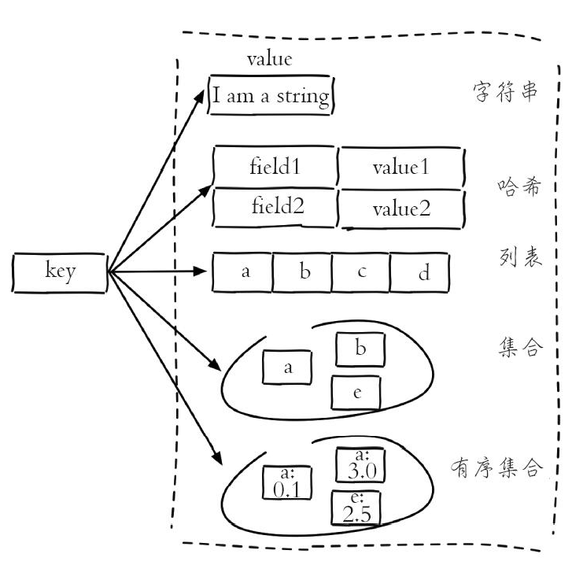
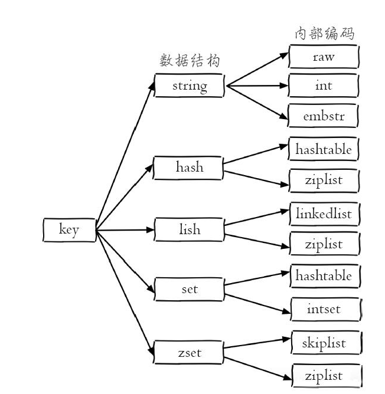

type命令实际返回的就是当前键的数据结构类型，它们分别是：string（字符串）、hash（哈希）、list（列表）、set（集合）、zset（有序集合），但这些只是Redis对外的数据结构。

实际上每种数据结构都有自己底层的内部编码实现，而且是多种实现，这样Redis会在合适的场景选择合适的内部编码。

参考：
《Redis开发与运维》 付磊　张益军 机械工业出版社

## Redis的pipeline机制有了解过？

### 概念

Pipeline（流水线）能将一组Redis命令进行组装，通过一次RTT传输给Redis，再将这组Redis命令的执行结果按顺序返回给客户端。

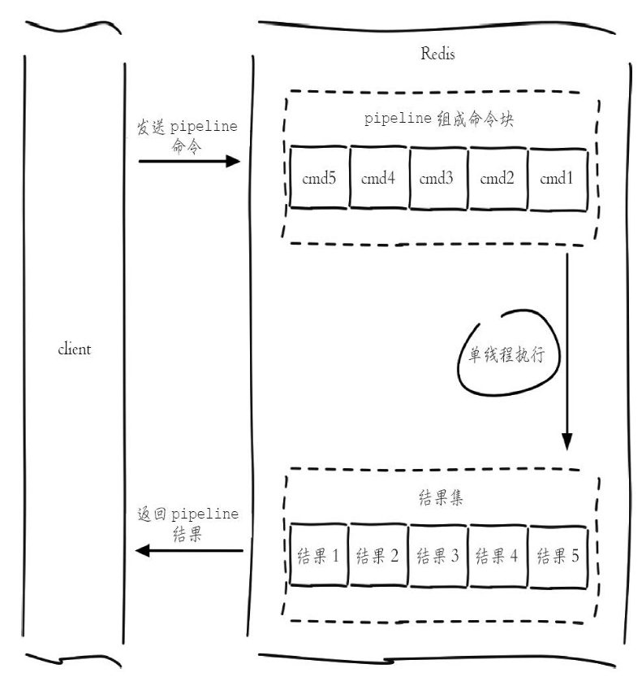

```
public void mdel(List<String> keys) {
    Jedis jedis = new Jedis("127.0.0.1");
    // 1)生成pipeline对象
    Pipeline pipeline = jedis.pipelined();
    // 2)pipeline执行命令，注意此时命令并未真正执行
    for (String key : keys) {
        pipeline.del(key);
    }
    // 3)执行命令
    pipeline.sync();
}
```

### 原生批量命令与Pipeline对比

可以使用Pipeline模拟出批量操作的效果，但是在使用时要注意它与原生批量命令的区别，具体包含以下几点：

- 原生批量命令是原子的，Pipeline是非原子的。

- 原生批量命令是一个命令对应多个key，Pipeline支持多个命令。

- 原生批量命令是Redis服务端支持实现的，而Pipeline需要服务端和客户端的共同实现。

### 集群pipeline

- 串行IO

```
Map<String, String> serialIOMget(List<String> keys) {
    // 结果集
    Map<String, String> keyValueMap = new HashMap<String, String>();
    // 属于各个节点的key列表,JedisPool要提供基于ip和port的hashcode方法
    Map<JedisPool, List<String>> nodeKeyListMap = new HashMap<JedisPool, List<String>>();
    // 遍历所有的key
    for (String key : keys) {
        // 使用CRC16本地计算每个key的slot
        int slot = JedisClusterCRC16.getSlot(key);
        // 通过jedisCluster本地slot->node映射获取slot对应的node
        JedisPool jedisPool = jedisCluster.getConnectionHandler().getJedisPoolFrom
            Slot(slot);
        // 归档
        if (nodeKeyListMap.containsKey(jedisPool)) {
            nodeKeyListMap.get(jedisPool).add(key);
        } else {
            List<String> list = new ArrayList<String>();
            list.add(key);
            nodeKeyListMap.put(jedisPool, list);
        }
    }
    // 从每个节点上批量获取，这里使用mget也可以使用pipeline
    for (Entry<JedisPool, List<String>> entry : nodeKeyListMap.entrySet()) {
        JedisPool jedisPool = entry.getKey();
       List<String> nodeKeyList = entry.getValue();
        // 列表变为数组
        String[] nodeKeyArray = nodeKeyList.toArray(new String[nodeKeyList.size()]);
        // 批量获取，可以使用mget或者Pipeline
        List<String> nodeValueList = jedisPool.getResource().mget(nodeKeyArray);
        // 归档
        for (int i = 0; i < nodeKeyList.size(); i++) {
            keyValueMap.put(nodeKeyList.get(i), nodeValueList.get(i));
        }
    }
    return keyValueMap;
}
```

- 并行IO

```
Map<String, String> parallelIOMget(List<String> keys) {
    // 结果集
    Map<String, String> keyValueMap = new HashMap<String, String>();
    // 属于各个节点的key列表
    Map<JedisPool, List<String>> nodeKeyListMap = new HashMap<JedisPool, List<String>>();
    ...和前面一样
    // 多线程mget，最终汇总结果，也可pipeline
    for (Entry<JedisPool, List<String>> entry : nodeKeyListMap.entrySet()) {
        // 多线程实现
    }
    return keyValueMap;
}
```

- hash_tag

将多个key强制分配到一个节点上，它的操作时间=1次网络时间+n次命令时间，这里换成pipeline即可

```
List<String> hashTagMget(String[] hashTagKeys) {
    return jedisCluster.mget(hashTagKeys);
}
```

参考：
《Redis开发与运维》 付磊　张益军 机械工业出版社

## 事务

为了保证多条命令组合的原子性，Redis提供了简单的事务功能以及集成Lua脚本来解决这个问题。

### Redis的事务怎么实现？有什么缺点？

- 事务实现

Redis提供了简单的事务功能，将一组需要一起执行的命令放到multi和exec两个命令之间。multi命令代表事务开始，exec命令代表事务结束，它们之间的命令是原子顺序执行的

```
127.0.0.1:6379> multi
OK
127.0.0.1:6379> sadd user:a:follow user:b
QUEUED
127.0.0.1:6379> sadd user:b:fans user:a
QUEUED
```

可以看到sadd命令此时的返回结果是QUEUED，代表命令并没有真正执行，而是暂时保存在Redis中。如果此时另一个客户端执行sismember user：a：follow user：b返回结果应该为0。

```
127.0.0.1:6379> sismember user:a:follow user:b
(integer) 0
```

只有当exec执行后，用户A关注用户B的行为才算完成，如下所示返回的两个结果对应sadd命令。

```
127.0.0.1:6379> exec
1) (integer) 1
2) (integer) 1
127.0.0.1:6379> sismember user:a:follow user:b
(integer) 1
```

如果要停止事务的执行，可以使用discard命令代替exec命令即可。

命令语法错误将导致事务无法执行；非语法错误将正常执行

watch命令可以提供类似乐观锁的功能，会在exec执行前观察watch 的 key是否发生变化，如果变化则不会执行事务

- 缺点

不支持事务中的回滚特性，同时无法实现命令之间的逻辑关系计算

### Redis结合lua有什么作用？Eval和evalsha的区别？

#### Redis结合lua有什么作用

Lua脚本在Redis中是原子执行的，执行过程中间不会插入其他命令，实现事务功能。

Lua脚本可以帮助开发和运维人员创造出自己定制的命令，并可以将这些命令常驻在Redis内存中，实现复用的效果。

Lua脚本可以将多条命令一次性打包，有效地减少网络开销。

#### Eval和evalsha的区别

- eval

```
eval 脚本内容 key个数 key列表 参数列表
```

```
127.0.0.1:6379> eval 'return "hello " .. KEYS[1] .. ARGV[1]' 1 redis world
"hello redisworld"
```

如果Lua脚本较长，还可以使用redis-cli--eval直接执行文件。eval命令和--eval参数本质是一样的，客户端如果想执行Lua脚本，首先在客户端编写好Lua脚本代码，然后把脚本作为字符串发送给服务端，服务端会将执行结果返回给客户端

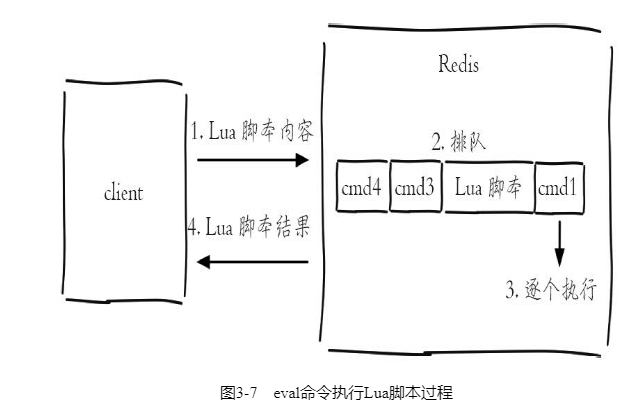

- evalsha

除了使用eval，Redis还提供了evalsha命令来执行Lua脚本。首先要将Lua脚本加载到Redis服务端，得到该脚本的SHA1校验和，evalsha命令使用SHA1作为参数可以直接执行对应Lua脚本，避免每次发送Lua脚本的开销。这样客户端就不需要每次执行脚本内容，而脚本也会常驻在服务端，脚本功能得到了复用

加载脚本：script load命令可以将脚本内容加载到Redis内存中，例如下面将lua_get.lua加载到Redis中，得到SHA1为："7413dc2440db1fea7c0a0bde841fa68eefaf149c"

```
# redis-cli script load "$(cat lua_get.lua)"
"7413dc2440db1fea7c0a0bde841fa68eefaf149c"
```

执行脚本：evalsha的使用方法如下，参数使用SHA1值，执行逻辑和eval一致。

```
evalsha 脚本SHA1值 key个数 key列表 参数列表
```

所以只需要执行如下操作，就可以调用lua_get.lua脚本：

```
127.0.0.1:6379> evalsha 7413dc2440db1fea7c0a0bde841fa68eefaf149c 1 redis world
"hello redisworld"
```

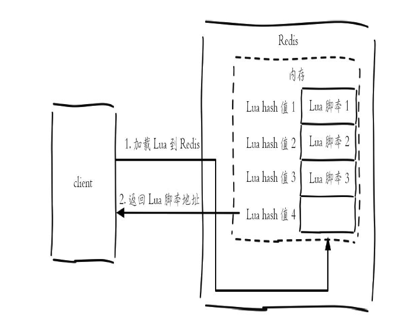

参考：
《Redis开发与运维》 付磊　张益军 机械工业出版社

## hyperloglog

HyperLogLog并不是一种新的数据结构（实际类型为字符串类型），而是一种基数算法，通过HyperLogLog可以利用极小的内存空间完成独立总数的统计，数据集可以是IP、Email、ID等。

HyperLogLog提供了3个命令：pfadd、pfcount、pfmerge

- 添加

pfadd key element [element …]

- 计算独立用户数

pfcount key [key …]

- 合并

pfmerge destkey sourcekey [sourcekey ...]

HyperLogLog内存占用量非常小，但是存在错误率，开发者在进行数据结构选型时只需要确认如下两条即可：

- 只为了计算独立总数，不需要获取单条数据。

- 可以容忍一定误差率，毕竟HyperLogLog在内存的占用量上有很大的优势。

参考：
《Redis开发与运维》 付磊　张益军 机械工业出版社

## 持久化

### RDB

#### 触发机制

RDB持久化是把当前进程数据生成快照保存到硬盘的过程，触发RDB持久化过程分为手动触发和自动触发。

手动触发分别对应save和bgsave命令。save命令已经废弃。bgsave命令使Redis进程执行fork操作创建子进程，RDB持久化过程由子进程负责，完成后自动结束，阻塞只发生在fork阶段，一般时间很短。

除了执行命令手动触发之外，Redis内部还存在自动触发RDB的持久化机制，例如以下场景：
- 使用save相关配置，如“save m n”。表示m秒内数据集存在n次修改时，自动触发bgsave。
- 如果从节点执行全量复制操作，主节点自动执行bgsave生成RDB文件并发送给从节点，更多细节见6.3节介绍的复制原理。
- 默认情况下执行shutdown命令时，如果没有开启AOF持久化功能则自动执行bgsave。

#### RDB优缺点

RDB的优点：

- RDB是一个紧凑压缩的二进制文件，代表Redis在某个时间点上的数据快照。非常适用于备份，全量复制等场景。
- Redis加载RDB恢复数据远远快于AOF的方式。

RDB的缺点：
- RDB方式数据没办法做到实时持久化/秒级持久化。因为bgsave每次运行都要执行fork操作创建子进程，属于重量级操作，频繁执行成本过高。
- Redis版本演进过程中有多个格式的RDB版本，存在老版本Redis服务无法兼容新版RDB格式的问题。

针对RDB不适合实时持久化的问题，Redis提供了AOF持久化方式来解决。

### AOF

AOF（append only file）持久化：以独立日志的方式记录每次写命令，重启时再重新执行AOF文件中的命令达到恢复数据的目的。AOF的主要作用是解决了数据持久化的实时性，目前已经是Redis持久化的主流方式。开启AOF功能需要设置配置：appendonly yes，默认不开启。

#### AOF的工作流程如下

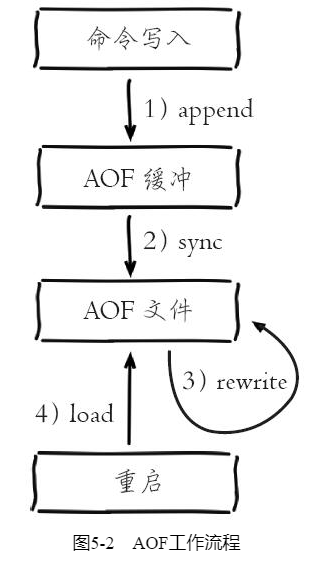

1. 所有的写入命令会追加到aof_buf（缓冲区）中。
2. AOF缓冲区根据对应的策略向硬盘做同步操作。
3. 随着AOF文件越来越大，需要定期对AOF文件进行重写，达到压缩的目的。
4. 当Redis服务器重启时，可以加载AOF文件进行数据恢复。

####  AOF为什么把命令追加到aof_buf中？

Redis使用单线程响应命令，如果每次写AOF文件命令都直接追加到硬盘，那么性能完全取决于当前硬盘负载。先写入缓冲区aof_buf中，还有另一个好处，Redis可以提供多种缓冲区同步硬盘的策略，在性能和安全性方面做出平衡。

####  Redis提供了多种AOF缓冲区同步文件策略，由参数appendfsync控制

配置为always时，每次写入都要同步AOF文件，在一般的SATA硬盘上，Redis只能支持大约几百TPS写入，显然跟Redis高性能特性背道而驰，不建议配置。

配置为no，由于操作系统每次同步AOF文件的周期不可控，而且会加大每次同步硬盘的数据量，虽然提升了性能，但数据安全性无法保证。

配置为everysec，是建议的同步策略，也是默认配置，做到兼顾性能和数据安全性。理论上只有在系统突然宕机的情况下丢失1秒的数据。

####  重写机制

随着命令不断写入AOF，文件会越来越大，为了解决这个问题，Redis引入AOF重写机制压缩文件体积。AOF文件重写是把Redis进程内的数据转化为写命令同步到新AOF文件的过程。

重写后的AOF文件为什么可以变小？有如下原因：
- 进程内已经超时的数据不再写入文件。
- 旧的AOF文件含有无效命令，如del key1、hdel key2、srem keys、set a111、set a222等。重写使用进程内数据直接生成，这样新的AOF文件只保留最终数据的写入命令。
- 多条写命令可以合并为一个，如：lpush list a、lpush list b、lpush list c可以转化为：lpush list a b c。为了防止单条命令过大造成客户端缓冲区溢出，对于list、set、hash、zset等类型操作，以64个元素为界拆分为多条。

AOF重写降低了文件占用空间，除此之外，另一个目的是：更小的AOF文件可以更快地被Redis加载。

AOF重写过程可以手动触发和自动触发：
- 手动触发：直接调用bgrewriteaof命令。
- 自动触发：根据auto-aof-rewrite-min-size和auto-aof-rewrite-percentage参数确定自动触发时机。auto-aof-rewrite-min-size：表示运行AOF重写时文件最小体积，默认为64MB。auto-aof-rewrite-percentage：代表当前AOF文件空间（aof_current_size）和上一次重写后AOF文件空间（aof_base_size）的比值。自动触发时机=aof_current_size>auto-aof-rewrite-min-size&&（aof_current_size-aof_base_size）/aof_base_size>=auto-aof-rewrite-percentage。其中aof_current_size和aof_base_size可以在info Persistence统计信息中查看。

#### 重启加载

总体看来优先加载AOF文件，其次加载RDB文件。

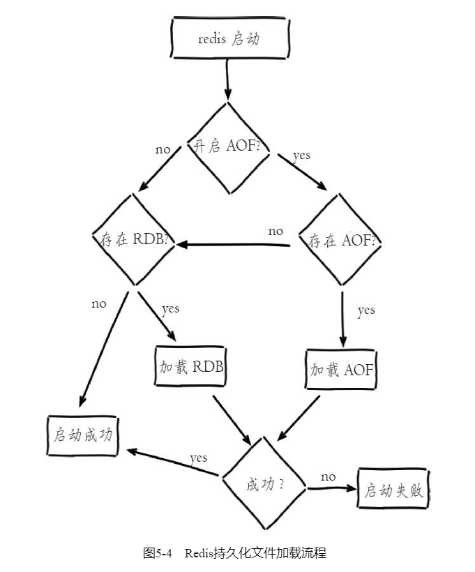

参考：
《Redis开发与运维》 付磊　张益军 机械工业出版社

## Redis的主备同步流程？

在从节点执行slaveof命令后，复制过程便开始运作。从图中可以看出复制过程大致分为6个过程：

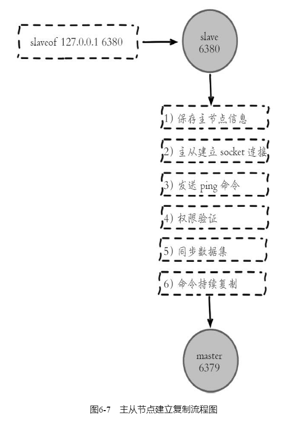

### 同步数据集

Redis在2.8及以上版本使用psync命令完成主从数据同步，同步过程分为：全量复制和部分复制。

- 全量复制：一般用于初次复制场景，Redis早期支持的复制功能只有全量复制，它会把主节点全部数据一次性发送给从节点，当数据量较大时，会对主从节点和网络造成很大的开销。

- 部分复制：用于处理在主从复制中因网络闪断等原因造成的数据丢失场景，当从节点再次连上主节点后，如果条件允许，主节点会补发丢失数据给从节点。因为补发的数据远远小于全量数据，可以有效避免全量复制的过高开销。

从节点使用psync命令完成部分复制和全量复制功能，命令格式：psync{runId}{offset}，参数含义如下：

- runId：从节点所复制主节点的运行id。

- offset：当前从节点已复制的数据偏移量。

流程说明：

1）从节点（slave）发送psync命令给主节点，参数runId是当前从节点保存的主节点运行ID，如果没有则默认值为，参数offset是当前从节点保存的复制偏移量，如果是第一次参与复制则默认值为-1。

2）主节点（master）根据psync参数和自身数据情况决定响应结果：

- 如果回复+FULLRESYNC{runId}{offset}，那么从节点将触发全量复制流程。

- 如果回复+CONTINUE，从节点将触发部分复制流程。

- 如果回复+ERR，说明主节点版本低于Redis2.8，无法识别psync命令，从节点将发送旧版的sync命令触发全量复制流程。

#### 全量复制

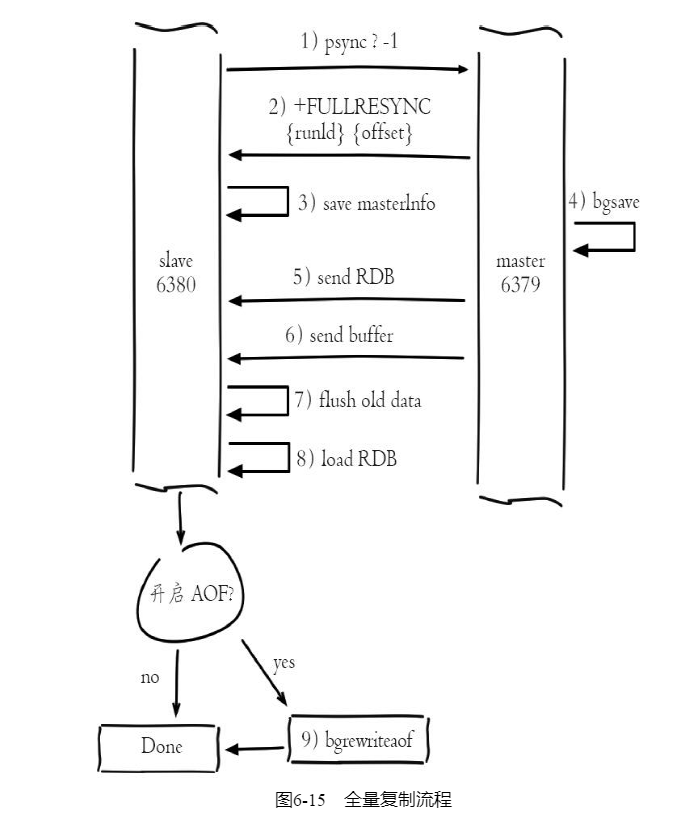

#### 部分复制

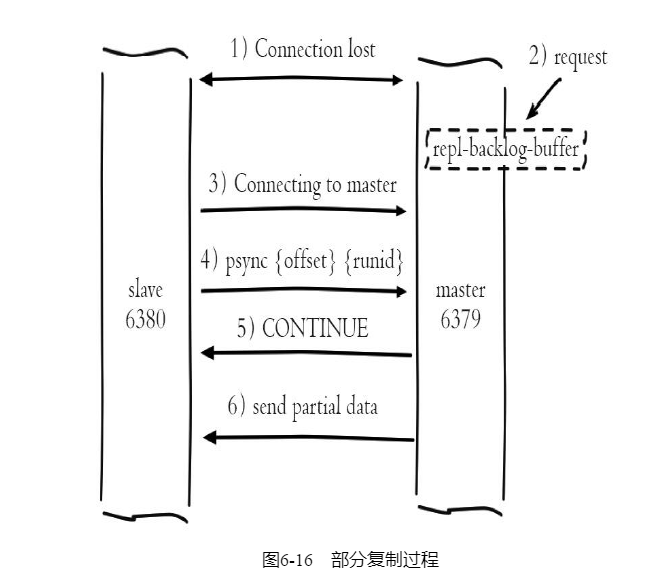

其中2）主从连接中断期间主节点依然响应命令，但因复制连接中断命令无法发送给从节点，不过主节点内部存在的复制积压缓冲区，依然可以保存最近一段时间的写命令数据，默认最大缓存1MB

### 异步复制

主节点不但负责数据读写，还负责把写命令同步给从节点。写命令的发送过程是异步完成，也就是说主节点自身处理完写命令后直接返回给客户端，并不等待从节点复制完成。正常情况下，延迟在1秒以内。

参考：
《Redis开发与运维》 付磊　张益军 机械工业出版社


## Redis有几种部署模式？重点讲下集群和哨兵机制的实现？

部署形式分为：单机、复制、哨兵、集群。

主从复制也带来了以下问题：

- 一旦主节点出现故障，需要手动将一个从节点晋升为主节点，同时需要修改应用方的主节点地址，还需要命令其他从节点去复制新的主节点，整个过程都需要人工干预。

- 主节点的写能力受到单机的限制。

- 主节点的存储能力受到单机的限制。

其中第一个问题就是Redis的高可用问题，可以基于哨兵模式解决。第二、三个问题属于Redis的分布式问题，可以基于集群模式解决。

### 哨兵

Redis Sentinel是一个分布式架构，其中包含若干个Sentinel节点和Redis数据节点，每个Sentinel节点会对数据节点和其余Sentinel节点进行监控，当它发现节点不可达时，会对节点做下线标识。如果被标识的是主节点，它还会和其他Sentinel节点进行“协商”，当大多数Sentinel节点都认为主节点不可达时，它们会选举出一个Sentinel节点来完成自动故障转移的工作，同时会将这个变化实时通知给Redis应用方。整个过程完全是自动的，不需要人工来介入，所以这套方案很有效地解决了Redis的高可用问题。Redis Sentinel与Redis主从复制模式只是多了若干Sentinel节点，所以Redis Sentinel并没有针对Redis节点做了特殊处理。

Redis Sentinel具有以下几个功能：
- 监控：Sentinel节点会定期检测Redis数据节点、其余Sentinel节点是否可达。
- 通知：Sentinel节点会将故障转移的结果通知给应用方。
- 主节点故障转移：实现从节点晋升为主节点并维护后续正确的主从关系。
- 配置提供者：在Redis Sentinel结构中，客户端在初始化的时候连接的是Sentinel节点集合，从中获取主节点信息。

同时看到，Redis Sentinel包含了若个Sentinel节点，这样做也带来了两个好处：
- 对于节点的故障判断是由多个Sentinel节点共同完成，这样可以有效地防止误判。
- Sentinel节点集合是由若干个Sentinel节点组成的，这样即使个别Sentinel节点不可用，整个Sentinel节点集合依然是健壮的。

但是Sentinel节点本身就是独立的Redis节点，只不过它们有一些特殊，它们不存储数据，只支持部分命令。

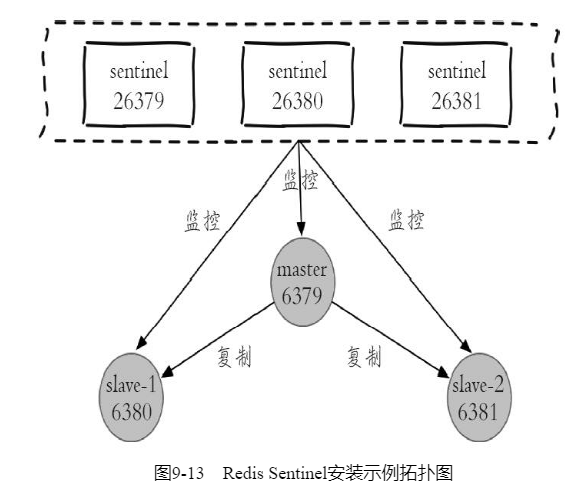

#### 部署Sentinel节点

1.配置Sentinel节点

```
redis-sentinel-26379.conf
port 26379  
daemonize yes  
logfile "26379.log"  
dir /opt/soft/redis/data  
sentinel monitor mymaster 127.0.0.1 6379 2  
sentinel down-after-milliseconds mymaster 30000  
sentinel parallel-syncs mymaster 1  
sentinel failover-timeout mymaster 180000  
```

1）Sentinel节点的默认端口是26379。

2）sentinel monitor mymaster127.0.0.1 6379 2配置代表sentinel-1节点需要监控127.0.0.1：6379这个主节点，2代表判断主节点失败至少需要2个Sentinel节点同意，mymaster是主节点的别名。

2.启动Sentinel节点

Sentinel节点的启动方法有两种：

方法一，使用redis-sentinel命令：

```
redis-sentinel redis-sentinel-26379.conf
```

方法二，使用redis-server命令加--sentinel参数：

```
redis-server redis-sentinel-26379.conf --sentinel
```

两种方法本质上是一样的。

3.确认

Sentinel节点本质上是一个特殊的Redis节点。这里只需要了解Sentinel节点能够彼此感知到对方，同时能够感知到Redis数据节点就可以了

#### Java操作Redis Sentinel

Jedis给出很多构造方法，其中最全的如下所示：

```
public JedisSentinelPool(String masterName, Set<String> sentinels,
    final GenericObjectPoolConfig poolConfig, final int connectionTimeout, 
    final int soTimeout,
    final String password, final int database, 
    final String clientName)
```

具体参数含义如下：
·masterName——主节点名。
·sentinels——Sentinel节点集合。
·poolConfig——common-pool连接池配置。
·connectTimeout——连接超时。
·soTimeout——读写超时。
·password——主节点密码。
·database——当前数据库索引。
·clientName——客户端名。

例如要想通过简单的几个参数获取JedisSentinelPool，可以直接按照下面方式进行JedisSentinelPool的初始化。

```
JedisSentinelPool jedisSentinelPool = new JedisSentinelPool(masterName, 
    sentinelSet, poolConfig, timeout);
```

此时timeout既代表连接超时又代表读写超时，password为空，database默认使用0，clientName为空。具体可以参考JedisSentinelPool源码。

和JedisPool非常类似，我们在使用JedisSentinelPool时也要尽可能按照common-pool的标准模式进行代码的书写，和JedisPool的推荐使用方法是一样的。

```
Jedis jedis = null;
try {
    jedis = jedisSentinelPool.getResource();
    // jedis command
} catch (Exception e) {
    logger.error(e.getMessage(), e);
} finally {
    if (jedis != null)
        jedis.close();
}
```

jedis.close（）并不是关闭Jedis连接，而是归还连接资源。
JedisSentinelPool和JedisPool一样，尽可能全局只有一个。

### 集群

Redis Cluster是Redis的分布式解决方案，在3.0版本正式推出，有效地解决了Redis分布式方面的需求。当遇到单机内存、并发、流量等瓶颈时，可以采用Cluster架构方案达到负载均衡的目的。

#### 数据分布

常见的数据分区规则有哈希分区和顺序分区两种。Redis Cluster采用哈希分区中的虚拟槽分区方案。虚拟槽分区巧妙地使用了哈希空间，使用分散度良好的哈希函数把所有数据映射到一个固定范围的整数集合中，整数定义为槽（slot）。这个范围一般远远大于节点数，比如Redis Cluster槽范围是0~16383。槽是集群内数据管理和迁移的基本单位。采用大范围槽的主要目的是为了方便数据拆分和集群扩展。
Redis Cluster所有的键根据哈希函数映射到0~16383整数槽内，计算公式：slot=CRC16（key）&16383。每一个节点负责维护一部分槽以及槽所映射的键值数据。

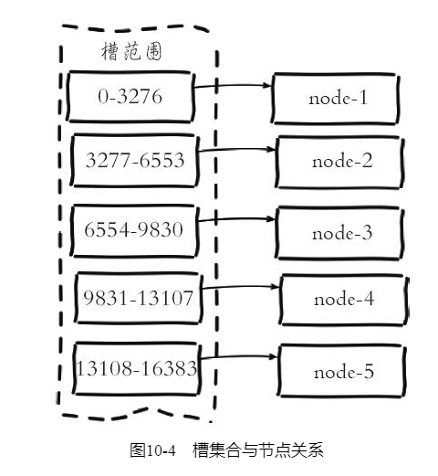


Redis虚拟槽分区的特点：
- 解耦数据和节点之间的关系，简化了节点扩容和收缩难度。
- 节点自身维护槽的映射关系，不需要客户端或者代理服务维护槽分区元数据。
- 支持节点、槽、键之间的映射查询，用于数据路由、在线伸缩等场景。

Redis集群相对单机在功能上存在一些限制，需要开发人员提前了解，在使用时做好规避。限制如下：
- key批量操作支持有限。如mset、mget，目前只支持具有相同slot值的key执行批量操作。
- key事务操作支持有限。同理只支持多key在同一节点上的事务操作，当多个key分布在不同的节点上时无法使用事务功能。
- 不支持多数据库空间。单机下的Redis可以支持16个数据库，集群模式下只能使用一个数据库空间，即db0。
- 复制结构只支持一层，从节点只能复制主节点，不支持嵌套树状复制结构。

#### 搭建集群

搭建集群工作需要以下三个步骤：
- 准备节点。（起多个节点）
- 节点握手。（节点直接通过meet相互建立联系。Gossip协议互相通信）
- 分配槽。（将槽分别给各个节点）

#### 请求路由

Redis集群对客户端通信协议做了比较大的修改，为了追求性能最大化，并没有采用代理的方式而是采用客户端直连节点的方式。

##### 请求重定向

在集群模式下，Redis接收任何键相关命令时首先计算键对应的槽，再根据槽找出所对应的节点，如果节点是自身，则处理键命令；否则回复MOVED重定向错误，通知客户端请求正确的节点。这个过程称为MOVED重定向。

执行以下命令，由于键对应槽是9252，不属于6379节点，则回复MOVED{slot}{ip}{port}格式重定向信息：

```
127.0.0.1:6379> set key:test:2 value-2
(error) MOVED 9252 127.0.0.1:6380
127.0.0.1:6379> cluster keyslot key:test:2
(integer) 9252
```

重定向信息包含了键所对应的槽以及负责该槽的节点地址，根据这些信息客户端就可以向正确的节点发起请求。

使用redis-cli命令时，可以加入-c参数支持自动重定向，简化手动发起重定向操作，如下所示：

```
#redis-cli -p 6379 -c
127.0.0.1:6379> set key:test:2 value-2
-> Redirected to slot [9252] located at 127.0.0.1:6380
OK
```

redis-cli自动帮我们连接到正确的节点执行命令，这个过程是在redis-cli内部维护，实质上是client端接到MOVED信息之后再次发起请求，并不在Redis节点中完成请求转发。但是它的弊端很明显，每次执行键命令前都要到Redis上进行重定向才能找到要执行命令的节点，额外增加了IO开销，这不是Redis集群高效的使用方式。正因为如此通常集群客户端都采用另一种实现：Smart（智能）客户端。

##### smart客户端

###### smart客户端原理

Smart客户端通过在内部维护slot→node的映射关系，本地就可实现键到节点的查找，从而保证IO效率的最大化，而MOVED重定向负责协助Smart客户端更新slot→node映射。以Java的Jedis为例，说明Smart客户端操作集群的流程。

1）首先在JedisCluster初始化时会选择一个运行节点，初始化槽和节点映射关系，使用cluster slots命令完成，如下所示：

```
127.0.0.1:6379> cluster slots
1) 1) (integer) 0 // 开始槽范围
   2) (integer) 1365 // 结束槽范围
   3) 1) "127.0.0.1" // 主节点ip
      2) (integer) 6385 // 主节点地址
   4) 1) "127.0.0.1" // 从节点ip
      2) (integer) 6386 // 从节点端口
2) 1) (integer) 5462
   2) (integer) 6826
   3) 1) "127.0.0.1"
      2) (integer) 6385
   4) 1) "127.0.0.1"
      2) (integer) 6386
...
```

2）JedisCluster解析cluster slots结果缓存在本地，并为每个节点创建唯一的JedisPool连接池。映射关系在JedisClusterInfoCache类中，如下所示：

```
public class JedisClusterInfoCache {
    private Map<String, JedisPool> nodes = new HashMap<String, JedisPool>();
    private Map<Integer, JedisPool> slots = new HashMap<Integer, JedisPool>();
    ...
}
```

3）JedisCluster执行键命令，异常重试，slot同步

###### JedisCluster的定义

Jedis为Redis Cluster提供了Smart客户端，对应的类是JedisCluster，它的初始化方法如下：

```
public JedisCluster(Set<HostAndPort> jedisClusterNode, int connectionTimeout, int 
    soTimeout, int maxAttempts, final GenericObjectPoolConfig poolConfig) {
    ...
}
```

其中包含了5个参数：
* Set<HostAndPort>jedisClusterNode：所有Redis Cluster节点信息（也可以是一部分，因为客户端可以通过cluster slots自动发现）。
* int connectionTimeout：连接超时。
* int soTimeout：读写超时。
* int maxAttempts：重试次数。
* GenericObjectPoolConfig poolConfig：连接池参数，JedisCluster会为Redis Cluster的每个节点创建连接池。

例如下面代码展示了一次JedisCluster的初始化过程。

```
// 初始化所有节点(例如6个节点)
Set<HostAndPort> jedisClusterNode = new HashSet<HostAndPort>();
jedisClusterNode.add(new HostAndPort("10.10.xx.1", 6379));
jedisClusterNode.add(new HostAndPort("10.10.xx.2", 6379));
jedisClusterNode.add(new HostAndPort("10.10.xx.3", 6379));
jedisClusterNode.add(new HostAndPort("10.10.xx.4", 6379));
jedisClusterNode.add(new HostAndPort("10.10.xx.5", 6379));
jedisClusterNode.add(new HostAndPort("10.10.xx.6", 6379));
// 初始化commnon-pool连接池，并设置相关参数
GenericObjectPoolConfig poolConfig = new GenericObjectPoolConfig();
// 初始化JedisCluster
JedisCluster jedisCluster = new JedisCluster(jedisClusterNode, 1000, 1000, 5, poolConfig);
```

JedisCluster可以实现命令的调用，如下所示。

```
jedisCluster.set("hello", "world");
jedisCluster.get("key");
```

对于JedisCluster的使用需要注意以下几点：
* JedisCluster包含了所有节点的连接池（JedisPool），所以建议JedisCluster使用单例。
* JedisCluster每次操作完成后，不需要管理连接池的借还，它在内部已经完成。
* JedisCluster一般不要执行close（）操作，它会将所有JedisPool执行destroy操作。


###### 多节点命令和操作

Redis Cluster虽然提供了分布式的特性，但是有些命令或者操作，诸如keys、flushall、删除指定模式的键，需要遍历所有节点才可以完成。下面代码实现了从Redis Cluster删除指定模式键的功能：

```
// 从RedisCluster批量删除指定pattern的数据
public void delRedisClusterByPattern(JedisCluster jedisCluster, String pattern, 
    int scanCounter) {
    // 获取所有节点的JedisPool
    Map<String, JedisPool> jedisPoolMap = jedisCluster.getClusterNodes();
    for (Entry<String, JedisPool> entry : jedisPoolMap.entrySet()) {
        // 获取每个节点的Jedis连接
        Jedis jedis = entry.getValue().getResource();
        // 只删除主节点数据
        if (!isMaster(jedis)) {
            continue;
        }
        // 使用Pipeline每次删除指定前缀的数据
        Pipeline pipeline = jedis.pipelined();
        // 使用scan扫描指定前缀的数据
        String cursor = "0";
        // 指定扫描参数：每次扫描个数和pattern
        ScanParams params = new ScanParams().count(scanCounter).match(pattern);
        while (true) {
            // 执行扫描
            ScanResult<String> scanResult = jedis.scan(cursor, params);
            // 删除的key列表
            List<String> keyList = scanResult.getResult();
            if (keyList != null && keyList.size() > 0) {
                for (String key : keyList) {
                    pipeline.del(key);
                }
                // 批量删除
                pipeline.syncAndReturnAll();
            }
            cursor = scanResult.getStringCursor();
            // 如果游标变为0，说明扫描完毕
            if ("0".equals(cursor)) {
                break;
            }
        }
    }
}
// 判断当前Redis是否为master节点
private boolean isMaster(Jedis jedis) {
    String[] data = jedis.info("Replication").split("\r\n");
    for (String line : data) {
        if ("role:master".equals(line.trim())) {
            return true;
        }
    }
    return false;
}
```

具体分为如下几个步骤：

1）通过jedisCluster.getClusterNodes（）获取所有节点的连接池。

2）使用info replication筛选1）中的主节点。

3）遍历主节点，使用scan命令找到指定模式的key，使用Pipeline机制删除。

例如下面操作每次遍历1000个key，将Redis Cluster中以user开头的key全部删除。

```
String pattern = "user*";
int scanCounter = 1000;
delRedisClusterByPattern(jedisCluster, pattern, scanCounter);
```

所以对于keys、flushall等需要遍历所有节点的命令，同样可以参照上面的方法进行相应功能的实现。

（3）批量操作的方法

Redis Cluster中，由于key分布到各个节点上，会造成无法实现mget、mset等功能。但是可以利用CRC16算法计算出key对应的slot，以及Smart客户端保存了slot和节点对应关系的特性，将属于同一个Redis节点的key进行归档，然后分别对每个节点对应的子key列表执行mget或者pipeline操作，具体使用方法可以参见***Redis的pipeline机制有了解过***小结，关联无底洞优化。

（4）使用Lua、事务等特性的方法

Lua和事务需要所操作的key，必须在一个节点上，不过Redis Cluster提供了hashtag，如果开发人员确实要使用Lua或者事务，可以将所要操作的key使用一个hashtag，如下所示：

```
// hashtag
String hastag = "{user}";
// 用户A的关注表
String userAFollowKey = hastag + ":a:follow";
// 用户B的粉丝表
String userBFanKey = hastag + ":b:fans";
// 计算hashtag对应的slot
int slot = JedisClusterCRC16.getSlot(hastag);
// 获取指定slot的JedisPool
JedisPool jedisPool = jedisCluster.getConnectionHandler().getJedisPoolFromSlot(slot);
// 在当个节点上执行事务
Jedis jedis = null;
try {
    jedis = jedisPool.getResource();
    // 用户A的关注表加入用户B，用户B的粉丝列表加入用户A
    Transaction transaction = jedis.multi();
    transaction.sadd(userAFollowKey, "user:b");
    transaction.sadd(userBFanKey, "user:a");
    transaction.exec();
} catch (Exception e) {
    logger.error(e.getMessage(), e);
} finally {
    if (jedis!= null)
        jedis.close();
}
```

具体步骤如下：
1）将事务中所有的key添加hashtag。
2）使用CRC16计算hashtag对应的slot。
3）获取指定slot对应的节点连接池JedisPool。
4）在JedisPool上执行事务。

##### ASK重定向

Redis集群支持在线迁移槽（slot）和数据来完成水平伸缩，当slot对应的数据从源节点到目标节点迁移过程中，客户端需要做到智能识别，保证键命令可正常执行。
集群环境下对于使用批量操作的场景，建议优先使用Pipeline方式，在客户端实现对ASK重定向的正确处理，这样既可以受益于批量操作的IO优化，又可以兼容slot迁移场景。

```
@Test
public void pipelineOnAskTestV2() {
    JedisSlotBasedConnectionHandler connectionHandler = new JedisCluster(new Host
        AndPort("127.0.0.1", 6379)) {
        public JedisSlotBasedConnectionHandler getConnectionHandler() {
            return (JedisSlotBasedConnectionHandler) super.connectionHandler;
        }
    }.getConnectionHandler();
    List<String> keys = Arrays.asList("key:test:68253", "key:test:79212", "key:
        test:5028");
    Jedis jedis = connectionHandler.getConnectionFromSlot(JedisClusterCRC16.get
        Slot(keys.get(2)));
    try {
        Pipeline pipelined = jedis.pipelined();
        for (String key : keys) {
            pipelined.get(key);
        }
        List<Object> results = pipelined.syncAndReturnAll();
        for (int i = 0; i < keys.size(); i++) {
            // 键顺序和结果顺序一致
            Object result = results.get(i);
            if (result != null && result instanceof JedisAskDataException) {
                JedisAskDataException askException = (JedisAskDataException) result;
                HostAndPort targetNode = askException.getTargetNode();
                Jedis targetJedis = connectionHandler.getConnectionFromNode(tar
                    getNode);
                try {
                    // 执行asking
                    targetJedis.asking();
                    // 获取key并执行
                    String key = keys.get(i);
                    String targetResult = targetJedis.get(key);
                    System.out.println(targetResult);
                } finally {
                    targetJedis.close();
                }
            } else {
                System.out.println(result);
            }
        }
    } finally {
        jedis.close();
    }
}
```

#### 故障转移

故障发现也是通过消息传播机制实现的，主要环节包括：主观下线（pfail）和客观下线（fail）。

·主观下线：指某个节点认为另一个节点不可用，即下线状态，这个状态并不是最终的故障判定，只能代表一个节点的意见，可能存在误判情况。

·客观下线：指标记一个节点真正的下线，集群内多个节点都认为该节点不可用，从而达成共识的结果。如果是持有槽的主节点故障，需要为该节点进行故障转移。

故障节点变为客观下线后，如果下线节点是持有槽的主节点则需要在它的从节点中选出一个替换它，从而保证集群的高可用。下线主节点的所有从节点承担故障恢复的义务，当从节点通过内部定时任务发现自身复制的主节点进入客观下线时，将会触发故障恢复流程

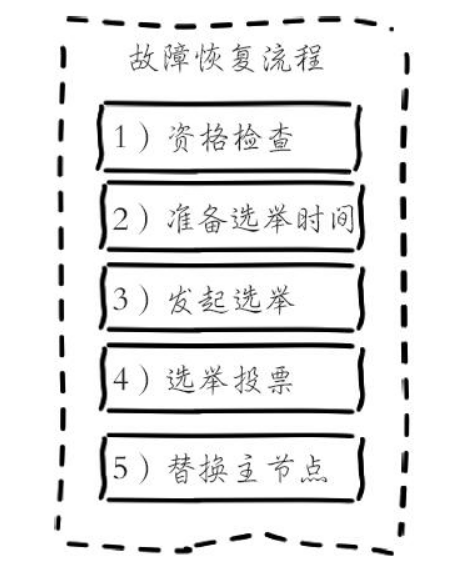

参考：
《Redis开发与运维》 付磊　张益军 机械工业出版社

## Redis的过期策略怎么实现的？Redis的淘汰策略是怎么实现的？

Redis使用maxmemory参数限制最大可用内存。限制内存的目的主要有：·用于缓存场景，当超出内存上限maxmemory时使用LRU等删除策略释放空间。·防止所用内存超过服务器物理内存。

Redis的内存回收机制主要体现在以下两个方面：·删除到达过期时间的键对象。·内存使用达到maxmemory上限时触发内存溢出控制策略。

### 删除过期键对象

Redis所有的键都可以设置过期属性，内部保存在过期字典中。由于进程内保存大量的键，维护每个键精准的过期删除机制会导致消耗大量的CPU，对于单线程的Redis来说成本过高，因此Redis采用惰性删除和定时任务删除机制实现过期键的内存回收。

- 惰性删除：惰性删除用于当客户端读取带有超时属性的键时，如果已经超过键设置的过期时间，会执行删除操作并返回空，这种策略是出于节省CPU成本考虑，不需要单独维护TTL链表来处理过期键的删除。但是单独用这种方式存在内存泄露的问题，当过期键一直没有访问将无法得到及时删除，从而导致内存不能及时释放。正因为如此，Redis还提供另一种定时任务删除机制作为惰性删除的补充。

- 定时任务删除：Redis内部维护一个定时任务，默认每秒运行10次（通过配置hz控制）。定时任务中删除过期键逻辑采用了自适应算法，根据键的过期比例、使用快慢两种速率模式回收键。

### 内存溢出控制策略

当Redis所用内存达到maxmemory上限时会触发相应的溢出控制策略。具体策略受maxmemory-policy参数控制，Redis支持6种策略，如下所示：
- noeviction：默认策略，不会删除任何数据，拒绝所有写入操作并返回客户端错误信息（error）OOM command not allowed when used memory，此时Redis只响应读操作。
- volatile-lru：根据LRU算法删除设置了超时属性（expire）的键，直到腾出足够空间为止。如果没有可删除的键对象，回退到noeviction策略。
- allkeys-lru：根据LRU算法删除键，不管数据有没有设置超时属性，直到腾出足够空间为止。
- allkeys-random：随机删除所有键，直到腾出足够空间为止。
- volatile-random：随机删除过期键，直到腾出足够空间为止。
- volatile-ttl：根据键值对象的ttl属性，删除最近将要过期数据。如果没有，回退到noeviction策略。

内存溢出控制策略可以采用config set maxmemory-policy{policy}动态配置。Redis支持丰富的内存溢出应对策略，可以根据实际需求灵活定制，比如当设置volatile-lru策略时，保证具有过期属性的键可以根据LRU剔除，而未设置超时的键可以永久保留。还可以采用allkeys-lru策略把Redis变为纯缓存服务器使用。当Redis因为内存溢出删除键时，可以通过执行info stats命令查看evicted_keys指标找出当前Redis服务器已剔除的键数量

参考：
《Redis开发与运维》 付磊　张益军 机械工业出版社

## 缓存击穿，缓存雪崩，热点key问题解决方案？

### 缓存击穿

缓存穿透是指查询一个根本不存在的数据，缓存层和存储层都不会命中，通常出于容错的考虑，如果从存储层查不到数据则不写入缓存层，整个过程分为如下3步：
1）缓存层不命中。
2）存储层不命中，不将空结果写回缓存。
3）返回空结果。

缓存穿透将导致不存在的数据每次请求都要到存储层去查询，失去了缓存保护后端存储的意义。

缓存穿透问题可能会使后端存储负载加大，由于很多后端存储不具备高并发性，甚至可能造成后端存储宕掉。

造成缓存穿透的基本原因有两个。第一，自身业务代码或者数据出现问题，第二，一些恶意攻击、爬虫等造成大量空命中。

**方案一：缓存空对象**

当第2步存储层不命中后，仍然将空对象保留到缓存层中，之后再访问这个数据将会从缓存中获取，这样就保护了后端数据源。

缓存空对象会有两个问题：第一，空值做了缓存，意味着缓存层中存了更多的键，需要更多的内存空间（如果是攻击，问题更严重），比较有效的方法是针对这类数据设置一个较短的过期时间，让其自动剔除。第二，缓存层和存储层的数据会有一段时间窗口的不一致，可能会对业务有一定影响。例如过期时间设置为5分钟，如果此时存储层添加了这个数据，那此段时间就会出现缓存层和存储层数据的不一致，此时可以利用消息系统或者其他方式清除掉缓存层中的空对象。

```
String get(String key) {
    // 从缓存中获取数据
    String cacheValue = cache.get(key);
    // 缓存为空
    if (StringUtils.isBlank(cacheValue)) {
        // 从存储中获取
        String storageValue = storage.get(key);
        cache.set(key, storageValue);
        // 如果存储数据为空，需要设置一个过期时间(300秒)
        if (storageValue == null) {
            cache.expire(key, 60 * 5);
        }
        return storageValue;
    } else {
        // 缓存非空
        return cacheValue;
    }
}
```

**方案二：布隆过滤器**

在访问缓存层和存储层之前，将存在的key用布隆过滤器提前保存起来，做第一层拦截。例如：一个推荐系统有4亿个用户id，每个小时算法工程师会根据每个用户之前历史行为计算出推荐数据放到存储层中，但是最新的用户由于没有历史行为，就会发生缓存穿透的行为，为此可以将所有推荐数据的用户做成布隆过滤器。如果布隆过滤器认为该用户id不存在，那么就不会访问存储层，在一定程度保护了存储层。

布隆过滤器原理见https://blog.csdn.net/qq_41125219/article/details/119982158

这种方法适用于数据命中不高、数据相对固定、实时性低（通常是数据集较大）的应用场景，代码维护较为复杂，但是缓存空间占用少。

方案对比：

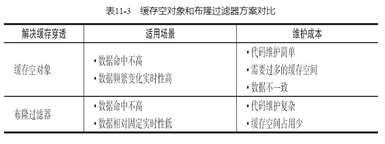

### 缓存雪崩

由于缓存层承载着大量请求，有效地保护了存储层，但是如果缓存层由于某些原因不能提供服务，于是所有的请求都会达到存储层，存储层的调用量会暴增，造成存储层也会级联宕机的情况。缓存雪崩的英文原意是stampeding herd（奔逃的野牛），指的是缓存层宕掉后，流量会像奔逃的野牛一样，打向后端存储。

**方案一：保证缓存层服务高可用性**

Redis Sentinel和Redis Cluster都实现了高可用

**方案二：依赖隔离组件为后端限流并降级**

例如hystrix，及时进行超时断路和失败断路。
具体实例可参考http://c.biancheng.net/springcloud/hystrix.html

**方案三：提前演练**

### 热点key重建优化

开发人员使用“缓存+过期时间”的策略既可以加速数据读写，又保证数据的定期更新，这种模式基本能够满足绝大部分需求。但是有两个问题如果同时出现，可能就会对应用造成致命的危害：
- 当前key是一个热点key（例如一个热门的娱乐新闻），并发量非常大。
- 重建缓存不能在短时间完成，可能是一个复杂计算，例如复杂的SQL、多次IO、多个依赖等。
在缓存失效的瞬间，有大量线程来重建缓存，造成后端负载加大，甚至可能会让应用崩溃。

**方案一：互斥锁**

只允许一个线程重建缓存，其他线程等待重建缓存的线程执行完，重新从缓存获取数据即可

```
String get(String key) {
    // 从Redis中获取数据
    String value = redis.get(key);
    // 如果value为空，则开始重构缓存
    if (value  == null) {
        // 只允许一个线程重构缓存，使用nx，并设置过期时间ex
        String mutexKey = "mutext:key:" + key;
        if (redis.set(mutexKey, "1", "ex 180", "nx")) {
            // 从数据源获取数据
            value = db.get(key);
            // 回写Redis，并设置过期时间
            redis.setex(key, timeout, value);
            // 删除key_mutex
            redis.delete(mutexKey);
        } 
        // 其他线程休息50毫秒后重试
        else {
            Thread.sleep(50);
            get(key);
        }
    }
    return value;
}
```

**方案二：永不过期**

“永远不过期”包含两层意思：

- 从缓存层面来看，确实没有设置过期时间，所以不会出现热点key过期后产生的问题，也就是“物理”不过期。

- 从功能层面来看，为每个value设置一个逻辑过期时间，当发现超过逻辑过期时间后，会使用单独的线程去构建缓存。

```
String get(final String key) {
    V v = redis.get(key);
    String value = v.getValue();
    // 逻辑过期时间
    long logicTimeout = v.getLogicTimeout();
    // 如果逻辑过期时间小于当前时间，开始后台构建
    if (v.logicTimeout <= System.currentTimeMillis()) {
        String mutexKey = "mutex:key:" + key;
            if (redis.set(mutexKey, "1", "ex 180", "nx")) {
                // 重构缓存
                threadPool.execute(new Runnable() {
                    public void run() {
                        String dbValue = db.get(key);
                        redis.set(key, (dbvalue,newLogicTimeout));
                        redis.delete(mutexKey);
                    }
                    });
                }
            }
            return value;
    }
```

方案对比：

- 互斥锁（mutex key）：这种方案思路比较简单，但是存在一定的隐患，如果构建缓存过程出现问题或者时间较长，可能会存在死锁和线程池阻塞的风险，但是这种方法能够较好地降低后端存储负载，并在一致性上做得比较好。

- “永远不过期”：这种方案由于没有设置真正的过期时间，实际上已经不存在热点key产生的一系列危害，但是会存在数据不一致的情况，同时代码复杂度会增大。

方案一是先重建后获取；方案二是先获取后更新；

参考：
《Redis开发与运维》 付磊　张益军 机械工业出版社
[布隆(Bloom Filter)过滤器](https://blog.csdn.net/qq_41125219/article/details/119982158)
[Hystrix：Spring Cloud服务熔断与降级组件](http://c.biancheng.net/springcloud/hystrix.html)

## Redis如果cpu过高，怎么解决？在使用中有出现什么问题？是怎么解决的？

- 并发饱和

对于这种情况，首先判断当前Redis的并发量是否达到极限，建议使用统计命令redis-cli-h{ip}-p{port}--stat获取当前Redis使用情况。如果每秒请求有几万，说明这个redis基本饱和，需要做集群化拓展来分摊压力。

- 高复杂度命令

如果只有几百或几千OPS的Redis实例就接近CPU饱和是很不正常的，有可能使用了高算法复杂度的命令。

- 过度内存优化

还有一种情况是过度的内存优化，这种情况有些隐蔽，需要我们根据info commandstats统计信息分析出命令不合理开销时间，例如下面的耗时统计：

```
cmdstat_hset:calls=198757512,usec=27021957243,usec_per_call=135.95
```

查看这个统计可以发现一个问题，hset命令算法复杂度只有O（1）但平均耗时却达到135微秒，显然不合理，正常情况耗时应该在10微秒以下。这是因为上面的Redis实例为了追求低内存使用量，过度放宽ziplist使用条件（修改了hash-max-ziplist-entries和hash-max-ziplist-value配置）。进程内的hash对象平均存储着上万个元素，而针对ziplist的操作算法复杂度在O（n）到O（n2）之间。虽然采用ziplist编码后hash结构内存占用会变小，但是操作变得更慢且更消耗CPU。ziplist压缩编码是Redis用来平衡空间和效率的优化手段，不可过度使用。

参考：
《Redis开发与运维》 付磊　张益军 机械工业出版社

## 如果有海量的数据，怎么查询某个key是否存在？

- 布隆过滤器：某样东西一定不存在或者可能存在，也就是说布隆过滤器说这个数不存在则一定不存，布隆过滤器说这个数存在可能不存在

- 位图：将key映射成一个唯一整数位移，使用redis的Bitmaps，如果位移的位置值为0，说明不存在，否则存在。

参考：
《Redis开发与运维》 付磊　张益军 机械工业出版社

## 如果要统计某一天的页面访问量怎么实现？

- Bitset

使用redis自带的Bitmaps。

优点占用内存更小，查询方便，可以指定查询某个用户，数据可能略有瑕疵，对于非登陆的用户，可能不同的key映射到同一个id，否则需要维护一个非登陆用户的映射，有额外的开销。

缺点如果用户非常的稀疏，那么占用的内存可能比方法一更大。

- HyperLogLog

使用HyperLogLog的PFADD命令，最后我们只要通过PFCOUNT就能顺利计算出最终的结果，因为这个只是一个概率算法，所以可能存在0.81%的误差。

优点占用内存极小，对于一个key，只需要12kb。

缺点查询指定用户的时候，可能会出错，毕竟存的不是具体的数据。总数也存在一定的误差。

参考：
[如何用 Redis 统计独立用户访问量](https://cloud.tencent.com/developer/article/1727425)
《Redis开发与运维》 付磊　张益军 机械工业出版社

## 常见的Redis的优化方案？  实践下

### 阻塞优化

- 慢查询调整

Redis原生提供慢查询统计功能，执行slowlog get{n}命令可以获取最近的n条慢查询命令，默认对于执行超过10毫秒的命令都会记录到一个定长队列中，线上实例建议设置为1毫秒便于及时发现毫秒级以上的命令。如果命令执行时间在毫秒级，则实例实际OPS只有1000左右。慢查询队列长度默认128，可适当调大。慢查询本身只记录了命令执行时间，不包括数据网络传输时间和命令排队时间，因此客户端发生阻塞异常后，可能不是当前命令缓慢，而是在等待其他命令执行。需要重点比对异常和慢查询发生的时间点，确认是否有慢查询造成的命令阻塞排队。

发现慢查询后，开发人员需要作出及时调整。可以按照以下两个方向去调整：

1）修改为低算法度的命令，如hgetall改为hmget等，禁用keys、sort等命令。

2）调整大对象：缩减大对象数据或把大对象拆分为多个小对象，防止一次命令操作过多的数据。

- 发现大对象发现

Redis本身提供发现大对象的工具，对应命令：redis-cli-h{ip}-p{port}bigkeys。内部原理采用分段进行scan操作，把历史扫描过的最大对象统计出来便于分析优化

- 其他外部因素优化

cpu竞争、网络问题等排查

### 内存优化

尽量的缩短键值对的存储长度，必要时要对数据进行序列化和压缩再存储

### 缓存设计优化

穿透优化、雪崩优化、热点key重建优化、无底洞优化（分节点使用pipeline或者使用hashtag，手动路由到指定节点操作）

### 其他优化

- 客户端使用优化

在客户端的使用上我们除了要尽量使用 Pipeline 的技术外，还需要注意要尽量使用 Redis 连接池，而不是频繁创建销毁Redis 连接。

- 避免大量数据同时失效

我们需要预防大量的缓存在同一时刻一起过期，就简单的解决方案就是在过期时间的基础上添加一个指定范围的随机数。

- 禁用 THP 特性

Linux kernel 在 2.6.38 内核增加了 Transparent Huge Pages (THP) 特性 ，支持大内存页 2MB 分配，默认开启。
当开启了 THP 时，fork 的速度会变慢，fork 之后每个内存页从原来 4KB 变为 2MB，会大幅增加重写期间父进程内存消耗。

- 使用分布式架构来增加读写速度

参考：
[Redis 性能优化的 13 条军规](https://zhuanlan.zhihu.com/p/118532234?utm_id=0)
[Redis 性能优化都有哪些方法](https://cloud.tencent.com/developer/article/2168105)
《Redis开发与运维》 付磊　张益军 机械工业出版社


# 参考

[微信公众号:我的IT技术路](https://mp.weixin.qq.com/s/54_bMeUwjxk-8DHa90heNQ)