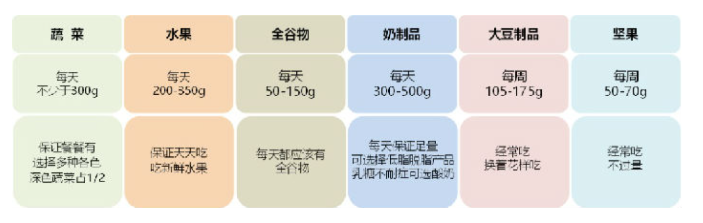

准则一  食物多样，合理搭配

核心推荐：

●  每天摄入谷类食物200~300g，其中包含全谷物和杂豆类50~150g；薯类50~100g。

准则二  吃动平衡，健康体重

核心推荐：

●  每天运动半小时（跑步、阻抗、八段锦、散步）

●  减少久坐时间，每小时起来动一动。

体重变化是判断一段时期内能量平衡与否最简便易行的指标，也是判断吃动是否平衡的指标。目前常用的判断健康体重的指标是体质指数（body mass index，BMI），它的计算方法是用体重（kg）除以身高（m）的平方。我国健康成年人（18～64 岁）的 BMI 应在 18.5～23.9 kg/m2，65岁以上老年人的适宜体重和BMI应该略高（20～26.9kg/m2）。

本人标准体重65kg

准则三  多吃蔬果、奶类、全谷、大豆

核心推荐：

●  餐餐有蔬菜，保证每天摄入不少于300g的新鲜蔬菜，深色蔬菜应占1/2。

●  天天吃水果，保证每天摄入200~350g的新鲜水果，果汁不能代替鲜果。

●  吃各种各样的奶制品，摄入量相当于每天300ml以上液态奶。

●  经常吃全谷物、大豆制品，适量吃坚果。

在一餐的食物中，首先保证蔬菜重量大约占 1/2，这样才能满足一天“量”的目标。

大豆及其制品，可以换着花样经常吃

每周可用豆腐、豆腐干、豆腐丝等制品轮换食用，既变换口味，又能满足营养需求

1. 全谷物，膳食好搭档

推荐每天吃全谷物食物50～150g，相当于一天谷物的1/4～1/3。

准则四  适量吃鱼、禽、蛋、瘦肉

核心推荐：

●  鱼、禽、蛋类和瘦肉摄入要适量，平均每天120~200g。

●  每周最好吃鱼2次或300~500g，蛋类300~350g，畜禽肉300~500g。

●  少吃深加工肉制品。

●  鸡蛋营养丰富，吃鸡蛋不弃蛋黄。

●  优先选择鱼，少吃肥肉、烟熏和腌制肉制品。

建议每月可食用动物内脏食物2～3次，且每次不要过多。没有必要过分追求“山珍海味”。

少吃熏腌和深加工肉制品

这些加工方法不仅使用了较多的食盐，同时油脂过度氧化等也存在一些食品安全问题，长期食用会给人体健康带来风险，因此应尽量少吃。

准则五  少盐少油，控糖限酒

核心推荐：

●  培养清淡饮食习惯，少吃高盐和油炸食品。成年人每天摄入食盐不超过5g，烹调油25~30g。

●  控制添加糖的摄入量，每天不超过50g，最好控制在25g以下。

●  反式脂肪酸每天摄入量不超过2g。

●  不喝或少喝含糖饮料。

●  儿童青少年、孕妇、乳母以及慢性病患者不应饮酒。成年人如饮酒，一天饮用的酒精量不超过15g。

准则六  规律进餐，足量饮水

核心推荐：

●  合理安排一日三餐，定时定量，不漏餐，每天吃早餐。

●  规律进餐、饮食适度，不暴饮暴食、不偏食挑食、不过度节食。

●  足量饮水，少量多次。在温和气候条件下，低身体活动水平成年男性每天喝水1 700ml，成年女性每天喝水1 500ml。

●  推荐喝白水或茶水，少喝或不喝含糖饮料，不用饮料代替白水。

准则七  会烹会选，会看标签

核心推荐：

●  在生命的各个阶段都应做好健康膳食规划。

●  认识食物，选择新鲜的、营养素密度高的食物。

●  学会阅读食品标签，合理选择预包装食品。

●  学习烹饪、传承传统饮食，享受食物天然美味。

●  在外就餐，不忘适量与平衡。

准则八  公筷分餐，杜绝浪费

核心推荐：

●  选择新鲜卫生的食物，不食用野生动物。

●  食物制备生熟分开，熟食二次加热要热透。

●  讲究卫生，从分餐公筷做起。

●  珍惜食物，按需备餐，提倡分餐不浪费。

●  做可持续食物系统发展的践行者。

拷贝请标明出处--《中国居民膳食指南》