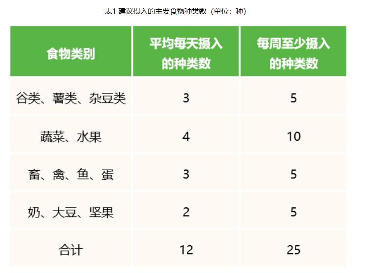
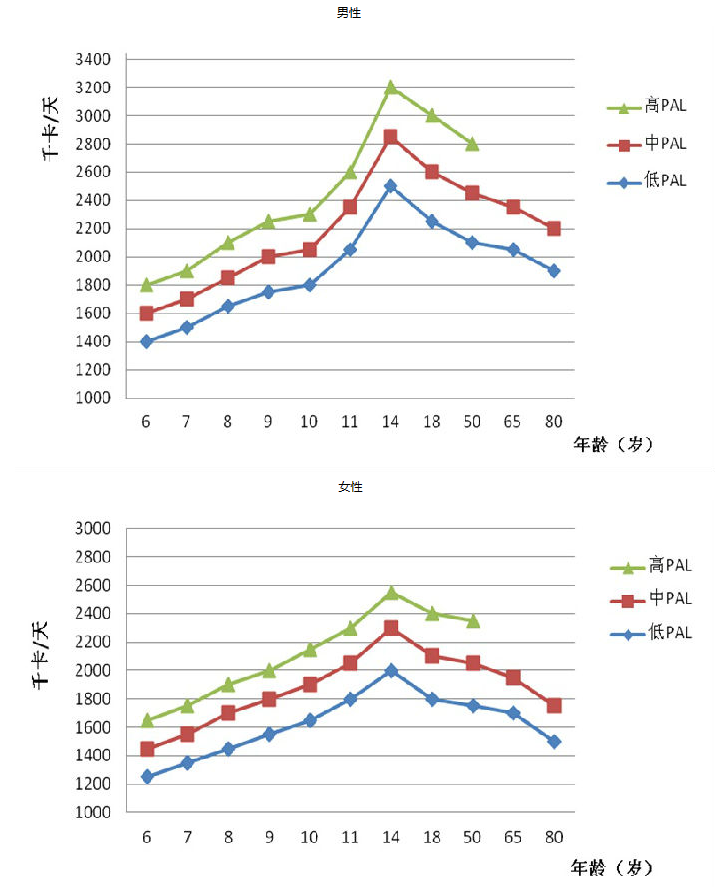
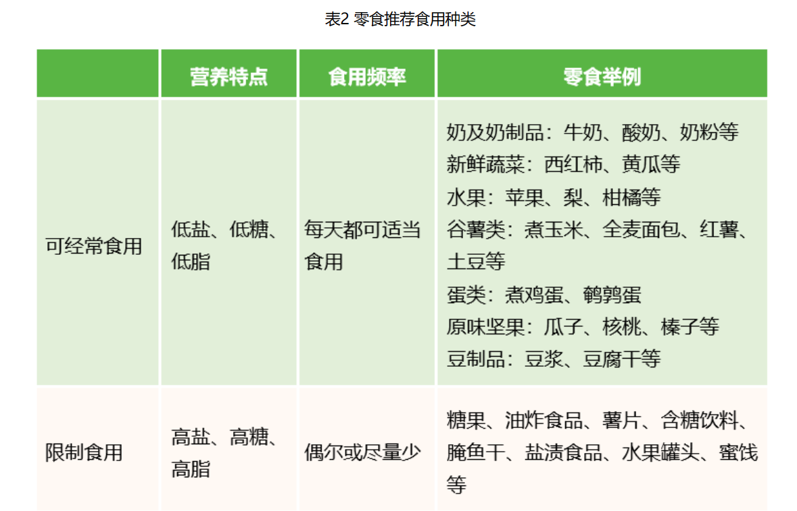
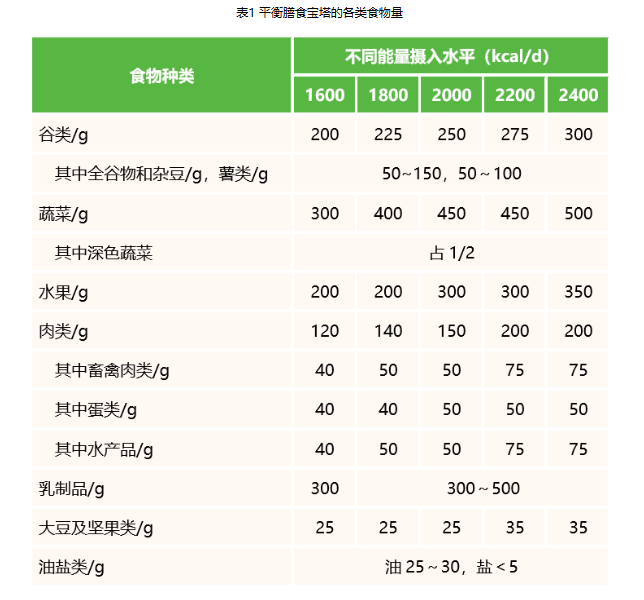

# 中国居民膳食指南2022摘录

## 准则一  食物多样，合理搭配

- 每天的膳食应包括谷薯类、蔬菜水果、畜禽鱼蛋奶和豆类食物。

- 平均每天摄入12种以上食物，每周25种以上，合理搭配。

- 每天摄入谷类食物200～300g，其中包含全谷物和杂豆类50～150g；薯类50～100g。

全谷、杂豆和薯类巧安排：

1. 全谷、杂豆每天吃一次

2. 薯类巧应用

## 准则二  吃动平衡，健康体重

核心推荐：

- 坚持日常身体活动，每周至少进行5天中等强度身体活动，累计150分钟以上；主动身体活动最好每天6000步。

- 鼓励适当进行高强度有氧运动，加强抗阻运动，每周2～3天。

- 减少久坐时间，每小时起来动一动。

为获得实质性的健康益处，成年人每周应该累计进行至少150分钟（2小时30分钟）的中等强度运动，或累计每周参加75分钟（1小时15分钟）大强度运动。也可以将中等强度和大强度的运动相结合。至少持续10分钟的运动才算是有效运动并进行累加，也就是说每次跑步不足10分钟不是真正有效的运动。一次性中等强度运动150分钟是可以接受的，但建议大众最好还是将运动分散在一周内完成更佳。

为了获得更多和更广泛的健康益处，成年人可以增加他们的活动量，活动量越多，健康收益越大，也就是说活动量只有下限，不存在严格意义的上限。如果每周能参加300分钟（5小时）中等强度运动，或者每周参加150分钟（2小时30分钟）高强度的运动，你会比仅仅满足基本活动量，获得更多的健康提升。

体重变化是判断一段时期内能量平衡与否最简便易行的指标，也是判断吃动是否平衡的指标。目前常用的判断健康体重的指标是体质指数（body mass index，BMI），它的计算方法是用体重（kg）除以身高（m）的平方。我国健康成年人（18～64 岁）的 BMI 应在 18.5～23.9 kg/m2，65岁以上老年人的适宜体重和BMI应该略高（20～26.9kg/m2）。

一般而言，一个人一天吃多少量食物是根据能量需要而计算出来的，故一天吃多少以食物供给是否满足一天能量需要为衡量标准。根据《中国居民膳食营养素参考摄入量（2013 版）》，我国成年人（18～49 岁）低身体活动水平者能量需要量男性为 9.41MJ（2250kcal），女性为 7.53MJ（1800kcal）。中国6岁以上不同性别、年龄和不同身体活动水平人群能量需要量见图1。

## 准则三  多吃蔬果、奶类、全谷、大豆

核心推荐：

- 餐餐有蔬菜，保证每天摄入不少于300g的新鲜蔬菜，深色蔬菜应占1/2。

- 天天吃水果，保证每天摄入200~350g的新鲜水果，果汁不能代替鲜果。

- 吃各种各样的奶制品，摄入量相当于每天300ml以上液态奶。

- 经常吃全谷物、大豆制品，适量吃坚果。

在一餐的食物中，首先保证蔬菜重量大约占 1/2，这样才能满足一天“量”的目标。

大豆及其制品，可以换着花样经常吃

每周可用豆腐、豆腐干、豆腐丝等制品轮换食用，既变换口味，又能满足营养需求

### 准则四  适量吃鱼、禽、蛋、瘦肉

核心推荐：

- 鱼、禽、蛋类和瘦肉摄入要适量，平均每天120~200g。

- 每周最好吃鱼3次或300-500g，蛋类300-350g，畜禽肉300-500g。

- 少吃深加工肉制品。

- 鸡蛋营养丰富，吃鸡蛋不弃蛋黄。

- 优先选择鱼，少吃肥肉、烟熏和腌制肉制品。

应将这些食物分散在每天各餐中，避免集中食用，最好每餐有肉，每天有蛋。食谱定量设计，能有效控制动物性食物的摄入量。

建议每月可食用动物内脏食物2～3次，且每次不要过多。没有必要过分追求“山珍海味”。

这些加工方法不仅使用了较多的食盐，同时油脂过度氧化等也存在一些食品安全问题，长期食用会给人体健康带来风险，因此应尽量少吃。

## 准则五  少盐少油，控糖限酒

核心推荐：

- 培养清淡饮食习惯，少吃高盐和油炸食品。成年人每天摄入食盐不超过5g，烹调油25~30g。

- 控制添加糖的摄入量，每天不超过50g，最好控制在25g以下。

- 反式脂肪酸每天摄入量不超过2g。

- 不喝或少喝含糖饮料。

- 儿童青少年、孕妇、乳母以及慢性病患者不应饮酒。成年人如饮酒，一天饮用的酒精量不超过15g。

## 准则六  规律进餐，足量饮水

核心推荐：

- 合理安排一日三餐，定时定量，不漏餐，每天吃早餐。

- 规律进餐、饮食适度，不暴饮暴食、不偏食挑食、不过度节食。

- 足量饮水，少量多次。在温和气候条件下，低身体活动水平成年男性每天喝水1700ml，成年女性每天喝水1500ml。

- 推荐喝白水或茶水，少喝或不喝含糖饮料，不用饮料代替白水。

零食资料：

一日三餐，两餐的间隔以4~6小时为宜。早餐安排在6:30—8:30，午餐11:30—13:30，晚餐18:00—20:00为宜。学龄前儿童除了保证每日三次正餐外，还应安排两次零点。

## 准则七  会烹会选，会看标签

## 准则八  公筷分餐，杜绝浪费

核心推荐：

- 选择新鲜卫生的食物，不食用野生动物。

- 食物制备生熟分开，熟食二次加热要热透。

- 讲究卫生，从分餐公筷做起。

- 珍惜食物，按需备餐，提倡分餐不浪费。

- 做可持续食物系统发展的践行者。

# 规划

## 体重规划

65kg

## 运动规划

番茄时钟避免久坐

中等强度：
工作日散步两次，共40*5=200min
户外走路一次，共60min

高强度间隔进行：
跑步，共25*2=50min
抗阻运动，共30*2=60min

等价中等强度时间（约）：450min

推力训练：变式俯卧撑、侧平举
核心训练：卷腹、仰卧抬腿、仰卧挺身
拉力训练：引体向上、弯举
臀腿训练：跪姿后踢腿、站姿侧踢腿、静蹲

## 饮水规划

上午：250*2=500ml

下午：250*3=750ml

晚上：250ml

加牛奶，共计1800ml

## 饮食规划(基于准则7内容)

### 早餐

- 鸡蛋一个，麦片奇亚籽葡萄干，牛奶300ml
- 鸡蛋一个，包子或烧卖一个，豆浆300ml

### 午餐或晚餐

- 谷薯豆100g（薯豆优先）、肉类75g(鱼优先)、蔬菜225g

### 下午茶

- 水果300g，茶水

### 其他

- 无糖饮料每周限一瓶
- 🈲含糖饮料

## 作息规划

22：30洗漱
23：30睡觉

# 参考
中国居民膳食指南2022
[跑步跑量应该怎么安排才合理、科学？ - 戴剑松的回答 - 知乎](https://www.zhihu.com/question/25888054/answer/67332197)

