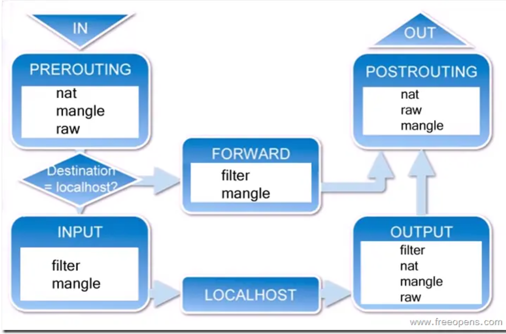
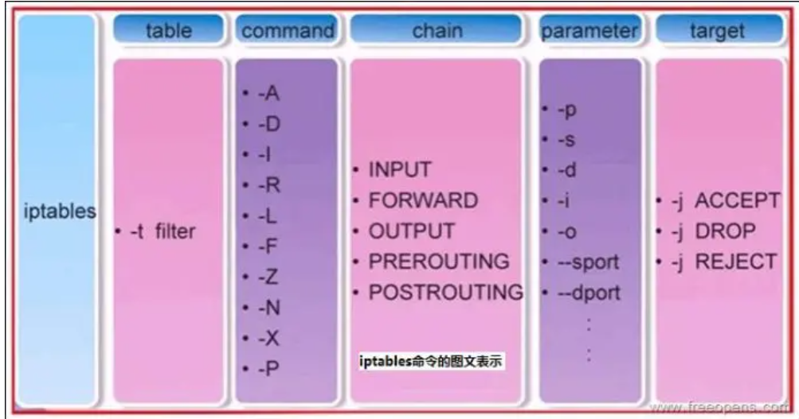
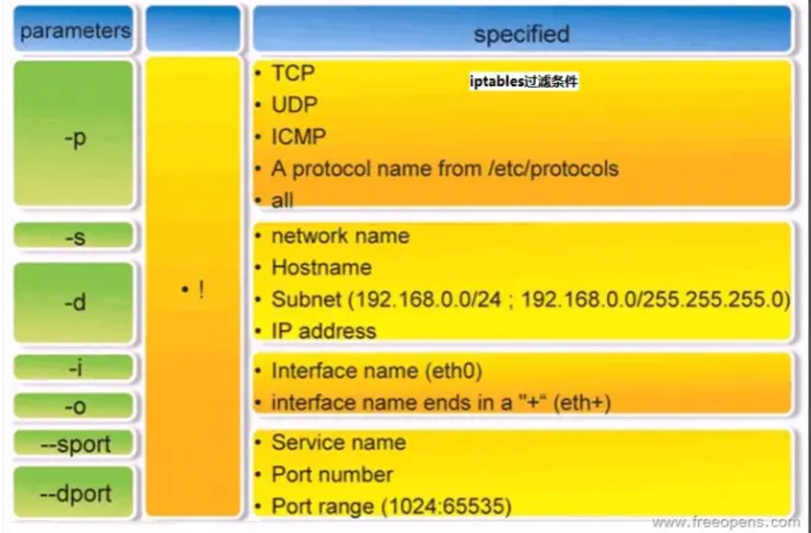

# 前言

前段时间公司的技术支持同事想让我们出个产品的端口加固脚本，当时对于防火墙知识不太熟悉，最后技术支持同事自己写了个脚本，近期公司的产品又有端口加固的需求了，所以学习了下iptables的相关知识，并整理下iptables的基本概念和简单命令。

# iptables简介

netfilter/iptables（简称为iptables）组成Linux平台下的包过滤防火墙，与大多数的Linux软件一样，这个包过滤防火墙是免费的，它可以代替昂贵的商业防火墙解决方案，完成封包过滤、封包重定向和网络地址转换（NAT）等功能。

# iptables基础

规则（rules）其实就是网络管理员预定义的条件，规则一般的定义为“如果数据包头符合这样的条件，就这样处理这个数据包”。规则存储在内核空间的信息 包过滤表中，这些规则分别指定了源地址、目的地址、传输协议（如TCP、UDP、ICMP）和服务类型（如HTTP、FTP和SMTP）等。当数据包与规则匹配时，iptables就根据规则所定义的方法来处理这些数据包，如放行（accept）、拒绝（reject）和丢弃（drop）等。配置防火墙的 主要工作就是添加、修改和删除这些规则。

# iptables和netfilter的关系

这是第一个要说的地方，Iptables和netfilter的关系是一个很容易让人搞不清的问题。很多的知道iptables却不知道netfilter。其实iptables只是Linux防火墙的管理工具而已，位于/sbin/iptables。真正实现防火墙功能的是netfilter，它是Linux内核中实现包过滤的内部结构。

# iptables传输数据包的过程

1. 当一个数据包进入网卡时，它首先进入PREROUTING链，内核根据数据包目的IP判断是否需要转送出去。
2. 如果数据包就是进入本机的，它就会沿着图向下移动，到达INPUT链。数据包到了INPUT链后，任何进程都会收到它。本机上运行的程序可以发送数据包，这些数据包会经过OUTPUT链，然后到达POSTROUTING链输出。
3. 如果数据包是要转发出去的，且内核允许转发，数据包就会如图所示向右移动，经过FORWARD链，然后到达POSTROUTING链输出。



# iptables的规则表和链

表（tables）提供特定的功能，iptables内置了4个表，即filter表、nat表、mangle表和raw表，分别用于实现包过滤，网络地址转换、包重构(修改)和数据跟踪处理。

链（chains）是数据包传播的路径，每一条链其实就是众多规则中的一个检查清单，每一条链中可以有一条或数条规则。当一个数据包到达一个链时，iptables就会从链中第一条规则开始检查，看该数据包是否满足规则所定义的条件。如果满足，系统就会根据 该条规则所定义的方法处理该数据包；否则iptables将继续检查下一条规则，如果该数据包不符合链中任一条规则，iptables就会根据该链预先定义的默认策略来处理数据包。

**简单的说：链表示位置，例如INPUT链、OUTPUT链都代表数据包经过的不同位置；每个链上都可以设定若干个规则，如果满足这个规则，则执行指定的操作，否则按照该链的默认规则操作；表是一种工具，表是用来检查设定规则是否满足的工具，不同的规则用不同的表进行检查。最关键的是要确定需要设定规则的位置和具体的规则。**

## 规则表

1. filter表——三个链：INPUT、FORWARD、OUTPUT（**即INPUT、FORWARD、OUTPUT这三个链都会用到filter表来做数据包过滤，基本是最常用的**）
作用：过滤数据包  内核模块：iptables_filter.
2. Nat表——三个链：PREROUTING、POSTROUTING、OUTPUT
作用：用于网络地址转换（IP、端口） 内核模块：iptable_nat
3. Mangle表——五个链：PREROUTING、POSTROUTING、INPUT、OUTPUT、FORWARD
作用：修改数据包的服务类型、TTL、并且可以配置路由实现QOS内核模块：iptable_mangle(别看这个表这么麻烦，咱们设置策略时几乎都不会用到它)
4. Raw表——两个链：OUTPUT、PREROUTING
作用：决定数据包是否被状态跟踪机制处理  内核模块：iptable_raw

## 规则链

1. INPUT——进来的数据包应用此规则链中的策略
2. OUTPUT——外出的数据包应用此规则链中的策略
3. FORWARD——转发数据包时应用此规则链中的策略
4. PREROUTING——对数据包作路由选择前应用此链中的规则
（所有的数据包进来的时侯都先由这个链处理）
5. POSTROUTING——对数据包作路由选择后应用此链中的规则
（所有的数据包出来的时侯都先由这个链处理）

# iptables的基本语法格式

iptables [-t 表名] 命令选项 ［链名］ ［条件匹配］ ［-j 目标动作或跳转］

说明：表名、链名用于指定 iptables命令所操作的表和链，命令选项用于指定管理iptables规则的方式（比如：插入、增加、删除、查看等；条件匹配用于指定对符合什么样 条件的数据包进行处理；目标动作或跳转用于指定数据包的处理方式（比如允许通过、拒绝、丢弃、跳转（Jump）给其它链处理。

iptables命令的管理控制选项：

-A 在指定链的末尾添加（append）一条新的规则
-D  删除（delete）指定链中的某一条规则，可以按规则序号和内容删除
-I  在指定链中插入（insert）一条新的规则，默认在第一行添加
-R  修改、替换（replace）指定链中的某一条规则，可以按规则序号和内容替换
-L  列出（list）指定链中所有的规则进行查看
-E  重命名用户定义的链，不改变链本身
-F  清空（flush）
-N  新建（new-chain）一条用户自己定义的规则链
-X  删除指定表中用户自定义的规则链（delete-chain）
-P  设置指定链的默认策略（policy）
-Z 将所有表的所有链的字节和数据包计数器清零
-n  使用数字形式（numeric）显示输出结果
-v  查看规则表详细信息（verbose）的信息
-V  查看版本(version)
-h  获取帮助（help）

防火墙处理数据包的四种方式：

- ACCEPT 允许数据包通过
- DROP 直接丢弃数据包，不给任何回应信息
- REJECT 拒绝数据包通过，必要时会给数据发送端一个响应的信息。




# iptables防火墙规则的保存与恢复

iptables-save把规则保存到文件中，再由目录rc.d下的脚本（/etc/rc.d/init.d/iptables）自动装载。使用命令iptables-save来保存规则。一般用`iptables-save > /etc/sysconfig/iptables`生成保存规则的文件/etc/sysconfig/iptables，

也可以用`service iptables save`它能把规则自动保存在/etc/sysconfig/iptables中。当计算机启动时，rc.d下的脚本将用命令iptables-restore调用这个文件，从而就自动恢复了规则。

# 如何只开放22端口，关闭其他端口

```
# 清除目前所有规则
iptables -F

# 允许通过tcp协议访问22端口
iptables -A INPUT -p tcp --dport 22 -j ACCEPT

# 禁止访问除22端口以外的所有端口
iptables -P INPUT DROP
iptables -P FORWARD DROP
iptables -P OUTPUT ACCEPT

# 允许本地内部访问
iptables -A INPUT -i lo -j ACCEPT

# 允许数据包响应
iptables -A INPUT -m state --state ESTABLISHED,RELATED -j ACCEPT

# 允许从本地访问外部端口
iptables -A OUTPUT -j ACCEPT

# 保存设置
/sbin/service iptables save

# 查看iptables状态
iptables -L -v -n
```

# 如何恢复开放所有端口

前一小结的第一个命令就是`iptables -F`，注释是**清除目前所有规则**，那么如果你认为直接执行`iptables -F`就可以恢复开放所有端口就大错特错了。笔者在开发环境执行了`iptables -F`后服务器直接无法连接了。为什么会这样呢？**因为在前面关闭端口的操作中通过`iptables -P INPUT DROP`和`iptables -P FORWARD DROP`修改了防火墙的默认规则，即默认拒绝INPUT和FORWARD链的数据包，所有通过`iptables -F`清理规则后就恢复到了默认规则，所以所有的数据包都无法进入了。如果要恢复开放所有的端口，首先要修改默认规则，然后再清理规则。**

```
iptables -P INPUT ACCEPT
iptables -P FORWARD ACCEPT
iptables -P OUTPUT ACCEPT
iptables -F
```

# 参考

[CENTOS IPTABLES 远程只允许22端口](https://www.cnblogs.com/lph970417/p/13549488.html)
[Linux下 iptables 超详细教程和使用示例](https://www.cnblogs.com/cangqinglang/p/15438461.html)
[iptables详解及一些常用规则](https://www.jianshu.com/p/ee4ee15d3658)
[关于linux 命令“iptables -F”，不要轻易执行](https://blog.csdn.net/aw277866304/article/details/106517097)
