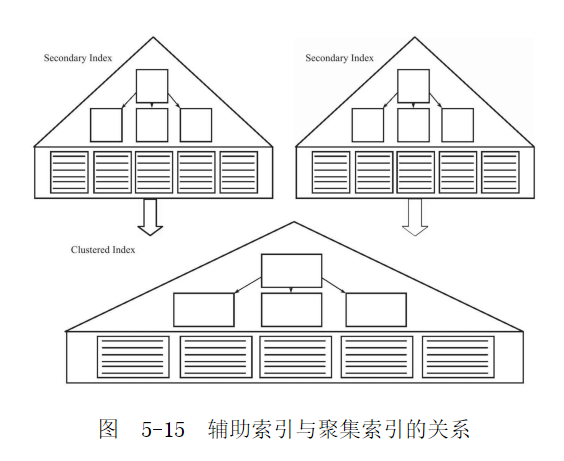
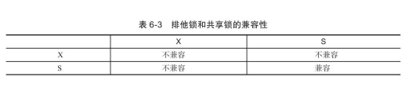

# 前言

整理mysql的相关面试题，题目来源微信公众号。

# 题目

## 数据库的常用存储引擎有哪些？能重点介绍innodb和myisam的区别？

### innodb

InnoDB存储引擎支持事务，其设计目标主要面向在线事务处理（OLTP）的应用。其特点是行锁设计、支持外键，并支持类似于Oracle的非锁定读，即默认读取操作不会产生锁。从MySQL数据库5.5.8版本开始，InnoDB存储引擎是默认的存储引擎。
InnoDB通过使用多版本并发控制（MVCC）来获得高并发性，并且实现了SQL标准的4种隔离级别，默认为REPEATABLE级别。同时，使用一种被称为next-keylocking的策略来避免幻读（phantom）现象的产生。除此之外，InnoDB储存引擎还提供了插入缓冲缓冲（insertbuffer）、二次写（doublewrite）、自适应哈希索引（adaptivehashindex）、预读（readahead）等高性能和高可用的功能。对于表中数据的存储，InnoDB存储引擎采用了聚集（clustered）的方式，因此每张表的存储都是按主键的顺序进行存放。如果没有显式地在表定义时指定主键，InnoDB存储引擎会为每一行生成一个6字节的ROWID，并以此作为主键。

### MyISAM

MyISAM存储引擎不支持事务、表锁设计，支持全文索引，主要面向一些OLAP数据库应用。
此外，MyISAM存储引擎的另一个与众不同的地方是它的缓冲池只缓存（cache）索引文件，而不缓冲数据文件，这点和大多数的数据库都非常不同。

### NDB

纯内存存储引擎

### 比较

除非有非常特别的原因需要使用其他的存储引擎，否则应该优先考虑InnoDB引擎。对于只读的数据，或者表比较小，可以忍受修复操作，则依然可以使用MyISAM（但请不要默认使用MyISAM，而是应该默认使用InnoDB）。

参考：
[Mysql 中 MyISAM 和 InnoDB 的区别有哪些？](https://www.zhihu.com/question/20596402/answer/529312016) 
《MySQL技术内幕：InnoDB存储引擎(第2版)》 姜承尧 机械工业出版社

## B+树和hash索引的区别是什么？

B+树多层，hash索引一层加链表

B+树是树，hash索引不是

hash索引复杂度O1，B+树更高

哈希索引只能用来搜索等值的查询，B+树可以范围查找

自适应哈希索引是由InnoDB存储引擎自己控制的，DBA本身并不能对其进行干预，B+树索引可以人为设定。

参考：
《MySQL技术内幕：InnoDB存储引擎(第2版)》 姜承尧 机械工业出版社

## 索引在什么时候会失效？

在某些情况下，当执行EXPLAIN命令进行SQL语句的分析时，会发现优化器并没有选择索引去查找数据，而是通过扫描聚集索引，也就是直接进行全表的扫描来得到数据。这种情况多发生于范围查找、JOIN链接操作等情况下。

参考：
《MySQL技术内幕：InnoDB存储引擎(第2版)》 姜承尧 机械工业出版社

## 了解聚集索引和非聚集索引的区别么？覆盖索引是什么？

聚集索引（clustered index）就是按照每张表的主键构造一棵B+树，同时叶子节点中存放的即为整张表的行记录数据，也将聚集索引的叶子节点称为数据页。

辅助索引（Secondary Index，也称非聚集索引），叶子节点并不包含行记录的全部数据。叶子节点除了包含键值以外，每个叶子节点中的索引行中还包含了一个书签（bookmark）。该书签用来告诉InnoDB存储引擎哪里可以找到与索引相对应的行数据。由于InnoDB存储引擎表是索引组织表，因此InnoDB存储引擎的辅助索引的书签就是相应行数据的聚集索引键。

辅助索引的存在并不影响数据在聚集索引中的组织，因此每张表上可以有多个辅助索引。当通过辅助索引来寻找数据时，InnoDB存储引擎会遍历辅助索引并通过叶级别的指针获得指向主键索引的主键，然后再通过主键索引来找到一个完整的行记录。举例来说，如果在一棵高度为3的辅助索引树中查找数据，那需要对这棵辅助索引树遍历3次找到指定主键，如果聚集索引树的高度同样为3，那么还需要对聚集索引树进行3次查找，最终找到一个完整的行数据所在的页，因此一共需要6次逻辑IO访问以得到最终的一个数据页。

InnoDB存储引擎支持覆盖索引（covering index，或称索引覆盖），即从辅助索引中就可以得到查询的记录，而不需要查询聚集索引中的记录。使用覆盖索引的一个好处是辅助索引不包含整行记录的所有信息，故其大小要远小于聚集索引，因此可以减少大量的IO操作。覆盖索引可以理解为辅助索引的特殊的用法。

参考：
《MySQL技术内幕：InnoDB存储引擎(第2版)》 姜承尧 机械工业出版社

## B+树的优点是什么？为什么mysql的索引使用b+树，为什么不使用B树或者红黑树呢？

- B+树的特征

有m个子树的中间节点包含有m个元素（B树中是k-1个元素），每个元素不保存数据，只用来索引；
所有的叶子结点中包含了全部关键字的信息，及指向含有这些关键字记录的指针，且叶子结点本身依关键字的大小自小而大的顺序链接。 (而B 树的叶子节点并没有包括全部需要查找的信息)；
所有的非终端结点可以看成是索引部分，结点中仅含有其子树根结点中最大（或最小）关键字。 (而B 树的非终节点也包含需要查找的有效信息)；

- 为什么说B+树比B树更适合数据库索引

1）B+树的磁盘读写代价更低

　　B+树的内部结点并没有指向关键字具体信息的指针。因此其内部结点相对B树更小。如果把所有同一内部结点的关键字存放在同一盘块中，那么盘块所能容纳的关键字数量也越多。一次性读入内存中的需要查找的关键字也就越多。相对来说IO读写次数也就降低了；

2）B+树查询效率更加稳定

　　由于非终结点并不是最终指向文件内容的结点，而只是叶子结点中关键字的索引。所以任何关键字的查找必须走一条从根结点到叶子结点的路。所有关键字查询的路径长度相同，导致每一个数据的查询效率相当；

3）B+树便于范围查询（最重要的原因，范围查找是数据库的常态）

　　B树在提高了IO性能的同时并没有解决元素遍历的我效率低下的问题，正是为了解决这个问题，B+树应用而生。B+树只需要去遍历叶子节点就可以实现整棵树的遍历。而且在数据库中基于范围的查询是非常频繁的，而B树不支持这样的操作或者说效率太低；

- 相比红黑树的优势

红黑树的出度为2，B+树的出度一般非常大，B+树会明显低很多，有利于减少IO次数。

参考：
[B树、B+树详解](https://www.cnblogs.com/lianzhilei/p/11250589.html)
[MySQL](https://www.cyc2018.xyz/%E6%95%B0%E6%8D%AE%E5%BA%93/MySQL.html)
[图解：什么是B树？](https://zhuanlan.zhihu.com/p/146252512)

## 索引怎么创建比较合适

对于什么时候添加B+树索引，一般的经验是，在访问表中很少一部分时使用B+树索引才有意义。

如果某个字段的取值范围很广，几乎没有重复，即属于高选择性，则此时使用B+树索引是最适合的。

怎样查看索引是否是高选择性的呢？可以通过SHOWINDEX结果中的列Cardinality来观察。Cardinality值非常关键，表示索引中不重复记录数量的预估值。同时需要注意的是，Cardinality是一个预估值，而不是一个准确值，基本上用户也不可能得到一个准确的值。在实际应用中，Cardinality/n_rows_in_table应尽可能地接近1。如果非常小，那么用户需要考虑是否还有必要创建这个索引。

Cardinality是通过抽样的方式统计出来的，可以通过`show index from tablexxx`看到每个索引的Cardinality。

参考：
《MySQL技术内幕：InnoDB存储引擎(第2版)》 姜承尧 机械工业出版社

## Innodb的行锁有哪几种？分别是怎么实现的？

InnoDB存储引擎实现了如下两种标准的行级锁：
- 共享锁（S Lock），允许事务读一行数据。
- 排他锁（X Lock），允许事务删除或更新一行数据。
如果一个事务T1已经获得了行r的共享锁，那么另外的事务T2可以立即获得行r的共享锁，因为读取并没有改变行r的数据，称这种情况为锁兼容（Lock Compatible）。但若有其他的事务T3想获得行r的排他锁，则其必须等待事务T1、T2释放行r上的共享锁——这种情况称为锁不兼容。

InnoDB存储引擎不存在锁升级的问题。因为其不是根据每个记录来产生行锁的，相反，其根据每个事务访问的每个页对锁进行管理的，采用的是位图的方式。因此不管一个事务锁住页中一个记录还是多个记录，其开销通常都是一致的。

参考：
《MySQL技术内幕：InnoDB存储引擎(第2版)》 姜承尧 机械工业出版社

## 一致性非锁定读、一致性锁定读

### 一致性非锁定读

一致性的非锁定读（consistent nonlocking read）是指InnoDB存储引擎通过行多版本控制（multiversioning）的方式来读取当前执行时间数据库中行的数据。如果读取的行正在执行DELETE或UPDATE操作，这时读取操作不会因此去等待行上锁的释放。相反地，InnoDB存储引擎会去读取行的一个快照数据。

快照数据是指该行的之前版本的数据，该实现是通过undo段来完成。而undo用来在事务中回滚数据，因此快照数据本身是没有额外的开销。此外，读取快照数据是不需要上锁的，因为没有事务需要对历史的数据进行修改操作。

非锁定读机制极大地提高了数据库的并发性。在InnoDB存储引擎的默认设置下，这是默认的读取方式，即读取不会占用和等待表上的锁。但是在不同事务隔离级别下，读取的方式不同，并不是在每个事务隔离级别下都是采用非锁定的一致性读。此外，即使都是使用非锁定的一致性读，但是对于快照数据的定义也各不相同。

在事务隔离级别READ COMMITTED和REPEATABLE READ（InnoDB存储引擎的默认事务隔离级别）下，InnoDB存储引擎使用非锁定的一致性读。然而，对于快照数据的定义却不相同。在READ COMMITTED事务隔离级别下，对于快照数据，非一致性读总是读取被锁定行的最新一份快照数据。而在REPEATABLE READ事务隔离级别下，对于快照数据，非一致性读总是读取事务开始时的行数据版本。

### 一致性锁定读

在默认配置下，即事务的隔离级别为REPEATABLE READ模式下，InnoDB存储引擎的SELECT操作使用一致性非锁定读。但是在某些情况下，用户需要显式地对数据库读取操作进行加锁以保证数据逻辑的一致性。而这要求数据库支持加锁语句，即使是对于SELECT的只读操作。InnoDB存储引擎对于SELECT语句支持两种一致性的锁定读（lockingread）操作：
- SELECT…FOR UPDATE
- SELECT…LOCK IN SHAREMODE
SELECT…FOR UPDATE对读取的行记录加一个X锁，其他事务不能对已锁定的行加上任何锁。SELECT…LOCK IN SHARE MODE对读取的行记录加一个S锁，其他事务可以向被锁定的行加S锁，但是如果加X锁，则会被阻塞。
对于一致性非锁定读，即使读取的行已被执行了SELECT…FOR UPDATE，也是可以进行读取的，这和之前讨论的情况一样。此外，SELECT…FORUPDATE，SELECT…LOCK IN SHARE MODE必须在一个事务中，当事务提交了，锁也就释放了。因此在使用上述两句SELECT锁定语句时，务必加上BEGIN，START TRANSACTION或者 SET AUTOCOMMIT= 0。

参考：
《MySQL技术内幕：InnoDB存储引擎(第2版)》 姜承尧 机械工业出版社

## 数据库的乐观锁和悲观锁的区别？Select*from table for update，select *from table in share mode分别加的是什么锁？

乐观锁类似CAS操作，一般会比较和自旋，适用于并发量小的场景；悲观锁会直接加锁，适用于并发量大的场景；

Select*from table for update，select *from table in share mode 都是主动加锁，应该属于悲观锁。

参考：
[mysql 悲观锁与乐观锁的详解](https://zhuanlan.zhihu.com/p/100703597?utm_id=0)

## 数据库会死锁么？Innodb是怎么解决死锁的？

解决死锁问题最简单的一种方法是超时，即当两个事务互相等待时，当一个等待时间超过设置的某一阈值时，其中一个事务进行回滚，另一个等待的事务就能继续进行。在InnoDB存储引擎中，参数innodb_lock_wait_timeout用来设置超时的时间。

超时机制虽然简单，但是其仅通过超时后对事务进行回滚的方式来处理，或者说其是根据FIFO的顺序选择回滚对象。但若超时的事务所占权重比较大，如事务操作更新了很多行，占用了较多的undolog，这时采用FIFO的方式，就显得不合适了，因为回滚这个事务的时间相对另一个事务所占用的时间可能会很多。因此，除了超时机制，当前数据库还都普遍采用wait-forgraph（等待图）的方式来进行死锁检测。较之超时的解决方案，这是一种更为主动的死锁检测方式。InnoDB存储引擎也采用的这种方式。

wait-forgraph要求数据库保存以下两种信息：

-锁的信息链表
-事务等待链表

通过上述链表可以构造出一张图，而在这个图中若存在回路，就代表存在死锁，因此资源间相互发生等待。

wait-forgraph是一种较为主动的死锁检测机制，在每个事务请求锁并发生等待时都会判断是否存在回路，若存在则有死锁，通常来说InnoDB存储引擎选择回滚undo量最小的事务。

参考：
《MySQL技术内幕：InnoDB存储引擎(第2版)》 姜承尧 机械工业出版社

## 如何安全的更改一行数据？

加锁，一致性锁定读；增加隔离级别，SERIALIZABLE

参考：
《MySQL技术内幕：InnoDB存储引擎(第2版)》 姜承尧 机械工业出版社

## 什么是幻读？Mysql的innodb存储引擎是怎么解决幻读的？

Phantom Problem是指在同一事务下，连续执行两次同样的SQL语句可能导致不同的结果，第二次的SQL语句可能会返回之前不存在的行。

InnoDB存储引擎采用Next-Key Locking的算法避免Phantom Problem。对于上述的SQL语句SELECT * FROM t WHERE a ＞ 2 FOR UPDATE，其锁住的不是5这单个值，而是对（2，+∞）这个范围加了X锁。因此任何对于这个范围的插入都是不被允许的，从而避免Phantom Problem。

InnoDB存储引擎默认的事务隔离级别是REPEATABLE READ，在该隔离级别下，其采用Next-Key Locking的方式来加锁。而在事务隔离级别READ COMMITTED下，其仅采用Record Lock。

参考：
《MySQL技术内幕：InnoDB存储引擎(第2版)》 姜承尧 机械工业出版社

## Mysql的事务有那几个特性？ACID分别是怎么实现的？

A（Atomicity），原子性。原子性指整个数据库事务是不可分割的工作单位。只有使事务中所有的数据库操作都执行成功，才算整个事务成功。事务中任何一个SQL语句执行失败，已经执行成功的SQL语句也必须撤销，数据库状态应该退回到执行事务前的状态。

C（consistency），一致性。一致性指事务将数据库从一种状态转变为下一种一致的状态。在事务开始之前和事务结束以后，数据库的完整性约束没有被破坏。

I（isolation），隔离性。隔离性还有其他的称呼，如并发控制（concurrency control）、可串行化（serializability）、锁（locking）等。事务的隔离性要求每个读写事务的对象对其他事务的操作对象能相互分离，即该事务提交前对其他事务都不可见，通常这使用锁来实现。

D（durability），持久性。事务一旦提交，其结果就是永久性的。即使发生宕机等故障，数据库也能将数据恢复。

事务隔离性由锁来实现。原子性、一致性、持久性通过数据库的redo log和undo log来完成。redo log称为重做日志，用来保证事务的原子性和持久性，适用于数据落盘过程，先写日志后落盘。undo log用来保证事务的一致性，适用于操作回滚过程。

参考：
《MySQL技术内幕：InnoDB存储引擎(第2版)》 姜承尧 机械工业出版社

## SQL有几种隔离级别？InnoDB默认的隔离级别是？分别是怎么实现的？

### SQL有几种隔离级别

SQL 标准 定义 的 四个 隔离 级别 为： 
- READ UNCOMMITTED 
- READ COMMITTED 
- REPEATABLE READ 
- SERIALIZABLE。

READ UNCOMMITTED称为浏览访问（browse access），仅仅针对事务而言的。READ COMMITTED称为游标稳定（cursor stability）。REPEATABLE READ是2.9999°的隔离，没有幻读的保护。SERIALIZABLE称为隔离，或3°的隔离。SQL和SQL2标准的默认事务隔离级别是SERIALIZABLE。

### InnoDB默认的隔离级别

InnoDB存储引擎默认支持的隔离级别是REPEATABLE READ，但是与标准SQL不同的是，InnoDB存储引擎在REPEATABLE READ事务隔离级别下，使用Next-Key Lock锁的算法，因此避免幻读的产生。这与其他数据库系统（如Microsoft SQL Server数据库）是不同的。所以说，InnoDB存储引擎在默认的REPEATABLE READ的事务隔离级别下已经能完全保证事务的隔离性要求，即达到SQL标准的SERIALIZABLE隔离级别。
隔离级别越低，事务请求的锁越少或保持锁的时间就越短。这也是为什么大多数数据库系统默认的事务隔离级别是READ COMMITTED。
据了解，大部分的用户质疑SERIALIZABLE隔离级别带来的性能问题，但是根据Jim Gray在《Transaction Processing》一书中指出，两者的开销几乎是一样的，甚至SERIALIZABLE可能更优!!!因此在InnoDB存储引擎中选择REPEATABLE READ的事务隔离级别并不会有任何性能的损失。同样地，即使使用READ COMMITTED的隔离级别，用户也不会得到性能的大幅度提升。

### 分别是怎么实现的

READ UNCOMMITTED ，事务中的修改，即使没有提交，对其它事务也是可见的。
READ COMMITTED ，一个事务只能读取已经提交的事务所做的修改。换句话说，一个事务所做的修改在提交之前对其它事务是不可见的。在 READ COMMITTED 的 事务 隔离级别下，除了唯一性的约束检查及外键约束的检查需要gap lock，InnoDB存储引擎不会使用gap lock的锁算法，事务提交后才可读到最新的数据(mvcc)；
REPEATABLE READ，使用Next-KeyLock锁的算法，因此避免幻读的产生，事务提交后才可读到提交的数据，但是每次读取的都是事务开始的快照(mvcc)。
SERIALIZABLE，在SERIALIABLE的事务隔离级别，InnoDB存储引擎会对每个SELECT语句后自动加上LOCK IN SHARE MODE，即为每个读取操作加一个共享锁。因为InnoDB存储引擎在REPEATABLE READ隔离级别下就可以达到3°的隔离，因此一般不在本地事务中使用SERIALIABLE的隔离级别。SERIALIABLE的事务隔离级别主要用于InnoDB存储引擎的分布式事务。

如果不同事务采取不同隔离级别，各自遵从各自的协议即可

参考：
《MySQL技术内幕：InnoDB存储引擎(第2版)》 姜承尧 机械工业出版社
[数据库系统原理](https://www.cyc2018.xyz)

## Mysql怎么优化，explain指令有了解过？？

### Mysql怎么优化

使用EXPLAIN语句让MySQL解释它将如何执行一条SELECT语句。
应该总是使用正确的数据类型。
决不要检索比需求还要多的数据。换言之，不要用SELECT*（除非你真正需要每个列）。
只返回必要的行：使用LIMIT语句来限制返回的数据。
必须索引数据库表以改善数据检索的性能。确定索引什么不是一件微不足道的任务，需要分析使用的SELECT语句以找出重复的WHERE和ORDERBY子句。如果一个简单的WHERE子句返回结果所花的时间太长，则可以断定其中使用的列（或几个列）就是需要索引的对象。
你的SELECT语句中有一系列复杂的OR条件吗？通过使用多条SELECT语句和连接它们的UNION语句，你能看到极大的性能改进。
LIKE很慢。一般来说，最好是使用FULLTEXT而不是LIKE。

### explain指令

Explain用来分析SELECT查询语句，开发人员可以通过分析Explain结果来优化查询语句。

接下来我们将展示explain中每个列的信息。

1. id列

id列的编号是 select 的序列号，有几个 select 就有几个id。

2. select_type列

select_type 表示对应行是是简单还是复杂的查询，如果是复杂的查询，又是上述三种复杂查询中的哪一种。

1）simple：简单查询。查询不包含子查询和union

2）primary：复杂查询中最外层的 select

3）subquery：包含在 select 中的子查询（不在 from 子句中）

4）derived：包含在 from 子句中的子查询。MySQL会将结果存放在一个临时表中，也称为派生表（derived的英文含义）

5）union：在 union 中的第二个和随后的 select

6）union result：从 union 临时表检索结果的 select

3. table列

这一列表示 explain 的一行正在访问哪个表。

4. type列

这一列表示关联类型或访问类型，即MySQL决定如何查找表中的行。

依次从最优到最差分别为：system > const > eq_ref > ref > fulltext > ref_or_null > index_merge > unique_subquery > index_subquery > range > index > ALL

NULL：mysql能够在优化阶段分解查询语句，在执行阶段用不着再访问表或索引。例如：在索引列中选取最小值，可以单独查找索引来完成，不需要在执行时访问表

const, system：mysql能对查询的某部分进行优化并将其转化成一个常量（可以看show warnings 的结果）。用于 primary key 或 unique key 的所有列与常数比较时，所以表最多有一个匹配行，读取1次，速度比较快。

eq_ref：primary key 或 unique key 索引的所有部分被连接使用 ，最多只会返回一条符合条件的记录。这可能是在 const 之外最好的联接类型了，简单的 select 查询不会出现这种 type。

ref：相比 eq_ref，不使用唯一索引，而是使用普通索引或者唯一性索引的部分前缀，索引要和某个值相比较，可能会找到多个符合条件的行。

ref_or_null：类似ref，但是可以搜索值为NULL的行。

index_merge：表示使用了索引合并的优化方法。 例如下表：id是主键，tenant_id是普通索引。or 的时候没有用 primary key，而是使用了 primary key(id) 和 tenant_id 索引

range：范围扫描通常出现在 in(), between ,> ,<, >= 等操作中。使用一个索引来检索给定范围的行。

index：和ALL一样，不同就是mysql只需扫描索引树，这通常比ALL快一些。

**ALL**：即全表扫描，意味着mysql需要从头到尾去查找所需要的行。通常情况下这需要增加索引来进行优化了

5. possible_keys列

这一列显示查询可能使用哪些索引来查找。

6. key列

这一列显示mysql实际采用哪个索引来优化对该表的访问。如果没有使用索引，则该列是 NULL。如果想强制mysql使用或忽视possible_keys列中的索引，在查询中使用 force index、ignore index。

7. key_len列

这一列显示了mysql在索引里使用的字节数，通过这个值可以算出具体使用了索引中的哪些列。

8. ref列

这一列显示了在key列记录的索引中，表查找值所用到的列或常量，常见的有：const（常量），func，NULL，字段名（例：film.id）

9. rows列

这一列是mysql估计要读取并检测的行数，注意这个不是结果集里的行数。

10. Extra列

这一列展示的是额外信息。常见的重要值如下：

distinct: 一旦mysql找到了与行相联合匹配的行，就不再搜索了

Using index：这发生在对表的请求列都是同一索引的部分的时候，返回的列数据只使用了索引中的信息，而没有再去访问表中的行记录。是性能高的表现。

Using where：mysql服务器将在存储引擎检索行后再进行过滤。就是先读取整行数据，再按 where 条件进行检查，符合就留下，不符合就丢弃。

Using temporary：mysql需要创建一张临时表来处理查询。出现这种情况一般是要进行优化的，首先是想到用索引来优化。

Using filesort：mysql 会对结果使用一个外部索引排序，而不是按索引次序从表里读取行。此时mysql会根据联接类型浏览所有符合条件的记录，并保存排序关键字和行指针，然后排序关键字并按顺序检索行信息。这种情况下一般也是要考虑使用索引来优化的。

参考：
《MySQL技术内幕：InnoDB存储引擎(第2版)》 姜承尧 机械工业出版社
[数据库系统原理](https://www.cyc2018.xyz)
[MySQL explain详解](https://www.cnblogs.com/zcyNB/p/15068294.html)

## pg和mysql的差别

### pg和mysql对比

MySQL与PostgreSQL的区别：
MySQL是应用开发者创建出来的DBMS;MySQL倾向于使用者的角度，回答的问题是“你想解决的是什么问题”。
PostgreSQL是由数据库开发者创建出来的DBMS；倾向于理论角度，回答的问题是“数据库应该如何来解决问题”。
MySQL一般会将数据合法性验证交给客户；PostgreSQL在合法性方面做得比较严格。
在架构上，MySQL分为两层：上层的SQL层和几个存储引擎（比如InnoDB，MyISAM）。PostgreSQL只有一个存储引擎提供这两个功能。
这两个数据库系统都可以针对应用的情境被优化、定制。MySQL项目一开始焦点在速度上，而PostgreSQL一开始焦点在特性和规范标准上。

PG相对于MySQL的优势：
1、在SQL的标准实现上要比MySQL完善，而且功能实现比较严谨；
2、存储过程的功能支持要比MySQL好，具备本地缓存执行计划的能力；
3、对表连接支持较完整，优化器的功能较完整，支持的索引类型很多，复杂查询能力较强；
4、PG主表采用堆表存放，MySQL采用索引组织表，能够支持比MySQL更大的数据量；
5、PG的主备复制属于物理复制，相对于MySQL基于binlog的逻辑复制，数据的一致性更加可靠，复制性能更高，对主机性能的影响也更小；
6、MySQL的存储引擎插件化机制，存在锁机制复杂影响并发的问题，而PG不存在。

MySQL相对于PG的优势：
1、innodb的基于回滚段实现的MVCC机制，相对PG新老数据一起存放的基于XID的MVCC机制是占优的；
2、MySQL采用索引组织表，这种存储方式非常适合基于主键匹配的查询、删改操作，但是对表结构设计存在约束；
3、MySQL的优化器较简单，系统表、运算符、数据类型的实现都很精简，非常适合简单的查询操作；
4、MySQL分区表的实现要优于PG的基于继承表的分区实现，主要体现在分区个数达到上千上万后的处理性能差异较大；
5、MySQL的存储引擎插件化机制，使得它的应用场景更加广泛，比如除了innodb适合事务处理场景外，myisam适合静态数据的查询场景。

重点差别：
PG在SQL的标准实现上要比MySQL完善，而且功能实现比较严谨。
PG存储过程的功能支持要比MySQL好，具备本地缓存执行计划的能力；
PG的主备复制属于物理复制，相对于MySQL基于binlog的逻辑复制，数据的一致性更加可靠，复制性能更高，对主机性能的影响也更小；
innodb的基于回滚段实现的MVCC机制，相对PG新老数据一起存放的基于XID的MVCC机制是占优的；
MySQL的存储引擎插件化机制，使得它的应用场景更加广泛；PostgreSQL只有一个存储引擎提供功能。
MySQL采用索引组织表，这种存储方式非常适合基于主键匹配的查询、删改操作，但是对表结构设计存在约束；

直观差别：
简单易用速度快用mysql;复杂严谨效率查询效率略低用pg

### 堆表和索引表对比

堆表（heap table）数据插入时时存储位置是随机的，主要是数据库内部块的空闲情况决定，获取数据是按照命中率计算，全表扫表时不见得先插入的数据先查到。

索引表（iot）数据存储是把表按照索引的方式存储的，数据是有序的，数据的位置是预先定好的，与插入的顺序没有关系。

索引表的查询效率逼堆表高（相当于查询索引的效率），插入数据的速度比堆表慢。

索引表适用场景：

适用于信息检索、空间和OLAP程序。
1、 代码查找表。
2、 经常通过主码访问的表。
3、 构建自己的索引结构。
4、 加强数据的共同定位，要数据按特定顺序物理存储。
5、 经常用between…and…对主码或唯一码进行查询。数据物理上分类查询。如一张订单表，按日期装载数据，想查单个客户不同时期的订货和统计情况。

常用数据库支持情况：

Oracle支持堆表，也支持索引组织表

PostgreSQL只支持堆表，不支持索引组织表

Innodb只支持索引组织表

参考：
[PostgreSQL与MySQL之间的区别](https://juejin.cn/post/7086069339748564999)
[堆表和索引组织表区别](https://blog.csdn.net/xqy1522/article/details/6750252)

## 你们项目有使用分库分表？如何实现？如果要扩数据库节点的话，怎么实现？

项目没有分库分表

相关学习资料参考https://blog.csdn.net/weixin_42208959/article/details/115289497、https://www.cyc2018.xyz/%E6%95%B0%E6%8D%AE%E5%BA%93/MySQL.html#%E4%B8%89%E3%80%81%E5%AD%98%E5%82%A8%E5%BC%95%E6%93%8E

参考：
[PostgreSQL与MySQL之间的区别](https://juejin.cn/post/7086069339748564999)
[分库分表面试题及答案](https://blog.csdn.net/weixin_42208959/article/details/115289497)

# 参考

[微信公众号:我的IT技术路](https://mp.weixin.qq.com/s/54_bMeUwjxk-8DHa90heNQ)