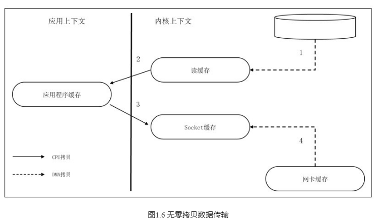
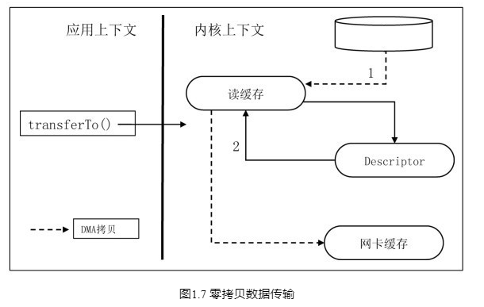
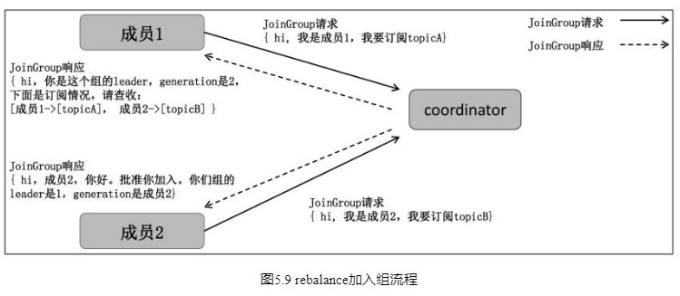
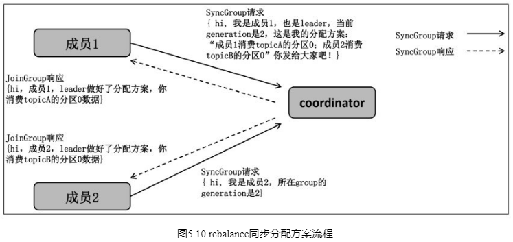
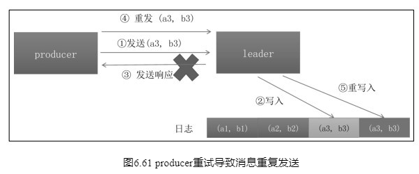
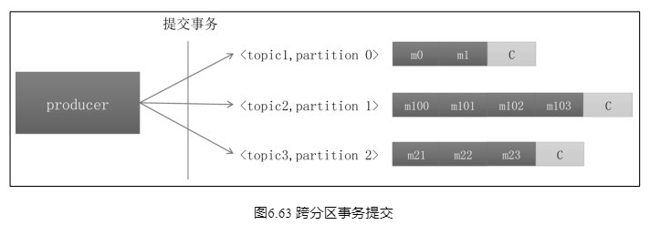
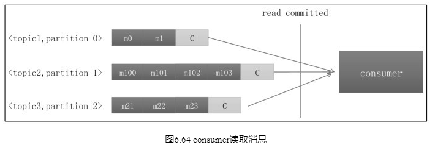
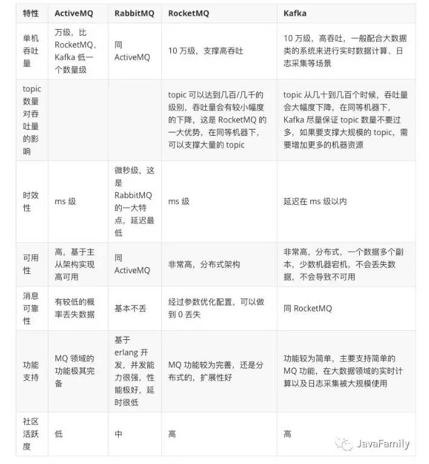

# 前言

整理kafka的相关面试题，题目来源微信公众号。

# 题目

## Kafka的高性能的原因？

Kafka就是依靠下列4点达到了高吞吐量、低延时的设计目标的。

- 大量使用操作系统页缓存，内存操作速度快且命中率高。

- Kafka不直接参与物理I/O操作，而是交由最擅长此事的操作系统来完成。

- 采用追加写入方式，摒弃了缓慢的磁盘随机读/写操作。

- 使用以sendfile为代表的零拷贝技术加强网络间的数据传输效率。

**什么是零拷贝？**

传统的Linux操作系统中的I/O接口是依托于数据拷贝来实现的，但在零拷贝技术出现之前，一个I/O操作会将同一份数据进行多次拷贝，如图所示。数据传输过程中还涉及内核态与用户态的上下文切换，CPU 的开销非常大，因此极大地限制了 OS 高效进行数据传输的能力。

零拷贝技术很好地改善了这个问题：首先在内核驱动程序处理 I/O 数据的时候，它不再需要进行上下文的切换，节省了内核缓冲区与用户态应用程序缓冲区之间的数据拷贝，同时它利用直接存储器访问技术（Direct Memory Access,DMA）执行I/O操作，因此也避免了OS内核缓冲区之间的数据拷贝，故而得名零拷贝，如图所示。

Linux提供的sendfile系统调用实现了这种零拷贝技术，而Kafka的消息消费机制使用的就是sendfile——严格来说是通过Java的FileChannel.transferTo方法实现的。

**什么是DMA？**

DMA，全称Direct Memory Access，即直接存储器访问。DMA传输将数据从一个地址空间复制到另一个地址空间，提供在外设和存储器之间或者存储器和存储器之间的高速数据传输。当CPU初始化这个传输动作，传输动作本身是由DMA控制器来实现和完成的。DMA传输方式无需CPU直接控制传输，也没有中断处理方式那样保留现场和恢复现场过程，通过硬件为RAM和IO设备开辟一条直接传输数据的通道，使得CPU的效率大大提高。

参考：
《Apache Kafka实战》 胡夕 电子工业出版社
[DMA原理介绍](https://zhuanlan.zhihu.com/p/138573828)

## Kafka怎么实现分区策略，怎么实现负载均衡？

producer 提供了分区策略以及对应的分区器（partitioner）供用户使用。随 Kafka 发布的默认partitioner会尽力确保具有相同key的所有消息都会被发送到相同的分区上；若没有为消息指定 key，则该 partitioner会选择轮询的方式来确保消息在 topic的所有分区上均匀分配。

对于有key的消息而言，Java版本producer自带的partitioner会根据murmur2算法计算消息 key的哈希值，然后对总分区数求模得到消息要被发送到的目标分区号。但是有的时候用户可能想实现自己的分区策略，而这又是默认 partitioner 无法提供的，那么此时用户就可以使用producer提供的自定义分区策略了。

若要使用自定义分区机制，用户需要完成两件事情。

（1）在producer程序中创建一个类，实现org.apache.kafka.clients.producer.Partitioner接口。主要分区逻辑在Partitioner.partition中实现。

（2）在用于构造KafkaProducer的Properties对象中设置partitioner.class参数。

参考：
《Apache Kafka实战》 胡夕 电子工业出版社

## Kafka的生产者发送消息流程是怎么样？

producer首先使用一个线程（用户主线程，也就是用户启动 producer的线程）将待发送的消息封装进一个 ProducerRecord 类实例，然后将其序列化之后发送给 partitioner，再由后者确定了目标分区后一同发送到位于 producer程序中的一块内存缓冲区中。而 producer的另一个工作线程（I/O发送线程，也称 Sender线程）则负责实时地从该缓冲区中提取出准备就绪的消息封装进一个批次（batch），统一发送给对应的broker。

参考：
《Apache Kafka实战》 胡夕 电子工业出版社

## Kakfa的ack机制？0，-1,1分别代表什么？

acks参数用于控制 producer生产消息的持久性（durability）。对于 producer而言，Kafka在乎的是“已提交”消息的持久性。一旦消息被成功提交，那么只要有任何一个保存了该消息的副本“存活”，这条消息就会被视为“不会丢失的”。

当 producer发送一条消息给 Kafka集群时，这条消息会被发送到指定 topic分区leader所在的broker上，producer等待从该leader broker返回消息的写入结果（当然并不是无限等待，是有超时时间的）以确定消息被成功提交。这一切完成后producer可以继续发送新的消息。Kafka能够保证的是consumer永远不会读取到尚未提交完成的消息——这和关系型数据库很类似，即在大部分情况下，某个事务的 SQL 查询都不会看到另一个事务中尚未提交的数据。

显然，leader broker何时发送写入结果返还给 producer就是一个需要仔细考虑的问题了，它也会直接影响消息的持久性甚至是 producer 端的吞吐量：producer 端越快地接收到 leader broker响应，它就能越快地发送下一条消息，即吞吐量也就越大。producer端的 acks参数就是用来控制做这件事情的。acks指定了在给 producer发送响应前，leader broker必须要确保已成功写入该消息的副本数。当前acks有3个取值：0、1和all。

- acks = 0：设置成 0 表示 producer 完全不理睬 leader broker 端的处理结果。此时，producer发送消息后立即开启下一条消息的发送，根本不等待leader broker端返回结果。由于不接收发送结果，因此在这种情况下 producer.send 的回调也就完全失去了作用，即用户无法通过回调机制感知任何发送过程中的失败，所以 acks=0时producer并不保证消息会被成功发送。但凡事有利就有弊，由于不需要等待响应结果，通常这种设置下producer的吞吐量是最高的

- acks = all或者-1：表示当发送消息时，leader broker不仅会将消息写入本地日志，同时还会等待 ISR 中所有其他副本都成功写入它们各自的本地日志后，才发送响应结果给producer。显然当设置acks=all时，只要ISR中至少有一个副本是处于“存活”状态的，那么这条消息就肯定不会丢失，因而可以达到最高的消息持久性，但通常这种设置下producer的吞吐量也是最低的。

- acks = 1：是0和 all 折中的方案，也是默认的参数值。producer 发送消息后 leader broker 仅将该消息写入本地日志，然后便发送响应结果给 producer，而无须等待 ISR中其他副本写入该消息。那么此时只要该leader broker一直存活，Kafka就能够保证这条消息不丢失。这实际上是一种折中方案，既可以达到适当的消息持久性，同时也保证了producer端的吞吐量。

总结一下，acks参数控制producer实现不同程度的消息持久性，它有3个取值，对应的优缺点以使用场景如表4.1所示。

在 producer程序中设置 acks非常简单，只需要在构造 KafkaProducer的 Properties对象中增加“acks”属性即可：

值得注意的是，该参数的类型是字符串，因此必须要写成“1”而不是1，否则程序会报错，提示你没有指定正确的参数类型。

参考：
《Apache Kafka实战》 胡夕 电子工业出版社

## Kafka的reblance的流程？在什么情况下会发生reblance？

### 什么是reblance

consumer group的rebalance本质上是一组协议，它规定了一个consumer group是如何达成一致来分配订阅 topic的所有分区的。假设某个组下有20个 consumer实例，该组订阅了一个有着100个分区的 topic。正常情况下，Kafka会为每个 consumer平均分配5个分区。这个分配过程就被称为 rebalance。当 consumer成功地执行 rebalance后，组订阅 topic的每个分区只会分配给组内的一个consumer实例。

新版本consumer使用了Kafka内置的一个全新的组协调协议（group coordination protocol）。对于每个组而言，Kafka的某个broker会被选举为组协调者（group coordinator）。coordinator负责对组的状态进行管理，它的主要职责就是当新成员到达时促成组内所有成员达成新的分区分配方案，即coordinator负责对组执行rebalance操作。

### rebalance触发的条件

组rebalance触发的条件有以下3个。

- 组成员发生变更，比如新 consumer 加入组，或已有 consumer 主动离开组，再或是已有consumer崩溃时则触发rebalance。

- 组订阅 topic 数发生变更，比如使用基于正则表达式的订阅，当匹配正则表达式的新topic被创建时则会触发rebalance。

- 组订阅topic的分区数发生变更，比如使用命令行脚本增加了订阅topic的分区数。

真实应用场景中引发 rebalance最常见的原因就是违背了第一个条件，特别是 consumer崩溃的情况。这里的崩溃不一定就是指 consumer进程“挂掉”或 consumer进程所在的机器宕机。当consumer无法在指定的时间内完成消息的处理，那么coordinator就认为该consumer已经崩溃，从而引发新一轮rebalance。举一个真实的案例，笔者曾经碰到过一个Kafka线上环境，发现该环境中的 consumer group频繁地进行 rebalance，但组内所有 consumer程序都未出现崩溃的情况，另外消费者组的订阅情况也从未发生过变更。经过一番详细的分析，最后笔者定位了原因：该 group 下的 consumer 处理消息的逻辑过重，而且事件处理时间波动很大，非常不稳定，从而导致 coordinator 会经常性地认为某个 consumer 已经挂掉，引发 rebalance。而consumer 程序中包含了错误重试的代码，使得落后过多的 consumer 会不断地申请重新加入组，最后表现为 coordinator不停地对 group执行 rebalance，极大地降低了 consumer端的吞吐量。鉴于目前一次 rebalance 操作的开销很大，生产环境中用户一定要结合自身业务特点仔细调优consumer 参数 session.timeout.ms、max.poll.records 和 max.poll.interval.ms，以避免不必要的rebalance出现。

- session.timeout.ms：

Kafka 社区于0.10.1.0版本对该参数的含义进行了拆分。在该版本及以后的版本中，session.timeout.ms 参数被明确为“coordinator 检测失败的时间”。因此在实际使用中，用户可以为该参数设置一个比较小的值让 coordinator能够更快地检测 consumer崩溃的情况，从而更快地开启 rebalance，避免造成更大的消费滞后（consumer lag）。目前该参数的默认值是10秒。

- max.poll.interval.ms：

如前所述，session.timeout.ms 中“consumer 处理逻辑最大时间”的含义被剥离出来了，Kafka 为这部分含义单独开放了一个参数——max.poll.interval.ms。在一个典型的 consumer 使用场景中，用户对于消息的处理可能需要花费很长时间。这个参数就是用于设置消息处理逻辑的最大时间的。假设用户的业务场景中消息处理逻辑是把消息“落地”到远程数据库中，且这个过程平均处理时间是2分钟，那么用户仅需要将max.poll.interval.ms设置为稍稍大于2分钟的值即可，而不必为session.timeout.ms也设置这么大的值。

通过将该参数设置成实际的逻辑处理时间再结合较低的 session.timeout.ms 参数值，consumer group既实现了快速的consumer崩溃检测，也保证了复杂的事件处理逻辑不会造成不必要的rebalance。

- max.poll.records：

该参数控制单次 poll调用返回的最大消息数。比较极端的做法是设置该参数为1，那么每次 poll只会返回1条消息。如果用户发现 consumer端的瓶颈在 poll速度太慢，可以适当地增加该参数的值。如果用户的消息处理逻辑很轻量，默认的500条消息通常不能满足实际的消息处理速度。

### rebalance分区分配

之前提到过在 rebalance时 group下所有的 consumer都会协调在一起共同参与分区分配，这是如何完成的呢？Kafka 新版本 consumer 默认提供了3种分配策略，分别是 range 策略、round-robin策略和sticky策略。

所谓的分配策略决定了订阅topic的每个分区会被分配给哪个consumer。range策略主要是基于范围的思想。它将单个 topic 的所有分区按照顺序排列，然后把这些分区划分成固定大小的分区段并依次分配给每个 consumer;round-robin策略则会把所有 topic的所有分区顺序摆开，然后轮询式地分配给各个consumer。最新发布的sticky策略有效地避免了上述两种策略完全无视历史分配方案的缺陷，采用了“有黏性”的策略对所有 consumer 实例进行分配，可以规避极端情况下的数据倾斜并且在两次rebalance间最大限度地维持了之前的分配方案。

通常意义上认为，如果 group 下所有 consumer 实例的订阅是相同，那么使用 round-robin会带来更公平的分配方案，否则使用range策略的效果更好。此外，sticky策略在0.11.0.0版本才被引入，故目前使用的用户并不多。新版本 consumer 默认的分配策略是 range。用户根据consumer参数partition.assignment.strategy来进行设置。另外Kafka支持自定义的分配策略，用户可以创建自己的consumer分配器（assignor）。

### rebalance generation

某个consumer group可以执行任意次rebalance。为了更好地隔离每次rebalance上的数据，新版本 consumer设计了 rebalance generation用于标识某次 rebalance。generation这个词类似于JVM分代垃圾收集器中“分代”（严格来说，JVM GC使用的是 generational）的概念。笔者把它翻译成“届”，表示rebalance之后的一届成员，在consumer中它是一个整数，通常从0开始。Kafka引入consumer generation主要是为了保护consumer group的，特别是防止无效offset提交。比如上一届的 consumer成员由于某些原因延迟提交了 offset，但 rebalance之后该 group产生了新一届的group成员，而这次延迟的offset提交携带的是旧的generation信息，因此这次提交会被consumer group拒绝。

### rebalance流程

rebalance 本质上是一组协议。group 与 coordinator 共同使用这组协议完成group的rebalance。最新版本Kafka中提供了下面5个协议来处理rebalance相关事宜。

- JoinGroup请求：consumer请求加入组。

- SyncGroup请求：group leader把分配方案同步更新到组内所有成员中。

- Heartbeat请求：consumer定期向coordinator汇报心跳表明自己依然存活。

- LeaveGroup请求：consumer主动通知coordinator该consumer即将离组。

- DescribeGroup 请求：查看组的所有信息，包括成员信息、协议信息、分配方案以及订阅信息等。该请求类型主要供管理员使用。coordinator不使用该请求执行rebalance。

在rebalance过程中，coordinator主要处理consumer发过来的JoinGroup和SyncGroup请求。当consumer主动离组时会发送LeaveGroup请求给coordinator。

在成功rebalance之后，组内所有consumer都需要定期地向coordinator发送Heartbeat请求。而每个 consumer也是根据 Heartbeat请求的响应中是否包含 REBALANCE_IN_PROGRESS来判断当前group是否开启了新一轮rebalance。

consumer group在执行rebalance之前必须首先确定coordinator所在的broker，并创建与该broker 相互通信的 Socket 连接。确定 coordinator 的算法与确定 offset 被提交到__consumer_offsets目标分区的算法是相同的。算法如下。

- 计算 Math.abs（groupID.hashCode） % offsets.topic.num.partitions参数值（默认是 50），假设是10。

- 寻找__consumer_offsets分区10的leader副本所在的broker，该broker即为这个group的coordinator。

成功连接 coordinator之后便可以执行 rebalance操作。目前 rebalance主要分为两步：加入组和同步更新分配方案。

- 加入组 ：这一步中组内所有 consumer（即 group.id 相同的所有 consumer 实例）向coordinator发送 JoinGroup请求。当收集全 JoinGroup请求后，coordinator从中选择一个consumer担任group的leader，并把所有成员信息以及它们的订阅信息发送给leader。特别需要注意的是，group 的 leader 和 coordinator 不是一个概念。leader 是某个consumer 实例，coordinator 通常是 Kafka 集群中的一个 broker。另外 leader 而非coordinator负责为整个group的所有成员制定分配方案。

- 同步更新分配方案 ：这一步中 leader 开始制定分配方案，即根据前面提到的分配策略决定每个consumer都负责哪些topic的哪些分区。一旦分配完成，leader会把这个分配方案封装进 SyncGroup 请求并发送给 coordinator。比较有意思的是，组内所有成员都会发送 SyncGroup请求，不过只有 leader发送的 SyncGroup请求中包含了分配方案。coordinator 接收到分配方案后把属于每个 consumer 的方案单独抽取出来作为SyncGroup请求的response返还给各自的consumer。下图分别描述了加入组和同步分配方案的流程。

参考：
《Apache Kafka实战》 胡夕 电子工业出版社

## 如何保证消息只消费一次？如何保证消息不丢失？

### 只消费一次

consumer端需要为每个它要读取的分区保存消费进度，即分区中当前最新消费消息的位置。该位置就被称为位移（offset）。consumer 需要定期地向 Kafka 提交自己的位置信息，实际上，这里的位移值通常是下一条待消费的消息的位置。假设 consumer 已经读取了某个分区中的第N条消息，那么它应该提交位移值为N，因为位移是从0开始的，位移为N的消息是第N+1条消息。这样下次 consumer 重启时会从第 N+1 条消息开始消费。总而言之，offset 就是consumer端维护的位置信息。

offset 对于 consumer 非常重要，因为它是实现消息交付语义保证（message delivery semantic） 的基石。常见的3种消息交付语义保证如下。

- 最多一次（at most once）处理语义：消息可能丢失，但不会被重复处理。

- 最少一次（at least once）处理语义：消息不会丢失，但可能被处理多次。

- 精确一次（exactly once）处理语义：消息一定会被处理且只会被处理一次。

显然，若consumer在消息消费之前就提交位移，那么便可以实现 at most once——因为若consumer 在提交位移与消息消费之间崩溃，则 consumer 重启后会从新的 offset 位置开始消费，前面的那条消息就丢失了。相反地，若提交位移在消息消费之后，则可实现 at least once 语义。由于Kafka没有办法保证这两步操作可以在同一个事务中完成，因此 Kafka默认提供的就是at least once的处理语义。好消息是Kafka社区已于0.11.0.0版本正式支持事务以及精确一次处理语义。

位移提交策略对于提供消息交付语义至关重要。默认情况下，consumer是自动提交位移的，自动提交间隔是5秒。这就是说若不做特定的设置，consumer程序在后台自动提交位移。通过设置auto.commit.interval.ms参数可以控制自动提交的间隔。

自动位移提交的优势是降低了用户的开发成本使得用户不必亲自处理位移提交；劣势是用户不能细粒度地处理位移的提交，特别是在有较强的精确一次处理语义时。在这种情况下，用户可以使用手动位移提交。

所谓的手动位移提交就是用户自行确定消息何时被真正处理完并可以提交位移。在一个典型的 consumer 应用场景中，用户需要对 poll 方法返回的消息集合中的消息执行业务级的处理。用户想要确保只有消息被真正处理完成后再提交位移。如果使用自动位移提交则无法保证这种时序性，因此在这种情况下必须使用手动提交位移。设置使用手动提交位移非常简单，仅仅需要在构建 KafkaConsumer 时设置 enable.auto.commit=false，然后调用 commitSync 或commitAsync方法即可。一段典型的手动提交代码如下：

上面的代码中 consumer 持续消费一批消息并把它们加入一个缓冲区中。当积累了足够多的消息（本例为500条）便统一插入到数据库中。只有被成功插入到数据库之后，这些消息才算是真正被处理完。此时调用 KafkaConsumer.commitSync 方法进行手动位移提交，然后清空缓冲区以备缓存下一批消息。若在成功插入数据库之后但提交位移语句执行之前 consumer 程序崩溃，由于未成功提交位移，consumer重启后会重新处理之前的一批消息并将它们再次插入到数据库中，从而造成消息多次被消费。

### 如何保证消息不丢失

- producer配置

block.on.buffer.full = true

实际上这个参数在 Kafka 0.9.0.0版本已经被标记为“deprecated”，并使用 max.block.ms参数替代，但这里还是推荐用户显式地设置它为 true，使得内存缓冲区被填满时 producer处于阻塞状态并停止接收新的消息而不是抛出异常；否则producer生产速度过快会耗尽缓冲区。新版本Kafka（0.10.0.0之后）可以不用理会这个参数，转而设置max.block.ms即可。

acks = all

设置 acks为 all很容易理解，即必须要等到所有 follower都响应了发送消息才能认为提交成功，这是producer端最强程度的持久化保证。

retries = Integer.MAX_VALUE

设置成 MAX_VALUE纵然有些极端，但其实想表达的是 producer要开启无限重试。用户不必担心producer会重试那些肯定无法恢复的错误，当前producer只会重试那些可恢复的异常情况，所以放心地设置一个比较大的值通常能很好地保证消息不丢失。

max.in.flight.requests.per.connection = 1

设置该参数为1主要是为了防止 topic 同分区下的消息乱序问题。这个参数的实际效果其实限制了producer在单个broker连接上能够发送的未响应请求的数量。因此，如果设置成1，则producer在某个broker发送响应之前将无法再给该broker发送PRODUCE请求。

使用带有回调机制的send

不要使用KafkaProducer中单参数的send方法，因为该send调用仅仅是把消息发出而不会理会消息发送的结果。如果消息发送失败，该方法不会得到任何通知，故可能造成数据的丢失。实际环境中一定要使用带回调机制的send版本，即KafkaProducer.send（record,callback）。

Callback逻辑中显式立即关闭producer

在 Callback的失败处理逻辑中显式调用 KafkaProducer.close（0）。这样做的目的是为了处理消息的乱序问题。若不使用 close（0），默认情况下 producer 会被允许将未完成的消息发送出去，这样就有可能造成消息乱序。

- broker配置

unclean.leader.election.enable = false

关闭unclean leader选举，即不允许非ISR中的副本被选举为leader，从而避免broker端因日志水位截断而造成的消息丢失。

replication.factor ＞= 3

设置成3主要是参考了 Hadoop及业界通用的三备份原则，其实这里想强调的是一定要使用多个副本来保存分区的消息。

min.insync.replicas ＞ 1

用于控制某条消息至少被写入到ISR中的多少个副本才算成功，设置成大于1是为了提升producer端发送语义的持久性。记住只有在producer端acks被设置成all或-1时，这个参数才有意义。在实际使用时，不要使用默认值。

确保replication.factor ＞ min.insync.replicas

若两者相等，那么只要有一个副本挂掉，分区就无法正常工作，虽然有很高的持久性但可用性被极大地降低了。推荐配置成replication.factor = min.insyn.replicas + 1

如果是poll之后就立刻提交位移，然后再持久化消息到数据库，这样可以保障最多消费一次。

参考：
《Apache Kafka实战》 胡夕 电子工业出版社

### 如果kafka消费者消费超时会发生什么？怎么避免kafka的消费超时？

可能触发rebalance。真实应用场景中引发 rebalance最常见的原因就是consumer崩溃的情况。这里的崩溃不一定就是指 consumer进程“挂掉”或 consumer进程所在的机器宕机。当consumer无法在指定的时间内完成消息的处理，那么coordinator就认为该consumer已经崩溃，从而引发新一轮rebalance。举一个真实的案例，笔者曾经碰到过一个Kafka线上环境，发现该环境中的 consumer group频繁地进行 rebalance，但组内所有 consumer程序都未出现崩溃的情况，另外消费者组的订阅情况也从未发生过变更。经过一番详细的分析，最后笔者定位了原因：该 group 下的 consumer 处理消息的逻辑过重，而且事件处理时间波动很大，非常不稳定，从而导致 coordinator 会经常性地认为某个 consumer 已经挂掉，引发 rebalance。而consumer 程序中包含了错误重试的代码，使得落后过多的 consumer 会不断地申请重新加入组，最后表现为 coordinator不停地对 group执行 rebalance，极大地降低了 consumer端的吞吐量。

为了避免超时，需要合理设置max.poll.interval.ms、max.poll.records，具体含义参见“Kafka的reblance的流程”问题。

参考：
《Apache Kafka实战》 胡夕 电子工业出版社

## Kafka消息的格式？

Kafka的实现方式本质上是使用 Java NIO的 ByteBuffer来保存消息，同时依赖文件系统提供的页缓存机制，而非依靠 Java 的堆缓存。毕竟在大部分情况下，我们在堆上保存的对象在写入文件系统后很有可能在操作系统的页缓存中仍保留着，从而会造成资源的浪费。

另外，ByteBuffer 是紧凑的二进制字节结构，而不需要 padding 操作，因此省去了很多不必要的对象开销。根据 Kafka官网的测试数据，在一台 32GB内存的机器上，Kafka几乎可以用到 28～30GB的物理内存而不用担心 Java GC的糟糕性能。若使用 ByteBuffer来保存相同的消息格式，经笔者测试，同一条消息比起纯 Java 堆的实现方案大概可节省近 40%的空间占用，好处不言而喻。除此之外，ByteBuffer方案还有着非常好的扩展性。

V2版本的消息格式比V1可以节省更多的空间。

参考：
《Apache Kafka实战》 胡夕 电子工业出版社

## Zookeeper在kafka中有哪些作用？

尽管新版本producer和 consumer都已不再需要连接ZooKeeper了，但Kafka依然重度依赖于ZooKeeper。ZooKeeper从某种程度上甚至可以说是Kafka的“单点失效”组件。一旦ZooKeeper服务挂掉，Kafka集群的很多组件也就无法正常工作。

Kafka依赖Apache ZooKeeper实现自动化的服务发现与成员管理。每当一个broker启动时，它会将自己注册到ZooKeeper下的一个节点。

每个 broker在 ZooKeeper下注册节点的路径是 chroot/brokers/ids/<broker.id>。如果没有配置 chroot，则路径是/brokers/ids/<broker.id>。是否配置了 chroot取决于 server.properties中的 zookeeper.connect参数是否设置了 chroot。下图使用 ZooKeeper提供的客户端直接访问ZooKeeper服务器去获取该broker的注册信息。

注意图中底部的ephemeralOwner值，该值不是0，表示这是一个ZooKeeper中的临时节点（ephemeral node）。ZooKeeper 临时节点的生命周期和客户端会话绑定。如果客户端会话失效，该临时节点就会自动被清除掉。Kafka正是利用ZooKeeper临时节点来管理broker生命周期的。broker启动时在ZooKeeper中创建对应的临时节点，同时还会创建一个监听器（listener）监听该临时节点的状态；一旦 broker 启动后，监听器会自动同步整个集群信息到该 broker上；而一旦该 broker崩溃，它与 ZooKeeper的会话就会失效，导致临时节点被删除，监听器被触发，然后处理 broker 崩溃的后续事宜。这就是 Kafka 管理集群及其成员的主要流程。

参考：
《Apache Kafka实战》 胡夕 电子工业出版社

## 集群的副本同步机制？

一个 Kafka分区本质上就是一个备份日志，即利用多份相同的备份共同提供冗余机制来保持系统高可用性。这些备份在 Kafka 中被称为副本（replica）。Kafka 把分区的所有副本均匀地分配到所有broker上，并从这些副本中挑选一个作为leader副本对外提供服务，而其他副本被称为 follower副本，只能被动地向 leader副本请求数据，从而保持与 leader副本的同步。

假如 leader 副本永远工作正常，那么其实不需要 follower 副本。但现实总是残酷的，Kafka leader 副本所在的 broker 可能因为各种各样的原因而随时宕机。一旦发生这种情况，follower副本会竞相争夺成为新leader的权力。显然不是所有的follower都有资格去竞选leader。前面说过，follower被动地向 leader请求数据。对于那些落后 leader进度太多的 follower而言，它们是没有资格竞选 leader 的，毕竟它们手中握有的数据太旧了，如果允许它们成为 leader，会造成数据丢失，而这对clients而言是灾难性的。鉴于这个原因，Kafka引入了ISR的概念。

所谓 ISR，就是 Kafka集群动态维护的一组同步副本集合（in-sync replicas）。每个 topic分区都有自己的ISR列表，ISR中的所有副本都与leader保持同步状态。值得注意的是，leader副本总是包含在ISR中的，只有ISR中的副本才有资格被选举为leader。而producer写入的一条 Kafka 消息只有被 ISR 中的所有副本都接收到，才被视为 “已提交”状态。由此可见，若ISR中有N个副本，那么该分区最多可以忍受N-1个副本崩溃而不丢失已提交消息。

follower副本只做一件事情：向 leader副本请求数据。

- 起始位移（base offset）：表示该副本当前所含第一条消息的offset。

- 高水印值（high watermark,HW）：副本高水印值。它保存了该副本最新一条已提交消息的位移。leader 分区的 HW 值决定了副本中已提交消息的范围，也确定了consumer能够获取的消息上限，超过 HW值的所有消息都被视为“未提交成功的”，因而consumer是看不到的。另外值得注意的是，不是只有leader副本才有HW值。实际上每个 follower副本都有 HW值，只不过只有 leader副本的 HW值才能决定 clients能看到的消息数量罢了。

- 日志末端位移（log end offset,LEO）：副本日志中下一条待写入消息的 offset。所有副本都需要维护自己的LEO信息。每当leader副本接收到producer端推送的消息，它会更新自己的LEO（通常是加1）。同样，follower副本向leader副本请求到数据后也会增加自己的 LEO。事实上只有 ISR中的所有副本都更新了对应的 LEO之后，leader副本才会向右移动HW值表明消息写入成功。

下面结合一个具体的示例来说明。假设图6.16中的Kafka集群当前只有一个topic，该topic只有一个分区，分区共有3个副本，因此ISR中也是这3个副本。该topic当前没有任何数据。由于没有任何数据，因此3个副本的LEO都是0,HW值是0。

现有一个producer向broker1所在的leader副本发送了一条消息，接下来会发生什么呢？

（1）broker1上的leader副本接收到消息，把自己的LEO值更新为1。

（2）broker2和broker3上的follower副本各自发送请求给broker1。

（3）broker1分别把该消息推送给follower副本。

（4）follower副本接收到消息后各自更新自己的LEO为1。

（5）leader副本接收到其他 follower副本的数据请求响应（response）之后，更新 HW值为1。此时位移为0的这条消息可以被consumer消费。

对于设置了 acks=-1（acks的含义请参考第 4章）的 producer而言，只有完整地做完上面所有的5步操作，producer才能正常返回，这也标志着这条消息发送成功。

**follower副本与 leader副本不同步如何界定？**

自 0.9.0.0版本之后，Kafka去掉了之前的 replica.lag.max.messages参数，改用统一的参数同时检测由于慢以及进程卡壳而导致的滞后（lagging）——即 follower副本落后 leader副本的时间间隔。这个唯一的参数就是 replica.lag.time.max.ms，默认值是 10 秒。对于“请求速度追不上”的情况，检测机制也发生了变化——如果一个 follower副本落后 leader的时间持续性地超过了这个参数值，那么该 follower 副本就是“不同步”的。这样即使出现刚刚提到的producer瞬时峰值流量，只要 follower 不是持续性落后，它就不会反复地在 ISR中移进、移出。

0.9.0.0版本之前，Kafka提供了一个参数replica.lag.max.messages，用于控制follower副本落后 leader副本的消息数。一旦超过这个消息数，则视为该 follower为“不同步”状态，从而需要被Kafka“踢出”ISR。这个参数由于不好配置，生产环境可能存在波动性，所以可能导致反复ISR变动，后续这个参数被废弃。

参考：
《Apache Kafka实战》 胡夕 电子工业出版社

## Kafka怎么判断一个broker是否还存活？

参考“Zookeeper在kafka中有哪些作用”。

## Kafka消息的幂等性和事务是怎么实现的？

下面分别从 producer和 consumer两个角度来分析 Kafka的消息交付语义。对 producer而言，Kafka 引入已提交消息（committed message）的概念。一旦消息被成功地提交到日志文件，只要至少存在一个可用的包含该消息的副本，那么这条消息就永远不会丢失。由此可见 Kafka producer提供的不是at most once语义，但它是at least once还是exactly once呢？

在0.11.0.0版本之前，Kafka producer默认提供的是at least once语义。设想这样的一个场景，当producer向broker发送新消息后，分区leader副本所在的broker成功地将该消息写入本地磁盘，然后发送响应给 producer。此时假设网络出现故障导致该响应没有发送成功，那么未接到响应的producer会认为该消息请求失败从而开启重试操作。若重试后网络恢复正常，那么显然同一条消息被写入到日志两次。在比较极端的情况下，同一条消息可能会被发送多次。具体流程如图所示。

因此我们说Kafka producer默认提供的就是at least once语义。

好消息是 Kafka 0.11.0.0版本推出了幂等性 producer和对事务的支持，从而完美地解决了这种消息重复发送的问题。

对 consumer 端而言，我们知道，相同日志下所有的副本都应该有相同的内容以及相同的当前位移值。consumer通过consumer位移自行控制和标记日志读取的进度。如果 consumer程序崩溃，那么替代它的新程序实例就必须要接管这个 consumer 位移，即从崩溃时读取位置继续开始消费。若要判断consumer到底支持什么交付语义，位移提交的时机就显得至关重要。

一种方式是 consumer 首先获取若干消息，然后提交位移，之后再开始处理消息。这种方法下若consumer在提交位移后处理消息前崩溃，那么它实现的就是at most once语义，因为消息有可能不被处理，就算处理了最多也只会是一次。

另一种方式是 consumer 获取了若干消息，处理到最后提交位移。显然，consumer 保证只有在消息被处理完成后才提交位移，因此它实现的就是 at least once 语义，因为消息处理过程中如果出现错误从而引发重试，那么某些消息就可能被处理多次。

那么如何实现 consumer端的 EOS（精确一次处理语义）呢？主要是依赖0.11.0.0版本引入的事务。

### 幂等性

如果要启用幂等性 producer 以及获取其提供的 EOS 语义，用户需要显式地设置producer端的新参数enable.idempotence为true。

幂等性 producer的设计思路类似于 TCP的工作方式。发送到 broker端的每批消息都会被赋予一个序列号（sequence number）用于消息去重。但是和 TCP 不同的是，这个序列号不会被丢弃，相反 Kafka会把它们保存在底层日志中，这样即使分区的 leader副本挂掉，新选出来的 leader broker也能执行消息去重工作。保存序列号只需要额外几字节，因此整体上对 Kafka消息保存开销的影响并不大。

除了序列号，Kafka还会为每个producer实例分配一个producer id（下称PID）。producer在初始化时必须分配一个 PID。PID 分配的过程对用户来说是完全透明的，因此不会为用户所见。消息要被发送到的每个分区都有对应的序列号值，它们总是从0开始并且严格单调增加。对于 PID、分区和序列号的关系，用户可以设想一个 Map,key 就是（PID，分区号）,value就是序列号。即每对（PID，分区号）都有对应的序列号值。若发送消息的序列号小于或等于broker端保存的序列号，那么broker会拒绝这条消息的写入操作。

这种设计确保了即使出现重试操作，每条消息也只会被保存在日志中一次。不过，由于每个新的 producer实例都会被分配不同的 PID，当前设计只能保证单个 producer实例的 EOS语义，而无法实现多个producer实例一起提供EOS语义。这一点要特别注意。

### 事务

对事务的支持是 Kafka 实现 EOS 的第二个利器。引入事务使得 clients 端程序（无论是producer还是consumer）能够将一组消息放入一个原子性单元中统一处理。

处于事务中的这组消息能够从多个分区中消费，也可以发送到多个分区中去。重要的是不论是发送还是消费，Kafka 都能保证它们是原子性的，即所有的写入操作要么全部成功，要么全部失败。当然对于consumer而言，EOS语义的支持要弱一些，这是由consumer本身的特性决定的。也就是说，consumer 有可能以原子性的方式消费这批消息，也有可能是非原子性的。设想consumer总是需要 replay某些消息，如果是这样的使用场景，那么对于 EOS的支持就要弱很多。

Kafka为实现事务要求应用程序必须提供一个唯一的 id来表征事务。这个 id被称为事务 id，或 TransactionalId，它必须在应用程序所有的会话上是唯一的。值得注意的是，TransactionalId与上面所说的PID是不同的，前者是由用户显式提供的，而后者是prodcuer自行分配的。

当提供了TransactionalId后，Kafka就能确保：

- 跨应用程序会话间的幂等发送语义。具体的做法与新版本 consumer的 generation概念类似，使用具有版本含义的generation来隔离旧事务的操作。

- 支持跨会话间的事务恢复。如果某个 producer 实例挂掉了，Kafka 能够保证下一个实例首先完成之前未完成的事务，从而总是保证状态的一致性。

如果以consumer的角度而言，如前所述，事务的支持要弱一些，原因如下。

- 对于compacted的topic而言，事务中的消息可能已经被删除了。

- 事务可能跨多个日志段（log segment），因此若老的日志段被删除，用户将丢失事务中的部分消息。

- consumer程序可能使用 seek方法定位事务中的任意位置，也可能造成部分消息的丢失。

- consumer可能选择不消费事务中的所有消息，即无法保证读取事务的全部消息。

下面分别讨论一下事务是如何在 producer和 consumer端实现的。下图给出了原子性写入多个分区的流程。

上图中的C是一类特殊的消息，即控制消息（control message）。事务控制消息和普通的 Kafka消息一样，只是在消息属性字段（attribute field）中专门使用1位来表征它是 control message。当前的 control message 总有两类——COMMIT 和 ABORT，分别表示事务提交和事务终止。将 control message保存到 Kafka日志中的目的就是让 consumer能够识别事务边界，从而整体读取某个事务下的所有消息，如下图所示。

那么，用户如何应用事务API呢？下面的代码给出了一个典型的事务API使用范例：

就 producer 而言，开启事务的第一步就是初始化事务状态 initTransactions（），然后调用beginTranscation 正式开始事务，上面的代码中的 sendOffsetsToTransaction 方法适用于事务中同时包含消息生产和消息消费的场景。当调用该方法时，Kafka 会确保只有事务被提交成功才消费给定的位移。

参考：
《Apache Kafka实战》 胡夕 电子工业出版社

## 如果leader crash时，ISR为空怎么办？

配置参数：unclean.leader.election
　true（默认）：允许不同步副本成为leader，由于不同步副本的消息较为滞后，此时成为leader，可能会出现消息不一致的情况。
　false：不允许不同步副本成为leader，此时如果发生ISR列表为空，会一直等待旧leader恢复，降低了可用性。

参考：
[Kafka 总结](https://blog.csdn.net/qq_42482205/article/details/106788440)

## Kafka是怎么实现选举的？哪些地方需要选举？

Kafka中的选举大致可以分为三大类：控制器的选举、分区leader的选举以及消费者相关的选举。

### controller选举

集群控制器组件（BrokerController）：
它是 Kafka 的核心组件。它的主要作用是在 ZooKeeper 的帮助下管理和协调整个 Kafka 集群，集群中的每个 broker 都可以称为 controller，但是在 Kafka 集群启动后，只有一个 broker 会成为 Controller 。
Controller Broker的主要职责有很多，主要是一些管理行为，主要包括以下几个方面：
• 创建、删除主题，增加分区并分配leader分区
• 集群Broker管理（新增 Broker、Broker 主动关闭、Broker 故障)
• preferred leader选举

分区重分配Kafka是基于zookeeper的，controller的选择也是在zookeeper上完成的。
Kafka 当前选举控制器的规则是：Kafka 集群中第一个启动的 broker 通过在 ZooKeeper 里创建一个临时节点 /controller 让自己成为 controller 控制器。其他 broker 在启动时也会尝试创建这个节点，但是由于这个节点已存在，所以后面想要创建 /controller 节点时就会收到一个 节点已存在 的异常。然后其他 broker 会在这个控制器上注册一个 ZooKeeper 的 watch 对象，/controller节点发生变化时，其他 broker 就会收到节点变更通知。这种方式可以确保只有一个控制器存在。那么只有单独的节点一定是有个问题的，那就是单点问题。

如果控制器关闭或者与 ZooKeeper 断开链接，ZooKeeper 上的临时节点就会消失。集群中的其他节点收到 watch 对象发送控制器下线的消息后，其他 broker 节点都会尝试让自己去成为新的控制器。其他节点的创建规则和第一个节点的创建原则一致，都是第一个在 ZooKeeper 里成功创建控制器节点的 broker 会成为新的控制器，那么其他节点就会收到节点已存在的异常，然后在新的控制器节点上再次创建 watch 对象进行监听。

### 分区leader的选举

Kafka实现高可用的方式是冗余副本，也就是每个分区只会有一个leader对外提供读写服务，其余broker上副本向leader同步数据。这样就涉及一个分区leader的选举

创建分区可以指定leader。如果不指定，则为分区的第一个副本，显然当leader宕机后不能使用这种选主方法。

ISR
kafka副本存在与leader不同步的风险，那么哪些副本是同步的，如何辨别？基于这个想法，kafka引入了ISR（a set of In-Sync Replicas），副本集合。ISR中的副本都是与Leader同步的副本，相反，不在ISR中的追随者副本被认为是与Leader不同步的。那么ISR到底需要满足什么条件才能进入呢。

broker上的消息消费使用了偏移量来标记，通过查看每个跟随者请求的最新偏移量，首领就会知道每个跟随者复制的进度。同时跟随者会对leader进行新消息的请求，如果跟随者在 10s 内没有请求任何消息，或者虽然跟随者已经发送请求，但是在 10s 内没有收到消息，就会被认为是不同步的。如果一个副本没有与领导者同步，那么在领导者掉线后，这个副本将不会称为领导者，因为这个副本的消息不是全部的，跟随者副本就会从 ISR 被剔除。倘若该副本后面慢慢地追上了领导者的进度，那么它是能够重新被加回 ISR 的。这也表明，ISR 是一个动态调整的集合，而非静态不变的。

所以如果leader宕机，Controller会从ISR中选择下一个分区Leader，这里还有个问题，ISR是个集合，是可能为空的。

Unclean 领导者选举
既然ISR可以动态调整，那么就会出现ISR为空的情况。ISR为空的情况就代表Leader副本也挂掉了。那么kafka就需要重新选举新的Leader。
那么该怎么选举Leader呢？

kafka把所有不在ISR的存活副本都成为非同步副本。
通常来说，非同步副本落后Leader太多，因此，如果选择这些副本为新的Leader，就可能出现数据的丢失。在kafka，选举Leader这种过程被成为Unclean。由Broker端参数unclean.leader.election.enable控制是否允许Unclean领导者选举。
开启 Unclean 领导者选举可能会造成数据丢失，但好处是，它使得分区 Leader 副本一直存在，不至于停止对外提供服务，因此提升了高可用性。反之，禁止 Unclean 领导者选举的好处在于维护了数据的一致性，避免了消息丢失，但牺牲了高可用性。
可以根据你的实际业务场景决定是否开启 Unclean 领导者选举。不过并不建议开启它，毕竟我们还可以通过其他的方式来提升高可用性。如果为了这点儿高可用性的改善，牺牲了数据一致性，那就非常不值当了。

### 消费者leader选举

群组协调器（Coordinator）：群组协调器是一个能够从消费者群组中收到所有消费者发送心跳消息的 broker。群组协调器可以满足 JoinGroup 请求并提供有关消费者组的元数据信息，例如分配和偏移量。群组协调器还有权知道所有消费者的心跳，

消费者领导者： 每个消费者群组中都有一个领导者，负责分区消费策略的选择

消费者leader的选择比较简单，当重平衡开始时，第一个给协调器发JoinGroup请求的就会成为leader

**分区消费策略选择**

每个给协调器发送JoinGroup消息的消费者都会在其中附带自己支持的分区消费策略，协调器在收集后会给消费者leader，并由leaderconsumer进行选择那么具体怎么选择呢？

1.收集各个消费者所支持的所有分配策略，组成候选集candidates。
2.每个消费者从候选集candidates中找出第一个自身所支持的策略，为这个策略投上一票。
3.计算候选集中各个策略的选票数，选票数最多的策略即为当前消费组的分配策略。
如果某个消费者并不支持所选举出的分配策略，那么就会报错。

参考：
[Kafka中涉及的四种选举](https://blog.csdn.net/qq_41308860/article/details/119147409)

## 如何设计保证kakfa中有某个特征的消息的是严格按照顺序消费的？

在Kafka中，只保证Partition(分区)内有序，不保证Topic所有分区都是有序的。

所以 Kafka 要保证消息的消费顺序，可以有2种方法：

1. 1个Topic（主题）只创建1个Partition(分区)，这样生产者的所有数据都发送到了一个Partition(分区)，保证了消息的消费顺序。
2. 生产者在发送消息的时候指定要发送到哪个Partition(分区)。

**单一partition若碰到如下场景还是需要调整参数**

场景一：设置了retries>0,并且max.in.flight.requests.per.connection>1

1、retries
生产者从服务器收到的错误有可能是临时性的错误（比如分区找不到首领）。在这种情况下，retries参数的值决定了生产者可以重发消息的次数，
如果达到这个次数，生产者会放弃重试并返回错误。默认情况下，生产者会在每次重试之间等待 100ms，不过可以通过 retry.backoff.ms 参数来改变这个时间间隔。建议在设置重试次数和重试时间间隔之前，先测试一下恢复一个崩溃节点需要多少时间（比如所有分区选举出首领需要多长时间），让总的重试时间比 Kafka 集群从崩溃中恢复的时间长，否则生产者会过早地放弃重试。不过有些错误不是临时性错误，没办法通过重试来解决（比如“消息太大”错误）。

2、max.in.flight.requests.per.connection
该参数指定了生产者在收到服务器响应之前可以发送多少个消息。它的值越高，就会占用越多的内存，不过也会提升吞吐量。
把它设为 1 可以保证消息是按照发送的顺序写入服务器的，即使发生了重试。这种场景下无法保障单一partition的有序，一般来说要保障消息的有序性，对于消息的可靠性也是有要求的，
所以一般retries可以设置为大于0，但是max.in.flight.requests.per.connection设置为1即可，不过这样就有一个问题，导致了消息的吞吐量大大降低。

场景二：需要提升吞吐量max.in.flight.requests.per.connection设置大于1

此场景下业务要保障消息的吞吐量，那么max.in.flight.requests.per.connection必然就会选择更大的一个阈值，但是此场景还能保障消息有序性吗？答案是肯定的，
可以设置enable.idempotence=true，开启生产者的幂等生产，可以解决顺序性问题，并且允许max.in.flight.requests.per.connection设置大于1

参考：
[Kafka 如何保证消息的消费顺序一致性](https://www.cnblogs.com/-courage/p/15252760.html)

## 有了解哪些消息队列？能否做下对比？

### 消息队列能干什么？

 消息队列作为高并发系统的核心组件之一，能够帮助业务系统解构提升开发效率和系统稳定性。主要具有以下：作用：提升性能、系统解耦、流量消峰

1. 提升性能
一个请求调用了A、B两个系统，执行业务逻辑各需要20 、200毫秒，那么处理这个请求一共需要220毫秒。引入MQ后：发送消息给MQ的速度是很快的（没有业务逻辑、没有数据库操作），所以引入MQ后，20多毫秒就可以返回结果给用户了。
2. 系统解耦
系统A和系统B通过同步调用的模式耦合在了一起，一旦系统B出现故障，很可能会影响系统A也有故障，而且系统A还得去关心系统B的故障，去处理对应的异常，这是很麻烦的。
引入MQ后：B如果出现了故障，对系统A根本没影响，系统A也感觉不到,B自己处理自己的问题！
3. 流量消峰
如果高并发访问系统A（A没有数据库操作），A调用B（B有数据库操作），那么瓶颈在B，因为数据库操作是比较耗时的。
同样的机器配置下，如果数据库可以抗每秒6000请求，MQ至少可以抗每秒几万请求。因为数据库复杂，需要支持事务、复杂的SQL查询等
引入MQ后：A系统依赖支持高并发的MQ，B也依赖MQ，此时B可以用自己的合适的速度访问MQ，即B系统流量被消峰了。整个系统的性能由A决定，而不速度慢的B决定。

### 主流MQ对比

- 吞吐量

Rabbitmq，Activitymq单机吞吐量是万级别的
Rocketmq、kafka是十万级别的

- 消息丢失

Rabbitmq基本不丢失消息
Activitymq有较低的概率丢失数据
Rocketmq、kafka经过参数优化配置，可以做到0丢失

- 部署方式

Rabbitmq，Activitymq不如Rocketmq、kafka，他们都是高可用的分布式架构，而且数据多个副本的数据也能做到0丢失。

- Rocketmq、kafka优势

(1)、RocketMQ（阿里开源的），git活跃度还可以。基本上你push了自己的bug确认了有问题都有阿里大佬跟你试试解答并修复的。
(2)、Kafka，这是个大哥，号称最好的mq。应用于大数据领域，公司的日志采集，实时计算等场景，都离不开他的身影，他基本上算得上是世界范围级别的消息队列标杆了。

参考：
[几种消息中间件的对比](https://juejin.cn/post/6844904168797241358)

## 调优

### 吞吐量

9

# 参考

[微信公众号:我的IT技术路](https://mp.weixin.qq.com/s/54_bMeUwjxk-8DHa90heNQ)