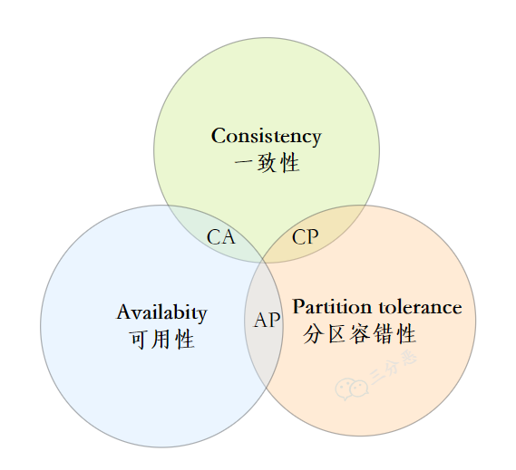
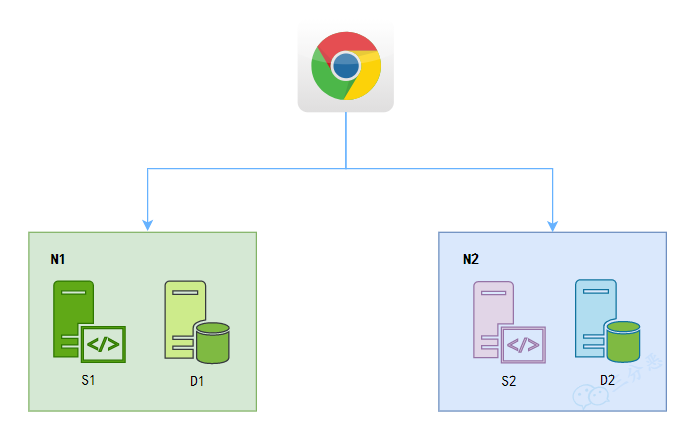

# 前言

整理分布式的相关面试题，题目来源微信公众号。

# 题目

## 请简述一下CAP理论，我们常见的中间件分别侧重点是什么？简述一下BASE理论？什么是强一致性，弱一致性，最终一致性

### CAP理论

CAP原则又称CAP定理，指的是在一个分布式系统中，Consistency（一致性）、 Availability（可用性）、Partition tolerance（分区容错性）这三个基本需求，最多只能同时满足其中的2个。

一致性 ：数据在多个副本之间能够保持一致的特性。
可用性：系统提供的服务一直处于可用的状态，每次请求都能获得正确的响应。
分区容错性：分布式系统在遇到任何网络分区故障的时候，仍然能够对外提供满足一致性和可用性的服务。

分布式系统是避免不了分区的，分区容错性是一定要满足的。
假如现在有两个分区N1和N2，N1和N2分别有不同的分区存储D1和D2，以及不同的服务S1和S2。
在满足一致性 的时候，N1和N2的数据要求值一样的，D1=D2。
在满足可用性的时候，无论访问N1还是N2，都能获取及时的响应。

现在有这样的场景：
用户访问了N1，修改了D1的数据。
用户再次访问，请求落在了N2。此时D1和D2的数据不一致。

接下来：
保证一致性：此时D1和D2数据不一致，要保证一致性就不能返回不一致的数据，可用性无法保证。
保证可用性：立即响应，可用性得到了保证，但是此时响应的数据和D1不一致，一致性无法保证。
所以，可以看出，分区容错的前提下，一致性和可用性是矛盾的。

CAP三者不可同得，那么必须得做一些权衡。

CA without P❌

如果不要求P（不允许分区），则C（强一致性）和A（可用性）是可以保证的。但是对于分布式系统，分区是客观存在的，其实分布式系统理论上是不可选CA的。

CP without A

如果不要求A（可用），相当于每个请求都需要在Server之间强一致，而P（分区）会导致同步时间无限延长，如此CP也是可以保证的。很多传统的数据库分布式事务都属于这种模式。

AP wihtout C

要高可用并允许分区，则需放弃一致性。一旦分区发生，节点之间可能会失去联系，为了高可用，每个节点只能用本地数据提供服务，而这样会导致全局数据的不一致性。现在众多的NoSQL都属于此类。

redis：单机AC，主从、哨兵、集群AP
es:个人认为AP
kafka：个人认为AP
consul：CP，保证一致性的前提下，尽量保证可用性

### BASE理论

BASE 是 Basically Available（基本可用） 、Soft-state（软状态） 和 Eventually Consistent（最终一致性） 三个短语的缩写。

BASE 理论是对 CAP 中一致性 C 和可用性 A 权衡的结果，其来源于对大规模互联网系统分布式实践的总结，是基于 CAP 定理逐步演化而来的，它大大降低了我们对系统的要求。

BASE理论的核心思想是：

即使无法做到强一致性（Strong consistency），但每个应用都可以根据自身的业务特点，采用适当的方式来使系统达到最终一致性（Eventual consistency）。

- 基本可用

什么是基本可用呢？

假如系统出现了不可预知故障，允许损失部分可用性，当然也不能完全不可用。

损失的这部分可用性指的是什么？

响应时间上的损失：正常情况下的搜索引擎0.5秒即返回给用户结果，而基本可用的搜索引擎可以在2秒作用返回结果。

功能上的损失：在一个电商网站上，正常情况下，用户可以顺利完成每一笔订单。但是到了大促期间，为了保护购物系统的稳定性，部分消费者可能会被引导到一个降级页面。

- 软状态

软状态指允许系统中的数据存在中间状态（CAP 理论中的数据不一致），并认为该中间状态的存在不会影响系统的整体可用性，即允许系统在不同节点的数据副本之间进行数据同步的过程存在延时。

- 最终一致性

最终一致性强调的是系统中所有的数据副本，在经过一段时间的同步后，最终能够达到一个一致的状态。因此，最终一致性的本质是需要系统保证最终数据能够达到一致，而不需要实时保证系统数据的强一致性。

分布式一致性的 3 种级别：

强一致性 ：系统写入了什么，读出来的就是什么。
弱一致性 ：不一定可以读取到最新写入的值，也不保证多少时间之后读取到的数据是最新的，只是会尽量保证某个时刻达到数据一致的状态。
最终一致性 ：弱一致性的升级版，系统会保证在一定时间内达到数据一致的状态。
业界比较推崇是最终一致性级别，但是某些对数据一致要求十分严格的场景比如银行转账还是要保证强一致性。

最终一致性怎么保证呢？

读时修复 : 在读取数据时，检测数据的不一致，进行修复。比如 Cassandra 的 Read Repair 实现，具体来说，在向 Cassandra 系统查询数据的时候，如果检测到不同节点 的副本数据不一致，系统就自动修复数据。
写时修复 : 在写入数据，检测数据的不一致时，进行修复。比如 Cassandra 的 Hinted Handoff 实现。具体来说，Cassandra 集群的节点之间远程写数据的时候，如果写失败 就将数据缓存下来，然后定时重传，修复数据的不一致性。
异步修复 : 这个是最常用的方式，通过定时对账检测副本数据的一致性，并修复。

### 小结

CAP 是分布式系统设计理论，BASE 是 CAP 理论中 AP 方案的延伸，ACID 是数据库事务完整性的理论。

CAP理论严格来讲不是三选二，而是CP、AP二选一，因为通常P（分区容错性）是必须得到保证的。

BASE理论面向的是大型高可用、可扩展的分布式系统。与传统ACID特性相反，不是强一致性模型，BASE提出通过牺牲强一致性来获得可用性，并允许数据一段时间内的不一致，但是最终需要达到一致状态。

参考：
[分布式必备理论基础：CAP和BASE](https://www.cnblogs.com/three-fighter/p/15293310.html)

## 有了解过哪些一致性协议？Poxos、ZAB、raft协议有了解？有了解过gossip协议？

### 一致性协议

顾名思义，一致性协议的应用是为了维护各节点数据的一致性，换句话说，就是使集群里的节点存储的数据是一模一样的。那么这样的技术，在现实生活中真的迫切需要嘛？其实这样的需求从古至今一直存在，这里我们举个趣味性的例子，可能很多人知道拜占庭将军问题，古时候东罗马帝国幅员辽阔，各个将军掌管各自的军队分散在帝国各处，他们之间靠信差交流。当东罗马帝国遭遇战争，将军们需要联合起来才能打倒敌方军队。这个时候将军们需要对最基本的进攻还是撤退达成一致。如果一齐进攻，他们能打倒敌人，如果一齐撤退，他们还有机会东山再起。此时将军们派出各自的信差去传达指令。那么帝国里有那么多将军，大家如何达成一致？最简单的，指派一个上将军，大家都听他的命令就好。那么上将军将怎么安排自己的信使？如果信使路上遇到了危险不幸逝去，那么长时间等不来回信的上将军该怎么处理？如果不幸逝世的是上将军怎么办？如果上将军是敌方间谍，专门传递虚假消息怎么办？比如间谍上将军对A将军传达撤退命令，对B将军传达进攻命令，那么最终只有B将军进攻，B就会全军覆没！这些情况其实都真实反映一致性协议需要考虑的种种问题。

一致性协议可以有多种分类方法，可以从单主和多主的角度对协议进行分类。单主协议，即整个分布式集群中只存在一个主节点，采用这个思想的主要有2PC, Paxos, Raft等. 另一类是多主协议，即整个集群中不只存在一个主节点，Pow协议以及著名的Gossip协议。

单主协议由一个主节点发出数据，传输给其余从节点，能保证数据传输的有序性。而多主协议则是从多个主节点出发传输数据，传输顺序具有随机性，因而数据的有序性无法得到保证，只保证最终数据的一致性。这是单主协议和多主协议之间最大的区别。单主协议中具有代表性的为Paxos, Raft两大协议，多主协议中具有代表性的为Gossip和Pow协议。

### Gossip协议

Gossip又被称为流行病算法，它与流行病毒在人群中传播的性质类似，由初始的几个节点向周围互相传播，到后期的大规模互相传播，最终达到一致性。Gossip协议被广泛应用于P2P网络，同时一些分布式的数据库，如Redis集群的消息同步使用的也是Gossip协议，另一个重大应用是被用于比特币的交易信息和区块信息的传播。

Gossip协议的整体流程非常简单，初始由几个节点发起消息，这几个节点会将消息的更新内容告诉自己周围的节点，收到消息的节点再将这些信息告诉周围的节点。依照这种方式，获得消息的节点会越来越多，总体消息的传输规模会越来越大，消息的传偶速度也越来越快。虽然不是每个节点都能在相同的时间达成一致，但是最终集群中所有节点的信息必然是一致的。Gossip协议确保的是分布式集群的最终一致性。

### Proof-of-work（Pow）算法与比特币

Proof-of-work算法又被称为Pow算法，其实从这个算法的名称中我们能对它实现的功能窥见一二，工作量证明算法，那是否意味着工作量较大的某一个节点能够获得主动权呢？事实也是类似这个原理，大量的节点参与竞争，通过自身的工作量大小来证明自己的能力，最终能力最大的节点获得优胜，其他节点的信息需要与该节点统一。Pow最为人所熟知的应用是比特币。下面就以比特币为例具体讲解该算法。

我们知道，比特币塑造的是一个去中心化的交易平台，最重要的一点就是该平台的可信度。要达到高可信度，要求整个系统中没有固定的leader，且为了防止外界篡改，必然要设定一些特殊的机制，比如让图谋不轨的一方无法篡改或者必须付出与收获完全不等称的代价才有修改的可能，以这样的方式打消其修改的念头。这时候比特币引入了Pow算法，在Pow机制下，所有参与者共同求解数学问题，这些数学问题往往需要经过大量枚举才能求解，因此需要参与者消耗大量的硬件算力。成功求解数学问题的参与者将获得记账权，并获得比特币作为奖励。其余所有参与者需要保持和获得记账权节点的区块一致，由此达到最终的一致性。

依靠Pow算法，比特币很大程度保证了交易平台的安全性。因为如果要对该平台的数据进行篡改或者毁坏，篡改者至少需要获得比特币全网一半以上的算力，这是非常难以达到的。但是同样Pow存在很多缺点，Pow达成一致性的速度很慢，应用在比特币中每秒钟只能做成7笔交易，这在大部分的商业应用中都是达不到要求的。其次Pow造成了很大的资源浪费。所有的竞争者夺取记账权需要付出巨大的硬件算力，这在背后是大量的硬件成本、电力损耗，而一旦记账权确定，其余没有获得记账权的节点的算力等于白白浪费。最后是现在出现了一些大规模的专业矿场，这些矿场的算力非常强大，它们的存在增大了平台被篡改的可能性。

在比特币的应用中，使用Pow算法确定竞争者的记账权，尽可能地解决"拜占庭将军"问题，再将可信的结果由传播速度极强，节点数目量大的Gossip协议去进行传输，最终达成全网一致，可谓很好地利用这两大算法的特点，将二者优劣互补并巧妙地用于区块链领域。

### Paxos协议

有点绕，没细看。

Paxos是非常经典的一致性协议，但是因为过于理论化，难以直接工程化，因此工业界出现了诸多基于Paxos思想出发的变种。虽然这些变种最终很多都和原始的Paxos有比较大的差距，甚至完全演变成了新的协议，但是作为奠基者的Paxos在分布式一致性协议中依然持有不可撼动的地位。

### Raft协议

Raft的核心思想和Paxos是非常一致的，甚至可以说，Raft是基于Paxos的一种具体化实现和改进，它让一致性算法更容易为人所接受，更容易得到实现。

多个server进行选举拉票，当且仅当某一个candidate收到超过一半的server的票数时，它就成功当选了leader，并开始向每个server发送心跳信息。那么当选举成功后，整个集群进入log传输的状态。

### Zab

把节点分两种，Leader（主）和Follower（从）。 有一个主节点，所有写操作全部通过节点进行处理，如果一个从节点收到了一个写操作请求，就会转给主节点处理。 其他节点都是从节点，可以通过从节点进行读操作。 主节点通过选举得出，主节点失踪后，其他从节点自动开始选举新的主节点。应用于Zookeeper。

### 应用

比特币：在比特币的应用中，使用Pow算法确定竞争者的记账权，尽可能地解决"拜占庭将军"问题，再将可信的结果由传播速度极强，节点数目量大的Gossip协议去进行传输，最终达成全网一致，可谓很好地利用这两大算法的特点

redis：选主，Raft;消息传递，Gossip

zookeeper：Zab 是特别为 Zookeeper 设计的支持崩溃恢复的原子广播协议，在 Zookeeper 中主要依赖 Zab 协议实现数据一致性，基于该协议，Zookeeper 实现了一种主备模型（Leader 与 Follower）的系统架构保证集群中各个副本之间的数据一致性。

参考：
[分布式一致性协议概述](https://zhuanlan.zhihu.com/p/130974371)
[几种常见的分布式一致性协议介绍](https://www.jianshu.com/p/71b2729d3004)
[Zookeeper的Zab协议详解](https://juejin.cn/post/7001070049200963621)

## 一致性hash算法了解么？

传统hash算法，在分布式存储环境下，如果增加或者减少节点，大量key需要重新hash，导致大量key需要迁移

一致性哈希是将整个哈希值空间组织成一个虚拟的圆环，如假设哈希函数H的值空间为0-2^32-1（哈希值是32位无符号整形），将存储节点和key都映射到hash环上的某个位置，一个存储节点只需要管理一个区间的key，如果增加或者减少节点，则只要移动一小部分key，其他的key不用变。

当存储节点太少的时候，可能出现各节点的存储key不均衡的情况，所以后续出现了虚拟节点方案，在hash环上设置多个虚拟节点，这样可以保证数据在各个虚拟节点上大致分布均匀，然后将虚拟节点均匀的分配给各个实际的存储节点上即可。redis集群即采用了虚拟节点方案进行数据分配。

参考：
[5分钟理解一致性哈希算法](https://juejin.cn/post/6844903750860013576)

## 分布式锁的实现方案？

## 接口如何实现幂等？

## 聊聊微服务治理，分别涉及到哪些方面？你们系统在高可靠上采取了哪些措施？应对高并发有什么方案？系统的监控运维和服务降级、熔断的方案是什么？

## 常见的负载均衡算法有哪些？

## 聊聊微服务拆分？你们系统是怎么拆分的，这种拆分有什么优缺点？

## 如何做微服务的限流？常见的限流算法有哪些？漏桶算法和令牌桶算法的区别是什么？

## 聊聊你理解的resful框架，和rpc框架的区别？

## 常见的RPC框架有哪些？能否做个对比？

## Grpc框架的原理有了解？

## 不同的系统怎么实现单点登入？怎么实现权限校验？
略
## 分布式session的实现方案？
略
## 分布式uuid的实现方案？
略
## 分布式事务的实现方案？
略

# 参考

[微信公众号:我的IT技术路](https://mp.weixin.qq.com/s/54_bMeUwjxk-8DHa90heNQ)

