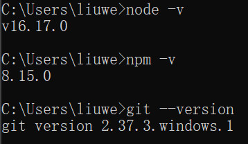

# 1 前言

周末参照网上教程基于GitHub和Hexo搭建个人博客，中间踩了不少的坑花了很多时间，所以将他人教程转载过来并加上一些修订内容记录下来。

# 2 步骤

## 2.1 安装Node.js和Git

- Node.js：[https://nodejs.org/zh-cn](https://link.zhihu.com/?target=https%3A//nodejs.org/zh-cn)
- Git：[https://git-scm.com/downloads](https://link.zhihu.com/?target=https%3A//git-scm.com/downloads)

基于上面两个网站下载最新的Node.js和Git安装包，基于默认配置一路点下去安装Node.js和Git。安装完成后，在cmd中依次执行 `node -v`、`npm -v` 和 `git --version`，看到类似以下版本号说明安装成功



## 2.2 连接 Github

使用邮箱注册 [GitHub](https://link.zhihu.com/?target=https%3A//github.com/) 账户，选择免费账户（Free），并完成邮件验证。

在Windows桌面右键 -> Git Bash Here，设置用户名和邮箱(此处的“GitHub 用户名”和"GitHub 邮箱"分别替换成个人的GitHub用户名和邮箱，下同）

```powershell
git config --global user.name "GitHub 用户名"
git config --global user.email "GitHub 邮箱"
```

**创建 SSH 密匙**：

输入 `ssh-keygen -t rsa -C "GitHub 邮箱"`，然后一路回车。

**添加密匙：**

进入 [C:\Users\用户名\.ssh] 目录（要勾选显示“隐藏的项目”），用记事本打开公钥 id_rsa.pub 文件并复制里面的内容。

登陆 GitHub ，进入 Settings 页面，选择左边栏的 SSH and GPG keys，点击 New SSH key。

Title 随便取个名字，粘贴复制的 id_rsa.pub 内容到 Key 中，点击 Add SSH key 完成添加。

**验证连接：**

打开 Git Bash，输入 `ssh -T git@github.com` 出现 “Are you sure……”，输入 yes 回车确认。显示 “Hi xxx! You've successfully……” 即连接成功。如果没有出现“Hi xxx! You've successfully……”字样，可以再次输入 `ssh -T git@github.com`尝试。

## 2.3 创建 Github Pages 仓库

GitHub 主页右上角加号 -> New repository：

- Repository name 中输入 `用户名.github.io`
- 勾选 “Initialize this repository with a README”
- Description 选填

填好后点击 Create repository 创建。

创建后默认自动启用 HTTPS，博客地址为：`https://用户名.github.io`

## 2.4 本地安装 Hexo 博客程序

新建一个文件夹用来存放 Hexo 的程序文件，如 hexoblog。打开该文件夹，右键 -> Git Bash Here。

使用 npm 一键安装 Hexo 博客程序：

```git
npm install -g hexo-cli
```

初始化并安装所需组件：

```git
hexo init      # 初始化
npm install    # 安装组件
```

完成后依次输入下面命令，启动本地服务器进行预览：

```git
hexo g   # 生成页面
hexo s   # 启动预览
```

**访问** `http://localhost:4000`**，出现 Hexo 默认页面，本地博客安装成功！**

## 2.5 部署 Hexo 到 GitHub Pages

本地博客测试成功后就是上传到 GitHub 进行部署，使其能够在网络上访问。

首先安装 hexo-deployer-git：

```git
npm install hexo-deployer-git --save
```

然后修改hexo程序文件夹中的_config.yml文件末尾的 deploy部分(建议使用notepad++打开)，修改成如下（注意替换GitHub用户名）：

```yml
deploy:
  type: git
  repository: git@github.com:用户名/用户名.github.io.git
  branch: main
```

完成后运行 `hexo d` 将网站上传部署到 GitHub Pages。

完成！这时访问我们的 GitHub 域名 `https://用户名.github.io` 就可以看到 Hexo 网站了。

## 2.6 博客图片问题处理

本人采用开源软件MarkText软件进行本地博客编辑，该软件可以在GitHub下载。需要在本地编辑博客和上传部署后的博客上都正常阅览图片，需要安装一些插件来实现该需求，具体操作如下：

* 在hexo主目录安装插件，在GitBash中输入：`npm install hexo-asset-image-for-hexo5 --save`  

* 在主目录的`_config.yml`文件中查找并修改`post_asset_folder`值为`true`：
  
  ```yml
  post_asset_folder: true
  ```

这样在使用`hexo new "article"`创建新博客文章的时候，就会发现在文章的同级目录出现和md文件名相同的文件夹，可以在这个文件夹中放该文章的图片，例如test.png。例：

| 1  <br>2  <br>3 | ├─article  <br>├──test.png  <br>└─article.md |
| --------------- | -------------------------------------------- |

* 写法：在文章里即可使用``在本地显示图片`test.png`，同时在静态网页中也可以正常显示。

**注意：**本文的hexo版本为6.2.0（可以通过hexo v查看），这里安装的图像插件为hexo-asset-image-for-hexo5是适用的（hexo5版本以上建议使用 hexo-asset-image-for-hexo5 ），网上绝大部分博客说的`npm install hexo-asset-image --save`经本人测试并不适配6.2.0版本的hexo。

## 2.7 开始使用

**发布文章**

进入博客所在目录，右键打开 Git Bash Here，创建博文：

```git
hexo new "My New Post"
```

然后 source 文件夹中会出现一个 My New Post.md 文件，就可以使用MarkText在该文件中撰写文章了。

写完后运行下面代码将文章渲染并部署到 GitHub Pages 上完成发布。**以后每次发布文章都是这三条命令。**

```git
hexo clean   # 清除缓存和已生成的静态文件
hexo g   # 生成页面
hexo d   # 部署发布
```

也可以不使用命令自己创建 .md 文件，只需在文件开头手动加入如下格式 Front-matter 即可，写完后运行 `hexo clean、hexo g` 和 `hexo d` 发布。

```markdown
---
title: Hello World # 标题
date: 2019/3/26 hh:mm:ss # 时间
categories: # 分类
- Diary
tags: # 标签
- PS3
- Games
---

摘要
<!--more-->
正文
```

## 2.8 更换主题

在 [Themes | Hexo](https://link.zhihu.com/?target=https%3A//hexo.io/themes/) 选择一个喜欢的主题，并参照主题的文档来安装和配置主题。

## 2.9 常用命令

```git
hexo new "name"       # 新建文章
hexo new page "name"  # 新建页面
hexo g                # 生成页面
hexo d                # 部署
hexo g -d             # 生成页面并部署
hexo s                # 本地预览
hexo clean            # 清除缓存和已生成的静态文件
hexo help             # 帮助
```

# 3 参考资料

[使用 Hexo+GitHub 搭建个人免费博客教程（小白向） - 知乎 (zhihu.com)](https://zhuanlan.zhihu.com/p/60578464)

[在Hexo中使用本地图片 - 个人学习 (idealx.cn)](https://www.idealx.cn/post/Hexo/hexo-asset-image/)

[fluid-dev/hexo-theme-fluid: 一款 Material Design 风格的 Hexo 主题 / An elegant Material-Design theme for Hexo (github.com)](https://github.com/fluid-dev/hexo-theme-fluid)
